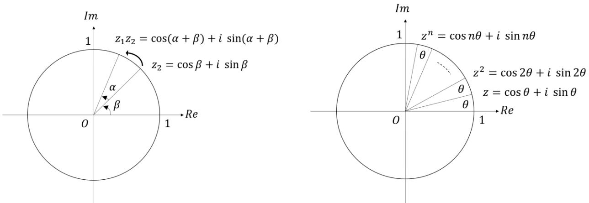
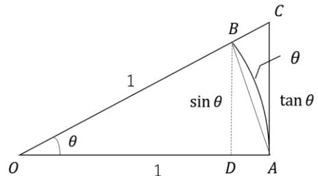

## 【第 2 講】 初等関数

### 【2-1】 はじめに

初等関数とは、代数関数（冪関数、多項式関数、有理関数など）、指数関数、対数関数、三角関数、逆三角関数、双曲線関数、逆双曲線関数とそれらの合成関数で作られる 1 変数関数のことである。数学の各分野はもちろん、理工学のあらゆる分野において応用される重要な関数である。本講座では一部の例外を除き、実数の範囲内で取り扱う。本講では、そのうち特に重要な指数関数、対数関数、三角関数とその性質、およびオイラーの公式を導いてそれらの関係を学ぶ。

### 【2-2】 指数・対数関数

#### 【2-2-1】 指数関数の定義と性質

実数を指数とした数（例えば  $2^{\sqrt{2}}$ ）は、具体的にどのようにして求められるか考えたことがあるだろうか？実はこれはそれほど単純な話ではない。第 1 講 イントロダクションで触れたように、実数は実は奥が深い。

まずは 2 の自然数乗（正の整数乗：**累乗**）から始めよう。以下  $n, m \in \mathbb{N}$ ,  $n, m > 0$  とする。

2 を  $n$  回掛け合わせた数を  $2^n$  と表記し、2 の  $n$  乗として定義する。

この時の 2 を**基数**、 $n$  を**指数**という。

定義から  $2^n \times 2^m = 2^{n+m}$ ,  $(2^n)^m = 2^{nm}$  が、また  $(2 \times 3)^n = 2^n \times 3^n$  等も成り立つ。

一般に非零の実数  $a, b \in \mathbb{R}$ ,  $a, b \neq 0$  の累乗についても同様に

$$a^n \times a^m = a^{n+m}, (a^n)^m = a^{nm}, (ab)^n = a^n b^n$$

が成り立つ。

これらの性質が、指数が整数の場合でも成立するような拡張を考える。

 $a^0 \times a^n = a^{0+n} = a^n$  より、 $a^0 \equiv 1$  また  $a^{-n} \times a^n = a^{-n+n} = a^0 = 1$  より  $a^{-n} \equiv 1/a^n$  とすれば、 $p, q \in \mathbb{Z}$  とし、指数が整数の場合でも同様に

$$a^p \times a^q = a^{p+q}, (a^p)^q = a^{pq}, (ab)^p = a^p b^p$$

が成り立つ。またこの拡張により

$$\frac{a^p}{a^q} = a^{p-q}, \quad \left(\frac{a}{b}\right)^p = \frac{a^p}{b^p}$$

も成り立つ。

指数が有理数の場合への拡張を考える。有理数でもこれらの性質が成り立つとすると、

$$\left(\frac{1}{a^2}\right)^2 = \frac{1}{a^2} = a \text{ より、} \frac{1}{a^2} \equiv \sqrt{a} \text{ とすればよいが、それが実数の範囲内で値を持つとすると、} a > 0$$

という制限をつける事になる。その上で一般に  $\left(a^{\frac{q}{p}}\right)^p = a^{\frac{pq}{p}} = a^q$  より、 $a^{\frac{q}{p}} \equiv \sqrt[p]{a^q}$  とする事で、 $r, s \in \mathbb{Q}$  として、指数が有理数でも同様に  $a, b \in \mathbb{R}, a, b > 0$  に対して

$$a^r \times a^s = a^{r+s}, \quad \frac{a^r}{a^s} = a^{r-s}, \quad (a^r)^s = a^{rs}, \quad (ab)^r = a^r b^r, \quad \left(\frac{a}{b}\right)^r = \frac{a^r}{b^r}$$

が成り立つ。

指数が実数の場合への拡張は、一筋縄ではいかない。例として、 $2^{\sqrt{2}}$  を考える。

 $\sqrt{2} = 1.41421356 \dots$  と無限に続く小数であるが、これを

 $1, 1.4, 1.41, 1.414, 1.4142, 1.41421, 1.414213, 1.4142135, 1.41421356, \dots$ 

として有限小数（有理数）の数列とみなし、

 $2^1, 2^{1.4}, 2^{1.41}, 2^{1.414}, 2^{1.4142}, 2^{1.41421}, 2^{1.414213}, 2^{1.4142135}, 2^{1.41421356} \dots$  という数列を考える。

この数列は、

$$\begin{array}{rcl} 2^1 & = & 2 \\ 2^{1.4} & = & 2.63901582 \dots \\ 2^{1.41} & = & 2.65737162 \dots \\ 2^{1.414} & = & 2.66474965 \dots \\ 2^{1.4142} & = & 2.66511908 \dots \\ 2^{1.41421} & = & 2.66513756 \dots \\ 2^{1.414213} & = & 2.66514310 \dots \\ 2^{1.4142135} & = & 2.66514402 \dots \\ 2^{1.41421356} & = & 2.66514413 \dots \\ \vdots & & \end{array}$$

というように一定の値に近づいていく事がわかる。

このように、指数が実数の場合は、その実数に近づく有理数の数列を用い、有理数乗の数列の極限として定義することになる9。

このような定義により、 $a, b \in \mathbb{R}, a, b > 0, \forall x, y \in \mathbb{R}$  に対しても

$$a^x \times a^y = a^{x+y}, \quad \frac{a^x}{a^y} = a^{x-y}, \quad (a^x)^y = a^{xy}, \quad (ab)^x = a^x b^x, \quad \left(\frac{a}{b}\right)^x = \frac{a^x}{b^x}$$

が成り立つ。これらの基本となる性質を**指数法則**という。

指数が実数にまで拡張され、任意の実数により連続した指数に対する値が得られるようになった。

基数  $a = 1$  の場合、全ての  $x$  に対して  $1^x = 1$  となるため、それ以外の  $0 < a < 1$  の場合と、 $1 < a$  の場合の  $a^x$  を**指数関数**として定義する。このときの  $a$  は基数でなく**底**と呼ばれる。

9 4 節にて違う定義を導く

指数法則より得られる指数関数の基本性質として

●  $1 < a$  の場合

- • 単調増加関数
- •  $x \rightarrow -\infty$  で  $x$  軸に漸近
- •  $x = 0$  の時、 $a^0 = 1$

●  $0 < a < 1$  の場合

- • 単調減少関数
- •  $x \rightarrow \infty$  で  $x$  軸に漸近
- •  $x = 0$  の時、 $a^0 = 1$

また定義域は実数全体、値域は正の実数全体となる。右図は指数関数  $y = a^x$  のグラフの例であり、上記の基本的な性質が読み取れる。

**[2-2-2] 対数関数の定義と性質**

指数関数  $a^x$  は全ての正の実数を値域にとり、 $0 < a < 1$  ならば単調減少関数、 $1 < a$  ならば単調増加関数であるため、任意の正の実数  $Y$  に対して、 $Y = a^x$  となる実数  $x$  がただ一つ定まる。

この  $x$  を、 $Y$  に対する  $a$  を底とする**対数**といい、 $x = \log_a Y$  と表す。このときの  $Y$  を**真数**という。

定義より、対数は指数法則に対応した以下の性質をもつ。

 $a, Y, Z \in \mathbb{R}$ ,  $a > 0, a \neq 1, Y, Z > 0$  に対し

(i)  $\log_a YZ = \log_a Y + \log_a Z$   
 $y = \log_a Y, z = \log_a Z$  とすると  $Y = a^y, Z = a^z$  であり、 $YZ = a^y a^z = a^{y+z}$   
 $\therefore \log_a YZ = y + z = \log_a Y + \log_a Z$  ■

(ii)  $\log_a \frac{Y}{Z} = \log_a Y - \log_a Z$   
 $y = \log_a Y, z = \log_a Z$  とすると  $Y = a^y, Z = a^z$  であり、 $Y/Z = a^y/a^z = a^{y-z}$   
 $\therefore \log_a \frac{Y}{Z} = y - z = \log_a Y - \log_a Z$  ■

(iii)  $\log_a Y^t = t \log_a Y$   
 $y = \log_a Y$  とすると  $Y = a^y$  であり、 $Y^t = (a^y)^t = a^{yt}$   
 $\therefore \log_a Y^t = yt = t \log_a Y$  ■

また  $b \in \mathbb{R}, b > 0, b \neq 1$  に対し底の変換公式と呼ばれる以下の性質をもつ。

(iv)  $\log_a Y = \frac{\log_b Y}{\log_b a}$ 

 $y = \log_a Y, z = \log_b Y, a = b^t$  とすると  $t = \log_b a, Y = b^z = a^y = (b^t)^y = b^{ty}, \therefore z = ty$ 

よって  $y = \frac{z}{t}$  より  $\log_a Y = \frac{\log_b Y}{\log_b a}$  ■

このように定義された対数に対し、 $y = \log_a x$  として**対数関数**を定義する。

定義より  $y = \log_a x$  に対して  $x = a^y = a^{\log_a x}$  また  $y = \log_a x = \log_a a^y$  となり、

 $y = \log_a x$  と  $y = a^x$  は互いに逆関数となる。

これらの定義により、対数関数は以下の性質を持つ。

底  $a \in \mathbb{R}, a > 0, a \neq 1$  に対し

•  $0 < a < 1$  のとき 単調減少関数

•  $1 < a$  のとき 単調増加関数

定義域は正の実数、値域は実数全体であり、 $x = 1$  のとき  $\log_a 1 = 0$  となる。

上の図は底  $a$  が  $0 < a < 1$  の場合と  $1 < a$  の場合の対数関数と指数関数のグラフの例で、上記性質の他、それぞれ  $y = x$  の点線に対して対称となっており逆関数の関係であることも読み取れる。

底  $a$  の対数関数とは何かを一言で言うと、「( $a$ 進数としたときの) 桁数を返す関数」となる。

**[2-2-3] 自然対数と自然指数**有用な対数の底として、**ネイピア数**と呼ばれる  $e$  が挙げられる。

ネイピア数  $e$  は、

$$e = \lim_{n \rightarrow \infty} \left(1 + \frac{1}{n}\right)^n \quad (2-2-1)$$

で定義される無理数で、その値は

$$e = 2.71828182846 \dots \quad (2-2-2)$$

となる。

ここで(2-2-1)式は、正の整数  $n$  による  $\left(1 + \frac{1}{n}\right)^n$  の値が、 $n$  がどんどん大きくなっていくにつれ一定の値（この場合は(2-2-2)の値）に近づいて行くときの「**極限**」を表しており、記号  $\lim$  は  $\lim_{n \rightarrow \infty}$  と読む。右図は  $\left(1 + \frac{1}{n}\right)^n$  の値を  $n$  が 1 から 100 までの範囲でグラフ化したもので、次第に近づいていく様子が見られる。

ネイピア数  $e$  を底とする対数は、**自然対数**と呼ばれ、通常  $\log_e x = \ln x$  と表記される。また通常「指数関数」はネイピア数を底とした  $e^x$  の事を指す事が多い。この  $e^x$  は  $\exp(x)$  とも書かれ、自然対数との対比で自然指数と呼ぶ事もある。

「自然」という言葉は、指数関数  $e^x$  が微分しても（従って積分しても）同じ  $e^x$  となるなど、数学的な性質が他の底と比べてシンプルな事から来ており、数学や物理学を始め、理工系の殆どの分野で用いられている。

**[2-2-4] 応用例**上記のように指数関数は解析学との関わりが深く、微分の考え方を用いた微分方程式（パラメータを時間だとすると、今の情報から少し先の未来がどうなるかを記述する方程式）を解く際に活躍してくれる。また対数関数は、（指数関数の）裏方さん的な役割が多いが、人間の知覚や地震のマグニチュードなどの他、「エントロピー」を表し物理学の統計力学や情報理論などの分野で応用されている。

### 【2-3】 三角関数

#### 【2-3-1】 三角関数の定義と性質

右図のように半径 1 の単位円上の点  $(x, y)$  において原点と結んだ直線と  $x$  軸との反時計回りを正としたなす角（弧度法）を  $\theta$  とし、その大きさは  $\pm\pi, \pm2\pi$  を超えてもそのまま外挿されるとする時

$$\sin (\text{正弦:サイン}) : \sin \theta = y$$

$$\cos (\text{余弦:コサイン}) : \cos \theta = x$$

として、また  $x \neq 0$  の時、

$$\tan (\text{正接:タンジェント}) : \tan \theta = y/x$$

として定義する。これらを**三角関数**といい、以下の基本的な性質をもつ。

定義より  $\sin \theta, \cos \theta$  は  $2\pi$  の周期、 $\tan \theta$  は  $\pi$  の周期を持つ周期関数、すなわち以下の関係が成り立つ( $n \in \mathbb{Z}$ )。

$$\begin{aligned} \sin(\theta + 2n\pi) &= \sin \theta \\ \cos(\theta + 2n\pi) &= \cos \theta \\ \tan(\theta + n\pi) &= \tan \theta \end{aligned}$$

 $\sin \theta, \cos \theta$  の定義域は実数全体、値域は  $-1$  以上  $1$  以下の実数となり、 $\sin \theta$  は奇関数 ( $\sin(-\theta) = -\sin \theta$ )  $\cos \theta$  は偶関数 ( $\cos(-\theta) = \cos \theta$ ) である。

また定義よりいわゆる位相のずれとして

$$\sin\left(\theta + \frac{\pi}{2}\right) = \cos \theta, \quad \cos\left(\theta - \frac{\pi}{2}\right) = \cos\left(\frac{\pi}{2} - \theta\right) = \sin \theta$$

が成り立つ。

 $\tan \theta$  の定義域は  $\frac{\pi}{2} + n\pi$  ( $n \in \mathbb{Z}$ ) を除く実数全体、値域は実数全体であり、 $-\frac{\pi}{2} < \theta < \frac{\pi}{2}$  で単調増加関数となる。

#### 【2-3-2】 三角関数の主な公式

上記基本性質の他に、以下のような性質が公式化されている。このうち加法定理が最も基本的な性質であり、他は加法定理（と上記基本性質）から容易に導かれる。ここでは各公式を列挙し、その証明は本講の付録 4 に記載する。

● 加法定理 (複号同順) (角の和の三角関数を元の角の三角関数で表す)
$$\begin{aligned}\sin(\alpha \pm \beta) &= \sin \alpha \cos \beta \pm \cos \alpha \sin \beta \\ \cos(\alpha \pm \beta) &= \cos \alpha \cos \beta \mp \sin \alpha \sin \beta \\ \tan(\alpha \pm \beta) &= \frac{\tan \alpha \pm \tan \beta}{1 \mp \tan \alpha \tan \beta}\end{aligned}\quad (2-3-1)$$

● 倍角の公式 (2 倍角の三角関数を元の角の三角関数で表す)
$$\begin{aligned}\sin 2\alpha &= 2 \sin \alpha \cos \alpha \\ \cos 2\alpha &= \cos^2 \alpha - \sin^2 \alpha \\ &= 1 - 2 \sin^2 \alpha \\ &= 2 \cos^2 \alpha - 1 \\ \tan 2\alpha &= \frac{2 \tan \alpha}{1 - \tan^2 \alpha}\end{aligned}\quad (2-3-2)$$

● 半角の公式 (半角の三角関数を元の角の三角関数で表す)
$$\begin{aligned}\sin^2 \frac{\alpha}{2} &= \frac{1 - \cos \alpha}{2} \\ \cos^2 \frac{\alpha}{2} &= \frac{1 + \cos \alpha}{2} \\ \tan^2 \frac{\alpha}{2} &= \frac{1 - \cos \alpha}{1 + \cos \alpha}\end{aligned}\quad (2-3-3)$$

● 積和の公式 (三角関数の積を三角関数の和で表す)
$$\begin{aligned}\sin \alpha \cos \beta &= \frac{1}{2} \{\sin(\alpha + \beta) + \sin(\alpha - \beta)\} \\ \cos \alpha \cos \beta &= \frac{1}{2} \{\cos(\alpha + \beta) + \cos(\alpha - \beta)\} \\ \sin \alpha \sin \beta &= -\frac{1}{2} \{\cos(\alpha + \beta) - \cos(\alpha - \beta)\}\end{aligned}\quad (2-3-4)$$

● 和積の公式 (三角関数の和を三角関数の積で表す)
$$\begin{aligned}\sin x + \sin y &= 2 \sin \frac{x+y}{2} \cos \frac{x-y}{2} \\ \sin x - \sin y &= 2 \cos \frac{x+y}{2} \sin \frac{x-y}{2} \\ \cos x + \cos y &= 2 \cos \frac{x+y}{2} \cos \frac{x-y}{2} \\ \cos x - \cos y &= -2 \sin \frac{x+y}{2} \sin \frac{x-y}{2}\end{aligned}\quad (2-3-5)$$

● 合成の公式 (同じ角の三角関数の和を一つの三角関数で表す)
$$\begin{aligned}a \sin \theta + b \cos \theta &= \sqrt{a^2 + b^2} \sin(\theta + \alpha) \\ \cos \alpha &= \frac{a}{\sqrt{a^2 + b^2}}, \sin \alpha = \frac{b}{\sqrt{a^2 + b^2}} \\ a \sin \theta + b \cos \theta &= \sqrt{a^2 + b^2} \cos(\theta - \beta) \\ \sin \beta &= \frac{a}{\sqrt{a^2 + b^2}}, \cos \beta = \frac{b}{\sqrt{a^2 + b^2}}\end{aligned}\quad (2-3-6)$$

**[2-3-3] ド・モアブルの定理**

複素平面上の大きさ 1 の複素数の極形式  $z = \cos \theta + i \sin \theta$  を考える。これは単位円上の点の  $x, y$  座標値として定義された三角関数を複素平面上にそのまま対応させたものとなる。

この表記での複素数  $z_1 = \cos \alpha + i \sin \alpha$ ,  $z_2 = \cos \beta + i \sin \beta$  の積は、加法定理を用いると

$$\begin{aligned} z_1 z_2 &= (\cos \alpha + i \sin \alpha)(\cos \beta + i \sin \beta) \\ &= (\cos \alpha \cos \beta - \sin \alpha \sin \beta) + i(\sin \alpha \cos \beta + \cos \alpha \sin \beta) \\ &= \cos(\alpha + \beta) + i \sin(\alpha + \beta) \end{aligned} \quad (2 - 3 - 7)$$

となり、これは大きさ 1 の複素数の積がその偏角の和の複素数となる事を意味し、加法定理が複素平面上でこのように表されていることになる。幾何学的には大きさ 1、偏角  $\alpha$  の複素数の積が複素平面上での角度  $\alpha$  の回転を表していると解釈できる（下図左）。

特に  $\alpha = \beta = \theta$  の場合は、

$$\begin{aligned} (\cos \theta + i \sin \theta)^2 &= \cos^2 \theta - \sin^2 \theta + i2 \sin \theta \cos \theta \\ &= \cos 2\theta + i \sin 2\theta \end{aligned}$$

となり、2 倍角の公式を表すと共に、 $(\cos \theta + i \sin \theta)^2 = \cos 2\theta + i \sin 2\theta$  という関係となる。

さらに(2-3-7)式で  $\alpha = \theta, \beta = 2\theta$  とすると、これは  $\cos \theta + i \sin \theta$  の3乗にあたり、

$$\begin{aligned} (\cos \theta + i \sin \theta)^3 &= (4 \cos^3 \theta - 3 \cos \theta) + i(3 \sin \theta - 4 \sin^3 \theta) \\ &= \cos 3\theta + i \sin 3\theta \end{aligned}$$

となり、3 倍角の公式を表し、また  $(\cos \theta + i \sin \theta)^3 = \cos 3\theta + i \sin 3\theta$  が成り立つ。

より高次についても同様となり、帰納的に以下の関係が成り立つ事が分かる（上図右）。

$$(\cos \theta + i \sin \theta)^n = \cos n\theta + i \sin n\theta \quad (2 - 3 - 8)$$

これをド・モアブルの定理という。

**[2-3-4] 応用例**三角関数は幾何学とのつながりが深く、周期性を利用した回転や振動、波動の表現として用いられている。またベクトルの基底としてフーリエ級数展開への応用も本講座でも説明する。

**[2-4] 指数関数の別定義**ネイピア数の定義 (2-2-1) 式を深掘りしてみよう。今、 $\left(1 + \frac{x}{n}\right)^n$  という式を考える。 $\frac{x}{n} = \frac{1}{m}$  とすると  $n = mx$  より  $\left(1 + \frac{x}{n}\right)^n = \left(1 + \frac{1}{m}\right)^{mx} = \left\{\left(1 + \frac{1}{m}\right)^m\right\}^x$  と書けて、この式で  $x$  を一定とした  $n \rightarrow \infty$  すなわち  $m \rightarrow \infty$  の極限をとると、 $\left\{\left(1 + \frac{1}{m}\right)^m\right\}^x \rightarrow (e)^x$  ( $m \rightarrow \infty$ ) がいえることになる。そこで以下の式を指数関数の新たな定義としよう ( $x = 1$  の場合はネイピア数の定義に帰着する)。

$$e^x = \lim_{n \rightarrow \infty} \left(1 + \frac{x}{n}\right)^n \quad (2-4-1)$$

この定義が意味をなすには、まず極限値が収束する必要がある10。

この極限値を評価するため、有限項  $\left(1 + \frac{x}{n}\right)^n$  について考えてみよう。このような  $(a+b)^n$  の形の式を展開するには、二項定理を用いる11。展開すると、

$$\begin{aligned} & \left(1 + \frac{x}{n}\right)^n \\ &= 1 + n \left(\frac{x}{n}\right) + \frac{n(n-1)}{2!} \left(\frac{x}{n}\right)^2 + \frac{n(n-1)(n-2)}{3!} \left(\frac{x}{n}\right)^3 + \frac{n(n-1)(n-2)(n-3)}{4!} \left(\frac{x}{n}\right)^4 + \dots \\ &= 1 + x + \frac{(1-\frac{1}{n})}{2!} x^2 + \frac{(1-\frac{1}{n})(1-\frac{2}{n})}{3!} x^3 + \frac{(1-\frac{1}{n})(1-\frac{2}{n})(1-\frac{3}{n})}{4!} x^4 + \dots \end{aligned}$$

となる。各分子の括弧内の  $1/n$  や  $2/n$  等の項は  $n \rightarrow \infty$  の極限で 0 となるので、その極限で各分子は 1 となり

$$\begin{aligned} e^x &= \lim_{n \rightarrow \infty} \left(1 + \frac{x}{n}\right)^n \\ &= 1 + x + \frac{1}{2!} x^2 + \frac{1}{3!} x^3 + \frac{1}{4!} x^4 + \dots \end{aligned} \quad (2-4-2)$$

となる (この級数は任意の  $x$  の値で収束する事が知られている)。実際にこの級数のふるまいを見てみようよう (次頁にて)。

10 指数関数を初めてこの形で定式化したのが、オイラーだったそうな。厳密には極限値が収束するうえに、この定義に基づき、指数法則が成り立つことを示す必要がある。

11 付録 1 : 二項定理 (二項展開) 参照

右図は(2-4-2)式の右辺を

 $e_n(x) \equiv 1 + x + \dots + \frac{1}{n!} x^n$ として、 $n$  次の項までの和で近似したときの様子を 20 次の項までグラフ化したものであり、次第に  $\exp(x)$  の値に近づいていく様子が分かる。

(2-4-1)式 (あるいは(2-4-2)式) で底  $e$  の指数関数  $e^x$  を定義することで、わざわざ  $e$  の有理数乗の極限という形を経ずに実数乗を直接定義することができることになる。

なお(2-4-2)式は、指数関数  $e^x$  の  $x = 0$  の周りでのいわゆるテーラー展開 (マクローリン展開) の結果と等しいが、指数関数の場合、微分を使わなくともこのように二項展開した極限として得ることができる。

**【2-5】 [▼A] オイラーの公式**

(2-3-8)式のド・モアブルの定理  $\cos n\theta + i \sin n\theta = (\cos \theta + i \sin \theta)^n$  (こおいて、 $n\theta = x$  と置くと  $\theta = \frac{x}{n}$  と書けるので、

$$\cos x + i \sin x = \left( \cos \frac{x}{n} + i \sin \frac{x}{n} \right)^n \quad (2-5-1)$$

と書ける。この式で  $x$  を一定とする  $n \rightarrow \infty$  ( $\theta \rightarrow 0$ ) の極限をとることを考えると、

$$\cos \frac{x}{n} \rightarrow 1, \quad \sin \frac{x}{n} \rightarrow \frac{x}{n} \quad (n \rightarrow \infty) \quad (2-5-2)$$

より12、

$$\begin{aligned} \cos x + i \sin x &= \lim_{n \rightarrow \infty} \left( \cos \frac{x}{n} + i \sin \frac{x}{n} \right)^n \\ &= \lim_{n \rightarrow \infty} \left( 1 + \frac{ix}{n} \right)^n \end{aligned} \quad (2-5-3)$$

と書けるが、この式は(2-4-1)式で  $x$  を (形式的に)  $ix$  としたものと等しい。

そこで、(2-4-2)式で  $x$  を  $ix$  として置き換え、指数が純虚数となる指数関数を

12 付録 3 :  $\sin \theta / \theta \rightarrow 1$  ( $\theta \rightarrow 0$ ) の証明 参照

$$e^{ix} = 1 + ix + \frac{(ix)^2}{2!} + \frac{(ix)^3}{3!} + \frac{(ix)^4}{4!} + \dots \quad (2-5-4)$$

として定義する13。これにより、

$$e^{i\theta} = \lim_{n \rightarrow \infty} \left(1 + \frac{i\theta}{n}\right)^n$$

と書けて、これと (2-5-3) 式と合わせると

$$e^{i\theta} = \cos \theta + i \sin \theta \quad (2-5-5)$$

が成り立つ14。

この(2-5-5)式は、有名な**オイラーの公式**と呼ばれるもので、指数関数と三角関数の驚くべき関係を端的に表している。

オイラーの公式により、三角関数の加法定理である (2-3-7) 式：

$$(\cos \alpha + i \sin \alpha)(\cos \beta + i \sin \beta) = \cos(\alpha + \beta) + i \sin(\alpha + \beta)$$

は、

$$e^{i\alpha} e^{i\beta} = e^{i(\alpha+\beta)} \quad (2-5-6)$$

となり、純虚数での指数法則が成り立つことを意味する。

これにより逆に三角関数の加法定理を瞬時に出せる（証明できるという意味ではない）。

$$\begin{aligned} \cos(\alpha \pm \beta) + i \sin(\alpha \pm \beta) &= e^{i(\alpha \pm \beta)} = e^{i\alpha} e^{\pm i\beta} = (\cos \alpha + i \sin \alpha)(\cos \beta \pm i \sin \beta) \\ &= (\cos \alpha \cos \beta \mp \sin \alpha \sin \beta) + i(\sin \alpha \cos \beta \pm \cos \alpha \sin \beta) \\ &\therefore \begin{cases} \cos(\alpha \pm \beta) = \cos \alpha \cos \beta \mp \sin \alpha \sin \beta \\ \sin(\alpha \pm \beta) = \sin \alpha \cos \beta \pm \cos \alpha \sin \beta \end{cases} \end{aligned}$$

またド・モアブルの定理  $(\cos \theta + i \sin \theta)^n = \cos n\theta + i \sin n\theta$  は、

$$(e^{i\theta})^n = e^{in\theta} \quad (2-5-7)$$

と書けることになり、これも指数法則の純虚数への拡張に対応している（ただし  $n$  は整数）。

オイラーの公式による指数関数と三角関数の繋がりは、指数関数の基本性質である指数法則と、三角関数の基本的な性質である加法定理、ド・モアブルの定理としても繋がっているという深いつながりであることが分かる。解析学と幾何学の橋渡しを担う重要な役割をもつ。

本講座では第6講で行列版、第8講でクォータニオン版として各講の付録にて再登場する。

$$\begin{cases} \cos x = 1 - \frac{1}{2!}x^2 + \frac{1}{4!}x^4 - \frac{1}{6!}x^6 + \frac{1}{8!}x^8 - \dots \\ \sin x = x - \frac{1}{3!}x^3 + \frac{1}{5!}x^5 - \frac{1}{7!}x^7 + \frac{1}{9!}x^9 - \dots \end{cases} \quad (2-5-8)$$

13 この辺りの話をきちっとする解析接続というモノがあるが、本講座では立ち入らない

14 (2-5-4) 式において  $i^2 = -1$  より (2-5-5) 式と実部・虚部を比較して以下も成り立つ。

**【2-6】 付録 1 : 二項定理 (二項展開)**

 $(a+b)^n$  を展開したものを**二項展開**と言う。二項展開の各項の係数を考えるにあたり、まずは  $n$  の値が小さい場合に実際に展開してみよう。

$$\begin{aligned} (a+b)^0 &= 1 \\ (a+b)^1 &= a+b \\ (a+b)^2 &= a^2 + 2ab + b^2 \\ (a+b)^3 &= a^3 + 3a^2b + 3ab^2 + b^3 \\ (a+b)^4 &= a^4 + 4a^3b + 6a^2b^2 + 4ab^3 + b^4 \end{aligned}$$

係数のみに注目すると

といういわゆるパスカルの三角形と呼ばれるものになる。この三角形をなす各数は、それぞれ左上、右上の数の和となっている（左端は右上のみ、右端は左上のみの数をそのまま受け継ぐ）。

実際、 $(a+b)^4 = (a+b)(a+b)^3 = (a+b)(a^3 + 3a^2b + 3ab^2 + b^3)$  を展開すれば、 $a^4$  となるのは  $a \times a^3$  の組み合わせのみ。 $a^3b$  となるのは  $b \times a^3$  と  $a \times 3a^2b$  の組み合わせで、その係数は 1 と 3 を合わせた 4 となる。また  $a^2b^2$  となるのは  $b \times 3a^2b$  と  $a \times 3ab^2$  の組み合わせで、その係数は 3 と 3 を合わせた 6 となり、このような関係が一般に成り立つことになる。

このことを、展開後の各項の係数を  $c_k^{(n)} a^{n-k} b^k$  のようにして数式で表すと以下のようになる。

$$(a+b)^n = c_0^{(n)} a^n + c_1^{(n)} a^{n-1}b + c_2^{(n)} a^{n-2}b^2 + \dots + c_{n-1}^{(n)} ab^{n-1} + c_n^{(n)} b^n$$

および

$$(a+b)^{n+1} = c_0^{(n+1)} a^{n+1} + c_1^{(n+1)} a^n b + c_2^{(n+1)} a^{n-1}b^2 + \dots + c_n^{(n+1)} ab^n + c_{n+1}^{(n+1)} b^{n+1}$$

に対して

$$c_0^{(n+1)} = c_0^{(n)} (= c_0^{(0)} = 1), \quad c_k^{(n+1)} = c_{k-1}^{(n)} + c_k^{(n)}, \quad c_{n+1}^{(n+1)} = c_n^{(n)} (= c_0^{(0)} = 1) \quad (2-6-1)$$

という関係が任意の  $n > 0$  に対して成り立つ。

この 二項展開の一般項を表すものが**二項定理**と呼ばれるもので、以下のような式となる15。

$$(a+b)^n = \sum_{k=0}^n c_k a^{n-k} b^k \quad (2-6-2)$$

 $(a+b)^n$  は  $(a+b)$  が  $n$  個掛け合わされたものであり、展開された際の  $a^{n-k} b^k$  の項は、 $n$  個ある  $(a+b)(a+b) \dots (a+b)$  の中から  $k$  個の  $b$  を選ぶ組み合わせの数だけあることになるので（選ばれなかった  $n-k$  個からは必ず  $a$  が選ばれる）その係数は「 $n$  個の中から  $k$  個を取り出

15 式の右辺は総和記号と呼ばれるもので表されている。付録 2 : 総和記号 参照

す組み合わせの数」を表す  ${}_nC_k$  ( $\binom{n}{k}$ )とも書かれる) となり、(2-6-2)式を得る。

この  ${}_nC_k$  の値は以下のようにして求まる。

 $n$  個から  $k$  個を取り出す最初の 1 個目は  $n$  通りの選び方があり、2 個目は  $n-1$  通り、最後の  $k$  個目は  $n-k+1$  通り選び方があり、組み合わせると  $n(n-1)(n-2)\cdots(n-k+1) = \frac{n!}{(n-k)!}$  通りとなるが、 $k$  個を取り出す順番にはよらないので、最終的な値は  ${}_nC_k = \frac{n!}{(n-k)!k!}$  通りとなる。

(2-6-1) 式の  $c_k^{(n)}$  は (2-6-2) 式の  ${}_nC_k$  に対応するものであり、(2-6-1) 式が  $c_k^{(n)} = {}_nC_k = \frac{n!}{(n-k)!k!}$  として実際に成り立つことは  $0! \equiv 1$  に注意して以下のように示される。

$${}_{n+1}C_0 = \frac{(n+1)!}{(n+1)!0!} = 1, \quad {}_nC_0 = \frac{n!}{n!0!} = 1, \quad {}_{n+1}C_{n+1} = \frac{(n+1)!}{0!(n+1)!} = 1, \quad {}_nC_n = \frac{n!}{0!n!} = 1$$

$$\begin{aligned} {}_{n+1}C_k &= \frac{(n+1)!}{(n+1-k)!k!} = \frac{(n+1)n!}{(n-k+1)!k!} = \frac{\{(n-k+1)+k\}n!}{(n-k+1)!k!} \\ &= \frac{n!}{(n-k)!k!} + \frac{n!}{(n-k+1)!(k-1)!} = {}_nC_k + {}_nC_{k-1} \quad \blacksquare \end{aligned}$$

### 【2-7】 付録 2 : 総和記号

数列の総和を示す記号を**総和記号**といいギリシャ文字の大文字のΣ (シグマ) で表す。

通常以下のように

$$\sum_{i=1}^n a_i \equiv a_1 + a_2 + \cdots + a_n$$

を意味する。 $a_1 + a_2 + \cdots + a_n$  の表記は具体的ではあるが、式中で頻繁に出てくると冗長で式全体の可読性を損なうため、このようなコンパクトな表記法が存在する。慣れると式の見通しが良くなりとても便利（かつ、めっちゃ強力）なので、ぜひ慣れて頂きたい。本講座内でもよく使われる。

総和記号の主な性質をあげた。比較的複雑な式の場合、これらを駆使して式変形が行われる。

(i) 線形性

$$\sum_{i=1}^n (a_i + b_i) = \sum_{i=1}^n a_i + \sum_{i=1}^n b_i, \quad \sum_{i=1}^n ka_i = k \sum_{i=1}^n a_i$$

(ii) 和の順番

基本的には内側から順に和を取る。以下はその例で

$$\begin{aligned} \sum_{i=1}^n \sum_{j=1}^i a_j &= \sum_{i=1}^n (a_1 + a_2 + \cdots + a_i) \\ &= (a_1) + (a_1 + a_2) + (a_1 + a_2 + a_3) + \cdots + (a_1 + a_2 + \cdots + a_n) \end{aligned}$$

(iii) 多重和の交換 (和の順番の入れ替え)

(ii) 和の順番 の例のように添字の範囲に依存性がある等の場合を除き)

添字が独立している場合 (有限和では) 和の順番に依らない。

$$\sum_{i=1}^n \sum_{j=1}^m a_{ij} = \sum_{j=1}^m \sum_{i=1}^n a_{ij}$$

例) 以下の 2 式は等しい

$$\sum_{i=1}^2 \sum_{j=1}^3 a_{ij} = \sum_{i=1}^2 (a_{i1} + a_{i2} + a_{i3}) = (a_{11} + a_{12} + a_{13}) + (a_{21} + a_{22} + a_{23})$$

$$\sum_{j=1}^3 \sum_{i=1}^2 a_{ij} = \sum_{j=1}^3 (a_{1j} + a_{2j}) = (a_{11} + a_{21}) + (a_{12} + a_{22}) + (a_{13} + a_{23})$$

応用) 添字の範囲が共通な場合など、一つの総和記号に複数の添字をまとめる略記法

$$\sum_{i,j=1}^n a_{ij} \equiv \sum_{i=1}^n \sum_{j=1}^n a_{ij}$$

(iv) 和の対象の分解・結合

乗法の分配則 :  $(a+b)(c+d) = ac + ad + bc + bd$  に基づく

$$\sum_{i=1}^n a_i \sum_{j=1}^m b_j = \sum_{i=1}^n \sum_{j=1}^m a_i b_j$$

例) 以下の 2 式は等しい

$$\sum_{i=1}^2 a_i \sum_{j=1}^3 b_j = (a_1 + a_2)(b_1 + b_2 + b_3) = a_1 b_1 + a_1 b_2 + a_1 b_3 + a_2 b_1 + a_2 b_2 + a_2 b_3$$

$$\sum_{i=1}^2 \sum_{j=1}^3 a_i b_j = \sum_{i=1}^2 (a_i b_1 + a_i b_2 + a_i b_3) = a_1 b_1 + a_1 b_2 + a_1 b_3 + a_2 b_1 + a_2 b_2 + a_2 b_3$$

**【2-8】 付録 3 :  $\sin \theta / \theta \rightarrow 1$  ( $\theta \rightarrow 0$ ) の証明**

 $0 < \theta < 1$  の時に  $\frac{\sin \theta}{\theta} \rightarrow 1$  ( $\theta \rightarrow 0$ ) となることを示す。

図は  $|\overline{OA}| = |\overline{OB}| = 1$  内角  $\theta$  の扇型  $OAB$  で、 $B$  から  $\overline{OA}$  に下ろした垂線の足を  $D$ 、 $A$  から伸ばした接線と  $\overline{OB}$  を伸ばした直線との交点を  $C$  とする。

図より  $|\overline{BD}| = \sin \theta$ 、 $|\overline{CA}| = \tan \theta$  となる。

 $\triangle OAB$ , 扇型  $OAB$ ,  $\triangle OAC$  の面積はそれぞれ  $\frac{1}{2} \sin \theta$ ,  $\frac{1}{2} \theta$ ,  $\frac{1}{2} \tan \theta$  となり、図よりその大小関係は  $\frac{1}{2} \sin \theta < \frac{1}{2} \theta < \frac{1}{2} \tan \theta$  となる。これにより  $\sin \theta < \theta$  および  $\theta < \frac{\sin \theta}{\cos \theta}$  がいえて、これからさらに  $\cos \theta < \frac{\sin \theta}{\theta} < 1$  がいえ、 $\theta \rightarrow 0$  のとき  $\cos \theta \rightarrow 1$  と、はさみうちの原理より  $\frac{\sin \theta}{\theta} \rightarrow 1$  となる。■  
またこれにより  $\cos \theta \rightarrow 1$ ,  $\sin \theta \rightarrow \theta$  ( $\theta \rightarrow 0$ ) となることがいえる。

**【2-9】 付録 4 : 三角関数の各公式の証明**

○加法定理 (2-3-1) 式の証明

【証明】

図のように単位円上の 2 点 A,B を x 軸からのなす角が  $\alpha, \beta$  となるように  
とると、それぞれの座標値は  $A(\cos \alpha, \sin \alpha), B(\cos \beta, \sin \beta)$  となる。

 $\overline{AB}$ の長さの 2 乗は余弦定理により

$$\begin{aligned} |\overline{AB}|^2 &= |\overline{OA}|^2 + |\overline{OB}|^2 - 2|\overline{OA}||\overline{OB}| \cos(\alpha - \beta) \\ &= 1 + 1 - 2 \cos(\alpha - \beta) \\ &= 2(1 - \cos(\alpha - \beta)) \end{aligned}$$

一方、座標値によっても求められ

$$\begin{aligned} |\overline{AB}|^2 &= (\cos \alpha - \cos \beta)^2 + (\sin \alpha - \sin \beta)^2 \\ &= \cos^2 \alpha + \sin^2 \alpha + \cos^2 \beta + \sin^2 \beta \\ &\quad - 2 \cos \alpha \cos \beta - 2 \sin \alpha \sin \beta \\ &= 2\{1 - (\cos \alpha \cos \beta + \sin \alpha \sin \beta)\} \\ \therefore \cos(\alpha - \beta) &= \cos \alpha \cos \beta + \sin \alpha \sin \beta \quad (#1) \end{aligned}$$

(#1)式より

$$\begin{aligned} \cos(\alpha + \beta) &= \cos\{\alpha - (-\beta)\} \\ &= \cos \alpha \cos(-\beta) + \sin \alpha \sin(-\beta) \\ &= \cos \alpha \cos \beta - \sin \alpha \sin \beta \quad (#2) \end{aligned}$$

基本性質  $\cos\left(\frac{\pi}{2} - \theta\right) = \sin \theta$  および (#1)式より

$$\begin{aligned} \sin(\alpha + \beta) &= \cos\left\{\frac{\pi}{2} - (\alpha + \beta)\right\} \\ &= \cos\left\{\left(\frac{\pi}{2} - \alpha\right) - \beta\right\} \\ &= \cos\left(\frac{\pi}{2} - \alpha\right) \cos \beta + \sin\left(\frac{\pi}{2} - \alpha\right) \sin \beta \\ &= \sin \alpha \cos \beta + \cos \alpha \sin \beta \quad (#3) \end{aligned}$$

(#3)式より

$$\begin{aligned} \sin(\alpha - \beta) &= \sin\{\alpha + (-\beta)\} \\ &= \sin \alpha \cos(-\beta) + \cos \alpha \sin(-\beta) \\ &= \sin \alpha \cos \beta - \cos \alpha \sin \beta \quad (#4) \end{aligned}$$

(#1),(#2),(#3),(#4)式より

$$\begin{aligned} \tan(\alpha \pm \beta) &= \frac{\sin(\alpha \pm \beta)}{\cos(\alpha \pm \beta)} \\ &= \frac{\sin \alpha \cos \beta \pm \cos \alpha \sin \beta}{\cos \alpha \cos \beta \mp \sin \alpha \sin \beta} \\ &= \frac{\tan \alpha \pm \tan \beta}{1 \mp \tan \alpha \tan \beta} \quad (#5) \end{aligned}$$

以上、(#1),(#2),(#3),(#4),(#5)式より (2-3-1) 式は示された。■

### ○倍角の公式 (2-3-2) 式の証明

#### 【証明】

加法定理 (2-3-1) において、 $\beta = \alpha$  とする。

$$\sin 2\alpha = \sin \alpha \cos \alpha + \cos \alpha \sin \alpha = 2 \sin \alpha \cos \alpha \quad (#1)$$

$$\sin^2 \alpha + \cos^2 \alpha = 1 \text{ も用いて}$$

$$\begin{aligned} \cos 2\alpha &= \cos \alpha \cos \alpha - \sin \alpha \sin \alpha = \cos^2 \alpha - \sin^2 \alpha \\ &= 1 - 2 \sin^2 \alpha = 2 \cos^2 \alpha - 1 \quad (#2) \end{aligned}$$

$$\tan 2\alpha = \frac{\tan \alpha + \tan \alpha}{1 - \tan \alpha \tan \alpha} = \frac{2 \tan \alpha}{1 - \tan^2 \alpha} \quad (#3)$$

以上、(#1),(#2),(#3)式より (2-3-2) 式は示された。■

### ○半角の公式 (2-3-3) 式の証明

#### 【証明】

倍角の公式  $\cos 2\alpha = 1 - 2 \sin^2 \alpha = 2 \cos^2 \alpha - 1$  において、 $\alpha \rightarrow \alpha/2$  に置き換えると

$$\cos \alpha = 1 - 2 \sin^2 \frac{\alpha}{2}, \quad \cos \alpha = 2 \cos^2 \frac{\alpha}{2} - 1$$

それぞれ整理して

$$\sin^2 \frac{\alpha}{2} = \frac{1 - \cos \alpha}{2}, \quad \cos^2 \frac{\alpha}{2} = \frac{1 + \cos \alpha}{2} \quad (#1)$$

この(#1)式を辺々割ると

$$\tan^2 \frac{\alpha}{2} = \frac{\sin^2 \frac{\alpha}{2}}{\cos^2 \frac{\alpha}{2}} = \frac{1 - \cos \alpha}{1 + \cos \alpha} \quad (#2)$$

以上、(#1),(#2)より (2-3-3) 式は示された。■

○積和の公式 (2-3-4) の証明【証明】加法定理  $\sin(\alpha + \beta) = \sin \alpha \cos \beta + \cos \alpha \sin \beta$ ,  $\sin(\alpha - \beta) = \sin \alpha \cos \beta - \cos \alpha \sin \beta$  を

$$\text{辺々足すと } \sin(\alpha + \beta) + \sin(\alpha - \beta) = 2 \sin \alpha \cos \beta$$

$$\therefore \sin \alpha \cos \beta = \frac{1}{2}\{\sin(\alpha + \beta) + \sin(\alpha - \beta)\} \quad (#1)$$

加法定理  $\cos(\alpha + \beta) = \cos \alpha \cos \beta - \sin \alpha \sin \beta$ ,  $\cos(\alpha - \beta) = \cos \alpha \cos \beta + \sin \alpha \sin \beta$  を

$$\text{辺々足すと } \cos(\alpha + \beta) + \cos(\alpha - \beta) = 2 \cos \alpha \cos \beta$$

$$\therefore \cos \alpha \cos \beta = \frac{1}{2}\{\cos(\alpha + \beta) + \cos(\alpha - \beta)\} \quad (#2)$$

同様に辺々引くと  $\cos(\alpha + \beta) - \cos(\alpha - \beta) = -2 \sin \alpha \sin \beta$ 

$$\therefore \sin \alpha \sin \beta = -\frac{1}{2}\{\cos(\alpha + \beta) - \cos(\alpha - \beta)\} \quad (#3)$$

以上、(#1),(#2),(#3)より (2-3-4)式は示された。■

○和積の公式 (2-3-5) の証明【証明】積和の公式  $\sin \alpha \cos \beta = \frac{1}{2}\{\sin(\alpha + \beta) + \sin(\alpha - \beta)\}$  に、 $\alpha = \frac{x+y}{2}, \beta = \frac{x-y}{2}$  を代入すると

$$\sin \frac{x+y}{2} \cos \frac{x-y}{2} = \frac{1}{2} \left\{ \sin \left( \frac{x+y}{2} + \frac{x-y}{2} \right) + \sin \left( \frac{x+y}{2} - \frac{x-y}{2} \right) \right\} = \frac{1}{2} (\sin x + \sin y)$$

$$\therefore \sin x + \sin y = 2 \sin \frac{x+y}{2} \cos \frac{x-y}{2} \quad (#1)$$

同様に  $\alpha = \frac{x-y}{2}, \beta = \frac{x+y}{2}$  を代入すると

$$\sin \frac{x-y}{2} \cos \frac{x+y}{2} = \frac{1}{2} \left\{ \sin \left( \frac{x-y}{2} + \frac{x+y}{2} \right) + \sin \left( \frac{x-y}{2} - \frac{x+y}{2} \right) \right\} = \frac{1}{2} (\sin x + \sin(-y))$$

$$\therefore \sin x - \sin y = 2 \cos \frac{x+y}{2} \sin \frac{x-y}{2} \quad (#2)$$

積和の公式  $\cos \alpha \cos \beta = \frac{1}{2}\{\cos(\alpha + \beta) + \cos(\alpha - \beta)\}$  に、 $\alpha = \frac{x+y}{2}, \beta = \frac{x-y}{2}$  を代入すると

$$\cos \frac{x+y}{2} \cos \frac{x-y}{2} = \frac{1}{2} \left\{ \cos \left( \frac{x+y}{2} + \frac{x-y}{2} \right) + \cos \left( \frac{x+y}{2} - \frac{x-y}{2} \right) \right\} = \frac{1}{2} (\cos x + \cos y)$$

$$\therefore \cos x + \cos y = 2 \cos \frac{x+y}{2} \cos \frac{x-y}{2} \quad (#3)$$

積和の公式  $\sin \alpha \sin \beta = -\frac{1}{2}\{\cos(\alpha + \beta) - \cos(\alpha - \beta)\}$  に、 $\alpha = \frac{x+y}{2}, \beta = \frac{x-y}{2}$  を代入すると

$$\sin \frac{x+y}{2} \sin \frac{x-y}{2} = -\frac{1}{2} \left\{ \cos \left( \frac{x+y}{2} + \frac{x-y}{2} \right) - \cos \left( \frac{x+y}{2} - \frac{x-y}{2} \right) \right\} = -\frac{1}{2} (\cos x - \cos y)$$

$$\therefore \cos x - \cos y = -2 \sin \frac{x+y}{2} \sin \frac{x-y}{2} \quad (#4)$$

○合成の公式 (2-3-6) の証明

【証明】

$$a \sin \theta + b \cos \theta = \sqrt{a^2 + b^2} \left( \frac{a}{\sqrt{a^2 + b^2}} \sin \theta + \frac{b}{\sqrt{a^2 + b^2}} \cos \theta \right)$$

となるが、 $\left( \frac{a}{\sqrt{a^2 + b^2}} \right)^2 + \left( \frac{b}{\sqrt{a^2 + b^2}} \right)^2 = 1$  なので、ある角  $\alpha, \beta$  ( $-\pi \leq \alpha, \beta \leq \pi$ ) を用いて

$$\frac{a}{\sqrt{a^2 + b^2}} = \cos \alpha, \frac{b}{\sqrt{a^2 + b^2}} = \sin \alpha \text{ または } \frac{a}{\sqrt{a^2 + b^2}} = \sin \beta, \frac{b}{\sqrt{a^2 + b^2}} = \cos \beta$$

と書くことができる。

以下、加法定理を用いると

前者の場合

$$a \sin \theta + b \cos \theta = \sqrt{a^2 + b^2} (\cos \alpha \sin \theta + \sin \alpha \cos \theta) = \sqrt{a^2 + b^2} \sin(\theta + \alpha)$$

後者の場合

$$a \sin \theta + b \cos \theta = \sqrt{a^2 + b^2} (\sin \beta \sin \theta + \cos \beta \cos \theta) = \sqrt{a^2 + b^2} \cos(\theta - \beta)$$

となる。以上により (2-3-6) 式は示された。■