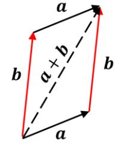
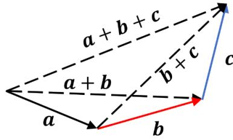
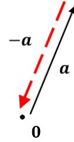
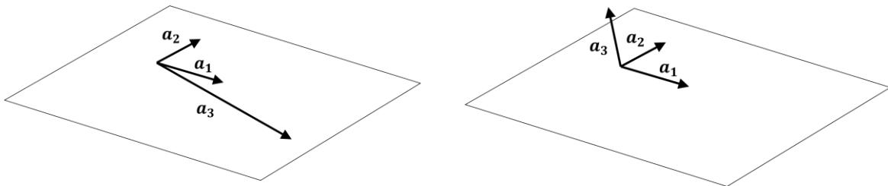
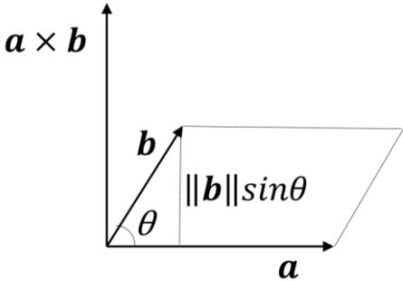
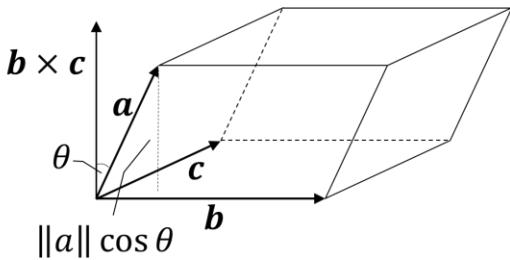
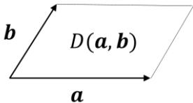
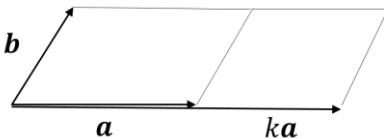
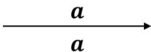
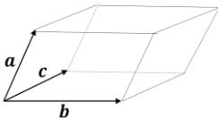

## 【第3講】ベクトル

### 【3-1】はじめに

ベクトルは、言うまでもなく理学・工学あらゆる分野で応用されており、その性質を理解し使いこなせることが求められる。また幾何ベクトルとしてのベクトルだけでなく、抽象化することで他にもさまざまなモノがベクトルとして認識され、ベクトルで得られた様々な知見が応用されている。ベクトルの概念はもともと線形性16を持っており、行列と共に線形代数の基礎をなし、応用範囲はさらに広がっている。

本講では、まず幾何ベクトルの性質を振り返り、抽象化の結果ベクトルとして仲間入りした例を紹介、またベクトルの線形性にも着目しながら線形代数の基礎の基礎を学んでいく。

### 【3-2】ベクトルがもつ性質

#### 【3-2-1】ベクトル自体がもつ性質

幾何ベクトルとは、平面あるいは空間内の「大きさ」と「向き」を持った量とされ、

始点  $P$  から終点  $Q$  へ向かう「有向線分」 $\vec{PQ}$  として定義された。また互いに大きさと向きが等しい（つまり平行移動して一致する）ベクトルは同一視されることから、始点や終点を省略した  $\vec{a} = \vec{PQ}$  などとも表記していた。

これから幾何ベクトル以外にもベクトルの概念を広げていくので、ベクトルを表す記号を  $a$  のように太文字で書き、以降特に必要のない限り、統一して用いることとする。

幾何ベクトルに対し、以下のような演算：**加法とスカラー積**が定義される。

・加法：ベクトル  $a$  の終点に、加えるベクトル  $b$  の始点を一致させるように平行移動させたとき、  $a$  の始点から  $b$  の終点に向かうベクトルとして定義され、  $a + b$  と表す。

・スカラー積：ベクトル  $a$  の大きさを  $k$  倍(実数)したものとなる。

 $k < 0$  の場合：逆向き、 $k = 0$  の場合：零ベクトルとなる。

加法： $a + b$       スカラー積： $a \rightarrow ka$ 

当たり前過ぎて意識しないが、この加法とスカラー積を任意のベクトルに対して行った結果がまたベクトルとなるという閉じた演算になっている点が重要となる。

加法には以下の性質がある事が図により示される。

16 例：関数  $f(x)$  が  $f(x + y) = f(x) + f(y)$ ,  $f(kx) = kf(x)$  という性質を持つとき、線形であるという

交換則  
 $a + b = b + a$ 

結合則  
 $(a + b) + c = a + (b + c)$ 

零ベクトルの存在  
 $a + 0 = a$ 

逆ベクトルの存在  
 $a + (-a) = 0$ 

またスカラー積には以下の性質がある事が下図により示される。

これらをまとめた結果が以下となる。

● 幾何ベクトルの性質

加法

- (i)  $a + b = b + a$  (交換則)
- (ii)  $(a + b) + c = a + (b + c)$  (結合則)
- (iii)  $a + 0 = a$  (零ベクトルの存在)
- (iv)  $a + (-a) = 0$  (逆ベクトルの存在)

分配則

 $k(a + b) = ka + kb$   
 (3 - 2 - 1)

スカラー積

- (v)  $k(a + b) = ka + kb$  (分配則)

**[3-2-2] ベクトルの組がもつ性質**

● 線形結合（または一次結合）の定義

ベクトルの組  $a_1, a_2, \dots, a_m$  とスカラー  $k_1, k_2, \dots, k_m$  において、以下のようなスカラー積されたベクトルの和をこれらのベクトルの  $(k_1, k_2, \dots, k_m)$  を係数とする）**線形結合**（一次結合）という。

 $k_1 a_1 + k_2 a_2 + \dots + k_m a_m$  (3 - 2 - 2)

例として 3 次元空間内で考えてみる。図は 3 次元空間における 2 本のベクトル  $a_1, a_2$  での、係数  $k_1, k_2$  による線形結合を示している。図をみると、 $a_1, a_2$  が「乗っている」平面上に  $k_1 a_1, k_2 a_2, k_1 a_1 + k_2 a_2$  の各ベクトルが全て同様に「乗っている」ことが直観的に分かる。

また係数  $k_1, k_2$  の値を連続的に変化させていけば、線形結合されたベクトル  $k_1 a_1 + k_2 a_2$  がその平面上の全ての点を「指しそうだ」という事も見て取れる。この場合ベクトル  $a_1, a_2$  が「張る」平面という表現をする。

ここでもう一本のベクトル  $a_3$  を加えてみる。

上図の左側では  $a_3$  は  $a_1, a_2$  が張る平面上にあり、右側では平面上にない向きをもつとする。

新たな線形結合  $k_1 a_1 + k_2 a_2 + k_3 a_3$  は左側と右側で明らかに異なる結果となる。

左側では、ベクトル  $a_3$  は  $a_1, a_2$  の線形結合で表され ( $a_3 = k_1 a_1 + k_2 a_2$  となる、少なくともどちらかは 0 でない  $k_1, k_2$  が存在する)、3 本のベクトルは  $a_3$  が加わる前と同じ平面を張る。右側では、ベクトル  $a_3$  は  $a_1, a_2$  の線形結合で表すことができず ( $a_3 = k_1 a_1 + k_2 a_2$  となる  $k_1, k_2$  が存在しない)、3 本のベクトルは  $a_3$  が加わる前と異なり 3 次元空間を張ることになる。この違いを以下のように定式化する。

●線形独立と線形従属 (または一次独立、一次従属)

あるベクトルの組  $a_1, a_2, \dots, a_m$  に対して、スカラー  $c_1, c_2, \dots, c_m$  を用いて

$$c_1 a_1 + c_2 a_2 + \dots + c_m a_m = \mathbf{0} \quad (3-2-3)$$

という式を考えると、この式は

$$c_1 = c_2 = \dots = c_m = 0 \quad (3-2-4)$$

という自明な解を持つが、(3-2-3)式が

・唯一この自明な解(3-2-4)しか持たない場合：

これらのベクトルの組は線形独立 (一次独立) であるという。

・そうでない場合 (他に解をもつ場合)：

これらのベクトルの組は線形従属 (一次従属) であるという。

定義よりベクトルの組の中に零ベクトルが一つでもあると線形従属となることに注意。

線形結合の例であげた 3 本のベクトル  $a_1, a_2, a_3$  について、このことを確認してみよう。

まずこの例の  $a_1, a_2$  は線形独立であることがわかる。もし線形従属なら、 $c_1 a_1 + c_2 a_2 = \mathbf{0}$  の式は、 $c_1, c_2$  の少なくともどちらかは 0 でない事になり、これは  $a_1 = -\frac{c_2}{c_1} a_2$  または  $a_2 = -\frac{c_1}{c_2} a_1$  と書けることを意味している。これでは「平面」を張ることはできないので、 $a_1, a_2$  は線形独立である。これに  $a_3$  を加えた場合、次のようになる。

左側の例では、少なくともどちらかは 0 でない  $k_1, k_2$  を用いて  $a_3 = k_1 a_1 + k_2 a_2$  と表すことができた。これは  $k_1 a_1 + k_2 a_2 - a_3 = 0$  と書けるので、(3-2-3)式が  $c_1 = k_1, c_2 = k_2, c_3 = -1$  という解を持つことを意味している。従って左側の例は線形従属となる。

右側の例で、 $c_1 a_1 + c_2 a_2 + c_3 a_3 = 0$  を考える。もし  $c_3 \neq 0$  なら、 $a_3 = -\frac{c_1}{c_3} a_1 - \frac{c_2}{c_3} a_2$  と書け、 $a_3$  が  $a_1, a_2$  の線形結合で表せないことに矛盾、従って  $c_3 = 0$  となり、 $c_1 a_1 + c_2 a_2 = 0$  を得るが、 $a_1, a_2$  は線形独立だったので  $c_1 = c_2 = 0$  となる。従って右側の例は線形独立となる。

#### ●基底、次元、座標系

上記の例のように線形独立なベクトルの組は、線形結合により2本なら「平面」を、3本なら「空間」を張る。この線形独立なベクトルの組が「平面」や「空間」上の任意のベクトルを線形結合で表せるとき、「平面」や「空間」の**基底**と呼ぶ。この線形結合での表し方は一意となる。

• 線形独立なベクトルの組によるベクトルの線形結合での表し方は一意 (3 - 2 - 5)

 $\therefore a = c_1 a_1 + \dots + c_n a_n = c'_1 a_1 + \dots + c'_n a_n$  のとき  $(c_1 - c'_1) a_1 + \dots + (c_n - c'_n) a_n = 0$  となり  
 $a_1, \dots, a_n$  は線形独立なので  $c_1 - c'_1 = 0, \dots, c_n - c'_n = 0 \therefore c'_1 = c_1, \dots, c'_n = c_n$  がいえる。■

また張られる「平面」や「空間」に対して基底のとり方は無数にあるが、どのようなとり方をしてもその数は同じであり、この数を**次元**という。上記は4次元以上の高次元でも成り立つ。

 $n$ 次元空間の各点を指すベクトルを基底の線形結合で表すとその係数は一意となるので、この係数の組を用いて各点を表すことができる。これを**座標系**といい、その係数の組を**座標値**という。ここまで幾何ベクトルの場合、暗に直交座標系を張れることを前提としてきた。例えば平面の場合、 $e_x = (1,0), e_y = (0,1)$  のような自然な直交座標系をなす基底を選ぶことができる。このような基底を**標準基底**（あるいは**正規直交基底**）という。

### 【3-3】内積

#### 【3-3-1】定義

ベクトル  $a = \sum_{i=1}^n a_i e_i, b = \sum_{j=1}^n b_j e_j$  ( $e_i$  は標準基底) において17

$$a \cdot b \equiv \sum_{i=1}^n a_i b_i \tag{3-3-1}$$

となるスカラー値をベクトルの（標準）**内積**という。（※なお本講ではベクトルの成分が実数である実ベクトルのみを取り扱う。）

自身との内積の値が  $a \cdot a = \sum_{i=1}^n a_i^2 \geq 0$  であり、0になるのは  $a = 0$  の時のみとなる事よりベクトルの**ノルム**（大きさ）を以下のように定義する。

17 (x,y)でなく(1,2)で表す。初見で分かりにくい場合は、nを2や3として総和を展開してみよう。

$$\|a\| \equiv \sqrt{a \cdot a} \quad (\|a\| = 0 \Leftrightarrow a = 0) \quad (3-3-2)$$

また標準基底同士の内積は

$$e_i \cdot e_j = \delta_{ij} \quad (3-3-3)$$

となる18。ここで  $\delta_{ij}$  はクロネッカーのデルタと呼ばれる記号で以下のように定義される。

$$\delta_{ij} = \begin{cases} 1 & \text{if } i = j \\ 0 & \text{if } i \neq j \end{cases} \quad (3-3-4)$$

これらより、ベクトル  $a = \sum_{i=1}^n a_i e_i, b = \sum_{j=1}^n b_j e_j$  の内積は

$$a \cdot b = \left( \sum_{i=1}^n a_i e_i \right) \cdot \left( \sum_{j=1}^n b_j e_j \right) = \sum_{i,j=1}^n a_i b_j e_i \cdot e_j = \sum_{i,j=1}^n a_i b_j \delta_{ij} = \sum_{i=1}^n a_i b_i \quad (3-3-5)$$

となり当然（標準）内積の定義と一致する。またベクトルと標準基底との内積は

$$e_i \cdot a = e_i \cdot \left( \sum_{j=1}^n a_j e_j \right) = \sum_{j=1}^n a_j e_i \cdot e_j = \sum_j a_j \delta_{ij} = a_i \quad (3-3-6)$$

となるように、ベクトルにおけるその標準基底の成分を取り出す事に相当する。

### [3-3-2] 代数的性質

定義から明らかに成り立つ、以下の基本的な代数的性質がある。

- (i)  $a \cdot b = b \cdot a$
- (ii)  $a \cdot (b + c) = a \cdot b + a \cdot c$
- (iii)  $a \cdot (kb) = k a \cdot b$  ( $k$  はスカラー値) (3-3-7)
- (iv)  $a \cdot a \geq 0$  (等号は  $a = 0$  のときのみ)

(※(ii),(iii) の性質を合わせて線形性、また内積記号の左側でも成り立つことから**双線形性**という)

### [3-3-3] 幾何学的意味

幾何ベクトルにおいては、以下のような幾何学的意味をもつ。

#### ● 内積 $a \cdot b$

図のように、なす角が  $\theta$  のベクトル  $a, b$  において、 $a - b$  のノルムの 2 乗を考える。

$$\begin{aligned} \|a - b\|^2 &= (a - b) \cdot (a - b) \\ &= a \cdot a + b \cdot b - 2a \cdot b \\ &= \|a\|^2 + \|b\|^2 - 2a \cdot b \end{aligned}$$

一方、余弦定理より

$$\|a - b\|^2 = \|a\|^2 + \|b\|^2 - 2\|a\|\|b\| \cos \theta$$

両式より

$$a \cdot b = \|a\|\|b\| \cos \theta \quad (3-3-8)$$

この式より、0 でないベクトル同士の内積が 0 となる場合、それらのベクトルは直交する事が分かる。

18 むしろ、これは標準基底あるいは正規直交基底が満たすべき性質となる

#### ●円の接線の方程式

図のような、点  $O$  を中心とした半径  $r_0$  の円に点  $P_0$  で接する接線の方程式を考える。

この接線上の任意の点を  $P$  とし、それぞれの位置ベクトルを

$$\vec{OP_0} = \mathbf{r}_0, \vec{OP} = \mathbf{r} \text{ とする。このとき題意より } \|\mathbf{r}_0\| = r_0 \text{ である。}$$

 $\mathbf{r}_0$  はこの接線に対する法線ベクトルでもあり、

接線を表すベクトル  $\mathbf{r} - \mathbf{r}_0$  と直交するので

$$\mathbf{r}_0 \cdot (\mathbf{r} - \mathbf{r}_0) = 0$$

が成り立つ。従って

$$\mathbf{r}_0 \cdot \mathbf{r} = r_0^2$$

が求める式となる。

座標系を入れて座標値で表記すると、点  $O$  を原点として

点  $P(x, y), P_0(x_0, y_0)$  とすると

$$x_0x + y_0y = r_0^2$$

となる。

(3-3-9)

#### ●球面の接平面の方程式

また上記はそのまま球面に接する接平面の方程式に拡張される。

すなわち上記において、円→球面、接線→接平面に

読み替えれば、そのまま成立する事がわかる（確かめよう）。

座標値では、点  $P(x, y), P_0(x_0, y_0) \rightarrow P(x, y, z), P_0(x_0, y_0, z_0)$ 

と読み替えることになり、

$$x_0x + y_0y + z_0z = r_0^2$$

となる。

点  $O, P_0, P$  を含む平面で切断すると、円と接線の関係になる（部分空間）からこのような事ができるのだが、もう一つ重要なことはベクトルの式が座標系によらずに成り立つからである。

### 【3-4】抽象化されたベクトルの概念と例

これまで幾何ベクトルの性質を振り返ってきた。線形独立性や基底などのベクトルの組が持つ重要な性質は、(3-2-1)式にまとめられているような和とスカラー積の性質から導かれていることが分かる。逆に和とスカラー積が定義され、これらの性質を満たせば、線形独立性なども持つことになる。そこで (3-2-1)式の性質に、スカラー積の性質として

$$(vi) \quad (k+l)\mathbf{a} = k\mathbf{a} + l\mathbf{a} \quad (\text{分配則})$$

$$(vii) \quad k(l\mathbf{a}) = (kl)\mathbf{a} \quad (\text{結合則})$$

$$(viii) \quad 1\mathbf{a} = \mathbf{a} \quad (\text{単位元})$$

一積を定義できる対象をベクトルとみなすことで、ベクトルの概念が広げられる。ベクトルの集合のことを**ベクトル空間**といい、位置づけた公理を**ベクトル空間の公理**という。

また内積は、ベクトルの大きさやベクトル間の角度に関わる量であった。これも同様に内積の性質(3-3-7)式を公理とし、その性質を満たすような、上記のベクトル空間に自然に導入できる内積を定義して用いることとなる。内積が導入されたベクトル空間を**計量ベクトル空間**という。

拡張されたベクトル（ベクトル空間）の例をあげる。各公理を満たすことの確認は読者に任せる。

● 例 1 n 次元実数ベクトル空間 :  $\mathbb{R}^n$  (実数を n 個組にしたもの : 行列でのベクトル)

$$\text{ベクトル } \mathbf{a} = \begin{bmatrix} a_1 \\ a_2 \\ \vdots \\ a_n \end{bmatrix}, \mathbf{b} = \begin{bmatrix} b_1 \\ b_2 \\ \vdots \\ b_n \end{bmatrix}, \text{ スカラー } k \in \mathbb{R} \text{ に対して}$$

$$\text{和 } \mathbf{a} + \mathbf{b} = \begin{bmatrix} a_1 \\ a_2 \\ \vdots \\ a_n \end{bmatrix} + \begin{bmatrix} b_1 \\ b_2 \\ \vdots \\ b_n \end{bmatrix} \equiv \begin{bmatrix} a_1 + b_1 \\ a_2 + b_2 \\ \vdots \\ a_n + b_n \end{bmatrix} \quad \text{スカラー積 } k\mathbf{a} = k \begin{bmatrix} a_1 \\ a_2 \\ \vdots \\ a_n \end{bmatrix} \equiv \begin{bmatrix} ka_1 \\ ka_2 \\ \vdots \\ ka_n \end{bmatrix}$$

と定義することでベクトル空間の公理を満たす。ベクトルの成分を縦に並べたものである。

$$\text{標準基底 } \mathbf{e}_1 = \begin{bmatrix} 1 \\ 0 \\ \vdots \\ 0 \end{bmatrix}, \mathbf{e}_2 = \begin{bmatrix} 0 \\ 1 \\ \vdots \\ 0 \end{bmatrix}, \dots, \mathbf{e}_n = \begin{bmatrix} 0 \\ 0 \\ \vdots \\ 1 \end{bmatrix}$$

内積  $\mathbf{a} \cdot \mathbf{b} = a_1 b_1 + a_2 b_2 + \dots + a_n b_n$  も自然に定められる。

● 例 2 複素数の集合  $\mathbb{C}$ 

複素平面上で複素数の和はベクトルの和のような性質をもっていた。

ベクトル  $\mathbf{a} = a_1 + ia_2, \mathbf{b} = b_1 + ib_2, \text{ スカラー } k \in \mathbb{R}$  に対して

$$\text{和 } \mathbf{a} + \mathbf{b} = (a_1 + ia_2) + (b_1 + ib_2) \equiv (a_1 + b_1) + i(a_2 + b_2)$$

$$\text{スカラー積 } k\mathbf{a} = k(a_1 + ia_2) \equiv ka_1 + i ka_2$$

と定義することでベクトル空間の公理を満たす。

基底  $\mathbf{e}_1 = 1, \mathbf{e}_2 = i$ 

$$\text{内積 } \mathbf{a} \cdot \mathbf{b} \equiv \frac{1}{2}(\mathbf{a}\bar{\mathbf{b}} + \mathbf{b}\bar{\mathbf{a}}) = \frac{1}{2}\{(a_1 + ia_2)(b_1 - ib_2) + (b_1 + ib_2)(a_1 - ia_2)\} = a_1 b_1 + a_2 b_2$$

と定める。

(注 : 本講では内積の値も実数としたいので、このように定義した。複素数値を許す場合は

通常  $\mathbf{a} \cdot \mathbf{b} \equiv \mathbf{a}\bar{\mathbf{b}}$  と定義される。その場合、内積の性質も複素数に拡張される。)

● 例 3 [▼B] 1 変数実数値関数の集合 (少し高度な例)

和  $(f + g)(x) \equiv f(x) + g(x), \text{ スカラー積 } (kf)(x) \equiv kf(x), \text{ 内積 } \int f(x)g(x)dx$ 

と定めることでベクトル空間の公理を満たし、自然な内積として利用できる。基底として三角関数を用いる例を、第 6 講行列 III にて応用例として取り上げる。

### 【3-5】外積

#### 【3-5-1】定義19

ベクトルの外積は、3次元でのみ定義されるものであり、成分で表すと以下のようになる。

$$\mathbf{a} = a_1\mathbf{e}_1 + a_2\mathbf{e}_2 + a_3\mathbf{e}_3, \mathbf{b} = b_1\mathbf{e}_1 + b_2\mathbf{e}_2 + b_3\mathbf{e}_3 \quad \text{(において } (\mathbf{e}_1, \mathbf{e}_2, \mathbf{e}_3 \text{ は標準基底))}$$

$$\mathbf{a} \times \mathbf{b} \equiv (a_2b_3 - a_3b_2)\mathbf{e}_1 + (a_3b_1 - a_1b_3)\mathbf{e}_2 + (a_1b_2 - a_2b_1)\mathbf{e}_3 \quad (3-5-1)$$

となるベクトルをベクトルの**外積**という（規則性を見やすくするため添字は1,2,3とした）。

この定義を観察すると、成分と基底の積  $a_i b_k e_i$  の添字の組が  $(i, j, k) = (1,2,3), (2,3,1), (3,1,2)$  の場合が正、 $(1,3,2), (2,1,3), (3,2,1)$  の場合が負 の符号がついていることが分かる。

この正負の組は、どの2つの数字をその () 内で入れ替えても互いに移り変わる。

また最初の項  $(a_2b_3 - a_3b_2)\mathbf{e}_1$  に対して、1→2, 2→3, 3→1 とサイクリックに添字を入れ替えると第2項  $(a_3b_1 - a_1b_3)\mathbf{e}_2$  に、もう一度入れ替えると第3項  $(a_1b_2 - a_2b_1)\mathbf{e}_3$  に、さらに入れ替えると第1項に戻る。従って、外積の定義全体がサイクリックな添字の入れ替えで不変（入れ替えについて対称）となることが分かる。このような規則性を活かした成分表記に大変有用（且つ強力）な記法（**Levi-Civita**（**レヴィ=チヴィタ**）記号）があるので付録1にて紹介する。

#### 【3-5-2】代数的性質

定義より明らかに成り立つ、以下の基本的な代数的性質がある。

(i)  $\mathbf{a} \times \mathbf{b} = -\mathbf{b} \times \mathbf{a} \quad \therefore \mathbf{a} \times \mathbf{a} = \mathbf{0}$ 

(ii)  $(\mathbf{a} + \mathbf{b}) \times \mathbf{c} = \mathbf{a} \times \mathbf{c} + \mathbf{b} \times \mathbf{c} \quad (3-5-2)$ 

(iii)  $(k\mathbf{a}) \times \mathbf{b} = k(\mathbf{a} \times \mathbf{b})$  ( $k$  はスカラー値)

また上記基本性質以外に、以下のような公式が成り立つ。ここでは公式の記載にとどめ、その証明は付録2に掲載する。各証明は成分表記で地道に行う方法と、Levi-Civita 記号を用いて劇的にシンプル(且つ機械的)に示す方法の2種類で行う。いずれも上記定義で述べた規則性に基づく。

●スカラー三重積  $\mathbf{a} \cdot (\mathbf{b} \times \mathbf{c})$  で成り立つ公式

$$\mathbf{a} \cdot (\mathbf{b} \times \mathbf{c}) = \mathbf{b} \cdot (\mathbf{c} \times \mathbf{a}) = \mathbf{c} \cdot (\mathbf{a} \times \mathbf{b}) \quad (3-5-3)$$

●ベクトル三重積  $\mathbf{a} \times (\mathbf{b} \times \mathbf{c})$  で成り立つ公式

$$\mathbf{a} \times (\mathbf{b} \times \mathbf{c}) = (\mathbf{a} \cdot \mathbf{c})\mathbf{b} - (\mathbf{a} \cdot \mathbf{b})\mathbf{c} \quad (3-5-4)$$

●外積同士の内積  $(\mathbf{a} \times \mathbf{b}) \cdot (\mathbf{c} \times \mathbf{d})$  で成り立つ公式

$$(\mathbf{a} \times \mathbf{b}) \cdot (\mathbf{c} \times \mathbf{d}) = (\mathbf{a} \cdot \mathbf{c})(\mathbf{b} \cdot \mathbf{d}) - (\mathbf{a} \cdot \mathbf{d})(\mathbf{b} \cdot \mathbf{c}) \quad (3-5-5)$$

19 初めて外積を学ぶ読者は幾何学的意味から入る方が分かりやすいとは思う。[3-5-3] 参照。ただしこれを定義として成分表示 (3-5-1) を導くには (3-5-2)(ii) を幾何学的に示す必要があり初学者にはかえって難解かと思われる。

**[3-5-3] 幾何学的意味**

幾何ベクトルにおいては、以下のような幾何学的な意味を持つ。

●外積  $a \times b$ 

・大きさ : ベクトルとしての  $a \times b$  のノルムの 2 乗により、 $a, b$  のなす角を  $\theta$  とすると

$$\begin{aligned} \|a \times b\|^2 &= (a \times b) \cdot (a \times b) \\ &= (a \cdot a)(b \cdot b) - (a \cdot b)^2 && (\because (3 - 5 - 5)) \\ &= \|a\|^2 \|b\|^2 (1 - \cos^2 \theta) \\ &= \|a\|^2 \|b\|^2 \sin^2 \theta \\ \therefore \|a \times b\| &= \|a\| \|b\| \sin \theta \end{aligned}$$

これは、ベクトル  $a, b$  が張る平行四辺形の面積と等しい。

・方向 :  $a \times b$  に対して、 $a, b$  とそれぞれ内積をとると

$$a \cdot (a \times b) = b \cdot (a \times a) = 0, \quad b \cdot (a \times b) = a \cdot (b \times b) = 0 \quad (\because (3 - 5 - 3))$$

より、 $a \times b$  は  $a, b$  どちらとも直交する。また定義より標準基底に対して

$$e_x \times e_y = e_z, \quad e_y \times e_z = e_x, \quad e_z \times e_x = e_y$$

が成り立つ事より、図のように、 $a$  を  $b$  に向けて回した時に右ねじが進む方を向く。

●スカラー三重積  $a \cdot (b \times c)$ 

ベクトル  $a$  と  $b \times c$  との内積は、そのなす角を  $\theta$  とすると  $\|a\| \|b \times c\| \cos \theta$  であるが、 $\|b \times c\|$  に  $\|a\| \cos \theta$  を掛けたものと見ることもでき、これはベクトル  $b, c$  が張る平行四辺形の面積に、ベクトル  $a$  の高さを掛けたものと等しい。従って、スカラー三重積の値は、3 本のベクトルが張る平行六面体の符号付き体積と見なせる。

その符号はベクトル  $a$  と  $b \times c$  との向きの関係で決まり、図のようになす角  $\theta$  が  $\pi/2$  以下の場合に正となり、内積の符号を表す  $\cos \theta$  の符号が反映されることになる。またスカラー三重積の性質(3-5-3)式はこの幾何学的意味から向き付けに注意して成り立つことが分かる。

ベクトルの外積は、第 8 講 回転の表現 II で学ぶクォータニオンの積から自然に生まれたもので、煎じ詰めるとその意味で 3 次元でしか定義できない20。また  $n$  次元に拡張可能な外積に似た概念のひとつに「外積代数」21と呼ばれるものがあるが、それに近いものを次節にて学ぶ。

20 生まれる詳細は第 8 講で。ちなみにクォータニオン（四元数）の次は 8 次元での八元数が定義でき、7 次元空間では外積的なものは定義できるそうな。

21 この節の外積（cross product）とは異なる「外積」であり、exterior product の訳語である。

### 【3-6】 n 本のベクトルが張る n 次元体積

応用として n 次元空間で n 本のベクトルが張る n 次元の体積に相当する「関数」を考える22。

外積の幾何学的意味の項で見たように、2 次元の場合は外積の大きさ、3 次元の場合はスカラー三重積にあたる量であり、これを n 次元に拡張したい。

#### 【3-6-1】 2 次元 : 2 次元体積 (面積)

以下、図のようなベクトル  $a, b$  が張る面積を値にもつ、ベクトルを変数とする「関数」を  $D(a, b)$  とし、その性質を考える。

(i) ベクトルの和に対して

 $a = a_1 + a_2$  のとき図のように平行四辺形  $OE'D'B$  と  $OEDB$  は底辺  $OB$  が共通で高さが等しいので、面積も等しい (面積 :  $D(a_1, b)$ )。  
 $CD'E'A$  と  $CDEA$  も同様 (面積 :  $D(a_2, b)$ )。従って

$$D(a_1 + a_2, b) = D(a_1, b) + D(a_2, b) \quad (b \text{ についても同様})$$

(ii) スカラー積に対して

 $a$  を  $k$  倍すると面積も  $k$  倍となる

$$D(ka, b) = kD(a, b) \quad (b \text{ についても同様})$$

(iii) 同じベクトルが張る面積は 0

$$D(a, a) = 0$$

またこれにより

$$\begin{aligned} 0 &= D(a + b, a + b) && (\because (iii)) \\ &= D(a, a + b) + D(b, a + b) && (\because (i)) \\ &= D(a, a) + D(a, b) + D(b, a) + D(b, b) && (\because (i)) \\ &= D(a, b) + D(b, a) && (\because (iii)) \\ \therefore D(b, a) &= -D(a, b) \end{aligned}$$

この面積は符号付きとなり、符号は張るベクトルの向き付けによる。

(iv) 標準基底が張る面積を 1 とする

$$D(e_1, e_2) = 1$$

面積の大きさの単位および向き付けの定義となる。

22 次講以降の行列のダンジョンで戦うための武器を作る。今のうちに武器の経験値を上げておこう。

実はこの 4 つの性質 : ((i),(ii)は  $b$  についても同様)

- (i)  $D(\mathbf{a}_1 + \mathbf{a}_2, b) = D(\mathbf{a}_1, b) + D(\mathbf{a}_2, b)$  (3 - 6 - 1)
- (ii)  $D(k\mathbf{a}, b) = kD(\mathbf{a}, b)$  (3 - 6 - 2)
- (iii)  $D(\mathbf{a}, \mathbf{a}) = 0 \quad \therefore D(b, \mathbf{a}) = -D(\mathbf{a}, b)$  (3 - 6 - 3)
- (iv)  $D(\mathbf{e}_1, \mathbf{e}_2) = 1$  (3 - 6 - 4)

で、 $D(\mathbf{a}, b)$  の値は一意に定まる。実際、 $\mathbf{a} = a_1\mathbf{e}_1 + a_2\mathbf{e}_2$ ,  $b = b_1\mathbf{e}_1 + b_2\mathbf{e}_2$  のとき

$$\begin{aligned} D(\mathbf{a}, b) &= D(a_1\mathbf{e}_1 + a_2\mathbf{e}_2, b_1\mathbf{e}_1 + b_2\mathbf{e}_2) \\ &= D(a_1\mathbf{e}_1, b_1\mathbf{e}_1) + D(a_1\mathbf{e}_1, b_2\mathbf{e}_2) + D(a_2\mathbf{e}_2, b_1\mathbf{e}_1) + D(a_2\mathbf{e}_2, b_2\mathbf{e}_2) && (\because (i)) \\ &= a_1b_1D(\mathbf{e}_1, \mathbf{e}_1) + a_1b_2D(\mathbf{e}_1, \mathbf{e}_2) + a_2b_1D(\mathbf{e}_2, \mathbf{e}_1) + a_2b_2D(\mathbf{e}_2, \mathbf{e}_2) && (\because (ii)) \\ &= a_1b_2D(\mathbf{e}_1, \mathbf{e}_2) + a_2b_1D(\mathbf{e}_2, \mathbf{e}_1) && (\because (iii)) \\ &= (a_1b_2 - a_2b_1)D(\mathbf{e}_1, \mathbf{e}_2) && (\because (iiii)) \\ &= a_1b_2 - a_2b_1 && (\because (iv)) \end{aligned}$$

となるが、これは幾何学的に求まる符号付き面積  $\mathbf{a} \times \mathbf{b}$  の値を成分で表したものと一致する。

( $\mathbf{a} = (a_1, a_2, 0), \mathbf{b} = (b_1, b_2, 0)$  のときの  $\mathbf{a} \times \mathbf{b}$  の大きさとなる)

**[3-6-2] 3 次元 : 3 次元体積 (体積)**

3 次元に素直に拡張する。この体積を表す  $D(\mathbf{a}, \mathbf{b}, \mathbf{c})$  も同様に以下の性質を持つ。((i)以外は明らか。(i)も  $b, c$  が張る平行四辺形の面積に  $\mathbf{a}_1, \mathbf{a}_2$  の高さを掛けた体積の和として成り立つ。)

- (i)  $D(\mathbf{a}_1 + \mathbf{a}_2, \mathbf{b}, \mathbf{c}) = D(\mathbf{a}_1, \mathbf{b}, \mathbf{c}) + D(\mathbf{a}_2, \mathbf{b}, \mathbf{c})$  (3 - 6 - 5)
- (ii)  $D(k\mathbf{a}, \mathbf{b}, \mathbf{c}) = kD(\mathbf{a}, \mathbf{b}, \mathbf{c})$  (3 - 6 - 6)
- (iii)  $D(\mathbf{a}, \mathbf{a}, \mathbf{b}) = 0 \quad \therefore D(\mathbf{b}, \mathbf{a}, \mathbf{c}) = -D(\mathbf{a}, \mathbf{b}, \mathbf{c})$  (3 - 6 - 7)
- (iv)  $D(\mathbf{e}_1, \mathbf{e}_2, \mathbf{e}_3) = 1$  (3 - 6 - 8)

((i),(ii)は  $b, c$  についても同様。(iii)はどの 2 つが同じでも、どの 2 つを入れ替えてもという意味)

性質(iii),(iv)より、 $D(\mathbf{e}_i, \mathbf{e}_j, \mathbf{e}_k)$  ( $1 \leq i, j, k \leq 3$ ) は  $i, j, k$  の値が全て異なるとき非零の値をもち、変数部分が  $\mathbf{e}_1, \mathbf{e}_2, \mathbf{e}_3$  からの並び替えで符号が変わるだけで以下のような値をもつことになる。

$$D(\mathbf{e}_i, \mathbf{e}_j, \mathbf{e}_k) = \begin{cases} +1 & \text{if } (i, j, k) = (1,2,3), (2,3,1), (3,1,2) \\ -1 & \text{if } (i, j, k) = (1,3,2), (2,1,3), (3,2,1) \\ 0 & \text{other} \end{cases} \quad (3 - 6 - 9)$$

これは (3-7-1) 式である Levi-Civita 記号  $\varepsilon_{ijk}$  と全く同じことがわかる。

また同じように上記 4 つの性質のみで  $D(\mathbf{a}, \mathbf{b}, \mathbf{c})$  の値は一意に定まる。

実際  $\mathbf{a} = \sum_{i=1}^3 a_i \mathbf{e}_i, \mathbf{b} = \sum_{j=1}^3 b_j \mathbf{e}_j, \mathbf{c} = \sum_{k=1}^3 c_k \mathbf{e}_k$  のとき

$$\begin{aligned} D(\mathbf{a}, \mathbf{b}, \mathbf{c}) &= D \left( \sum_{i=1}^3 a_i \mathbf{e}_i, \sum_{j=1}^3 b_j \mathbf{e}_j, \sum_{k=1}^3 c_k \mathbf{e}_k \right) = \sum_{i,j,k=1}^3 a_i b_j c_k D(\mathbf{e}_i, \mathbf{e}_j, \mathbf{e}_k) \\ &= a_1 \sum_{j,k=1}^3 b_j c_k D(\mathbf{e}_1, \mathbf{e}_j, \mathbf{e}_k) + a_2 \sum_{j,k=1}^3 b_j c_k D(\mathbf{e}_2, \mathbf{e}_j, \mathbf{e}_k) + a_3 \sum_{j,k=1}^3 b_j c_k D(\mathbf{e}_3, \mathbf{e}_j, \mathbf{e}_k) \\ &= a_1(b_2 c_3 - b_3 c_2) D(\mathbf{e}_1, \mathbf{e}_2, \mathbf{e}_3) + a_2(b_3 c_1 - b_1 c_3) D(\mathbf{e}_2, \mathbf{e}_3, \mathbf{e}_1) + a_3(b_1 c_2 - b_2 c_1) D(\mathbf{e}_3, \mathbf{e}_1, \mathbf{e}_2) \\ &= \{a_1(b_2 c_3 - b_3 c_2) + a_2(b_3 c_1 - b_1 c_3) + a_3(b_1 c_2 - b_2 c_1)\} D(\mathbf{e}_1, \mathbf{e}_2, \mathbf{e}_3) \\ &= a_1(b_2 c_3 - b_3 c_2) + a_2(b_3 c_1 - b_1 c_3) + a_3(b_1 c_2 - b_2 c_1) \quad (3 - 6 - 10) \end{aligned}$$

**[3-6-3] n 次元 : n 次元体積**

n 次元に素直に拡張して

$$(i) \quad D(\mathbf{a}_1, \dots, \mathbf{a}_{i_1} + \mathbf{a}_{i_2}, \dots, \mathbf{a}_n) = D(\mathbf{a}_1, \dots, \mathbf{a}_{i_1}, \dots, \mathbf{a}_n) + D(\mathbf{a}_1, \dots, \mathbf{a}_{i_2}, \dots, \mathbf{a}_n) \quad (3-6-11)$$

$$(ii) \quad D(\mathbf{a}_1, \dots, k\mathbf{a}_i, \dots, \mathbf{a}_n) = kD(\mathbf{a}_1, \dots, \mathbf{a}_i, \dots, \mathbf{a}_n) \quad (3-6-12)$$

$$(iii) \quad D(\mathbf{a}_1, \dots, \mathbf{a}_i, \dots, \mathbf{a}_i, \dots, \mathbf{a}_n) = 0 \\ \therefore D(\mathbf{a}_1, \dots, \mathbf{a}_j, \dots, \mathbf{a}_i, \dots, \mathbf{a}_n) = -D(\mathbf{a}_1, \dots, \mathbf{a}_i, \dots, \mathbf{a}_j, \dots, \mathbf{a}_n) \quad (3-6-13)$$

$$(iv) \quad D(\mathbf{e}_1, \mathbf{e}_2, \dots, \mathbf{e}_n) = 1 \quad (3-6-14)$$

これまでと同様にこの関数値はこの 4 つの性質で一意に定まり、「n 次元体積」に相当する23。

3 次と同様  $D(\mathbf{e}_{i_1}, \mathbf{e}_{i_2}, \dots, \mathbf{e}_{i_n})$  は 性質(iii),(iv)より  $\mathbf{e}_1, \mathbf{e}_2, \dots, \mathbf{e}_n$  からの並び替えで値が決まり24、

$$D(\mathbf{e}_{i_1}, \mathbf{e}_{i_2}, \dots, \mathbf{e}_{i_n}) = \begin{cases} +1 & (i_1, i_2, \dots, i_n) \text{ が } (1, 2, \dots, n) \text{ の偶置換} \\ -1 & (i_1, i_2, \dots, i_n) \text{ が } (1, 2, \dots, n) \text{ の奇置換} \\ 0 & \text{other} \end{cases} \quad (3-6-15)$$

となり、これは (3-7-6) 式である拡張 Levi-Civita 記号  $\varepsilon_{i_1 i_2 \dots i_n}$  と全く同じとなる。

性質 (i),(ii) のことを**多重線形性**、性質 (iii) のことを**交代性**という。

性質 (i), (ii), (iii) を用いて、後に重要となる性質を 2 つ導く。

● あるベクトルのスカラー積を他のベクトルに加えても「関数」の値は変わらない

$$D(\mathbf{a}_1, \dots, \mathbf{a}_{i-1}, \mathbf{a}_i + k\mathbf{a}_j, \dots, \mathbf{a}_j, \dots, \mathbf{a}_n) = D(\mathbf{a}_1, \dots, \mathbf{a}_{i-1}, \mathbf{a}_i, \dots, \mathbf{a}_j, \dots, \mathbf{a}_n) \quad (3-6-16)$$

【証明】  $D(\mathbf{a}_1, \dots, \mathbf{a}_i + k\mathbf{a}_j, \dots, \mathbf{a}_j, \dots, \mathbf{a}_n) = D(\mathbf{a}_1, \dots, \mathbf{a}_i, \dots, \mathbf{a}_j, \dots, \mathbf{a}_n) + kD(\mathbf{a}_1, \dots, \mathbf{a}_j, \dots, \mathbf{a}_j, \dots, \mathbf{a}_n)$   
 $= D(\mathbf{a}_1, \dots, \mathbf{a}_i, \dots, \mathbf{a}_j, \dots, \mathbf{a}_n) \quad \blacksquare$ 

● 線形従属なベクトルの組に対しては 0 となる（張る体積は 0）

$$\mathbf{a}_1, \mathbf{a}_2, \dots, \mathbf{a}_n \text{ が線形従属} \Rightarrow D(\mathbf{a}_1, \mathbf{a}_2, \dots, \mathbf{a}_n) = 0 \quad (3-6-17)$$

【証明】 線形従属なので、あるベクトルは他の線形結合で書ける。

例えば  $\mathbf{a}_1 = k_2 \mathbf{a}_2 + \dots + k_n \mathbf{a}_n$  と書けたとすると（他の場合も同様）

$$D(\mathbf{a}_1, \mathbf{a}_2, \dots, \mathbf{a}_n) = k_2 D(\mathbf{a}_2, \mathbf{a}_2, \dots, \mathbf{a}_n) + \dots + k_n D(\mathbf{a}_n, \mathbf{a}_2, \dots, \mathbf{a}_n) = 0 \quad \blacksquare$$

またこの対偶として「 $D(\mathbf{a}_1, \mathbf{a}_2, \dots, \mathbf{a}_n) \neq 0 \Rightarrow \mathbf{a}_1, \mathbf{a}_2, \dots, \mathbf{a}_n$  は線形独立」が直ちにいえる。

この「関数」には線形代数がいつぱい詰まっている。次講以降で活躍する。

23 数学的な厳密さよりも武器を作ることを目的としている。そもそも「n 次元体積」の定義すらしていないことに注意。（これに踏み込むと話が進まないw 興味のある人は(将来)「Gram 行列式」「微分形式」とかで調べてみよう）次講で(n 次元目の高さ)×(n-1 次元体積)と解釈できる話をする。ここでは、これを用いて「n 次元体積」としよう。ど一しても論理体系が気になる人は（内積のように）この 4 つの性質をこの「関数」の公理と位置づけて考え、別途「n 次元体積」となることを示す立場を取ろう。

24 偶置換、奇置換は、[3-7-2] 拡張 Levi-Civita 記号 および 付録 3 参照

**【3-7】 付録 1 : Levi-Civita 記号25[3-7-1] Levi-Civita 記号 (3次の場合)**● 定義
$$\varepsilon_{ijk} = \begin{cases} +1 & \text{if } (i,j,k) = (1,2,3), (2,3,1), (3,1,2) \\ -1 & \text{if } (i,j,k) = (1,3,2), (2,1,3), (3,2,1) \\ 0 & \text{other} \end{cases} \quad (3-7-1)$$

この記号を使うとベクトルの外積は

$$\mathbf{a} \times \mathbf{b} = \sum_{i,j,k=1}^3 \varepsilon_{ijk} a_j b_k \mathbf{e}_i \quad (3-7-2)$$

または単に成分表記で

$$(\mathbf{a} \times \mathbf{b})_i = \sum_{j,k=1}^3 \varepsilon_{ijk} a_j b_k \quad (3-7-3)$$

と書ける。

実際(3-7-2)式を展開してみると

$$\begin{aligned} \sum_{i,j,k=1}^3 \varepsilon_{ijk} a_j b_k \mathbf{e}_i &= \sum_{j,k=1}^3 \varepsilon_{1jk} a_j b_k \mathbf{e}_1 + \sum_{j,k=1}^3 \varepsilon_{2jk} a_j b_k \mathbf{e}_2 + \sum_{j,k=1}^3 \varepsilon_{3jk} a_j b_k \mathbf{e}_3 \\ &= (a_2 b_3 - a_3 b_2) \mathbf{e}_1 + (a_3 b_1 - a_1 b_3) \mathbf{e}_2 + (a_1 b_2 - a_2 b_1) \mathbf{e}_3 \end{aligned}$$

となり、外積の定義 (3-5-1) 式と一致する。

● 基本性質 (各添字の値が 1,2,3 のどれであっても成り立つことを確かめるとわかりやすい)

- (i)  $\varepsilon_{ijk} = -\varepsilon_{ikj}$  どの 2 つの添字を入れ替えても符号が変わる
- (ii)  $\varepsilon_{iij} = 0$  添字が同じだと 0 (3-7-4)
- (iii)  $\varepsilon_{ijk} = \varepsilon_{jki}$  添字のサイクリックな入れ替えで不変

● [▼C] Levi-Civita 記号の積
$$\sum_{i=1}^3 \varepsilon_{ijk} \varepsilon_{ilm} = \delta_{jl} \delta_{km} - \delta_{jm} \delta_{kl} \quad (3-7-5)$$

概要を説明する。左辺を展開した第一項  $\varepsilon_{1jk} \varepsilon_{1lm}$  に着目すると、添字  $j, k$  および  $l, m$  がそれぞれ 2, 3 か 3, 2 の場合に非零となり、その組み合わせが  $(2,3)(2,3), (3,2)(3,2)$  の場合に正、 $(2,3)(3,2), (3,2)(2,3)$  の場合に負の符号となる。すなわち 添字の組み合わせとして、 $j = l, k = m$  の場合に +1、 $j = m, k = l$  の場合に -1 となり、それ以外では 0 となる。総和の他の項  $\varepsilon_{2jk} \varepsilon_{2lm}, \varepsilon_{3jk} \varepsilon_{3lm}$  についても同様の事が言えて、これらをまとめたものが上記の式となる。導出は行列式を学んだあと行列 II の講の付録で行う。

25 エディントンのイプシロンとも呼ばれる (らしい)

**[3-7-2] 拡張 Levi-Civita 記号 (n 次の場合)**

●定義

$$\varepsilon_{i_1 i_2 \dots i_n} = \begin{cases} +1 & (i_1, i_2, \dots, i_n) \text{ が } (1, 2, \dots, n) \text{ の偶置換} \\ -1 & (i_1, i_2, \dots, i_n) \text{ が } (1, 2, \dots, n) \text{ の奇置換} \\ 0 & \text{other} \end{cases} \quad (3-7-6)$$

●偶置換と奇置換

 $(i_1, i_2, \dots, i_n)$  が  $(1, 2, \dots, n)$  の順番を並び替えしたものとする。任意の 2 つの数字の入れ替えを**互換**という。 $(1, 2, \dots, n)$  から互換を繰り返し  $(i_1, i_2, \dots, i_n)$  の並びにするとき、偶数回の互換で達成できる場合を**偶置換**、奇数回の場合を**奇置換**という。この偶奇性は互換のやり方によらない26。3 次での例 : 1, 2, 3 の数字の並び方は  $3!=6$  通りあり、 $(1, 2, 3)$  から互換を繰り返し行うと偶奇性により 2 種類に分かれる。 $(1, 2, 3), (2, 3, 1), (3, 1, 2)$  : 偶置換  $(1, 3, 2), (2, 1, 3), (3, 2, 1)$  : 奇置換 (実際に確かめよう) 3 次では通常の Levi-Civita 記号に帰着することがわかる。

●基本性質

- (i)  $\varepsilon_{i_1, \dots, i_j, \dots, i_k, \dots, i_n} = -\varepsilon_{i_1, \dots, i_k, \dots, i_j, \dots, i_n}$  添字の入れ替えで符号が変わる
- (ii)  $\varepsilon_{i_1, \dots, i_j, \dots, i_k, \dots, i_n} = 0$  同じ添字で 0 (3-7-7)

**[3-8] 付録 2 : 外積の公式の証明**

●成分表記による証明 : ややこしそうに見えるが規則性がつかめれば見た目ほどではない27。

○スカラー三重積  $a \cdot (b \times c)$  で成り立つ公式

$$a \cdot (b \times c) = b \cdot (c \times a) = c \cdot (a \times b)$$

3 式をそれぞれ成分表記で展開する。

$$\begin{aligned} a \cdot (b \times c) &= a_1(b_2c_3 - b_3c_2) + a_2(b_3c_1 - b_1c_3) + a_3(b_1c_2 - b_2c_1) \\ &= a_1b_2c_3 + a_2b_3c_1 + a_3b_1c_2 - a_1b_3c_2 - a_2b_1c_3 - a_3b_2c_1 \end{aligned}$$

$$\begin{aligned} b \cdot (c \times a) &= b_1(c_2a_3 - c_3a_2) + b_2(c_3a_1 - c_1a_3) + b_3(c_1a_2 - c_2a_1) \\ &= a_1b_2c_3 + a_2b_3c_1 + a_3b_1c_2 - a_1b_3c_2 - a_2b_1c_3 - a_3b_2c_1 \end{aligned}$$

$$\begin{aligned} c \cdot (a \times b) &= c_1(a_2b_3 - a_3b_2) + c_2(a_3b_1 - a_1b_3) + c_3(a_1b_2 - a_2b_1) \\ &= a_1b_2c_3 + a_2b_3c_1 + a_3b_1c_2 - a_1b_3c_2 - a_2b_1c_3 - a_3b_2c_1 \end{aligned}$$

よって 3 式が等しいことが示された。■

26 付録 3 : 置換と転倒数の偶奇性 参照のこと

27 証明そのものよりも、この規則性を掴むことを目的としている。パズル感覚で楽しんでほしい

○ベクトル三重積  $\mathbf{a} \times (\mathbf{b} \times \mathbf{c})$  で成り立つ公式28

$$\mathbf{a} \times (\mathbf{b} \times \mathbf{c}) = (\mathbf{a} \cdot \mathbf{c})\mathbf{b} - (\mathbf{a} \cdot \mathbf{b})\mathbf{c}$$

$$\begin{aligned} \mathbf{a} \times (\mathbf{b} \times \mathbf{c}) &= \{a_2(b_1c_2 - b_2c_1) - a_3(b_3c_1 - b_1c_3)\}\mathbf{e}_1 \\ &\quad + \{a_3(b_2c_3 - b_3c_2) - a_1(b_1c_2 - b_2c_1)\}\mathbf{e}_2 \\ &\quad + \{a_1(b_3c_1 - b_1c_3) - a_2(b_2c_3 - b_3c_2)\}\mathbf{e}_3 \\ &= \{(a_2c_2 + a_3c_3)b_1 - (a_2b_2 + a_3b_3)c_1\}\mathbf{e}_1 \\ &\quad + \{(a_1c_1 + a_3c_3)b_2 - (a_1b_1 + a_3b_3)c_2\}\mathbf{e}_2 \\ &\quad + \{(a_1c_1 + a_2c_2)b_3 - (a_1b_1 + a_2b_2)c_3\}\mathbf{e}_3 \\ &= \{(a_1c_1 + a_2c_2 + a_3c_3)b_1 - (a_1b_1 + a_2b_2 + a_3b_3)c_1\}\mathbf{e}_1 \\ &\quad + \{(a_1c_1 + a_2c_2 + a_3c_3)b_2 - (a_1b_1 + a_2b_2 + a_3b_3)c_2\}\mathbf{e}_2 \\ &\quad + \{(a_1c_1 + a_2c_2 + a_3c_3)b_3 - (a_1b_1 + a_2b_2 + a_3b_3)c_3\}\mathbf{e}_3 \\ &= \{(\mathbf{a} \cdot \mathbf{c})b_1 - (\mathbf{a} \cdot \mathbf{b})c_1\}\mathbf{e}_1 + \{(\mathbf{a} \cdot \mathbf{c})b_2 - (\mathbf{a} \cdot \mathbf{b})c_2\}\mathbf{e}_2 + \{(\mathbf{a} \cdot \mathbf{c})b_3 - (\mathbf{a} \cdot \mathbf{b})c_3\}\mathbf{e}_3 \\ &= (\mathbf{a} \cdot \mathbf{c})\mathbf{b} - (\mathbf{a} \cdot \mathbf{b})\mathbf{c} \quad \blacksquare \end{aligned}$$

○外積同士の内積  $(\mathbf{a} \times \mathbf{b}) \cdot (\mathbf{c} \times \mathbf{d})$  で成り立つ公式

$$(\mathbf{a} \times \mathbf{b}) \cdot (\mathbf{c} \times \mathbf{d}) = (\mathbf{a} \cdot \mathbf{c})(\mathbf{b} \cdot \mathbf{d}) - (\mathbf{a} \cdot \mathbf{d})(\mathbf{b} \cdot \mathbf{c})$$

$$\begin{aligned} (\mathbf{a} \times \mathbf{b}) \cdot (\mathbf{c} \times \mathbf{d}) &= (a_2b_3 - a_3b_2)(c_2d_3 - c_3d_2) + (a_3b_1 - a_1b_3)(c_3d_1 - c_1d_3) + (a_1b_2 - a_2b_1)(c_1d_2 - c_2d_1) \\ &= a_2b_3c_2d_3 + a_3b_2c_3d_2 + a_3b_1c_3d_1 + a_1b_3c_1d_3 + a_1b_2c_1d_2 + a_2b_1c_2d_1 \\ &\quad - (a_2b_3c_3d_2 + a_3b_2c_2d_3 + a_3b_1c_1d_3 + a_1b_3c_3d_1 + a_1b_2c_2d_1 + a_2b_1c_1d_2) \\ &= a_1c_1b_2d_2 + a_1c_1b_3d_3 + a_2c_2b_1d_1 + a_2c_2b_3d_3 + a_3c_3b_1d_1 + a_3c_3b_2d_2 \\ &\quad - (a_1d_1b_2c_2 + a_1d_1b_3c_3 + a_2d_2b_1c_1 + a_2d_2b_3c_3 + a_3d_3b_1c_1 + a_3d_3b_2c_2) \\ &= \{a_1c_1(b_2d_2 + b_3d_3) + a_2c_2(b_1d_1 + b_3d_3) + a_3c_3(b_1d_1 + b_2d_2)\} \\ &\quad - \{a_1d_1(b_2c_2 + b_3c_3) + a_2d_2(b_1c_1 + b_3c_3) + a_3d_3(b_1c_1 + b_2c_2)\} \end{aligned}$$

この式に  $0 = (a_1c_1b_1d_1 + a_2c_2b_2d_2 + a_3c_3b_3d_3) - (a_1d_1b_1c_1 + a_2d_2b_2c_2 + a_3d_3b_3c_3)$ 

を加える

$$\begin{aligned} &= [\{a_1c_1(b_1d_1 + b_2d_2 + b_3d_3) + a_2c_2(b_1d_1 + b_2d_2 + b_3d_3) + a_3c_3(b_1d_1 + b_2d_2 + b_3d_3)\} \\ &\quad - \{a_1d_1(b_1c_1 + b_2c_2 + b_3c_3) + a_2d_2(b_1c_1 + b_2c_2 + b_3c_3) + a_3d_3(b_1c_1 + b_2c_2 + b_3c_3)\}] \\ &= (a_1c_1 + a_2c_2 + a_3c_3)(b_1d_1 + b_2d_2 + b_3d_3) - (a_1d_1 + a_2d_2 + a_3d_3)(b_1c_1 + b_2c_2 + b_3c_3) \\ &= (\mathbf{a} \cdot \mathbf{c})(\mathbf{b} \cdot \mathbf{d}) - (\mathbf{a} \cdot \mathbf{d})(\mathbf{b} \cdot \mathbf{c}) \quad \blacksquare \end{aligned}$$

28 基底  $\mathbf{e}_1$  の成分のみに着目、残りはサイクリックな添字の入れ替えで成り立つ

●Levi-Civita 記号を用いた証明29 (各総和記号の添字は全て 1 から 3 まで動く)

○スカラー三重積 :  $\mathbf{a} \cdot (\mathbf{b} \times \mathbf{c}) = \mathbf{b} \cdot (\mathbf{c} \times \mathbf{a}) = \mathbf{c} \cdot (\mathbf{a} \times \mathbf{b})$ 

$$\begin{aligned} \mathbf{a} \cdot (\mathbf{b} \times \mathbf{c}) &= \sum_i a_i \sum_{j,k} \varepsilon_{ijk} b_j c_k = \sum_{i,j,k} \varepsilon_{ijk} a_i b_j c_k \\ \mathbf{b} \cdot (\mathbf{c} \times \mathbf{a}) &= \sum_j b_j \sum_{k,i} \varepsilon_{jki} c_k a_i = \sum_{i,j,k} \varepsilon_{jki} a_i b_j c_k = \sum_{i,j,k} \varepsilon_{ijk} a_i b_j c_k \quad (\because (3-7-4)(iii)) \\ \mathbf{c} \cdot (\mathbf{a} \times \mathbf{b}) &= \sum_k c_k \sum_{i,j} \varepsilon_{kij} a_i b_j = \sum_{i,j,k} \varepsilon_{kij} a_i b_j c_k = \sum_{i,j,k} \varepsilon_{ijk} a_i b_j c_k \quad \blacksquare \end{aligned}$$

○[▼C] ベクトル三重積 :  $\mathbf{a} \times (\mathbf{b} \times \mathbf{c}) = (\mathbf{a} \cdot \mathbf{c})\mathbf{b} - (\mathbf{a} \cdot \mathbf{b})\mathbf{c}$ 

$$\begin{aligned} \mathbf{a} \times (\mathbf{b} \times \mathbf{c}) &= \sum_{i,j,k} \varepsilon_{ijk} a_j \left( \sum_{l,m} \varepsilon_{klm} b_l c_m \right) \mathbf{e}_i \\ &= \sum_{i,j,l,m} \sum_k \varepsilon_{kij} \varepsilon_{klm} a_j b_l c_m \mathbf{e}_i \quad (\because (3-7-4)(iii)) \\ &= \sum_{i,j,l,m} (\delta_{il} \delta_{jm} - \delta_{im} \delta_{jl}) a_j b_l c_m \mathbf{e}_i \quad (\because (3-7-5)) \\ &= \sum_{i,j} \{(a_j c_j) b_i - (a_j b_j) c_i\} \mathbf{e}_i \\ &= (\mathbf{a} \cdot \mathbf{c})\mathbf{b} - (\mathbf{a} \cdot \mathbf{b})\mathbf{c} \quad \blacksquare \end{aligned}$$

○[▼C] 外積同士の内積 :  $(\mathbf{a} \times \mathbf{b}) \cdot (\mathbf{c} \times \mathbf{d}) = (\mathbf{a} \cdot \mathbf{c})(\mathbf{b} \cdot \mathbf{d}) - (\mathbf{a} \cdot \mathbf{d})(\mathbf{b} \cdot \mathbf{c})$ 

$$\begin{aligned} (\mathbf{a} \times \mathbf{b}) \cdot (\mathbf{c} \times \mathbf{d}) &= \sum_i \left( \sum_{j,k} \varepsilon_{ijk} a_j b_k \right) \left( \sum_{l,m} \varepsilon_{ilm} c_l d_m \right) \\ &= \sum_{j,k,l,m} \sum_i \varepsilon_{ijk} \varepsilon_{ilm} a_j b_k c_l d_m \\ &= \sum_{j,k,l,m} (\delta_{jl} \delta_{km} - \delta_{jm} \delta_{kl}) a_j b_k c_l d_m \quad (\because (3-7-5)) \\ &= \sum_{j,k} (a_j c_j b_k d_k - a_j d_j b_k c_k) \\ &= (\mathbf{a} \cdot \mathbf{c})(\mathbf{b} \cdot \mathbf{d}) - (\mathbf{a} \cdot \mathbf{d})(\mathbf{b} \cdot \mathbf{c}) \quad \blacksquare \end{aligned}$$

29 こういうのが代数の威力の片鱗の片鱗でござる。総和記号に不慣れな場合は、第 2 講の付録 2 参照。

**【3-9】付録3:置換と転倒数の偶奇性**置換の偶奇性（偶数・奇数のどちらかということ）はその本来の形で定義し、互換のやり方によらないことを証明しようとすると、 $n$  次の対称群の話となり準備含めそれなりの頁数を要する。大抵の線形代数の教科書にも書いてあると思うので、ここでは転倒数というものの偶奇性と置換の偶奇性の関係を調べる。なお対称群とはどういうものなのか一見の価値はあると思うので、未見の読者は折をみて調べて頂きたい30。

●転倒数の定義1から $n$ までの数字の並び  $1, 2, \dots, n$  を任意に並び替えしたものを  $i_1, i_2, \dots, i_n$  としたとき、このなかの  $i_j, i_k$  が、 $j < k$  にもかかわらず  $i_j > i_k$  となるとき、この  $i_j, i_k$  は転倒しているといい、全ての転倒している2つの数字の組数の合計をその数字の並びの**転倒数**という。

→要するに左から順にみていったとき、自分の右側に自分より小さな数がいくつあるか？

その合計のこと。任意の数字の並びに対してその転倒数は一意に定まり、並び替えの手順には依らないことがわかる。

例)  $1, 2, 3$  : 転倒している数はない→転倒数 0       $1, 3, 2$  : 3 と 2 が転倒       $\rightarrow$  転倒数 1  
 $2, 3, 1$  : 2 と 1, 3 と 1 が転倒 →転倒数 2       $2, 1, 3$  : 2 と 1 が転倒       $\rightarrow$  転倒数 1  
 $3, 1, 2$  : 3 と 1, 3 と 2 が転倒 →転倒数 2       $3, 2, 1$  : 3 と 2, 3 と 1, 2 と 1 が転倒→転倒数 3

●転倒数の符号の定義 $i_1, i_2, \dots, i_n$  の転倒数が偶数のときを  $+1$ 、奇数のときを  $-1$  として転倒数の符号を定義し、 $\varepsilon(i_1, i_2, \dots, i_n)$  と記す。

$$\text{例) } \varepsilon(1,2,3) = \varepsilon(2,3,1) = \varepsilon(3,1,2) = +1, \quad \varepsilon(1,3,2) = \varepsilon(2,1,3) = \varepsilon(3,2,1) = -1$$

●隣り合う2つの数字の入れ替え（隣接互換）に対する性質 $i_1, i_2, \dots, i_n$  に対し、どの隣り合う2つの数字を入れ替えても転倒数の符号は変わる。

（つまり  $\varepsilon(i_1, \dots, i_{k+1}, i_k, \dots, i_n) = -\varepsilon(i_1, \dots, i_k, i_{k+1}, \dots, i_n)$  となる）

【証明】: 任意の隣り合う数字を  $i_k, i_{k+1}$  とする。この2つの数字を入れ替えるとき、2つ以外の他の数字に対する転倒数は変わらないことがわかる。この2つの数字の組が  $i_k < i_{k+1}$  ならば入れ替えると転倒数は1増える。逆に  $i_k > i_{k+1}$  ならば入れ替えると転倒数は1減る。以上によりいずれにしても転倒数の符号は変わることがわかる。 ■

30 ごく始めの部分について次講の付録2で触れる

#### ●任意の2つの数字の入れ替え（互換）に対する性質

 $i_1, i_2, \dots, i_n$  に対し、どの2つの数字を入れ替えても転倒数の符号は変わる。

(つまり  $\varepsilon(i_1, \dots, i_{j+k}, \dots, i_j, \dots, i_n) = -\varepsilon(i_1, \dots, i_j, \dots, i_{j+k}, \dots, i_n)$  となる)

【証明】: 入れ替える数字の組を  $i_j, i_{j+k}$  ( $k > 0$ ) とする。今  $i_j$  を次々と右隣の数字と入れ替えて  $\dots, i_{j-1}, i_j, i_{j+1}, \dots, i_{j+k-1}, i_{j+k}, i_{j+k+1}, \dots$  ←から(☆)の並びにすると  $k$  回隣接互換したことになる。  $\dots, i_{j-1}, i_{j+1}, \dots, i_{j+k-1}, i_{j+k}, i_j, i_{j+k+1}, \dots$  (☆) さらに  $i_{j+k}$  を次々と左隣と入れ替えて(★)の並び  $\dots, i_{j-1}, i_{j+k}, i_{j+1}, \dots, i_{j+k-1}, i_j, i_{j+k+1}, \dots$  (★) まで行ったとすると  $k-1$  回隣接互換したことになる。これにより  $i_j, i_{j+k}$  の互換が達成され、合計で  $2k-1$  回の奇数回 隣接互換したので転倒数の符号は変わる。また転倒数は一意に定まるので互換のやり方には依らないことがわかる。 ■

#### ●置換の偶奇性と転倒数の偶奇性

 $i_1, i_2, \dots, i_n$  が  $1, 2, \dots, n$  の偶/奇置換であるとは、 $1, 2, \dots, n$  に対して互換を繰り返し偶/奇数回で  $i_1, i_2, \dots, i_n$  に到達できる場合のことと定義した。今、この過程を転倒数と比較しながらたどれば、転倒数の定義より  $1, 2, \dots, n$  の転倒数は偶数 (0) で、上記互換に対する性質より互換のたびに転倒数の偶奇性も同じように変わっていくことから、任意の  $i_1, i_2, \dots, i_n$  に対する置換の偶奇性と転倒数の偶奇性は一致することがわかる。 さらに  $i_1, i_2, \dots, i_n$  に対する転倒数は一意に定まるので、置換および転倒数の偶奇性は互換のやり方に依らないことがわかる。

#### ● $D(e_{i_1}, \dots, e_{i_n})$ および $\varepsilon_{i_1 \dots i_n}$ の符号について

「関数」  $D(e_{i_1}, \dots, e_{i_n})$  は  $i_1, \dots, i_n$  が全て異なるときに 0 以外の値をもち、 $1, \dots, n$  のときに  $+1$  となり、どの  $e_i, e_j$  を入れ替えても符号が変わる性質を持っていた。上記の偶奇性の議論を当てはめると、 $i_1, \dots, i_n$  が全て異なるとき置換および転倒数の偶奇性による符号の変化と一致することがわかる。また  $D(e_{i_1}, \dots, e_{i_n})$  と拡張 Levi-Civita 記号  $\varepsilon_{i_1 \dots i_n}$  を同一視できることになる。

#### ●演習 : 4次の置換・転倒数の偶奇性の具体例による確認

下記は4つの数字の並び  $4!=24$  個を置換・転倒数の符号により組分けしたものであり、() 内はそれぞれの転倒数を示す。これを用いた本付録内容の確認を、理解を深めるための演習とする。

$$\begin{aligned} +1: & \begin{cases} 1234 & (0) & 1342 & (2) & 1423 & (2) & 2143 & (2) & 2314 & (2) & 2431 & (4) \\ 3124 & (2) & 3241 & (4) & 3412 & (4) & 4132 & (4) & 4213 & (4) & 4321 & (6) \end{cases} \\ -1: & \begin{cases} 1243 & (1) & 1324 & (1) & 1432 & (3) & 2134 & (1) & 2341 & (3) & 2413 & (3) \\ 3142 & (3) & 3214 & (3) & 3421 & (5) & 4123 & (3) & 4231 & (5) & 4312 & (5) \end{cases} \end{aligned}$$

なお、先頭が1である  $1234(0), 1342(2), 1423(2)$  と  $1243(1), 1324(1), 1432(3)$  の各転倒数とその偶奇性は1を除いた  $234(0), 342(2), 423(2)$  と  $243(1), 324(1), 432(3)$  のと同じで、さらに各数字から1を引いた  $123(0), 231(2), 312(2)$  と  $132(1), 213(1), 321(3)$  の各転倒数とその偶奇性とも等しい。次講にて、このことを用いる。