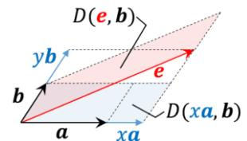
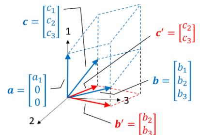
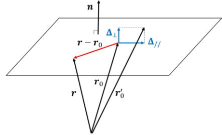

## 【第 4 講】 行列 I : 連立一次方程式

### 【4-1】 はじめに

本講ではまず連立一次方程式を加減法（消去法）で解くことから始めて、掃き出し法（ガウスの消去法）と呼ばれる系統的な解法を学ぶ。実は線形代数は連立一次方程式を系統的に解く研究に端を発するものであり、そこには線形代数の本質の一端が潜んでいる。本講では、ひたすら連立一次方程式をいじくり回し、前講の最後に用意した「関数」も用い、行列式・行列を定義して考察を続ける。

ちなみに連立一次方程式を効率的に解くことは、現代においても計算科学における重要な研究テーマのひとつであると聞いたら驚く人もいるかと思う。もちろん 2 元や 3 元連立といったことではなく、とてつもなく大規模な話である31。そこで使われる手法はさまざまであるが、掃き出し法はその最初の第一歩にあたる。

### 【4-2】 掃き出し法

#### 【4-2-1】 連立一次方程式の加減法による解法

以下の三元連立一次方程式を加減法で解く。

$$\begin{cases} x + y + 2z = 9 \\ 2x + y + 3z = 13 \\ x + 2y + 4z = 17 \end{cases}$$

毎回  $x$  や  $y, z$  を書く必要ないよね？

$$\begin{bmatrix} 1 & 1 & 2 & 9 \\ 2 & 1 & 3 & 13 \\ 1 & 2 & 4 & 17 \end{bmatrix}$$

・ 第 2 式と第 3 式から第 1 式のそれぞれ 2 倍・ 1 倍を引く

$$\begin{cases} x + y + 2z = 9 \\ -y - z = -5 \\ y + 2z = 8 \end{cases}$$

$$\begin{bmatrix} 1 & 1 & 2 & 9 \\ 0 & -1 & -1 & -5 \\ 0 & 1 & 2 & 8 \end{bmatrix}$$

・ 第 2 式を(-1)倍

$$\begin{cases} x + y + 2z = 9 \\ y + z = 5 \\ y + 2z = 8 \end{cases}$$

$$\begin{bmatrix} 1 & 1 & 2 & 9 \\ 0 & 1 & 1 & 5 \\ 0 & 1 & 2 & 8 \end{bmatrix}$$

・ 第 3 式から第 2 式を引く

$$\begin{cases} x + y + 2z = 9 \\ y + z = 5 \\ z = 3 \end{cases}$$

$$\begin{bmatrix} 1 & 1 & 2 & 9 \\ 0 & 1 & 1 & 5 \\ 0 & 0 & 1 & 3 \end{bmatrix}$$

・ 第 1 式と第 2 式から第 3 式のそれぞれ 2 倍・ 1 倍を引く

$$\begin{cases} x + y = 3 \\ y = 2 \\ z = 3 \end{cases}$$

$$\begin{bmatrix} 1 & 1 & 0 & 3 \\ 0 & 1 & 0 & 2 \\ 0 & 0 & 1 & 3 \end{bmatrix}$$

・ 第 1 式から第 2 式を引く

$$\begin{cases} x = 1 \\ y = 2 \\ z = 3 \end{cases}$$

$$\begin{bmatrix} 1 & 0 & 0 & 1 \\ 0 & 1 & 0 & 2 \\ 0 & 0 & 1 & 3 \end{bmatrix}$$

31 何千万元連立とか。凄つ：偏微分方程式を離散化したものや、「ビッグデータ」の解析手法 等々々々

左側は加減法を用いて実際に解いたもので、右側はその係数と右辺の定数項のみを書き出したものである。右側はひとまず置いといて、加減法の解き方を振り返ってみよう。

連立方程式なので、各式を辺々「加減」しても成り立たなければならない。加減法はこの性質を利用して、**各式ごとに担当する変数以外の変数を消去していき、最終的に各式の左辺が単独な各変数となるようにすること**で、右辺に解を得る手法である。上記を実現するにあたり、

- ある式の両辺を定数倍（0以外で負値を含む）する
- ある式の両辺の定数倍（0以外で負値を含む）を別の式の両辺に加える

の２つの式変形が基本となり、これらを駆使しながら解くことになる。

上記の例をみると、必要な情報は左辺の各式における各変数の係数と、右辺の定数項だということが分かる。その観点で各係数と定数項のみを抽出して書かれたものが右側の表記となり、掃き出し法とは右側の表記で加減法をやることに他ならない。

### **[4-2-2] 掃き出し法と行基本変形**

右側の表記  $\left( \begin{array}{ccc|c} 1 & 1 & 2 & 9 \\ 2 & 1 & 3 & 13 \\ 1 & 2 & 4 & 17 \end{array} \right)$  は、元の式の係数が書かれている縦棒の左側部分を**係数行列**、右辺

定数項にあたる縦棒の右側を含めた全体を**拡大係数行列**という。横に並んだ数字・文字を**行**、縦に並んだ数字・文字を**列**と呼ぶ。この例では係数行列のみで見れば第 1 行は 1 1 2、第 3 列は 2

3 となる。また係数行列の各行で左からみて最初の 0 でない値をもつ成分を**主成分**という。

1. ↑
2. ↑

掃き出し法では「式変形」にあたるものは**行基本変形**と呼ばれ、行基本変形を駆使して実現すべき係数行列を簡約行列といい、この行、列、主成分の用語を使うと以下のように定義される。

## ●行基本変形の定義

- ある行を定数倍（0 以外で負値を含む）する
- ある行の定数倍（0 以外で負値を含む）を別の行に加える (4 − 2 − 1)
- （必要に応じて）ある行と別の行を入れ替える

### ●簡約行列の定義(各主成分は各式に残す各変数の係数にあたる)

- 各主成分の値は 1
- 主成分をもつ列の主成分以外の値は 0 (4 - 2 - 2)
- 各行は下側にいくほど主成分は右側にある
- 全ての成分が 0 となる行はそうでない行の下側にある

違う例で掃き出し法を確認してみよう。右側と見比べると何をしているのかよく分かると思う。

| $\begin{bmatrix} 1 & -1 & 3 &   & 3 \\ -1 & 1 & -2 &   & -5 \\ 2 & -3 & 4 &   & 8 \end{bmatrix}$ | $\begin{cases} x - y + 3z = 8 \\ -x + y - 2z = -5 \\ 2x - 3y + 4z = 8 \end{cases}$ |
|--------------------------------------------------------------------------------------------------|------------------------------------------------------------------------------------|
|--------------------------------------------------------------------------------------------------|------------------------------------------------------------------------------------|

「2 行目 ( $r_2$ ) と3 行目 ( $r_3$ ) を入れ替えた」という行基本変形を意味する32。

$$\begin{bmatrix} 1 & -1 & 3 & 8 \\ 0 & 0 & 1 & 3 \\ 0 & -1 & -2 & -8 \end{bmatrix} \begin{matrix} r_2 + r_1 \\ r_3 - 2r_1 \end{matrix} \quad \begin{cases} x - y + 3z = 8 \\ z = 3 \\ -y - 2z = -8 \end{cases}$$

$$\begin{bmatrix} 1 & -1 & 3 & 8 \\ 0 & -1 & -2 & -8 \\ 0 & 0 & 1 & 3 \end{bmatrix} \begin{matrix} r_2 \leftrightarrow r_3 \\ \end{matrix} \quad \begin{cases} x - y + 3z = 8 \\ -y - 2z = -8 \\ z = 3 \end{cases}$$

$$\begin{bmatrix} 1 & -1 & 3 & 8 \\ 0 & 1 & 2 & 8 \\ 0 & 0 & 1 & 3 \end{bmatrix} \begin{matrix} r_2 \times (-1) \\ \\ \end{matrix} \quad \begin{cases} x - y + 3z = 8 \\ y + 2z = 8 \\ z = 3 \end{cases}$$

$$\begin{bmatrix} 1 & -1 & 0 & -1 \\ 0 & 1 & 0 & 2 \\ 0 & 0 & 1 & 3 \end{bmatrix} \begin{matrix} r_1 - 3r_3 \\ r_2 - 2r_3 \\ \end{matrix} \quad \begin{cases} x - y = -1 \\ y = 2 \\ z = 3 \end{cases}$$

$$\begin{bmatrix} 1 & 0 & 0 & 1 \\ 0 & 1 & 0 & 2 \\ 0 & 0 & 1 & 3 \end{bmatrix} \begin{matrix} r_1 + r_2 \\ \\ \end{matrix} \quad \begin{cases} x = 1 \\ y = 2 \\ z = 3 \end{cases}$$

### [4-2-3] 不定解、解なしとなる場合

連立一次方程式において方程式が全て独立でない場合、その解は不定もしくは不能（解なし）となった。例として

$$\begin{cases} x + y + 2z = 1 \\ 3x + 2y + 3z = 2 \\ 2x + y + z = 1 + a \end{cases}$$

を考える。この連立方程式の第3式は、第2式から第1式を引いたものの右辺定数項に  $a$  を足したものとなっており、独立な式が一つ減るので  $a = 0$  の場合 解は不定となる。

 $a \neq 0$  の場合は連立させる式が共通の解を持たない事になり連立方程式としては解なし、つまり不能となる。掃き出し法ではどのように振る舞うのだろうか。実際に解いてみよう。

$$\begin{bmatrix} 1 & 1 & 2 & 1 \\ 3 & 2 & 3 & 2 \\ 2 & 1 & 1 & 1 + a \end{bmatrix} \quad \begin{cases} x + y + 2z = 1 \\ 3x + 2y + 3z = 2 \\ 2x + y + z = 1 + a \end{cases}$$

$$\begin{bmatrix} 1 & 1 & 2 & 1 \\ 0 & -1 & -3 & -1 \\ 0 & -1 & -3 & -1 + a \end{bmatrix} \begin{matrix} r_2 - 3r_1 \\ r_3 - 2r_1 \end{matrix} \quad \begin{cases} x + y + 2z = 1 \\ -y - 3z = -1 \\ -y - 3z = -1 + a \end{cases}$$

$$\begin{bmatrix} 1 & 1 & 2 & 1 \\ 0 & 1 & 3 & 1 \\ 0 & -1 & -3 & -1 + a \end{bmatrix} \begin{matrix} r_2 \times (-1) \\ \\ \end{matrix} \quad \begin{cases} x + y + 2z = 1 \\ y + 3z = 1 \\ -y - 3z = -1 + a \end{cases}$$

$$\begin{bmatrix} 1 & 1 & 2 & 1 \\ 0 & 1 & 3 & 1 \\ 0 & 0 & 0 & a \end{bmatrix} \begin{matrix} r_3 + r_2 \\ \\ \end{matrix} \quad \begin{cases} x + y + 2z = 1 \\ y + 3z = 1 \\ 0 = a \end{cases}$$

となり、3 行目が元の式で表すと左辺は 0、右辺は  $a$  となった。さらに続けると

32  $r$  は 行を表す row の意。この書き方はいろいろと流儀があると思う。なお「このように各列の主成分以外の値を 0 にしていくことを『掃き出す』と称している」という説が有力。

$$\begin{bmatrix} 1 & 0 & -1 \\ 0 & 1 & 3 \\ 0 & 0 & 0 \end{bmatrix} \begin{bmatrix} 0 \\ 1 \\ a \end{bmatrix} r_1 - r_2 \quad \left\{ \begin{array}{l} x = -z = 0 \\ y + 3z = 1 \\ 0 = a \end{array} \right.$$

と簡約行列となり、確かに 3 変数に対して独立な式が 2 つであることを意味している。

 $a \neq 0$  の場合、**不能**（連立方程式としては解無し）となる。

 $a = 0$  の場合、解は**不定**となりパラメータ  $t$  を用いて例えば  $z = t$  とした場合は

$$\begin{cases} x = t \\ y = -3t + 1 \\ z = t \end{cases} \text{ あるいはパラメータを消去して } \begin{cases} x = z \\ y = -3z + 1 \end{cases}$$

という解となる。このようなパラメータの数（この場合は 1）は解の自由度と呼ばれる。

以上のように簡約行列となった時点での「主成分の数」（=「主成分がある行/列の数」=「成分が全て 0 となった行以外の行の数」）を（係数行列の）**rank**（階数）といい上記の例では 2 となる。これは元の連立方程式で独立な式の数を意味することになる。元の変数の数（ $n$ ）に対して同じだけ独立な式の数（rank）があれば解が定まり（一意性は後程述べる）、少なければ不能か不定となり、不定の場合は 解の自由度 =  $n - \text{rank}$  という関係となる（付録 2 参照）。また行基本変形の様子を観察すると直接数値を加減しあうのは同じ列の間だけであり、**rank** は係数行列部分のみで決まり定数項の値に依らず同じ手順で掃き出せる構造であることがわかる。

※幾何学的解釈：3 元 1 次方程式  $ax + by + cz = d$  は 3 次元空間における平面の方程式とみることもできた。平面の法線ベクトルを  $\mathbf{n} = (a, b, c)$ 、平面上のある点を  $\mathbf{r}_0 = (x_0, y_0, z_0)$ 、平面上の任意の点を  $\mathbf{r} = (x, y, z)$  とすると、平面の方程式は  $\mathbf{n} \cdot (\mathbf{r} - \mathbf{r}_0) = 0$  であり、これは  $ax + by + cz = ax_0 + by_0 + cz_0$  となり右辺を  $d$  として与式を得る。式より右辺の定数項が変わると、平面は法線ベクトルの方向（逆向きも含む）に平行移動することがわかる(付録 3 参照)。

上図は 3 元連立 1 次方程式を 3 平面の交わりとして幾何学的に解釈したもので、図の (a) は 3 平面が一点で交わり、連立方程式の解が定まる場合に相当する。(b) は 1 直線で交わり、上記の例の連立方程式が自由度 1 の不定解を持つ場合に相当する。(c) は 3 平面が共通部分を持たず不能となる例であり上記の例の連立方程式で定数項  $a \neq 0$  に相当する。(d) は独立な式が 1 つ（rank=1）で解の自由度が 2 に相当する。このように係数行列の行を（法線）ベクトルとみなした場合、それらの線形独立性が連立方程式の独立性を決めていそうなことが読み取れる。（各面の法線ベクトルを考察せよ。ヒント：2 平面が平行な場合は法線も平行、直線で交わる場合両法線は直線に垂直となる。）次項ではこれとは違う見かたで連立一次方程式を考察する。

**[4-2-4] 連立一次方程式の違う見かた**

簡単のために 2 元連立一次方程式で考えよう。以下の連立方程式をこんな風にみてみよう。

$$\begin{cases} x + 2y = 5 \\ 2x + 5y = 12 \end{cases} \quad x \begin{bmatrix} 1 \\ 2 \end{bmatrix} + y \begin{bmatrix} 2 \\ 5 \end{bmatrix} = \begin{bmatrix} 5 \\ 12 \end{bmatrix} \quad (4-2-3)$$

連立方程式の解は  $x = 1, y = 2$  となり、2 式は独立な式であることもわかる。

 $\begin{bmatrix} 1 \\ 2 \end{bmatrix}, \begin{bmatrix} 2 \\ 5 \end{bmatrix}, \begin{bmatrix} 5 \\ 12 \end{bmatrix}$  は、成分がそれぞれ (1,2), (2,5), (5,12) の数ベクトルであり、それぞれ変数  $x, y$  の係数と右辺定数項に相当する。変数  $x, y$  を係数のベクトルに対するスカラー積とみれば、

$$\begin{bmatrix} x \\ 2x \end{bmatrix} + \begin{bmatrix} 2y \\ 5y \end{bmatrix} = \begin{bmatrix} 5 \\ 12 \end{bmatrix} \quad \therefore \begin{bmatrix} x + 2y \\ 2x + 5y \end{bmatrix} = \begin{bmatrix} 5 \\ 12 \end{bmatrix}$$

となり元の連立方程式を再現し、(4-2-3)式は係数列のベクトル  $\begin{bmatrix} 1 \\ 2 \end{bmatrix}, \begin{bmatrix} 2 \\ 5 \end{bmatrix}$  の線形結合で定数項ベクトルを表せるか？を意味し、解が定まるこの場合はベクトルの組は線形独立である。

別の例として独立でない連立方程式も考えてみよう。

$$\begin{cases} x + 2y = 5 \\ 3x + 6y = 15 \end{cases} \quad x \begin{bmatrix} 1 \\ 3 \end{bmatrix} + y \begin{bmatrix} 2 \\ 6 \end{bmatrix} = \begin{bmatrix} 5 \\ 15 \end{bmatrix} \quad (4-2-4)$$

下式は上式の 3 倍で、答えは  $x = -2t + 5, y = t$  となり、独立ではない式であることがわかる。

また係数の列のベクトル  $\begin{bmatrix} 1 \\ 3 \end{bmatrix}, \begin{bmatrix} 2 \\ 6 \end{bmatrix}$  は  $\begin{bmatrix} 2 \\ 6 \end{bmatrix} = 2 \begin{bmatrix} 1 \\ 3 \end{bmatrix}$  となり線形従属であり、実際ベクトルを一つにまとめることができ、方程式は  $(x + 2y) \begin{bmatrix} 1 \\ 3 \end{bmatrix} = \begin{bmatrix} 5 \\ 15 \end{bmatrix}$  となり確かに不定解を得ることがわかる。

この見かたでは、一般的な 2 元連立一次方程式

$$\begin{cases} ax + by = e \\ cx + dy = f \end{cases} \quad \text{は} \quad x \begin{bmatrix} a \\ c \end{bmatrix} + y \begin{bmatrix} b \\ d \end{bmatrix} = \begin{bmatrix} e \\ f \end{bmatrix} \quad (4-2-5)$$

とみることになる。ここでベクトルの講の最後で準備した「関数」  $D(\mathbf{a}, \mathbf{b})$  を登場させよう。

天下り式で恐縮だが、 $\begin{bmatrix} e \\ f \end{bmatrix} (= x \begin{bmatrix} a \\ c \end{bmatrix} + y \begin{bmatrix} b \\ d \end{bmatrix})$  と  $\begin{bmatrix} b \\ d \end{bmatrix}$  を  $\mathbf{a}, \mathbf{b}$  に代入してみると線形性と交代性より

$$D(\begin{bmatrix} e \\ f \end{bmatrix}, \begin{bmatrix} b \\ d \end{bmatrix}) = D(x \begin{bmatrix} a \\ c \end{bmatrix} + y \begin{bmatrix} b \\ d \end{bmatrix}, \begin{bmatrix} b \\ d \end{bmatrix}) = xD(\begin{bmatrix} a \\ c \end{bmatrix}, \begin{bmatrix} b \\ d \end{bmatrix}) + yD(\begin{bmatrix} b \\ d \end{bmatrix}, \begin{bmatrix} b \\ d \end{bmatrix}) = xD(\begin{bmatrix} a \\ c \end{bmatrix}, \begin{bmatrix} b \\ d \end{bmatrix})$$

同様に

$$D(\begin{bmatrix} a \\ c \end{bmatrix}, \begin{bmatrix} e \\ f \end{bmatrix}) = D(\begin{bmatrix} a \\ c \end{bmatrix}, x \begin{bmatrix} a \\ c \end{bmatrix} + y \begin{bmatrix} b \\ d \end{bmatrix}) = xD(\begin{bmatrix} a \\ c \end{bmatrix}, \begin{bmatrix} a \\ c \end{bmatrix}) + yD(\begin{bmatrix} a \\ c \end{bmatrix}, \begin{bmatrix} b \\ d \end{bmatrix}) = yD(\begin{bmatrix} a \\ c \end{bmatrix}, \begin{bmatrix} b \\ d \end{bmatrix})$$

これは、 $D(\begin{bmatrix} a \\ c \end{bmatrix}, \begin{bmatrix} b \\ d \end{bmatrix}) \neq 0$  の場合

$$x = D(\begin{bmatrix} e \\ f \end{bmatrix}, \begin{bmatrix} b \\ d \end{bmatrix}) / D(\begin{bmatrix} a \\ c \end{bmatrix}, \begin{bmatrix} b \\ d \end{bmatrix}), \quad y = D(\begin{bmatrix} a \\ c \end{bmatrix}, \begin{bmatrix} e \\ f \end{bmatrix}) / D(\begin{bmatrix} a \\ c \end{bmatrix}, \begin{bmatrix} b \\ d \end{bmatrix}) \quad (4-2-6)$$

として解が求まるということを意味している。成分で表すと  $D(\mathbf{a}, \mathbf{b}) = a_1 b_2 - a_2 b_1$  だった。

(4-2-3)式  $x \begin{bmatrix} 1 \\ 2 \end{bmatrix} + y \begin{bmatrix} 2 \\ 5 \end{bmatrix} = \begin{bmatrix} 5 \\ 12 \end{bmatrix}$  の例では、 $D(\begin{bmatrix} 1 \\ 2 \end{bmatrix}, \begin{bmatrix} 2 \\ 5 \end{bmatrix}) = 1 \times 5 - 2 \times 2 = 1$  であり、0 でない。

また  $D(\begin{bmatrix} 5 \\ 12 \end{bmatrix}, \begin{bmatrix} 2 \\ 5 \end{bmatrix}) = 5 \times 5 - 12 \times 2 = 1$ ,  $D(\begin{bmatrix} 1 \\ 2 \end{bmatrix}, \begin{bmatrix} 5 \\ 12 \end{bmatrix}) = 1 \times 12 - 2 \times 5 = 2$  なので、確かに  $x = 1, y = 2$  を得る。また(4-2-4)式の例だと列のベクトルは線形従属なので  $D(\begin{bmatrix} 1 \\ 3 \end{bmatrix}, \begin{bmatrix} 2 \\ 6 \end{bmatrix}) = 0$  となり、解が不定となる場合この方法では解を得られないことになる。

※幾何学的解釈:  $\begin{bmatrix} a \\ c \end{bmatrix} = \mathbf{a}, \begin{bmatrix} b \\ d \end{bmatrix} = \mathbf{b}, \begin{bmatrix} e \\ f \end{bmatrix} = \mathbf{e}$  により式は  $x\mathbf{a} + y\mathbf{b} = \mathbf{e}$  と

書け  $\mathbf{e}$  と  $\mathbf{b}$  が張る面積  $D(\mathbf{e}, \mathbf{b})$  は  $x\mathbf{a}$  と  $\mathbf{b}$  が張る面積  $D(x\mathbf{a}, \mathbf{b})$ 

と等しく、これは  $\mathbf{a}$  と  $\mathbf{b}$  が張る面積  $D(\mathbf{a}, \mathbf{b})$  の  $x$  倍であり、よっ

て  $D(\mathbf{e}, \mathbf{b}) = D(x\mathbf{a}, \mathbf{b}) = xD(\mathbf{a}, \mathbf{b})$  より  $D(\mathbf{a}, \mathbf{b}) \neq 0$  のとき  $x = D(\mathbf{e}, \mathbf{b})/D(\mathbf{a}, \mathbf{b})$  として求まる。

同様に 3 元連立一次方程式でも各係数の列と定数項をベクトルとみなし

$$\begin{cases} ax + by + cz = j \\ dx + ey + fz = k \\ gx + hy + iz = l \end{cases} \text{ だと } x \begin{bmatrix} a \\ d \\ g \end{bmatrix} + y \begin{bmatrix} b \\ e \\ h \end{bmatrix} + z \begin{bmatrix} c \\ f \\ i \end{bmatrix} = \begin{bmatrix} j \\ k \\ l \end{bmatrix} \quad (4-2-7)$$

において  $D \left( \begin{bmatrix} j \\ k \\ l \end{bmatrix}, \begin{bmatrix} b \\ e \\ h \end{bmatrix}, \begin{bmatrix} c \\ f \\ i \end{bmatrix} \right) = x D \left( \begin{bmatrix} a \\ d \\ g \end{bmatrix}, \begin{bmatrix} b \\ e \\ h \end{bmatrix}, \begin{bmatrix} c \\ f \\ i \end{bmatrix} \right)$  等がいえて、 $D \left( \begin{bmatrix} a \\ d \\ g \end{bmatrix}, \begin{bmatrix} b \\ e \\ h \end{bmatrix}, \begin{bmatrix} c \\ f \\ i \end{bmatrix} \right) \neq 0$  の場合は

$$x = \frac{D \left( \begin{bmatrix} j \\ k \\ l \end{bmatrix}, \begin{bmatrix} b \\ e \\ h \end{bmatrix}, \begin{bmatrix} c \\ f \\ i \end{bmatrix} \right)}{D \left( \begin{bmatrix} a \\ d \\ g \end{bmatrix}, \begin{bmatrix} b \\ e \\ h \end{bmatrix}, \begin{bmatrix} c \\ f \\ i \end{bmatrix} \right)}, \quad y = \frac{D \left( \begin{bmatrix} a \\ d \\ g \end{bmatrix}, \begin{bmatrix} j \\ k \\ l \end{bmatrix}, \begin{bmatrix} c \\ f \\ i \end{bmatrix} \right)}{D \left( \begin{bmatrix} a \\ d \\ g \end{bmatrix}, \begin{bmatrix} b \\ e \\ h \end{bmatrix}, \begin{bmatrix} c \\ f \\ i \end{bmatrix} \right)}, \quad z = \frac{D \left( \begin{bmatrix} a \\ d \\ g \end{bmatrix}, \begin{bmatrix} b \\ e \\ h \end{bmatrix}, \begin{bmatrix} j \\ k \\ l \end{bmatrix} \right)}{D \left( \begin{bmatrix} a \\ d \\ g \end{bmatrix}, \begin{bmatrix} b \\ e \\ h \end{bmatrix}, \begin{bmatrix} c \\ f \\ i \end{bmatrix} \right)} \quad (4-2-8)$$

として解ける。全く同様にして、 $n$  元連立でもこの「関数」を適用して解くことができる。このような連立一次方程式の解法を**クラメルの法則** (公式) という33。本項の見かた「 $n$  元連立一次方程式の各変数を  $x_1, \dots, x_n$  係数行列の各列と右辺定数項をベクトルとみなしたものを  $a_1, \dots, a_n, b$  とすると方程式は  $x_1 a_1 + \dots + x_n a_n = b$  と書ける。」に対して、いくつか考察しよう。

○掃き出し法とは  $x_1 a_1 + \dots + x_n a_n = b$  に対し線形結合の係数の組  $x_1, \dots, x_n$  を不変に保つたまま(線形結合関係を保つという)、行基本変形により  $x_1 a'_1 + \dots + x_n a'_n = b'$  のように各ベクトルを変形していき、最終的に  $a'_1, \dots, a'_n$  を標準基底に変形することで  $x_1 e_1 + \dots + x_n e_n = x$  として解  $x$  を得る手法といえる。つまり行基本変形は線形結合関係を保つ34 (だから解になる)。

○この見かたでは簡約行列の rank は線形独立な列のベクトルの最大数と同じとみなせる。実際前項の例では rank = 2 だが主成分がないため掃き出せなかった 3 列目は主成分のある 2 列のベクトルの線形結合で表され、簡約行列の構造から一般的に成り立つことがわかる (付録 2 参照)。また上記のように線形結合関係は行基本変形で保たれるので、rank を (係数) 行列の線形独立な列のベクトルの最大数と定義し直すことで簡約行列でない任意の (係数) 行列に拡張できることになる。

○前講(3-6-17)の対偶「 $D(a_1, \dots, a_n) \neq 0 \Rightarrow a_1, \dots, a_n$  は線形独立」および「 $n$  次元のベクトル( $b$ )の線形独立な  $n$  本のベクトル ( $a_1, \dots, a_n$ ) による線形結合での表し方は一意35」より、クラメルの法則により得る解は一意な解であることがいえる。また  $n$  本の列のベクトルの組が線形独立な場合、上記より rank は  $n$  となりその際の掃き出し法で定まるの解の一意性もいえる。

前項の幾何学的解釈でみた行をベクトルの組とみなしたときの線形独立性と解の一意性、および  $D(a_1, \dots, a_n) \neq 0$  との関係は次講にてまとめて示す。

 $D(a_1, \dots, a_n) \neq 0$  は連立一次方程式が一意な解を持つことを示す。次節で改めて調べよう。

33 掃き出し法に比べ計算量が多いため、数値計算には向かず理論的考察等に用いられる。次講にて再登場する。なおクラメルの法則(公式)は通常 行列式を用いて定式化されているものを指す。念のため。

34 「だから解になる」ので成立して当然なのだが、付録 3 : ●行基本変形と線形結合関係 にて示す

35 第 3 講第 2 節 (3-2-5) 参照

**【4-3】 行列式の導入**

**【4-3-1】 あらためて「関数」  $D(a, b, c)$  とは**

【3-6】 節でみた 4 つの性質で、その値が一意に定まった。3 次の場合を以下に再掲する。

$$\begin{cases} (i) D(a_1 + a_2, b, c) = D(a_1, b, c) + D(a_2, b, c) & (3 - 6 - 5) \\ (ii) D(ka, b, c) = kD(a, b, c) & (3 - 6 - 6) \\ (iii) D(a, a, b) = 0 \quad \therefore D(b, a, c) = -D(a, b, c) & (3 - 6 - 7) \\ (iv) D(e_1, e_2, e_3) = 1 & (3 - 6 - 8) \end{cases}$$

今、相手にしているのは連立一次方程式で、その係数行列を列のベクトルの組として見ているのだった。これからこの「関数」を成分表記で調べるが、係数行列を列のベクトルの組として見ることを踏まえて  $a_j = \sum_{i=1}^n a_{ij} e_i$  として成分を定義する。成分  $a_{ij}$  の左側の添字  $i$  は各ベクトルの上から数えて何番目の成分か（つまり何行目か）を、右側の添字  $j$  は横に並んだ列のベクトルの組のうち左から数えて何番目か（つまり何列目か）を表している。行はその成分が横に並び、列はその成分が縦に並ぶことを思い出そう。また 3 行 3 列だと図のようになることに注意しよう。つまり添字は  $a_{\text{行列}}$  を指す。

$$\begin{bmatrix} a_{11} & a_{12} & a_{13} \\ a_{21} & a_{22} & a_{23} \\ a_{31} & a_{32} & a_{33} \end{bmatrix} \leftarrow 1 \text{ 行}$$

$$\begin{bmatrix} a_{11} & a_{12} & a_{13} \\ a_{21} & a_{22} & a_{23} \\ a_{31} & a_{32} & a_{33} \end{bmatrix} \leftarrow 2 \text{ 行}$$

$$\uparrow 1 \text{ 列} \uparrow 2 \text{ 列} \uparrow 3 \text{ 列}$$

感覚を掴むために、まずは 3 次からやると

$$D(a_1, a_2, a_3) = D \left( \sum_{i=1}^3 a_{i1} e_i, \sum_{j=1}^3 a_{j2} e_j, \sum_{k=1}^3 a_{k3} e_k \right) = \sum_{i,j,k=1}^3 a_{i1} a_{j2} a_{k3} D(e_i, e_j, e_k) \quad (4 - 3 - 1)$$

(4-3-1)式の右辺をじっくり観察してみよう。係数行列の成分は  $a_{i1} a_{j2} a_{k3}$  のように各ベクトルからの積として現れ、右側の添字はベクトルの番号すなわち列の番号を示し、1, 2, 3 と固定されている。左側の添字  $i, j, k$  は各ベクトルの成分の番号を表し、それぞれ独立に 1, 2, 3 をとるが  $D(e_i, e_j, e_k)$  により  $i, j, k$  の値が全て異なる場合のみ残る。つまり各列から一つずつ、他のどの行とも重ならないように成分を選ぶことになる。符号は  $D(e_i, e_j, e_k)$  により決まり、 $(i, j, k) = (1, 2, 3)$  の時+1 で、どの 2 つの添字を入れ替えても符号が変わる。という構造をしている。

3 次の場合、 $D(e_i, e_j, e_k)$  は Levi-Civita 記号  $\varepsilon_{ijk}$  と同一視できた。

この構造は n 次の場合も同様となる。

$$D(a_1, a_2, \dots, a_n) = \sum_{i_1, i_2, \dots, i_n=1}^n a_{i_1 1} a_{i_2 2} \dots a_{i_n n} D(e_{i_1}, e_{i_2}, \dots, e_{i_n}) \quad (4 - 3 - 2)$$

係数行列の成分は  $a_{i_1 1} a_{i_2 2} \dots a_{i_n n}$  のように列を表す右側の添字は 1, 2,  $\dots, n$  固定、各成分を表す左側の添字  $i_1, i_2, \dots, i_n$  は  $D(e_{i_1}, e_{i_2}, \dots, e_{i_n})$  により 添字の値が全て異なる場合のみ残る。つまり各列から一つずつ、他のどの行とも重ならないように成分を選ぶことになる。符号は  $(i_1, i_2, \dots, i_n) = (1, 2, \dots, n)$  の時+1 で、どの 2 つの添字を入れ替えても符号が変わる。n 次の場合も  $D(e_{i_1}, e_{i_2}, \dots, e_{i_n})$  は 拡張 Levi-Civita 記号  $\varepsilon_{i_1 i_2 \dots i_n}$  と同一視できた。

**[4-3-2] 行列式の定義**

前節で連立一次方程式の係数を列のベクトルの組とみたときの「関数」  $D(\mathbf{a}, \mathbf{b}, \mathbf{c}, \dots) \neq 0$  が一意な解をもつ条件であることをみた。この指標を**行列式**という36。この後 4 節で定義する行列に対しても、固有な特徴を示す重要な指標となる。ここで改めて定義しよう。表記としては(係数)行列の成分をそのまま並べ、大括弧 [] でなく、縦棒 | | で挟んだ形で表す。 $D(\mathbf{e}_i, \mathbf{e}_j, \mathbf{e}_k, \dots)$  の表記は書くのがメンドクサイので、Levi-Civita 記号  $\varepsilon_{ijk\dots}$  で代用しよう37。

2 次だと以下のように定義される

$$\begin{vmatrix} a_{11} & a_{12} \\ a_{21} & a_{22} \end{vmatrix} \equiv \sum_{i,j=1}^2 \varepsilon_{ij} a_{i1} a_{j2} = a_{11} a_{22} - a_{21} a_{12} \quad (4-3-3)$$

$$\varepsilon_{ij} \equiv \begin{cases} +1 & \text{if } (i,j) = (1,2) \\ -1 & \text{if } (i,j) = (2,1) \\ 0 & \text{other} \end{cases} \quad (4-3-4)$$

簡単な覚え方としてよく使われるのは図の左側で、左上から右下へ掛ける場合は + の、右上から左下へ掛ける場合は - の符号がつく。

3 次だと

$$\begin{vmatrix} a_{11} & a_{12} & a_{13} \\ a_{21} & a_{22} & a_{23} \\ a_{31} & a_{32} & a_{33} \end{vmatrix} \equiv \sum_{i,j,k=1}^3 \varepsilon_{ijk} a_{i1} a_{j2} a_{k3} \quad (4-3-5)$$

展開すると

$$= a_{11} a_{22} a_{33} + a_{21} a_{32} a_{13} + a_{31} a_{12} a_{23} - a_{31} a_{22} a_{13} - a_{11} a_{32} a_{23} - a_{21} a_{12} a_{33}$$

簡単な覚え方としてよく使われるのは、上図の右側で、サラスの方法とも呼ばれる。

いずれも各列から一つずつ、他のどの行とも重ならないように成分を選んでいる事に再度注意。

 $n$  次の場合以下のように定義される。

$$\begin{vmatrix} a_{11} & \dots & a_{1n} \\ \vdots & \ddots & \vdots \\ a_{n1} & \dots & a_{nn} \end{vmatrix} \equiv \sum_{i_1, \dots, i_n=1}^n \varepsilon_{i_1 \dots i_n} a_{i_1} \dots a_{i_n} \quad (4-3-6)$$

4 次以上では、サラスの方法のような簡易的な覚え方は適用できない38。また  $n$  次の行列式は展開すると  $i_1, \dots, i_n$  の順列の個数すなわち  $n!$  個の項数となり、計算量も膨大となっていく。なにかしら計算量を減らす方法が望まれる。次項にて行列式の性質をさらに深掘りしよう。

36 歴史的にはこのように連立一次方程式の可解性を判定する指標として導入された。

37 一般的な行列式の定義である、ライプニッツの明示公式と同等であり、付録 4 にて言及する

38 なぜか？ 4 次を例に同じような図を書いてみて理由を考えてみよう

**[4-3-3] 行列式の性質 I**

以下にまとめて列挙するが 【3-6】 節でみた「関数」  $D(\mathbf{a}, \mathbf{b}, \dots)$  の (列の) ベクトルに関する性質はそのまま引き継ぐ。3 次の場合を具体例として示す。高次も同様となる。

- ● (i) 各列のベクトルの多重線形性 : ベクトルの和

$$\begin{vmatrix} a_1 & b_1 + c_1 & d_1 \\ a_2 & b_2 + c_2 & d_2 \\ a_3 & b_3 + c_3 & d_3 \end{vmatrix} = \begin{vmatrix} a_1 & b_1 & d_1 \\ a_2 & b_2 & d_2 \\ a_3 & b_3 & d_3 \end{vmatrix} + \begin{vmatrix} a_1 & c_1 & d_1 \\ a_2 & c_2 & d_2 \\ a_3 & c_3 & d_3 \end{vmatrix} \quad (4-3-7)$$

- ● (ii) 各列のベクトルの多重線形性 : スカラー積

$$\begin{vmatrix} a_1 & kb_1 & c_1 \\ a_2 & kb_2 & c_2 \\ a_3 & kb_3 & c_3 \end{vmatrix} = k \begin{vmatrix} a_1 & b_1 & c_1 \\ a_2 & b_2 & c_2 \\ a_3 & b_3 & c_3 \end{vmatrix} \quad (4-3-8)$$

- ● (iii) 列のベクトル間の交代性

$$\begin{vmatrix} a_1 & a_1 & b_1 \\ a_2 & a_2 & b_2 \\ a_3 & a_3 & b_3 \end{vmatrix} = 0 \quad \therefore \begin{vmatrix} b_1 & a_1 & c_1 \\ b_2 & a_2 & c_2 \\ b_3 & a_3 & c_3 \end{vmatrix} = - \begin{vmatrix} a_1 & b_1 & c_1 \\ a_2 & b_2 & c_2 \\ a_3 & b_3 & c_3 \end{vmatrix} \quad (4-3-9)$$

- ● (iv) 標準基底を順に列のベクトルにもつ行列式の値は 1

$$\begin{vmatrix} 1 & 0 & 0 \\ 0 & 1 & 0 \\ 0 & 0 & 1 \end{vmatrix} = 1 \quad (4-3-10)$$

- ● (v) ある列のスカラー倍を別の列に加えても行列式の値は変わらない

$$\begin{vmatrix} a_1 & b_1 + kc_1 & c_1 \\ a_2 & b_2 + kc_2 & c_2 \\ a_3 & b_3 + kc_3 & c_3 \end{vmatrix} = \begin{vmatrix} a_1 & b_1 & c_1 \\ a_2 & b_2 & c_2 \\ a_3 & b_3 & c_3 \end{vmatrix} \quad (4-3-11)$$

- ● (vi) 列のベクトルの組が線形従属  $\Rightarrow$  行列式の値は 0 (4-3-12)

(対偶 : 行列式の値が 0 でない  $\Rightarrow$  列のベクトルの組は線形独立)

(vi') 列のベクトルの組は線形独立である  $\Leftrightarrow$  行列式の値は 0 でない (次講第 3 節で示す)

これ以外のとても重要な性質として、行列式は行と列が完全に対等であることを示すことができ、上記を含め列に対して成立する性質がそのまま行に対しても成立する事がわかる。付録 1 に記載する。またこれを用いると、具体的には 3 次の場合だと

$$\begin{vmatrix} a_{11} & a_{12} & a_{13} \\ a_{21} & a_{22} & a_{23} \\ a_{31} & a_{32} & a_{33} \end{vmatrix} \leftrightarrow \begin{vmatrix} a_{11} & a_{21} & a_{31} \\ a_{12} & a_{22} & a_{32} \\ a_{13} & a_{23} & a_{33} \end{vmatrix}$$

のように行と列を入れ替えた (つまり  $a_{ij} \leftrightarrow a_{ji}$  となる) (係数) 行列を転置行列というが、転置してもその行列式は変化しない (値は等しい) 事が示せる。証明を同様に付録 1 に記載する。

- ● (vii) 転置行列の行列式は元の行列の行列式と等しい (4-3-13)

さらに上記の性質は行に対しても成り立つため、掃き出し法での行基本変形を当てはめて考えると

- ● (viii) 行基本変形に対する性質 (4-3-14)

- A) ある行の定数倍を別の行に加えても、行列式の値は変わらない (性質(v)より)
- B) ある行を (0 以外で) 定数倍すると、行列式の値も定数倍される (性質(ii)より)
- C) ある行と別の行を入れ替えると、行列式の符号が変わる (性質(iii)より)

行基本変形を適用して、以下のように行列式の 1 列目を 1 行目以外 0 にできたとしよう。4 次を例として考えてみる。 $a_{21} = a_{31} = a_{41} = 0$  に注意し行列式の定義より添字  $i$  で展開すると

$$\begin{vmatrix} a_{11} & a_{12} & a_{13} & a_{14} \\ 0 & a_{22} & a_{23} & a_{24} \\ 0 & a_{32} & a_{33} & a_{34} \\ 0 & a_{42} & a_{43} & a_{44} \end{vmatrix} = \sum_{i,j,k,l=1}^4 \varepsilon_{ijkl} a_{i1} a_{j2} a_{k3} a_{l4} = \sum_{j,k,l=1}^4 \varepsilon_{1jkl} a_{11} a_{j2} a_{k3} a_{l4} = a_{11} \sum_{j,k,l=1}^4 \varepsilon_{1jkl} a_{j2} a_{k3} a_{l4}$$

と  $i$  が 1 以外の項は残らない。最右辺は  $\varepsilon_{1jkl}$  と最初の添字が 1 に確定し、 $j, k, l$  が 1 になる項も残らなくなり  $a_{11}$  以外の 1 列目だけでなく 1 行目も除いた成分だけが残ることになる。また置換  $(1,2,3,4) \rightarrow (1,j,k,l)$  の偶奇性は先頭の 1 が不動なので置換  $(2,3,4) \rightarrow (j,k,l)$  の偶奇性と等しく、これは各数字を -1 した（各数字の名前をつけ直した）置換  $(1,2,3) \rightarrow (j-1,k-1,l-1)$  の偶奇性とも等しい(前講付録 3 演習参照)。つまり新たな添字を  $(J,K,L) = (j-1,k-1,l-1)$  と定義すれば  $\varepsilon_{1jkl} = \varepsilon_{JKL}$  と書ける（要するに 2,3,4 と 1,2,3 の並び替え方は同じということ）。そこで 1 行目と 1 列目を除いた係数行列を

$$\begin{vmatrix} a'_{11} & a'_{12} & a'_{13} \\ a'_{21} & a'_{22} & a'_{23} \\ a'_{31} & a'_{32} & a'_{33} \end{vmatrix} = \begin{vmatrix} a_{22} & a_{23} & a_{24} \\ a_{32} & a_{33} & a_{34} \\ a_{42} & a_{43} & a_{44} \end{vmatrix} \text{ として } a_{11} \text{ 以外の最右辺は} \sum_{j,k,l=1}^4 \varepsilon_{1jkl} a_{j2} a_{k3} a_{l4} = \sum_{j,k,l=2}^4 \varepsilon_{1jkl} a_{j2} a_{k3} a_{l4} = \sum_{j,K,L=1}^3 \varepsilon_{JKL} a'_{j1} a'_{k2} a'_{L3} = \begin{vmatrix} a'_{11} & a'_{12} & a'_{13} \\ a'_{21} & a'_{22} & a'_{23} \\ a'_{31} & a'_{32} & a'_{33} \end{vmatrix}$$

と書けることになり、この  $|a'_{JK}|$  のように成分（添字）を定義し直した場合の行列式という意味で

$$\begin{vmatrix} a_{11} & a_{12} & a_{13} & a_{14} \\ 0 & a_{22} & a_{23} & a_{24} \\ 0 & a_{32} & a_{33} & a_{34} \\ 0 & a_{42} & a_{43} & a_{44} \end{vmatrix} = a_{11} \begin{vmatrix} a_{22} & a_{23} & a_{24} \\ a_{32} & a_{33} & a_{34} \\ a_{42} & a_{43} & a_{44} \end{vmatrix}$$

となる。以上の議論は、より高次にも全く同様に適用でき以下が成り立つことがわかる。

● (ix) 行列式の次数下げ

$$\begin{vmatrix} a_{11} & a_{12} & \cdots & a_{1n} \\ 0 & a_{22} & \cdots & a_{2n} \\ \vdots & \vdots & \ddots & \vdots \\ 0 & a_{n2} & \cdots & a_{nn} \end{vmatrix} = a_{11} \begin{vmatrix} a_{22} & \cdots & a_{2n} \\ \vdots & \ddots & \vdots \\ a_{n2} & \cdots & a_{nn} \end{vmatrix} \quad (4-3-15)$$

※幾何学的解釈 : 3 次を例とする。 $\begin{vmatrix} a_1 & b_1 & c_1 \\ 0 & b_2 & c_2 \\ 0 & b_3 & c_3 \end{vmatrix} = a_1 \begin{vmatrix} b_2 & c_2 \\ b_3 & c_3 \end{vmatrix}$ 

左辺は 3 本のベクトル  $a, b, c$  が張る平行六面体の体積を表し、右辺は  $b, c$  を 2-3 平面に射影した  $b', c'$  が張る平行四辺形の面積に高さ  $a_1$  を掛けたものとなる。このように  $n$  次の場合 ( $n$  次元体積) = ( $n$  次元目の高さ) × ( $n-1$  次元体積) と解釈できる。

● (x) 上三角行列の行列式

成分  $a_{ij} = 0$  ( $i > j$ ) となる（係数）行列を**上三角行列**といい、次数下げを繰り返し適用できる。

$$\begin{vmatrix} a_{11} & a_{12} & \cdots & a_{1n} \\ 0 & a_{22} & \cdots & a_{2n} \\ \vdots & \vdots & \ddots & \vdots \\ 0 & 0 & \cdots & a_{nn} \end{vmatrix} = a_{11} a_{22} \cdots a_{nn} \quad (4-3-16)$$

**【4-4】 行列の導入**

**【4-3-1】 導入小話 : もしかすると行列つて · · · ·**

拡大係数行列は、連立一次方程式を以下のように表示していた（とりあえず 2 行 2 列で）。

$$\begin{bmatrix} a & b \\ c & d \end{bmatrix} \begin{bmatrix} e \\ f \end{bmatrix} \quad \begin{cases} ax + by = e \\ cx + dy = f \end{cases}$$

係数や定数項の値だけでなく、方程式そのものを表示するにはどうすればよいだろうか？

方程式なので両辺を等号で結ぶ形にしたい。連立方程式の定数項はセットにして等号の右辺に置きたい。変数も同じようにセットにして、係数行列と共に左辺に置きたい。こんな感じで。

$$\begin{bmatrix} a & b \\ c & d \end{bmatrix} \begin{bmatrix} x \\ y \end{bmatrix} = \begin{bmatrix} e \\ f \end{bmatrix}$$

左辺を係数行列と変数の積とみて、積を定義しよう。方程式を再現させるには、左辺の係数のそれぞれの行と変数の列の積が、右辺定数項のそれぞれの値になるように、

$$\begin{bmatrix} a & b \\ c & d \end{bmatrix} \begin{bmatrix} x \\ y \end{bmatrix} \equiv \begin{bmatrix} ax + by \\ cx + dy \end{bmatrix} \quad (4-4-1)$$

という演算を定義すればよいだろう。

ついでに連立方程式が変数変換しても成り立つようにしておこう。 $(x, y) \rightarrow (u, v)$  となる

$$\begin{cases} x = \alpha u + \beta v \\ y = \gamma u + \delta v \end{cases} \quad (4-4-2)$$

という変数変換39を行うと、連立方程式の左辺は

$$\begin{cases} ax + by = a(\alpha u + \beta v) + b(\gamma u + \delta v) = (a\alpha + b\gamma)u + (a\beta + b\delta)v \\ cx + dy = c(\alpha u + \beta v) + d(\gamma u + \delta v) = (c\alpha + d\gamma)u + (c\beta + d\delta)v \end{cases} \quad (4-4-3)$$

となるが、(4-4-1) 式で定義した積を使うと、(4-4-2)式と(4-4-3)式はそれぞれ

$$\begin{bmatrix} x \\ y \end{bmatrix} = \begin{bmatrix} \alpha & \beta \\ \gamma & \delta \end{bmatrix} \begin{bmatrix} u \\ v \end{bmatrix}, \quad \begin{bmatrix} ax + by \\ cx + dy \end{bmatrix} = \begin{bmatrix} a\alpha + b\gamma & a\beta + b\delta \\ c\alpha + d\gamma & c\beta + d\delta \end{bmatrix} \begin{bmatrix} u \\ v \end{bmatrix}$$

と書ける。これを (4-4-1) 式の両辺に代入すると

$$\begin{bmatrix} a & b \\ c & d \end{bmatrix} \begin{bmatrix} \alpha & \beta \\ \gamma & \delta \end{bmatrix} \begin{bmatrix} u \\ v \end{bmatrix} = \begin{bmatrix} a\alpha + b\gamma & a\beta + b\delta \\ c\alpha + d\gamma & c\beta + d\delta \end{bmatrix} \begin{bmatrix} u \\ v \end{bmatrix}$$

となるので、

$$\begin{bmatrix} a & b \\ c & d \end{bmatrix} \begin{bmatrix} \alpha & \beta \\ \gamma & \delta \end{bmatrix} \equiv \begin{bmatrix} a\alpha + b\gamma & a\beta + b\delta \\ c\alpha + d\gamma & c\beta + d\delta \end{bmatrix} \quad (4-4-4)$$

という積を定義すればよいだろう。ん？この積もしかして逆に掛けると

$$\begin{bmatrix} \alpha & \beta \\ \gamma & \delta \end{bmatrix} \begin{bmatrix} a & b \\ c & d \end{bmatrix} = \begin{bmatrix} a\alpha + c\beta & b\alpha + d\beta \\ a\gamma + c\delta & b\gamma + d\delta \end{bmatrix}$$

となって、非可換40だな。ま、しょうがないか。これを行列と呼ぶことにしよう。

・・・・という感じで発見されたのかも。知らないけど。

39 一次変換であることに注意

40 可換 : 交換則が成り立つ ( $ab = ba$ )、非可換 : 交換則が成り立たない ( $ab \neq ba$ ) ということ

**[4-4-2] 行列と演算の定義**

●行列 : 数や変数・定数・式などを表す文字を  $n$ 個  $\times m$ 個 の形に縦横に並べて、括弧でくくったものを行列といい数や文字をその成分という。本講座では、成分は実数のみ、行列は  $n = m$  の場合（**正方行列**という）のみを対象とする。例外は後述する  $1 \times n$  または  $n \times 1$  行列。

●行と列 例 :  $2 \times 2$  行列  $\begin{bmatrix} a & b \\ c & d \end{bmatrix}$  以降、この行列を例にとって説明する横に並んだ  $a$   $b$  や  $c$   $d$  を行、縦に並んだ  $a$  や  $b$  を列という41。行と列に関わるあらゆるものは、行が先、列が後の順番になる。例えば、 $2 \times 1$  行列は 2 行 1 列の行列を意味し  $\begin{bmatrix} a \\ c \end{bmatrix}$  のように書く。列のみの行列であり、**列ベクトル**（縦ベクトル）ともいう。同様に  $1 \times 2$  行列は 1 行 2 列の行列を意味し  $\begin{bmatrix} a & b \end{bmatrix}$  のように書く。行のみの行列であり、**行ベクトル**（横ベクトル）ともいう。

●成分 : 成分も行と列の順で表す。例えば (1,2) 成分は 1 行 2 列目のことを指し、例では  $b$  を指す。添字を使って  $a_{ij}$  のように表記することもあり、 $i$  行  $j$  列目の成分を意味する。この場合、行列として表記すると  $\begin{bmatrix} a_{11} & a_{12} \\ a_{21} & a_{22} \end{bmatrix}$  となる。混同しやすいので注意。 $a_{行列}$  : 行、列の順。

●表記 : これまでの例のように括弧で成分をくくった表記以外に、 $A$  のように（通常）大文字のアルファベットで表すこともある。その際、列ベクトルはベクトルの表記に習い  $x$  のように太文字で表す。またこの場合、行列式42は  $\det(A)$  とも書かれる。ちなみに行列の括弧も大括弧  $[ \ ]$  と小括弧  $( \ )$  どちらもあるが、本講座では大括弧を採用する43。

●対角成分と単位行列、零行列 : 例だと  $a$  や  $d$  のように行と列が一致した対角線上に並んだ成分を**対角成分**という。対角成分のみ 1 で、他は 0 となる成分をもつ行列を**単位行列**という。

例 :  $\begin{bmatrix} 1 & 0 \\ 0 & 1 \end{bmatrix}$  単位行列は  $E$  または  $I$  と表記される。本講座では  $E$  を採用する。成分が全て 0 の行列を**零行列**という。通常アルファベット大文字の 0 と表記される。

●転置行列 :  $\begin{bmatrix} a & b \\ c & d \end{bmatrix} \rightarrow \begin{bmatrix} a & c \\ b & d \end{bmatrix}$  のように行と列の成分を入れ替えた行列を**転置行列**といい行列  $A$  の転置行列は  $A^T$  のように右肩に  $T$  を載せて表記する。成分の添字で表わすと  $(A^T)_{ij} = (A)_{ji}$  ということになる。（左肩に  $t$  を載せ  ${}^t A$  とする表記もある。）

41 日本語は本来縦書きなので混同しやすいが、西洋では行とは横に並んだ文字列を指す

42 英語では determinant といい、「決定因子」くらいの意味となる

43 使用している数式エディタの場合、小括弧だとやや見にくくなるので

●行列の和とスカラー積

ベクトルの和やスカラー積と同様に、成分同士の和、全成分に対する積と定義される。

$$\text{和} : \begin{bmatrix} a & b \\ c & d \end{bmatrix} + \begin{bmatrix} e & f \\ g & h \end{bmatrix} \equiv \begin{bmatrix} a+e & b+f \\ c+g & d+h \end{bmatrix} \quad \text{スカラー積} : k \begin{bmatrix} a & b \\ c & d \end{bmatrix} \equiv \begin{bmatrix} ka & kb \\ kc & kd \end{bmatrix} \quad (4-4-5)$$

●行列と列ベクトル、行ベクトルと行列の積

○  $n \times n$  行列と  $n \times 1$  行列である列ベクトルとの積が  $n \times 1$  行列の列ベクトルとなる。  
 $n$  が 2, 3 の場合は以下のように定義される。

$$\begin{bmatrix} a & b \\ c & d \end{bmatrix} \begin{bmatrix} x \\ y \end{bmatrix} \equiv \begin{bmatrix} ax+by \\ cx+dy \end{bmatrix}, \quad \begin{bmatrix} a & b & c \\ d & e & f \\ g & h & i \end{bmatrix} \begin{bmatrix} x \\ y \\ z \end{bmatrix} \equiv \begin{bmatrix} ax+by+cz \\ dx+ey+fz \\ gx+hy+iz \end{bmatrix} \quad (4-4-6)$$

理論的な話の場合、添字での表記が用いられる事が多く、規則性が分かりやすくなる。

$$\mathbf{y} = A\mathbf{x} \quad \text{に対し} \quad y_i = \sum_{j=1}^n a_{ij}x_j \quad (4-4-7)$$

 $\mathbf{y}$  の  $i$  行目の成分は、 $A$  の  $i$  行と  $\mathbf{x}$  との成分同士の積の和となっている事が分かる。

○  $1 \times n$  行列である行ベクトルと  $n \times n$  行列との積が  $1 \times n$  行列の行ベクトルとなる。  
 $n$  が 2, 3 の場合は以下のように定義される。

$$\begin{bmatrix} x & y \\ z & w \end{bmatrix} \begin{bmatrix} a & b \\ d & e \\ g & h \\ i & j \end{bmatrix} \equiv \begin{bmatrix} ax+by & bx+dy \\ ax+dy+gz & bx+ey+hz \\ cx+fy+iz & cx+fy+iz \end{bmatrix} \quad (4-4-8)$$

添字での表記では（列ベクトルの転置行列でもある行ベクトルを  $\mathbf{x}^T$  のように表記して）

$$\mathbf{y}^T = \mathbf{x}^T A \quad \text{に対し} \quad y_j = \sum_{i=1}^n x_i a_{ij} \quad (4-4-9)$$

 $\mathbf{y}^T$  の  $j$  列目の成分は、 $\mathbf{x}^T$  と  $A$  の  $j$  列との成分同士の積の和となっている事が分かる。

●行列と行列との積

 $n \times n$  行列と  $n \times n$  行列との積が  $n \times n$  行列となる。 $n$  が 2, 3 の場合は以下のように定義される。

$$\begin{bmatrix} a & b \\ c & d \end{bmatrix} \begin{bmatrix} w & x \\ y & z \end{bmatrix} \equiv \begin{bmatrix} aw+by & ax+bz \\ cw+dy & cx+dz \end{bmatrix} \\ \begin{bmatrix} a & b & c \\ d & e & f \\ g & h & i \end{bmatrix} \begin{bmatrix} r & s & t \\ u & v & w \\ x & y & z \end{bmatrix} \equiv \begin{bmatrix} ar+bu+cx & as+bv+cy & at+bw+cz \\ dr+eu+fx & ds+ev+fy & dt+ew+fz \\ gr+hu+ix & gs+hv+iy & gt+hw+iz \end{bmatrix} \quad (4-4-10)$$

添字での表記では

$$AB = C \quad \text{に対し} \quad c_{ij} = \sum_{k=1}^n a_{ik}b_{kj} \quad (4-4-11)$$

この場合、 $C$  の  $(i,j)$  成分は、 $A$  の  $i$  行と  $B$  の  $j$  列との成分同士の積の和となる。

**[4-4-3] 行列の基本性質**

任意の正方行列  $A, B, C$ 、単位行列  $E$ 、零行列  $O$ 、スカラー  $k, l$  に対して以下が成り立つ。

● 和とスカラー積 : ベクトル空間の公理を満たす

| (i) $A + B = B + A$              | (vi) $(k + l)A = kA + lA$   |
|----------------------------------|-----------------------------|
| (ii) $(A + B) + C = A + (B + C)$ | (vii) $k(lA) = (kl)A$       |
| (iii) $A + O = O + A = A$        | (viii) $1A = A, (-1)A = -A$ |
| (iv) $A + (-A) = (-A) + A = O$   | (ix) $0A = O, kO = O$       |
| (v) $k(A + B) = kA + kB$         |                             |

● 積

| (i) $(AB)C = A(BC)$       | (iii) $AE = EA = A$ |
|---------------------------|---------------------|
| (ii) $(A + B)C = AC + BC$ | (iv) $OA = AO = O$  |
| $A(B + C) = AB + AC$      |                     |

**[4-4-4] 連立一次方程式の行列による表示**

行列とその積が定義されたので、行列を使って連立一次方程式を表してみよう。

例えば 3 元連立一次方程式の場合、

$$\begin{cases} a_{11}x_1 + a_{12}x_2 + a_{13}x_3 = b_1 \\ a_{21}x_1 + a_{22}x_2 + a_{23}x_3 = b_2 \\ a_{31}x_1 + a_{32}x_2 + a_{33}x_3 = b_3 \end{cases}$$

に対して、

$$\begin{bmatrix} a_{11} & a_{12} & a_{13} \\ a_{21} & a_{22} & a_{23} \\ a_{31} & a_{32} & a_{33} \end{bmatrix} \begin{bmatrix} x_1 \\ x_2 \\ x_3 \end{bmatrix} = \begin{bmatrix} b_1 \\ b_2 \\ b_3 \end{bmatrix} \quad \text{or} \quad \sum_{j=1}^3 a_{ij}x_j = b_i$$

また以下のようにも書ける。

$$A = \begin{bmatrix} a_{11} & a_{12} & a_{13} \\ a_{21} & a_{22} & a_{23} \\ a_{31} & a_{32} & a_{33} \end{bmatrix}, \quad x = \begin{bmatrix} x_1 \\ x_2 \\ x_3 \end{bmatrix}, \quad b = \begin{bmatrix} b_1 \\ b_2 \\ b_3 \end{bmatrix} \quad \text{とすれば} \quad Ax = b$$

最後の式  $Ax = b$  は、まるで一次方程式  $ax = b$  のようにもみえる。 $ax = b$  が  $a \neq 0$  の時に  $x = \frac{1}{a}b$  と解くことができたように、連立一次方程式も解けないのだろうか？この 1 次方程式の可解条件  $a \neq 0$  は、行列式  $|A| \neq 0$  に対応しているのではないか？

そもそも  $\frac{1}{a}$  とは何だろう？  $a$  の逆数である  $\frac{1}{a}$  は一次方程式  $ax' = 1$  の解とみることもでき、この  $x'$  を右辺  $b$  に掛けた  $x'b$  が元の一次方程式  $ax = b$  の解とみることもできる。

このことを行列形式で書いた連立一次方程式に拡張してみよう。 $ax' = 1$  の右辺の 1 にあたるものは積の基本性質(iii)から単位行列  $E$  としてよいだろう。左辺の  $a$  に相当するものは係数行列  $A$  なので、 $x'$  に相当するものも行列となり、 $Ax' = E$  となりそうだ。標語的に書けば :

$$ax = b: ax' = 1 \rightarrow x = x'b \quad \Rightarrow \quad Ax = b: Ax' = E \rightarrow x = X'b ?$$

実際  $x = X'b$  として左から  $A$  を掛けると  $Ax = AX'b = Eb = b$  となり式を満たすことになる。この  $AX' = E$  を満たす  $X'$  は、行列  $A$  の逆数に相当するものといえるかも知れない。

3 次を例に具体的に考えてみよう。 $AX' = E$  を成分で書くと

$$\begin{bmatrix} a_{11} & a_{12} & a_{13} \\ a_{21} & a_{22} & a_{23} \\ a_{31} & a_{32} & a_{33} \end{bmatrix} \begin{bmatrix} x'_{11} & x'_{12} & x'_{13} \\ x'_{21} & x'_{22} & x'_{23} \\ x'_{31} & x'_{32} & x'_{33} \end{bmatrix} = \begin{bmatrix} 1 & 0 & 0 \\ 0 & 1 & 0 \\ 0 & 0 & 1 \end{bmatrix}$$

となる。よく見ればこれは

$$x'_1 = \begin{bmatrix} x'_{11} \\ x'_{21} \\ x'_{31} \end{bmatrix}, x'_2 = \begin{bmatrix} x'_{12} \\ x'_{22} \\ x'_{32} \end{bmatrix}, x'_3 = \begin{bmatrix} x'_{13} \\ x'_{23} \\ x'_{33} \end{bmatrix} \quad e_1 = \begin{bmatrix} 1 \\ 0 \\ 0 \end{bmatrix}, e_2 = \begin{bmatrix} 0 \\ 1 \\ 0 \end{bmatrix}, e_3 = \begin{bmatrix} 0 \\ 0 \\ 1 \end{bmatrix}$$

としたときの

$$Ax'_1 = e_1, \quad Ax'_2 = e_2, \quad Ax'_3 = e_3$$

という連立一次方程式 3 セットとみることもでき、 $x'_1, x'_2, x'_3$  をそれぞれ求めることができる。

もはや興味の対象は連立一次方程式を解くことから行列の逆数に相当するものに移っているが、 $x'_1, x'_2, x'_3$  を掃き出し法で求めてみよう。掃き出し法とは連立一次方程式  $Ax = b$  に対して行基本変形を用いて  $[A|b] \rightarrow [E|x]$  として解く手法だった。行基本変形は直接加減し合うのは同じ列の間だけであり、係数行列が同じ場合は定数項である列ベクトルを並べ  $[A|e_1 e_2 e_3] \rightarrow [E|x'_1 x'_2 x'_3]$  として 3 つの連立方程式を一度に解けることになる。この場合の拡大係数行列は

$$\begin{bmatrix} a_{11} & a_{12} & a_{13} \\ a_{21} & a_{22} & a_{23} \\ a_{31} & a_{32} & a_{33} \end{bmatrix} \begin{bmatrix} 1 & 0 & 0 \\ 0 & 1 & 0 \\ 0 & 0 & 1 \end{bmatrix}$$

となる。実際に本講の冒頭の 2 例でみてみよう。

$$\begin{bmatrix} 1 & 1 & 2 & 1 & 0 & 0 \\ 2 & 1 & 3 & 0 & 1 & 0 \\ 1 & 2 & 4 & 0 & 0 & 1 \end{bmatrix} \quad \begin{bmatrix} 1 & -1 & 3 & 1 & 0 & 0 \\ -1 & 1 & -2 & 0 & 1 & 0 \\ 2 & -3 & 4 & 0 & 0 & 1 \end{bmatrix}$$

これにそれぞれ行基本変形を適応させる。掃き出す手順は冒頭と全く同じことに注意。

$$\begin{bmatrix} 1 & 1 & 2 & 1 & 0 & 0 \\ 0 & -1 & -1 & -2 & 1 & 0 \\ 0 & 1 & 2 & -1 & 0 & 1 \end{bmatrix} \begin{matrix} r_2 - 2r_1 \\ r_3 - r_1 \end{matrix} \quad \begin{bmatrix} 1 & -1 & 3 & 1 & 0 & 0 \\ 0 & 0 & 1 & 1 & 1 & 0 \\ 0 & -1 & -2 & -2 & 0 & 1 \end{bmatrix} \begin{matrix} r_2 + r_1 \\ r_2 - 2r_1 \end{matrix}$$

$$\begin{bmatrix} 1 & 1 & 2 & 1 & 0 & 0 \\ 0 & 1 & 1 & 2 & -1 & 0 \\ 0 & 1 & 2 & -1 & 0 & 1 \end{bmatrix} \begin{matrix} r_2 \times (-1) \\ \\ \\ \end{matrix} \quad \begin{bmatrix} 1 & -1 & 3 & 1 & 0 & 0 \\ 0 & -1 & -2 & -2 & 0 & 1 \\ 0 & 0 & 1 & 1 & 1 & 0 \end{bmatrix} \begin{matrix} r_2 \leftrightarrow r_3 \\ \\ \\ \end{matrix}$$

$$\begin{bmatrix} 1 & 1 & 2 & 1 & 0 & 0 \\ 0 & 1 & 1 & 2 & -1 & 0 \\ 0 & 0 & 1 & -3 & 1 & 1 \end{bmatrix} \begin{matrix} r_3 - r_2 \\ \\ \\ \end{matrix} \quad \begin{bmatrix} 1 & -1 & 3 & 1 & 0 & 0 \\ 0 & 1 & 2 & 2 & 0 & -1 \\ 0 & 0 & 1 & 1 & 1 & 0 \end{bmatrix} \begin{matrix} r_2 \times (-1) \\ \\ \\ \end{matrix}$$

$$\begin{bmatrix} 1 & 1 & 0 & 7 & -2 & -2 \\ 0 & 1 & 0 & 5 & -2 & -1 \\ 0 & 0 & 1 & -3 & 1 & 1 \end{bmatrix} \begin{matrix} r_1 - 2r_3 \\ r_2 - r_3 \\ \\ \end{matrix} \quad \begin{bmatrix} 1 & -1 & 0 & -2 & -3 & 0 \\ 0 & 1 & 0 & 0 & -2 & -1 \\ 0 & 0 & 1 & 1 & 1 & 0 \end{bmatrix} \begin{matrix} r_1 - 3r_3 \\ \\ \\ \end{matrix}$$

$$\begin{bmatrix} 1 & 0 & 0 & 2 & 0 & -1 \\ 0 & 1 & 0 & 5 & -2 & -1 \\ 0 & 0 & 1 & -3 & 1 & 1 \end{bmatrix} \begin{matrix} r_1 - r_2 \\ \\ \\ \end{matrix} \quad \begin{bmatrix} 1 & 0 & 0 & -2 & -5 & -1 \\ 0 & 1 & 0 & 0 & -2 & -1 \\ 0 & 0 & 1 & 1 & 1 & 0 \end{bmatrix} \begin{matrix} r_1 + r_2 \\ \\ \\ \end{matrix}$$

元の連立方程式 (  $Ax = b$  )

$$\begin{bmatrix} 1 & 1 & 2 \\ 2 & 1 & 3 \\ 1 & 2 & 4 \end{bmatrix} \begin{bmatrix} x_1 \\ x_2 \\ x_3 \end{bmatrix} = \begin{bmatrix} 9 \\ 13 \\ 17 \end{bmatrix} \quad \begin{bmatrix} 1 & -1 & 3 \\ -1 & 1 & -2 \\ 2 & -3 & 4 \end{bmatrix} \begin{bmatrix} x_1 \\ x_2 \\ x_3 \end{bmatrix} = \begin{bmatrix} 8 \\ -5 \\ 8 \end{bmatrix}$$

に対して得られた行列 (  $AX' = E$  となるはずの  $X'$  ) はそれぞれ

$$\begin{bmatrix} 2 & 0 & -1 \\ 5 & -2 & -1 \\ -3 & 1 & 1 \end{bmatrix} \quad \begin{bmatrix} -2 & -5 & -1 \\ 0 & -2 & -1 \\ 1 & 1 & 0 \end{bmatrix}$$

であり、実際に積 (  $AX'$  ) をとってみると ( 確かめよう)

$$\begin{bmatrix} 1 & 1 & 2 \\ 2 & 1 & 3 \\ 1 & 2 & 4 \end{bmatrix} \begin{bmatrix} 2 & 0 & -1 \\ 5 & -2 & -1 \\ -3 & 1 & 1 \end{bmatrix} = \begin{bmatrix} 1 & 0 & 0 \\ 0 & 1 & 0 \\ 0 & 0 & 1 \end{bmatrix} \quad \begin{bmatrix} 1 & -1 & 3 \\ -1 & 1 & -2 \\ 2 & -3 & 4 \end{bmatrix} \begin{bmatrix} -2 & -5 & -1 \\ 0 & -2 & -1 \\ 1 & 1 & 0 \end{bmatrix} = \begin{bmatrix} 1 & 0 & 0 \\ 0 & 1 & 0 \\ 0 & 0 & 1 \end{bmatrix}$$

確かに積は単位行列となった。さらに元の連立方程式の右辺定数項との積 (  $X'b$  ) は

$$\begin{bmatrix} 2 & 0 & -1 \\ 5 & -2 & -1 \\ -3 & 1 & 1 \end{bmatrix} \begin{bmatrix} 9 \\ 13 \\ 17 \end{bmatrix} = \begin{bmatrix} 1 \\ 2 \\ 3 \end{bmatrix} \quad \begin{bmatrix} -2 & -5 & -1 \\ 0 & -2 & -1 \\ 1 & 1 & 0 \end{bmatrix} \begin{bmatrix} 8 \\ -5 \\ 8 \end{bmatrix} = \begin{bmatrix} 1 \\ 2 \\ 3 \end{bmatrix}$$

となり、確かに冒頭で解いた解と一致するではないか ( 確かめよう)。

行列の逆数にあたるものを掃き出し法で求められそうなことがわかった。もしこの  $AX' = E$  となる  $X'$  が  $X'A = E$  でもあれば、 $Ax = b$  の左から  $X'$  を掛けて  $x = X'b$  が直接いえ、まさに逆数に相当するといえそうだ。実は上記の例の  $X'$  は  $X'A = E$  でもある ( 確かめよう)。このことは偶然なのだろうか？次講でこの行列の逆数にあたるものを含め、さらに深く探っていこう。

**【4-5】 付録 1 : 行列式の重要な性質**

● 行列式の重要な性質

3 次を例として以下を考える。行列式は列をベクトルとしてみなし  $a_j = \sum_{i=1}^3 a_{ij} e_i$  としたとき

$$|A| = \begin{vmatrix} a_{11} & a_{12} & a_{13} \\ a_{21} & a_{22} & a_{23} \\ a_{31} & a_{32} & a_{33} \end{vmatrix} = D(a_1, a_2, a_3) = \sum_{i,j,k=1}^3 \varepsilon_{ijk} a_{i1} a_{j2} a_{k3}$$

として定義された。ここで  $D(a_l, a_m, a_n)$  ( $1 \leq l, m, n \leq 3$ ) を考えてみよう。まず  $D(a_l, a_m, a_n)$  のベクトルの入れ替えに対する交代性により  $(l, m, n)$  の値が全て異なる場合のみ 0 以外の値を持ちえる。 $(l, m, n) = (1, 2, 3)$  の時は定義より行列式  $|A|$  となり、それ以外は同様にベクトルの入れ替えにより符号が変わるだけで  $(l, m, n)$  が  $(1, 2, 3)$  の偶/奇置換のとき  $\pm |A|$  となる。以上をまとめると

$$D(a_l, a_m, a_n) = \begin{cases} +|A| & \text{if } (l, m, n) \text{ が} (1, 2, 3) \text{ の偶置換} : (1, 2, 3), (2, 3, 1), (3, 1, 2) \\ -|A| & \text{if } (l, m, n) \text{ が} (1, 2, 3) \text{ の奇置換} : (1, 3, 2), (2, 1, 3), (3, 2, 1) \\ 0 & \text{other} \end{cases}$$

となり、これは  $|A|$  を掛けた  $\varepsilon_{lmn}$  そのものである。よって 以下のように書けることになる。

$$D(a_l, a_m, a_n) = |A| \varepsilon_{lmn}$$

一方左辺は  $a_l = \sum_{i=1}^3 a_{il} e_i$  等により  $\sum_{i,j,k=1}^3 a_{il} a_{jm} a_{kn} D(e_i, e_j, e_k) = \sum_{i,j,k=1}^3 \varepsilon_{ijk} a_{il} a_{jm} a_{kn}$ 

とも書けるため、結果として以下が成り立つ。

$$\sum_{i,j,k=1}^3 \varepsilon_{ijk} a_{il} a_{jm} a_{kn} = |A| \varepsilon_{lmn} \quad (4-5-1)$$

この両辺に  $\varepsilon_{lmn}$  を掛けて添字  $l, m, n$  の総和をとると (  $\sum_{l,m,n=1}^3 \varepsilon_{lmn} \varepsilon_{lmn} = \sum_{l \neq m \neq n} 1 = 3!$  より)

$$\sum_{i,j,k=1}^3 \sum_{l,m,n=1}^3 \varepsilon_{ijk} \varepsilon_{lmn} a_{il} a_{jm} a_{kn} = |A| \sum_{l,m,n=1}^3 \varepsilon_{lmn} \varepsilon_{lmn} = 3! |A|$$

$$\therefore |A| = \frac{1}{3!} \sum_{i,j,k=1}^3 \sum_{l,m,n=1}^3 \varepsilon_{ijk} \varepsilon_{lmn} a_{il} a_{jm} a_{kn} \quad (4-5-2)$$

が成り立つ。全く同様の議論により、 $n$  次の行列式に対して以下が成り立つ。

$$\sum_{i_1, \dots, i_n=1}^n \varepsilon_{i_1 \dots i_n} a_{i_1 j_1} \dots a_{i_n j_n} = |A| \varepsilon_{j_1 \dots j_n} \quad (4-5-3)$$

$$|A| = \frac{1}{n!} \sum_{i_1, \dots, i_n=1}^n \sum_{j_1, \dots, j_n=1}^n \varepsilon_{i_1 \dots i_n} \varepsilon_{j_1 \dots j_n} a_{i_1 j_1} \dots a_{i_n j_n} \quad (4-5-4)$$

これにより、行列式の行と列は完全に対等である (従って同等の性質を持つ) ことがわかる。

3次を例に説明すると、(4-5-2)式を添字  $l, m, n$  について展開し  $\varepsilon_{ijk}$  の交代性に着目し整理すると元の行列式の定義  $|A| = \sum_{i,j,k=1}^3 \varepsilon_{ijk} a_{i1} a_{j2} a_{k3}$  に帰着するが、逆に添字  $i, j, k$  について展開して整理することで  $|A| = \sum_{l,m,n=1}^3 \varepsilon_{lmn} a_{1l} a_{2m} a_{3n}$  を得る。前者が行列を列ベクトルの組として捉えているのに対し、後者は行ベクトルの組とした場合に相当し、行列式として両者は代数的に全く同じようにふるまい、列ベクトルとみなした場合に持つ (列に対する) 性質は行ベクトルとみなした場合も (行に対しても) 同様に成り立つ。(4-5-2)式、(4-5-4)式はそう主張している。

●転置行列の行列式 :  $|A^T| = |A|$  (総和記号に不慣れな場合は 第 2 講 付録 2 参照)

【証明】 3次の場合でみてみると (4-5-2) 式および  $a_{ij}^T = a_{ji}$  より

$$|A^T| = \frac{1}{3!} \sum_{i,j,k=1}^3 \sum_{l,m,n=1}^3 \varepsilon_{ijk} \varepsilon_{lmn} a_{il}^T a_{jm}^T a_{kn}^T$$

$$= \frac{1}{3!} \sum_{i,j,k=1}^3 \sum_{l,m,n=1}^3 \varepsilon_{ijk} \varepsilon_{lmn} a_{il} a_{mj} a_{nk} = \frac{1}{3!} \sum_{l,m,n=1}^3 \sum_{i,j,k=1}^3 \varepsilon_{lmn} \varepsilon_{ijk} a_{il} a_{mj} a_{nk} = |A|$$

 $n$  次の場合も同様となる。 ■

●行列の積の行列式 :  $|AB| = |A||B|$  (ついでに示す 本編での登場は第 5 講 第 3 節にて)

【証明】  $C = AB$  として 3次の場合でみてみると  $c_{ij} = \sum_{k=1}^3 a_{ik} b_{kj}$  と (4-5-1) 式より

$$|AB| = |C| = \sum_{i,j,k=1}^3 \varepsilon_{ijk} c_{i1} c_{j2} c_{k3} = \sum_{i,j,k=1}^3 \sum_{l,m,n=1}^3 \varepsilon_{ijk} a_{il} b_{l1} a_{jm} b_{m2} a_{kn} b_{n3}$$

$$= \sum_{l,m,n=1}^3 \sum_{i,j,k=1}^3 \varepsilon_{ijk} a_{il} a_{jm} a_{kn} b_{l1} b_{m2} b_{n3} = \sum_{l,m,n=1}^3 |A| \varepsilon_{lmn} b_{l1} b_{m2} b_{n3} = |A||B|$$

**【4-6】 付録 2 : 簡約行列の構造**

簡約行列は定義に従うと rank に応じてとり得るパターンは限られ、例として行列の次数 2,3,4 に対して列挙すると以下のようになり、より高次も同様となる。

\*の成分は任意の値 小括弧内の数字は (rank, 解の自由度) を表す

○ 2 次

$$(2,0): \begin{bmatrix} 1 & 0 \\ 0 & 1 \end{bmatrix}, \quad (1,1): \begin{bmatrix} 1 & * \\ 0 & 0 \end{bmatrix}, \begin{bmatrix} 0 & 1 \\ 0 & 0 \end{bmatrix}, \quad (0,2): \begin{bmatrix} 0 & 0 \\ 0 & 0 \end{bmatrix}$$

○ 3 次

$$(3,0): \begin{bmatrix} 1 & 0 & 0 \\ 0 & 1 & 0 \\ 0 & 0 & 1 \end{bmatrix}, \quad (2,1): \begin{bmatrix} 1 & 0 & * \\ 0 & 1 & * \\ 0 & 0 & 0 \end{bmatrix}, \begin{bmatrix} 1 & * & 0 \\ 0 & 0 & 1 \\ 0 & 0 & 0 \end{bmatrix}, \begin{bmatrix} 0 & 1 & 0 \\ 0 & 0 & 1 \\ 0 & 0 & 0 \end{bmatrix}$$

$$(1,2): \begin{bmatrix} 1 & * & * \\ 0 & 0 & 0 \\ 0 & 0 & 0 \end{bmatrix}, \begin{bmatrix} 0 & 1 & * \\ 0 & 0 & * \\ 0 & 0 & 0 \end{bmatrix}, \begin{bmatrix} 0 & 0 & 1 \\ 0 & 0 & 0 \\ 0 & 0 & 0 \end{bmatrix}, \quad (0,3): \begin{bmatrix} 0 & 0 & 0 \\ 0 & 0 & 0 \\ 0 & 0 & 0 \end{bmatrix}$$

○ 4 次

$$(4,0): \begin{bmatrix} 1 & 0 & 0 & 0 \\ 0 & 1 & 0 & 0 \\ 0 & 0 & 1 & 0 \\ 0 & 0 & 0 & 1 \end{bmatrix}, \quad (3,1): \begin{bmatrix} 1 & 0 & 0 & * \\ 0 & 1 & 0 & * \\ 0 & 0 & 1 & * \\ 0 & 0 & 0 & 0 \end{bmatrix}, \begin{bmatrix} 1 & 0 & * & 0 \\ 0 & 1 & * & 0 \\ 0 & 0 & 0 & 1 \\ 0 & 0 & 0 & 0 \end{bmatrix}, \begin{bmatrix} 1 & * & 0 & 0 \\ 0 & 0 & 1 & 0 \\ 0 & 0 & 0 & 1 \\ 0 & 0 & 0 & 0 \end{bmatrix}, \begin{bmatrix} 0 & 1 & 0 & 0 \\ 0 & 0 & 1 & 0 \\ 0 & 0 & 0 & 1 \\ 0 & 0 & 0 & 0 \end{bmatrix}$$

$$(2,2): \begin{bmatrix} 1 & 0 & * & * \\ 0 & 1 & * & * \\ 0 & 0 & 0 & 0 \\ 0 & 0 & 0 & 0 \end{bmatrix}, \begin{bmatrix} 1 & * & 0 & * \\ 0 & 0 & 1 & * \\ 0 & 0 & 0 & 0 \\ 0 & 0 & 0 & 0 \end{bmatrix}, \begin{bmatrix} 1 & * & * & 0 \\ 0 & 0 & 0 & 1 \\ 0 & 0 & 0 & 0 \\ 0 & 0 & 0 & 0 \end{bmatrix}, \begin{bmatrix} 0 & 1 & * & 0 \\ 0 & 0 & 1 & * \\ 0 & 0 & 0 & 1 \\ 0 & 0 & 0 & 0 \end{bmatrix}, \begin{bmatrix} 0 & 0 & 1 & 0 \\ 0 & 0 & 0 & 0 \\ 0 & 0 & 0 & 0 \\ 0 & 0 & 0 & 0 \end{bmatrix}, \begin{bmatrix} 0 & 1 & * & * \\ 0 & 0 & 0 & 1 \\ 0 & 0 & 0 & 1 \\ 0 & 0 & 0 & 0 \end{bmatrix}, \begin{bmatrix} 0 & 0 & 0 & 0 \\ 0 & 0 & 0 & 0 \\ 0 & 0 & 0 & 0 \\ 0 & 0 & 0 & 0 \end{bmatrix}, (0,4): \begin{bmatrix} 0 & 0 & 0 & 0 \\ 0 & 0 & 0 & 0 \\ 0 & 0 & 0 & 0 \\ 0 & 0 & 0 & 0 \end{bmatrix}$$

○ 主成分がない行 : 連立させる方程式が全て独立でない場合は行基本変形により掃き出され、その式に対応する行は全て 0 となり、行の入れ替えにより下の方に集められていく。連立方程式の解が不定となる場合、この全成分が 0 の行の数は、解の自由度を意味することになる。

○ 主成分がある行 : 残った主成分のある行の数が独立な式の数を意味する rank となる。(主成分の定義より) この行の 1 である主成分の左側は全て 0 となり、右側は任意の値(\*)をとり得る。各主成分は行列の上から行を降りるごとに右側にすなわち階段状に配置され、配置される列の選び方 : (次数) n 列の中から (rank) r 列を選ぶ組み合わせの数  $_nC_r$  だけパターンがあることになる。

○ 主成分がある列 : この列の主成分の下側はもちろん、上側の各成分の各行の左側に別の主成分があって任意の値をとり得る成分(\*)も掃き出されて 0 となる。

○ 主成分がない列 : この列の左側の列に主成分があれば、任意の値を持ちうるその行の成分(\*)は掃き出すことができずに残る。左側のどの列にも主成分がなければ、主成分の左側は 0 なので、この主成分がない列は全て 0 となることになる。行基本変形は同じ列の間だけで直接加減しあうので、この列は最初から全て 0 すなわち該当する変数の係数が最初から全て 0 である特殊な場合となる。

**【4-7】 付録 3 : 補足説明**

● 3 次元空間における平面の方程式

3 次元空間における平面をベクトルで表そう。平面の法線ベクトルを  $\mathbf{n} = (a, b, c)$ 、平面の代表点の位置ベクトルを  $\mathbf{r}_0 = (x_0, y_0, z_0)$ 、平面上の任意の点の位置ベクトルを  $\mathbf{r} = (x, y, z)$  とすると、ベクトル  $\mathbf{r} - \mathbf{r}_0$  は法線ベクトル  $\mathbf{n}$  と直交するので平面の方程式は  $\mathbf{n} \cdot (\mathbf{r} - \mathbf{r}_0) = 0$  と書ける。

これは  $ax + by + cz = ax_0 + by_0 + cz_0$  となり右辺を  $d$  とすれば 3 元一次方程式  $ax + by + cz = d$  と解釈できる。今、 $\mathbf{r}_0$  を動かすことを考えよう。 $\mathbf{r}_0 \rightarrow \mathbf{r}'_0 = \mathbf{r}_0 + \Delta_\perp + \Delta_{//}$  とし、変位量を平面に垂直な方向  $\Delta_\perp$  と平行な方向  $\Delta_{//}$  に分解して考えると、 $\mathbf{n}$  と  $\Delta_{//}$  は直交するので、一次方程式の右辺  $d \rightarrow d' = \mathbf{n} \cdot \mathbf{r}'_0 = \mathbf{n} \cdot (\mathbf{r}_0 + \Delta_\perp + \Delta_{//}) = \mathbf{n} \cdot \mathbf{r}_0 + \mathbf{n} \cdot \Delta_\perp = d + \mathbf{n} \cdot \Delta_\perp$  となり、平面に平行な変位は  $d$  の変化に寄与しない。つまり同じ平面上の代表点  $\mathbf{r}_0$  のとり方には依らないことを意味する。逆に右辺  $d$  が変化すると、平面全体は法線ベクトルの方向（逆向きを含む）に平行移動することになる。

● 行基本変形と線形結合関係

行基本変形が線形結合関係を保つことを、2 次を例として示す。高次も同様となる。

2 元連立一次方程式  $x \begin{bmatrix} a_1 \\ a_2 \end{bmatrix} + y \begin{bmatrix} b_1 \\ b_2 \end{bmatrix} = \begin{bmatrix} c_1 \\ c_2 \end{bmatrix}$  が成り立つとき、行基本変形  $\begin{bmatrix} a_1 & b_1 \\ a_2 & b_2 \end{bmatrix} \begin{bmatrix} c_1 \\ c_2 \end{bmatrix} \rightarrow \begin{bmatrix} a'_1 & b'_1 \\ a'_2 & b'_2 \end{bmatrix} \begin{bmatrix} c'_1 \\ c'_2 \end{bmatrix}$ 

を行っても、 $x \begin{bmatrix} a'_1 \\ a'_2 \end{bmatrix} + y \begin{bmatrix} b'_1 \\ b'_2 \end{bmatrix} = \begin{bmatrix} c'_1 \\ c'_2 \end{bmatrix}$  が成り立つことを示すことになる。

(A)  $r_1 \leftrightarrow r_2 : \begin{bmatrix} a_1 & b_1 \\ a_2 & b_2 \end{bmatrix} \begin{bmatrix} c_1 \\ c_2 \end{bmatrix} \rightarrow \begin{bmatrix} a_2 & b_2 \\ a_1 & b_1 \end{bmatrix} \begin{bmatrix} c_2 \\ c_1 \end{bmatrix}$ 

$$x \begin{bmatrix} a'_1 \\ a'_2 \end{bmatrix} + y \begin{bmatrix} b'_1 \\ b'_2 \end{bmatrix} = x \begin{bmatrix} a_2 \\ a_1 \end{bmatrix} + y \begin{bmatrix} b_2 \\ b_1 \end{bmatrix} = \begin{bmatrix} xa_2 + yb_2 \\ xa_1 + yb_1 \end{bmatrix} = \begin{bmatrix} c_2 \\ c_1 \end{bmatrix} = \begin{bmatrix} c'_1 \\ c'_2 \end{bmatrix}$$

(B)  $r_2 \times k : \begin{bmatrix} a_1 & b_1 \\ a_2 & b_2 \end{bmatrix} \begin{bmatrix} c_1 \\ c_2 \end{bmatrix} \rightarrow \begin{bmatrix} a_1 & b_1 \\ ka_2 & kb_2 \end{bmatrix} \begin{bmatrix} c_1 \\ kc_2 \end{bmatrix}$  (他も同様)

$$x \begin{bmatrix} a'_1 \\ a'_2 \end{bmatrix} + y \begin{bmatrix} b'_1 \\ b'_2 \end{bmatrix} = x \begin{bmatrix} a_1 \\ ka_2 \end{bmatrix} + y \begin{bmatrix} b_1 \\ kb_2 \end{bmatrix} = \begin{bmatrix} xa_1 + yb_1 \\ k(xa_2 + yb_2) \end{bmatrix} = \begin{bmatrix} c_1 \\ kc_2 \end{bmatrix} = \begin{bmatrix} c'_1 \\ c'_2 \end{bmatrix}$$

(C)  $r_2 + kr_1 : \begin{bmatrix} a_1 & b_1 \\ a_2 & b_2 \end{bmatrix} \begin{bmatrix} c_1 \\ c_2 \end{bmatrix} \rightarrow \begin{bmatrix} a_1 & b_1 \\ a_2 + ka_1 & b_2 + kb_1 \end{bmatrix} \begin{bmatrix} c_1 \\ kc_1 \end{bmatrix}$  (他も同様)

$$x \begin{bmatrix} a'_1 \\ a'_2 \end{bmatrix} + y \begin{bmatrix} b'_1 \\ b'_2 \end{bmatrix} = x \begin{bmatrix} a_1 \\ a_2 + ka_1 \end{bmatrix} + y \begin{bmatrix} b_1 \\ b_2 + kb_1 \end{bmatrix} = \begin{bmatrix} xa_1 + yb_1 \\ xa_2 + yb_2 + k(xa_1 + yb_1) \end{bmatrix} = \begin{bmatrix} c_1 \\ c_2 + kc_1 \end{bmatrix} = \begin{bmatrix} c'_1 \\ c'_2 \end{bmatrix}$$

以上により題意は示された。 ■

**【4-8】 付録 4 : 行列式の定義について**

本講での行列式の定義が、線形代数の教科書によく載っているいわゆる行列式に対するライプニッツの明示公式

$$\begin{vmatrix} a_{11} & \dots & a_{1n} \\ \vdots & \ddots & \vdots \\ a_{n1} & \dots & a_{nn} \end{vmatrix} \equiv \sum_{\sigma \in S_n} \text{sgn}(\sigma) a_{1,\sigma(1)} \cdots a_{n,\sigma(n)}$$

( $S_n$  は  $n$  次対称群、 $\text{sgn}(\sigma)$  は置換  $\sigma$  の符号を表す)

と同等であることを、3次を例として解説する。まず置換  $\sigma$  とは何かをごく簡単に説明する。

前講の[3-7-2] 拡張 Levi-Civita 記号の説明で、「 $(1,2,3)$ の数字の並びの順列は、 $3!=6$  通りあり、 $(1,2,3)$ から2つの数字の入れ替えである互換の組み合わせで変換するとき、偶数回の互換で到達できる場合を偶置換、奇数回の互換で到達できる場合を奇置換といい、この偶奇性は互換のやり方によらない。」という話をした。この「置換」は本来以下のよう定式化される。

 $(1,2,3)$  を  $(3,2,1)$  に変換する置換  $\sigma$  を  $\sigma = \begin{pmatrix} 1 & 2 & 3 \\ 3 & 2 & 1 \end{pmatrix}$  と書く。この場合、1 と 3 の互換 1 回で変換ができるのでこの置換  $\sigma$  は奇置換となる。またこの置換  $\sigma$  を各要素に注目して 1 が 3 に、2 が 2 に、3 が 1 に変換されることを  $\sigma(1) = 3$ ,  $\sigma(2) = 2$ ,  $\sigma(3) = 1$  と表記する。

この $(1,2,3)$ の置換の集合は3次の対称群  $S_3$  とよばれ、その要素は3の順列の数と等しく6つある。 $S_3$  の元である6通りの置換を全て書き下すと、

$$\text{偶置換} : \begin{pmatrix} 1 & 2 & 3 \\ 1 & 2 & 3 \end{pmatrix}, \begin{pmatrix} 1 & 2 & 3 \\ 2 & 3 & 1 \end{pmatrix}, \begin{pmatrix} 1 & 2 & 3 \\ 3 & 1 & 2 \end{pmatrix} \quad \text{奇置換} : \begin{pmatrix} 1 & 2 & 3 \\ 1 & 3 & 2 \end{pmatrix}, \begin{pmatrix} 1 & 2 & 3 \\ 2 & 1 & 3 \end{pmatrix}, \begin{pmatrix} 1 & 2 & 3 \\ 3 & 2 & 1 \end{pmatrix}$$

となり、符号を表す  $\text{sgn}(\sigma)$  は 置換  $\sigma$  が偶置換の場合は +1、奇置換の場合は -1 を表す。

以上を用いて3次の行列式のライプニッツの明示公式は「3次の全ての置換に対してその置換の符号付きで、行列の各行から置換に対応した列の要素を選んで積を作ったものの総和を取る」という手続きにより行列式を求める事となる。具体的には、

$$\begin{aligned} & \sum_{\sigma \in S_3} \text{sgn}(\sigma) a_{1,\sigma(1)} a_{2,\sigma(2)} a_{3,\sigma(3)} \\ &= \text{sgn} \begin{pmatrix} 1 & 2 & 3 \\ 1 & 2 & 3 \end{pmatrix} a_{1,\sigma(1)} a_{2,\sigma(2)} a_{3,\sigma(3)} + \text{sgn} \begin{pmatrix} 1 & 2 & 3 \\ 2 & 3 & 1 \end{pmatrix} a_{1,\sigma(1)} a_{2,\sigma(2)} a_{3,\sigma(3)} \\ &+ \text{sgn} \begin{pmatrix} 1 & 2 & 3 \\ 3 & 1 & 2 \end{pmatrix} a_{1,\sigma(1)} a_{2,\sigma(2)} a_{3,\sigma(3)} + \text{sgn} \begin{pmatrix} 1 & 2 & 3 \\ 1 & 3 & 2 \end{pmatrix} a_{1,\sigma(1)} a_{2,\sigma(2)} a_{3,\sigma(3)} \\ &+ \text{sgn} \begin{pmatrix} 1 & 2 & 3 \\ 2 & 1 & 3 \end{pmatrix} a_{1,\sigma(1)} a_{2,\sigma(2)} a_{3,\sigma(3)} + \text{sgn} \begin{pmatrix} 1 & 2 & 3 \\ 3 & 2 & 1 \end{pmatrix} a_{1,\sigma(1)} a_{2,\sigma(2)} a_{3,\sigma(3)} \\ &= a_{11} a_{22} a_{33} + a_{12} a_{23} a_{31} + a_{13} a_{21} a_{32} - a_{11} a_{23} a_{32} - a_{12} a_{21} a_{33} - a_{13} a_{22} a_{31} \end{aligned}$$

本講での定義では行列の要素は列番号を1からnに固定し、行番号を動かして総和を取る形式だった。付録1で示したように、行列式は行と列の性質が同等であるため両者は一致する。