## 【第 5 講】 行列 II : 線形変換

### 【5-1】 はじめに

前講では連立一次方程式をテーマとしてきた。一次方程式  $ax = b$  の見かたを変えて  $y = ax$  として 1 次関数と見ることができたように、行列形式で書かれた連立一次方程式  $Ax = b$  を  $y = Ax$  として みてみると、これはベクトル  $x$  で表された点が行列  $A$  で別のベクトル  $y$  で示される点に写されるものだと考えることができる。本講ではこの視点で行列や行列式、ベクトルがもつ性質を掘り下げていこう。最後に線形写像という一段高い位置から俯瞰することで理解を深め、次講に繋げていく。

### 【5-2】 線形変換（一次変換）

#### 【5-2-1】 線形変換の例

式  $y = Ax$  のようにベクトル  $x$  を行列  $A$  によってベクトル  $y$  に写す（対応させる）ことを線形変換（一次変換）という。例として下記の 2 次の行列  $A$  で考えてみる。

$$A = \begin{bmatrix} a_{11} & a_{12} \\ a_{21} & a_{22} \end{bmatrix}$$

この行列による変換は、

$$\begin{bmatrix} y_1 \\ y_2 \end{bmatrix} = \begin{bmatrix} a_{11} & a_{12} \\ a_{21} & a_{22} \end{bmatrix} \begin{bmatrix} x_1 \\ x_2 \end{bmatrix} \quad \text{あるいは} \begin{cases} y_1 = a_{11}x_1 + a_{12}x_2 \\ y_2 = a_{21}x_1 + a_{22}x_2 \end{cases} \quad (5-2-1)$$

という変換（まさに一次変換）となる。この式は、座標値  $(x_1, x_2)$  の点が  $(a_{11}x_1 + a_{12}x_2, a_{21}x_1 + a_{22}x_2)$  に写されることを意味しているが、これを以下のようにとらえることもできる。

変換前の任意の点を表す位置ベクトル  $x = x_1e_1 + x_2e_2$  は

$$y = Ax = A(x_1e_1 + x_2e_2) = x_1Ae_1 + x_2Ae_2 = x_1e'_1 + x_2e'_2 \quad (5-2-2)$$

と写されるとみることができる。これは標準基底  $e_1 = \begin{bmatrix} 1 \\ 0 \end{bmatrix}, e_2 = \begin{bmatrix} 0 \\ 1 \end{bmatrix}$  が別の基底  $e'_1, e'_2$  に

$$e'_1 = Ae_1 : \begin{bmatrix} a_{11} \\ a_{21} \end{bmatrix} = \begin{bmatrix} a_{11} & a_{12} \\ a_{21} & a_{22} \end{bmatrix} \begin{bmatrix} 1 \\ 0 \end{bmatrix}, \quad e'_2 = Ae_2 : \begin{bmatrix} a_{12} \\ a_{22} \end{bmatrix} = \begin{bmatrix} a_{11} & a_{12} \\ a_{21} & a_{22} \end{bmatrix} \begin{bmatrix} 0 \\ 1 \end{bmatrix} \quad (5-2-3)$$

として写され（対応させられ）、このとき写された基底を元の標準基底で表すと

$$\begin{bmatrix} a_{11} \\ a_{21} \end{bmatrix} = a_{11} \begin{bmatrix} 1 \\ 0 \end{bmatrix} + a_{21} \begin{bmatrix} 0 \\ 1 \end{bmatrix}, \begin{bmatrix} a_{12} \\ a_{22} \end{bmatrix} = a_{12} \begin{bmatrix} 1 \\ 0 \end{bmatrix} + a_{22} \begin{bmatrix} 0 \\ 1 \end{bmatrix} \quad \text{or} \quad \begin{cases} e'_1 = a_{11}e_1 + a_{21}e_2 \\ e'_2 = a_{12}e_1 + a_{22}e_2 \end{cases} \quad (5-2-4)$$

となり、座標値の変換（5-2-1）式と異なる変換をしていると解釈できる。

この意味は後ほど述べる44こととして、(5-2-2) 式で変換された点は

$$\begin{bmatrix} y_1 \\ y_2 \end{bmatrix} = y = x_1e'_1 + x_2e'_2 = x_1 \begin{bmatrix} a_{11} \\ a_{21} \end{bmatrix} + x_2 \begin{bmatrix} a_{12} \\ a_{22} \end{bmatrix} = \begin{bmatrix} a_{11}x_1 + a_{12}x_2 \\ a_{21}x_1 + a_{22}x_2 \end{bmatrix}$$

となり、当然（5-2-1）式と一致する。

以上の話を具体的に 2 次の行列で可視化してみよう。例として以下の行列で考えてみる。

44 本講第 5 節にて。

$$A = \begin{bmatrix} 3/2 & 1/2 \\ 1/4 & 1 \end{bmatrix}$$

図は変換前の（灰色の）点線で描かれた直交座標系を張る標準基底  $e_1, e_2$  が（ピンク色の）鎖線で描かれた斜交座標系を張る基底  $e'_1, e'_2$  に

$$e'_1 = Ae_1 : \begin{bmatrix} 3/2 \\ 1/4 \end{bmatrix} = \begin{bmatrix} 3/2 & 1/2 \\ 1/4 & 1 \end{bmatrix} \begin{bmatrix} 1 \\ 0 \end{bmatrix}$$

$$e'_2 = Ae_2 : \begin{bmatrix} 1/2 \\ 1 \end{bmatrix} = \begin{bmatrix} 3/2 & 1/2 \\ 1/4 & 1 \end{bmatrix} \begin{bmatrix} 0 \\ 1 \end{bmatrix}$$

として写されたものを重ねて描いたものであり

変換前の任意の点  $x = x_1e_1 + x_2e_2$  は (5-2-2)式

$$y = Ax = A(x_1e_1 + x_2e_2) = x_1Ae_1 + x_2Ae_2 = x_1e'_1 + x_2e'_2$$

より直交座標のある座標値の点が、斜交座標での同じ座標値の点に写されることがわかる。このようすは、図で変換前の直交座標での正方形の各頂点(0,3),(1,3),(1,2),(0,2)が変換後の斜交座標での該当する各頂点に写されていることからもわかる。また原点を中心とした半径 1 の円が対応する斜交座標で原点から  $\pm 1$  の範囲内に写されていることもわかる。

図 5-2-1

線形変換の特徴として、まず写された後の基底  $e'_1, e'_2$  を列ベクトルとして並べたものが、線形変換の行列となっている事があげられる。高次でも同様となり、これの意味は第 5 節で詳しく述べる。

次に変換による面積の変化は、基底により張られる面積の変化によりわかるが、これはまさに我らが  $D(a, b, c, \dots)$  「関数」の出発点で行列式の値となり、高次でも成り立つ。この例では、 $|A| = \frac{3}{2} \times 1 - \frac{1}{4} \times \frac{1}{2} = \frac{11}{8} = 1.375$  となり、変換前の標準基底が張る面積 1 に対して、1.375 倍となり、四角形や円の面積も 1.375 倍となる。

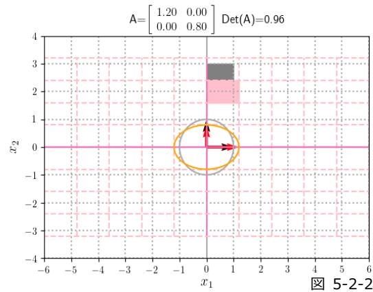

図 5-2-2

図 5-2-2 は行列が  $\begin{bmatrix} 1.2 & 0 \\ 0 & 0.8 \end{bmatrix}$  の例で、行列式の値は 0.96 となる。縦 0.8 倍、横 1.2 倍のスケール変換となっていることがわかる。

図 5-2-3 は行列が  $\begin{bmatrix} 1 & 0.8 \\ 0 & 1 \end{bmatrix}$  の例で、行列式の値は 1 となる。 $\begin{bmatrix} 1 & k \\ 0 & 1 \end{bmatrix}$  の形の変換は剪断（せんだん : shear）と呼ばれ面積を保つ変形を表すものとして知られる。

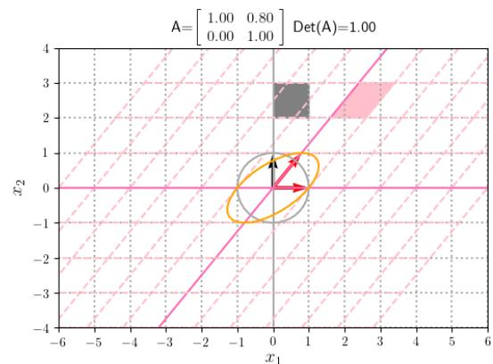

図 5-2-3

図 5-2-4 は行列が  $\begin{bmatrix} \cos(\pi/3) & -\sin(\pi/3) \\ \sin(\pi/3) & \cos(\pi/3) \end{bmatrix}$  の例で、原点を中心とした角度  $\pi/3$  の回転を表し、行列式の値は 1 となる。4 節で詳しくみることになる。

図 5-2-5, 図 5-2-6 は行列が

$$\begin{bmatrix} 1 & 0.8 \\ 0 & 1 \end{bmatrix} \begin{bmatrix} \cos(\pi/3) & -\sin(\pi/3) \\ \sin(\pi/3) & \cos(\pi/3) \end{bmatrix} \begin{bmatrix} \cos(\pi/3) & -\sin(\pi/3) \\ \sin(\pi/3) & \cos(\pi/3) \end{bmatrix} \begin{bmatrix} 1 & 0.8 \\ 0 & 1 \end{bmatrix}$$

の例で、「回転」「せん断」の合成変換を表している。このように線形変換を連続して行う場合、対応する行列の積が合成した変換を表すことになるが行列の積は非可換なのでその結果も一般的には異なる。この違いも 5 節で詳しく述べる。

図 5-2-7 は行列式が 0 となる例で、行列が

 $\begin{bmatrix} 1 & -1 \\ -1 & 1 \end{bmatrix}$  のときを示している。写された基底は  $\begin{bmatrix} 1 \\ -1 \end{bmatrix}, \begin{bmatrix} -1 \\ 1 \end{bmatrix}$  となり真逆を向いて線形従属となり、平面上の点は全て直線上に写されていること（つまり面積は 0）が見て取れる。変換は

$$\begin{bmatrix} y_1 \\ y_2 \end{bmatrix} = \begin{bmatrix} 1 & -1 \\ -1 & 1 \end{bmatrix} \begin{bmatrix} x_1 \\ x_2 \end{bmatrix} = \begin{bmatrix} x_1 - x_2 \\ -x_1 + x_2 \end{bmatrix}$$

となり、直線  $x_2 = x_1 + a$  上の点は全て点  $(-a, a)$  上に、特に直線  $x_1 = x_2$  上の点は全て原点に写されることになる。

図 5-2-4

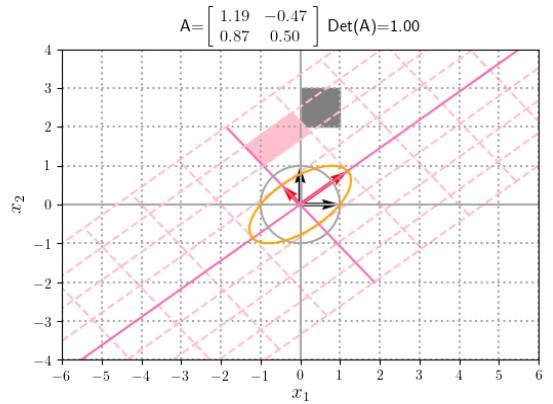

図 5-2-5

図 5-2-6

前講の最後に行列の逆数に相当する行列を掃き出し法で求めた。これは線形変換では逆変換に当たるのではないか？また上記の行列式が 0 で、ある直線上の点が全て同じ点に写されるような場合には逆変換は存在しなさそうだが、それと行列式が 0 とは繋がっているのではないか？

ここらで課題となっていた行列の逆数にあたる行列について調べてみよう。

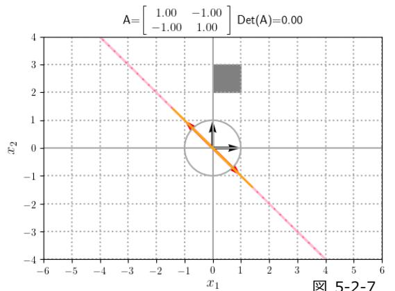

図 5-2-7

**【5-3】 逆行列**

**[5-3-1] 行列式の性質 II : 余因子展開と積の行列式**

行列の逆数にあたる逆行列を求める上でまず必要となる行列式の性質をみてみよう。

3 次を例として行列式に対し以下のことを考えてみる。 $D(\mathbf{a}_1, \mathbf{a}_2, \mathbf{a}_3)$  は  $\mathbf{a}_1 = \sum_{i=1}^3 a_{i1} e_i$  より

$$D(\mathbf{a}_1, \mathbf{a}_2, \mathbf{a}_3) = a_{11}D(\mathbf{e}_1, \mathbf{a}_2, \mathbf{a}_3) + a_{21}D(\mathbf{e}_2, \mathbf{a}_2, \mathbf{a}_3) + a_{31}D(\mathbf{e}_3, \mathbf{a}_2, \mathbf{a}_3)$$

として 1 列目で展開できる。行列式の表記では

$$\begin{bmatrix} a_{11} & a_{12} & a_{13} \\ a_{21} & a_{22} & a_{23} \\ a_{31} & a_{32} & a_{33} \end{bmatrix} = a_{11} \begin{bmatrix} 1 & a_{12} & a_{13} \\ 0 & a_{22} & a_{23} \\ 0 & a_{32} & a_{33} \end{bmatrix} + a_{21} \begin{bmatrix} 0 & a_{12} & a_{13} \\ 1 & a_{22} & a_{23} \\ 0 & a_{32} & a_{33} \end{bmatrix} + a_{31} \begin{bmatrix} 0 & a_{12} & a_{13} \\ 0 & a_{22} & a_{23} \\ 1 & a_{32} & a_{33} \end{bmatrix}$$

となるが、右辺第 1 項は行列式の次数下げ(4-3-15)式を 3 次に適用すると以下のようになる。

$$a_{11} \begin{bmatrix} 1 & a_{12} & a_{13} \\ 0 & a_{22} & a_{23} \\ 0 & a_{32} & a_{33} \end{bmatrix} = a_{11} \begin{bmatrix} a_{22} & a_{23} \\ a_{32} & a_{33} \end{bmatrix}$$

ここで第 2 項は 1 度、第 3 項は 2 度、行を入れ換えて 1 行目に持っていけば

$$\begin{bmatrix} a_{11} & a_{12} & a_{13} \\ a_{21} & a_{22} & a_{23} \\ a_{31} & a_{32} & a_{33} \end{bmatrix} = a_{11} \begin{bmatrix} 1 & a_{12} & a_{13} \\ 0 & a_{22} & a_{23} \\ 0 & a_{32} & a_{33} \end{bmatrix} - a_{21} \begin{bmatrix} 1 & a_{22} & a_{23} \\ 0 & a_{12} & a_{13} \\ 0 & a_{32} & a_{33} \end{bmatrix} + a_{31} \begin{bmatrix} 1 & a_{32} & a_{33} \\ 0 & a_{12} & a_{13} \\ 0 & a_{22} & a_{23} \end{bmatrix}$$

と書ける（入れ換え時の符号の反転に注意）ので、行列式の次数下げを同様に適用すると

$$= a_{11} \begin{bmatrix} a_{22} & a_{23} \\ a_{32} & a_{33} \end{bmatrix} - a_{21} \begin{bmatrix} a_{12} & a_{13} \\ a_{32} & a_{33} \end{bmatrix} + a_{31} \begin{bmatrix} a_{12} & a_{13} \\ a_{22} & a_{23} \end{bmatrix}$$

と書けることになる。

この 2 次の行列式の部分は、それぞれ以下のように

$$\begin{bmatrix} (a_{11}) & \dots & \dots \\ \vdots & a_{22} & a_{23} \\ \vdots & a_{32} & a_{33} \end{bmatrix}, \quad \begin{bmatrix} \vdots & a_{12} & a_{13} \\ (a_{21}) & \dots & \dots \\ \vdots & a_{32} & a_{33} \end{bmatrix}, \quad \begin{bmatrix} \vdots & a_{12} & a_{13} \\ \vdots & a_{22} & a_{23} \\ (a_{31}) & \dots & \dots \end{bmatrix}$$

 $a_{11}, a_{21}, a_{31}$  のそれぞれの行と列の成分を除いた残りを詰めた形になっていることがわかる。

このような成分  $a_{ij}$  の行と列の成分を除いて詰めた行列を小行列、その行列式を**小行列式**といい

 $M_{ij}$  と表す事が多い。上記の例ではそれぞれ  $M_{11}, M_{21}, M_{31}$  となる。

同様に 2 列目でも展開できる。 $\mathbf{a}_2 = \sum_{i=1}^3 a_{i2} e_i$  より展開し行列式で表すと

$$D(\mathbf{a}_1, \mathbf{a}_2, \mathbf{a}_3) = a_{12}D(\mathbf{a}_1, \mathbf{e}_1, \mathbf{a}_3) + a_{22}D(\mathbf{a}_1, \mathbf{e}_2, \mathbf{a}_3) + a_{32}D(\mathbf{a}_1, \mathbf{e}_3, \mathbf{a}_3)$$

$$\begin{bmatrix} a_{11} & a_{12} & a_{13} \\ a_{21} & a_{22} & a_{23} \\ a_{31} & a_{32} & a_{33} \end{bmatrix} = a_{12} \begin{bmatrix} a_{11} & 1 & a_{13} \\ a_{21} & 0 & a_{23} \\ a_{31} & 0 & a_{33} \end{bmatrix} + a_{22} \begin{bmatrix} a_{11} & 0 & a_{13} \\ a_{21} & 1 & a_{23} \\ a_{31} & 0 & a_{33} \end{bmatrix} + a_{32} \begin{bmatrix} a_{11} & 0 & a_{13} \\ a_{21} & 0 & a_{23} \\ a_{31} & 1 & a_{33} \end{bmatrix}$$

となり、それぞれ 1 列目と入れ換えて

$$= -a_{12} \begin{bmatrix} 1 & a_{11} & a_{13} \\ 0 & a_{21} & a_{23} \\ 0 & a_{31} & a_{33} \end{bmatrix} - a_{22} \begin{bmatrix} 0 & a_{11} & a_{13} \\ 1 & a_{21} & a_{23} \\ 0 & a_{31} & a_{33} \end{bmatrix} - a_{32} \begin{bmatrix} 0 & a_{11} & a_{13} \\ 0 & a_{21} & a_{23} \\ 1 & a_{31} & a_{33} \end{bmatrix}$$

さらに 1 列目のときと同様に第 2 項は 1 度の、第 3 項は 2 度の入れ換えで 1 行目に移して

$$= -a_{12} \begin{bmatrix} 1 & a_{11} & a_{13} \\ 0 & a_{21} & a_{23} \\ 0 & a_{31} & a_{33} \end{bmatrix} + a_{22} \begin{bmatrix} 1 & a_{21} & a_{23} \\ 0 & a_{11} & a_{13} \\ 0 & a_{31} & a_{33} \end{bmatrix} - a_{32} \begin{bmatrix} 1 & a_{31} & a_{33} \\ 0 & a_{11} & a_{13} \\ 0 & a_{21} & a_{23} \end{bmatrix}$$

$$= -a_{12} \begin{bmatrix} a_{21} & a_{23} \\ a_{31} & a_{33} \end{bmatrix} + a_{22} \begin{bmatrix} a_{11} & a_{13} \\ a_{31} & a_{33} \end{bmatrix} - a_{32} \begin{bmatrix} a_{11} & a_{13} \\ a_{21} & a_{23} \end{bmatrix}$$

$$M_{12} : \begin{vmatrix} \cdots & (a_{12}) & \cdots \\ a_{21} & \vdots & a_{23} \\ a_{31} & \vdots & a_{33} \end{vmatrix}, \quad M_{22} : \begin{vmatrix} a_{11} & \vdots & a_{13} \\ \cdots & (a_{22}) & \cdots \\ a_{31} & \vdots & a_{33} \end{vmatrix}, \quad M_{32} : \begin{vmatrix} a_{11} & \vdots & a_{13} \\ a_{21} & \vdots & a_{23} \\ \cdots & (a_{32}) & \cdots \end{vmatrix}$$

また展開の際につく符号は、入れ換えの回数より  $(-1)^{i+j}$  と書けることがわかる (確認しよう)。

この入れ換えによる符号  $(-1)^{i+j}$  を小行列の行列式  $M_{ij}$  に付けた  $(-1)^{i+j}M_{ij}$  を成分  $a_{ij}$  の**余因子**といい、 $\tilde{a}_{ij}$  (あるいは  $C_{ij}$ ) と書かれることが多い。

同様に 3 列目の展開は

$$\begin{aligned} D(\mathbf{a}_1, \mathbf{a}_2, \mathbf{a}_3) &= a_{13}D(\mathbf{a}_1, \mathbf{a}_2, \mathbf{e}_1) + a_{23}D(\mathbf{a}_1, \mathbf{a}_2, \mathbf{e}_2) + a_{33}D(\mathbf{a}_1, \mathbf{a}_2, \mathbf{e}_3) \\ \begin{vmatrix} a_{11} & a_{12} & a_{13} \\ a_{21} & a_{22} & a_{23} \\ a_{31} & a_{32} & a_{33} \end{vmatrix} &= a_{13} \begin{vmatrix} a_{11} & a_{12} & 1 \\ a_{21} & a_{22} & 0 \\ a_{31} & a_{32} & 0 \end{vmatrix} + a_{23} \begin{vmatrix} a_{11} & a_{12} & 0 \\ a_{21} & a_{22} & 1 \\ a_{31} & a_{32} & 0 \end{vmatrix} + a_{33} \begin{vmatrix} a_{11} & a_{12} & 0 \\ a_{21} & a_{22} & 0 \\ a_{31} & a_{32} & 1 \end{vmatrix} \\ &= (-1)^{1+3} a_{13} \begin{vmatrix} a_{21} & a_{22} \\ a_{31} & a_{32} \end{vmatrix} + (-1)^{2+3} a_{23} \begin{vmatrix} a_{11} & a_{12} \\ a_{31} & a_{32} \end{vmatrix} + (-1)^{3+3} a_{33} \begin{vmatrix} a_{11} & a_{12} \\ a_{21} & a_{22} \end{vmatrix} \end{aligned}$$

となり、小行列式・余因子で表すと以下のように書ける。

$$\begin{aligned} &= (-1)^{1+3} a_{13} M_{13} + (-1)^{2+3} a_{23} M_{23} + (-1)^{3+3} a_{33} M_{33} \\ &= a_{13} \tilde{a}_{13} + a_{23} \tilde{a}_{23} + a_{33} \tilde{a}_{33} \end{aligned}$$

元の展開式と比較すれば、余因子  $\tilde{a}_{ij}$  とは  $j$  列目が標準基底の  $i$  番目  $\mathbf{e}_i$  となる  $D(\mathbf{a}_1, \mathbf{a}_2, \mathbf{a}_3)$  の ことでもあり、同じことだが  $j$  列目が標準基底の  $i$  番目となる行列式のことでもある。

これまでの話はそのまま  $n$  次へ拡張されることもわかる。このような展開を**余因子展開**という。

● (xi) 列に対する余因子展開 ( $j$  列目による展開)

$$\begin{vmatrix} a_{11} & \cdots & a_{1n} \\ \vdots & \ddots & \vdots \\ a_{n1} & \cdots & a_{nn} \end{vmatrix} = \sum_{i=1}^n (-1)^{i+j} a_{ij} M_{ij} = \sum_{i=1}^n a_{ij} \tilde{a}_{ij} \quad (5-3-1)$$

行列式は列に対して成り立つ性質は行に対しても成り立つ。余因子展開は以下のようになる。

● (xii) 行に対する余因子展開 ( $i$  行目による展開)

$$\begin{vmatrix} a_{11} & \cdots & a_{1n} \\ \vdots & \ddots & \vdots \\ a_{n1} & \cdots & a_{nn} \end{vmatrix} = \sum_{j=1}^n (-1)^{i+j} a_{ij} M_{ij} = \sum_{j=1}^n a_{ij} \tilde{a}_{ij} \quad (5-3-2)$$

同様に余因子  $\tilde{a}_{ij}$  は  $i$  行目が標準基底の  $j$  番目となる行列式でもあることになる (次項も参照)。

● (xiii) 正方行列  $A, B$  の積の行列式は、それぞれの行列式の積

$$|AB| = |A| |B| \quad (5-3-3)$$

証明は前講 付録 1 参照。なお証明をたどれば  $|A| = 0$  or  $|B| = 0$  のときも成り立つことに注意。

### [5-3-2] 逆行列の定義と余因子行列による表示

前講の最後に考えた行列  $A$  の逆数にあたる行列は  $AX' = E$  を満たすもので、もしこれが  $X'A = E$  でもあれば  $Ax = b$  の両辺に左から  $X'$  を掛けることで  $x = X'b$  を得て実際に解を得た結果に結びつくのだった。また線形変換  $\mathbf{y} = Ax$  も同様に左から  $X'$  を掛けることで  $x = X'\mathbf{y}$  と書けることになり逆変換となりそうだ。これらを踏まえ、逆行列を以下のように定義しよう。

●逆行列と正則行列の定義

正方行列  $A$  に対して行列  $X$  が  $AX = XA = E$  を満たすとき、  
 $X$  を  $A$  の逆行列であるといい  $A^{-1}$  と表記する。逆行列を持つ行列を**正則行列**という。  
 (定義から  $A$  は  $A^{-1}$  の逆行列でもあることに注意)

3次を例として、それぞれ  $AX = E, YA = E$  を満たす  $X, Y$  を考えてみよう。  
 まず以下の式を満たす行列  $X$  を求める。

$$AX = E, \quad \begin{bmatrix} a_{11} & a_{12} & a_{13} \\ a_{21} & a_{22} & a_{23} \\ a_{31} & a_{32} & a_{33} \end{bmatrix} \begin{bmatrix} x_{11} & x_{12} & x_{13} \\ x_{21} & x_{22} & x_{23} \\ x_{31} & x_{32} & x_{33} \end{bmatrix} = \begin{bmatrix} 1 & 0 & 0 \\ 0 & 1 & 0 \\ 0 & 0 & 1 \end{bmatrix}$$

前講の最後にやったように、行列  $A, X, E$  を列ベクトルが並んだものとみなし

$$\mathbf{a}_1 = \begin{bmatrix} a_{11} \\ a_{21} \\ a_{31} \end{bmatrix}, \mathbf{a}_2 = \begin{bmatrix} a_{12} \\ a_{22} \\ a_{32} \end{bmatrix}, \mathbf{a}_3 = \begin{bmatrix} a_{13} \\ a_{23} \\ a_{33} \end{bmatrix}, \mathbf{x}_1 = \begin{bmatrix} x_{11} \\ x_{21} \\ x_{31} \end{bmatrix}, \mathbf{x}_2 = \begin{bmatrix} x_{12} \\ x_{22} \\ x_{32} \end{bmatrix}, \mathbf{x}_3 = \begin{bmatrix} x_{13} \\ x_{23} \\ x_{33} \end{bmatrix}, \mathbf{e}_1 = \begin{bmatrix} 1 \\ 0 \\ 0 \end{bmatrix}, \mathbf{e}_2 = \begin{bmatrix} 0 \\ 1 \\ 0 \end{bmatrix}, \mathbf{e}_3 = \begin{bmatrix} 0 \\ 0 \\ 1 \end{bmatrix}$$

を導入すれば、以下の3つの連立一次方程式となり

$$A\mathbf{x}_1 = \mathbf{e}_1, \quad A\mathbf{x}_2 = \mathbf{e}_2, \quad A\mathbf{x}_3 = \mathbf{e}_3$$

さらにそれぞれを前講[4-2-4]でやったように列ベクトル  $\mathbf{a}_1, \mathbf{a}_2, \mathbf{a}_3$  の線形結合の形に書き直すと

$$\begin{aligned} x_{11}\mathbf{a}_1 + x_{21}\mathbf{a}_2 + x_{31}\mathbf{a}_3 &= \mathbf{e}_1 \\ x_{12}\mathbf{a}_1 + x_{22}\mathbf{a}_2 + x_{32}\mathbf{a}_3 &= \mathbf{e}_2 \\ x_{13}\mathbf{a}_1 + x_{23}\mathbf{a}_2 + x_{33}\mathbf{a}_3 &= \mathbf{e}_3 \end{aligned}$$

と書けて、これを一つにまとめると以下の式になる。

$$x_{1j}\mathbf{a}_1 + x_{2j}\mathbf{a}_2 + x_{3j}\mathbf{a}_3 = \mathbf{e}_j$$

クラメルの法則でみたように、これを  $D(\mathbf{a}_1, \mathbf{a}_2, \mathbf{a}_3)$  の  $\mathbf{a}_1, \mathbf{a}_2, \mathbf{a}_3$  にそれぞれ代入すれば

$$\begin{aligned} D(\mathbf{e}_j, \mathbf{a}_2, \mathbf{a}_3) &= x_{1j}D(\mathbf{a}_1, \mathbf{a}_2, \mathbf{a}_3) = x_{1j}|A| \\ D(\mathbf{a}_1, \mathbf{e}_j, \mathbf{a}_3) &= x_{2j}D(\mathbf{a}_1, \mathbf{a}_2, \mathbf{a}_3) = x_{2j}|A| \\ D(\mathbf{a}_1, \mathbf{a}_2, \mathbf{e}_j) &= x_{3j}D(\mathbf{a}_1, \mathbf{a}_2, \mathbf{a}_3) = x_{3j}|A| \end{aligned}$$

とそれぞれ  $x_{1j}, x_{2j}, x_{3j}$  の項が残る。一方左辺は前項でみたように

$$D(\mathbf{e}_j, \mathbf{a}_2, \mathbf{a}_3) = \tilde{a}_{j1}, \quad D(\mathbf{a}_1, \mathbf{e}_j, \mathbf{a}_3) = \tilde{a}_{j2}, \quad D(\mathbf{a}_1, \mathbf{a}_2, \mathbf{e}_j) = \tilde{a}_{j3}$$

として余因子となり結果  $\tilde{a}_{ji} = x_{ij}|A|$  と書ける。添字の順番が両辺で逆になっていることに注意。

ここで余因子を成分とする行列の転置行列として以下のように**余因子行列**を定義する。

$$\tilde{A} \equiv \begin{bmatrix} \tilde{a}_{11} & \tilde{a}_{21} & \tilde{a}_{31} \\ \tilde{a}_{12} & \tilde{a}_{22} & \tilde{a}_{32} \\ \tilde{a}_{13} & \tilde{a}_{23} & \tilde{a}_{33} \end{bmatrix} \quad (\text{転置しないものを余因子行列と定義する場合もあるので注意})$$

余因子行列  $\tilde{A}$  を用いて、行列  $A$  の行列式  $|A| \neq 0$  のとき  $X = \frac{1}{|A|}\tilde{A}$  と求まる。

次に以下の式を満たす行列  $Y$  を求める ( $AX = E$  のときとほぼ同様となる)。

$$YA = E, \quad \begin{bmatrix} y_{11} & y_{12} & y_{13} \\ y_{21} & y_{22} & y_{23} \\ y_{31} & y_{32} & y_{33} \end{bmatrix} \begin{bmatrix} a_{11} & a_{12} & a_{13} \\ a_{21} & a_{22} & a_{23} \\ a_{31} & a_{32} & a_{33} \end{bmatrix} = \begin{bmatrix} 1 & 0 & 0 \\ 0 & 1 & 0 \\ 0 & 0 & 1 \end{bmatrix}$$

行列  $Y, A, E$  を行ベクトルが並んだものとみなし、

$$\begin{aligned} \mathbf{y}_1^\top &= [y_{11} \ y_{12} \ y_{13}], & \mathbf{y}_2^\top &= [y_{21} \ y_{22} \ y_{23}], & \mathbf{y}_3^\top &= [y_{31} \ y_{32} \ y_{33}] \\ \mathbf{a}_1^\top &= [a_{11} \ a_{12} \ a_{13}], & \mathbf{a}_2^\top &= [a_{21} \ a_{22} \ a_{23}], & \mathbf{a}_3^\top &= [a_{31} \ a_{32} \ a_{33}] \\ \mathbf{e}_1^\top &= [1 \ 0 \ 0], & \mathbf{e}_2^\top &= [0 \ 1 \ 0], & \mathbf{e}_3^\top &= [0 \ 0 \ 1] \end{aligned}$$

を導入すれば、以下の 3 つの連立一次方程式となり、

$$\mathbf{y}_1^\top A = \mathbf{e}_1^\top, \quad \mathbf{y}_2^\top A = \mathbf{e}_2^\top, \quad \mathbf{y}_3^\top A = \mathbf{e}_3^\top$$

それぞれを行ベクトル  $\mathbf{a}_1^\top, \mathbf{a}_2^\top, \mathbf{a}_3^\top$  の線形結合の形に書き直すと

$$\begin{aligned} y_{11}[a_{11} \quad a_{12} \quad a_{13}] + y_{12}[a_{21} \quad a_{22} \quad a_{23}] + y_{13}[a_{31} \quad a_{32} \quad a_{33}] &= [1 \quad 0 \quad 0], & y_{11}\mathbf{a}_1^\top + y_{12}\mathbf{a}_2^\top + y_{13}\mathbf{a}_3^\top &= \mathbf{e}_1^\top \\ y_{21}[a_{11} \quad a_{12} \quad a_{13}] + y_{22}[a_{21} \quad a_{22} \quad a_{23}] + y_{23}[a_{31} \quad a_{32} \quad a_{33}] &= [0 \quad 1 \quad 0], & y_{21}\mathbf{a}_1^\top + y_{22}\mathbf{a}_2^\top + y_{23}\mathbf{a}_3^\top &= \mathbf{e}_2^\top \\ y_{31}[a_{11} \quad a_{12} \quad a_{13}] + y_{32}[a_{21} \quad a_{22} \quad a_{23}] + y_{33}[a_{31} \quad a_{32} \quad a_{33}] &= [0 \quad 0 \quad 1], & y_{31}\mathbf{a}_1^\top + y_{32}\mathbf{a}_2^\top + y_{33}\mathbf{a}_3^\top &= \mathbf{e}_3^\top \end{aligned}$$
と書けて、これを一つにまとめると以下の式になる。

$$y_{i1}\mathbf{a}_1^\top + y_{i2}\mathbf{a}_2^\top + y_{i3}\mathbf{a}_3^\top = \mathbf{e}_i^\top$$

これを  $D(\mathbf{a}_1^\top, \mathbf{a}_2^\top, \mathbf{a}_3^\top)$  の  $\mathbf{a}_1^\top, \mathbf{a}_2^\top, \mathbf{a}_3^\top$  にそれぞれ代入すれば45、それぞれ  $y_{i1}, y_{i2}, y_{i3}$  の項が残り

$$D(\mathbf{e}_i^\top, \mathbf{a}_2^\top, \mathbf{a}_3^\top) = y_{i1}D(\mathbf{a}_1^\top, \mathbf{a}_2^\top, \mathbf{a}_3^\top) = y_{i1}|A|$$

$$D(\mathbf{a}_1^\top, \mathbf{e}_i^\top, \mathbf{a}_3^\top) = y_{i2}D(\mathbf{a}_1^\top, \mathbf{a}_2^\top, \mathbf{a}_3^\top) = y_{i2}|A|$$

$$D(\mathbf{a}_1^\top, \mathbf{a}_2^\top, \mathbf{e}_i^\top) = y_{i3}D(\mathbf{a}_1^\top, \mathbf{a}_2^\top, \mathbf{a}_3^\top) = y_{i3}|A|$$

となる。また左辺を行列式で表せば、例として以下のようになり余因子となることがわかる。

$$D(\mathbf{e}_3^\top, \mathbf{a}_2^\top, \mathbf{a}_3^\top) = \begin{vmatrix} 0 & 0 & 1 \\ a_{21} & a_{22} & a_{23} \\ a_{31} & a_{32} & a_{33} \end{vmatrix} = \tilde{a}_{13}, \quad D(\mathbf{e}_i^\top, \mathbf{a}_2^\top, \mathbf{a}_3^\top) = \tilde{a}_{1i}$$

$$D(\mathbf{a}_1^\top, \mathbf{e}_1^\top, \mathbf{a}_3^\top) = \begin{vmatrix} a_{11} & a_{12} & a_{13} \\ 1 & 0 & 0 \\ a_{31} & a_{32} & a_{33} \end{vmatrix} = \tilde{a}_{21}, \quad D(\mathbf{a}_1^\top, \mathbf{e}_i^\top, \mathbf{a}_3^\top) = \tilde{a}_{2i}$$

$$D(\mathbf{a}_1^\top, \mathbf{a}_2^\top, \mathbf{e}_2^\top) = \begin{vmatrix} a_{11} & a_{12} & a_{13} \\ a_{21} & a_{22} & a_{23} \\ 0 & 1 & 0 \end{vmatrix} = \tilde{a}_{32}, \quad D(\mathbf{a}_1^\top, \mathbf{a}_2^\top, \mathbf{e}_i^\top) = \tilde{a}_{3i}$$

左辺を余因子として結果  $\tilde{a}_{ji} = y_{ij}|A|$  と書ける。添字の順番が両辺で逆になっていることに注意。

余因子行列を用いて、行列  $A$  の行列式  $|A| \neq 0$  のとき  $Y = \frac{1}{|A|}\tilde{A}$  と求まる。

3 次を例とした以上の議論は、より高次にも全く同様に適用され  $n$  次の正方行列  $A$  に対し

 $AX = E, YA = E$  を満たす  $X, Y$  は、 $|A| \neq 0$  のとき  $X = Y = \frac{1}{|A|}\tilde{A}$  となり逆行列の定義を満たす。

$$A^{-1} = \frac{1}{|A|}\tilde{A} \quad (|A| \neq 0) \quad (5-3-4)$$

これは逆行列の余因子行列による表示となる。次項でこの逆行列の性質を調べよう。

### [5-3-3] 正則行列/逆行列の性質

(i) 逆行列は一意 : 正則な行列がもつ逆行列は一意に定まる (5-3-5)

 $AX = XA = E, AY = YA = E$  を満たす任意の  $X, Y$  に対し  $AY = E$  の両辺に左から  $X$  を掛けると  $XAY = X$  となるが  $XA = E$  より  $EY = X$  したがって  $Y = X$  がいえて、題意は示された。 ■

(ii)  $|A^{-1}| = 1/|A|$  : (正則行列の) 逆行列の行列式は行列式の逆数となる (5-3-6)

 $A^{-1}A = E$  の両辺の行列式は  $1 = |E| = |A^{-1}A| = |A^{-1}||A|$  となり  $\therefore |A^{-1}| = 1/|A|$  ■

45  $D(\mathbf{a}, \mathbf{b}, \mathbf{c})$  のベクトルは列ベクトルと限られているわけではなく、行ベクトルとみなしても良い。そもそも  $D(\mathbf{a}, \mathbf{b}, \mathbf{c})$  自体には行や列の概念はなく、列をベクトルとみなして定義した場合の行も、列と同じ性質を持つ (逆もしかり) という関係にあること (第 4 講 付録 1 参照) に注意。

(iii)  $(AB)^{-1} = B^{-1}A^{-1}$  : 正則行列の積も正則で、積の逆行列は逆行列の逆順の積 (5-3-7)

 $AB$  に  $B^{-1}A^{-1}$  を掛ける。左側から :  $(B^{-1}A^{-1})(AB) = B^{-1}(A^{-1}A)B = B^{-1}B = E$ 

右側から :  $(AB)(B^{-1}A^{-1}) = A(BB^{-1})A^{-1} = AA^{-1} = E$  となり、題意を満たす。 ■

(iv) 正方行列  $A$  に対し  $AX = E$  または  $XA = E \Rightarrow X = A^{-1}$  (5-3-8)

 $AX = E$  の両辺の行列式を求めると、 $1 = |E| = |AX| = |A||X|$  となり  $|A| \neq 0$  がいえて、

 $A^{-1}A = AA^{-1} = E$  となる  $A^{-1} = \frac{1}{|A|}\tilde{A}$  が求まる。 $AX = E$  の両辺に左側から  $A^{-1}$  を掛けると、

 $A^{-1}AX = A^{-1} \Rightarrow X = A^{-1}$  となる。 $XA = E$  の場合も同様。よって題意は示された。 ■

• 性質(i)により、 $Ax = b$  に対し  $|A| \neq 0$  のとき  $x = A^{-1}b$  として得る解の一意性がいえる。

• 性質(iv)により、前講の最後に掃き出し法で求めた方法でも逆行列が求まることがわかった。

●  $n$  次正方行列  $A$  に対して以下の条件は全て同値となる (5-3-9)

(i)  $A$  は正則行列である

(ii) 行列式  $|A| \neq 0$ 

(iii)  $Ax = 0$  が自明な解のみをもつ

(iv)  $A$  を列ベクトルの組とみなしたとき、その組は線形独立である

(iv')  $A$  を行ベクトルの組とみなしたとき、その組は線形独立である

(v)  $\text{rank}(A) = n$ 

【証明】

• (i)  $\Rightarrow$  (ii) :

 $A^{-1}A = E$  の両辺の行列式  $1 = |E| = |A^{-1}A| = |A^{-1}||A|$  より  $|A| \neq 0$  がいえる。

• (ii)  $\Rightarrow$  (iii) :

 $|A| \neq 0$  より  $A^{-1}$  となる  $\frac{1}{|A|}\tilde{A}$  が求まり  $Ax = 0$  の両辺に左から掛け一意な解  $x = 0$  を得る。

• (iii)  $\Rightarrow$  (iv) :

 $A$  を列ベクトルの組  $[a_1 \cdots a_n]$  とみなすと  $Ax = 0$  は  $x_1a_1 + \cdots + x_na_n = 0$  と書けるが、自明な解のみなので  $x_1 = \cdots = x_n = 0$  のみとなり、列ベクトルの組  $a_1, \dots, a_n$  は線形独立となる。

• (iv)  $\Rightarrow$  (v) :

前講[4-2-4]の考察でみたように行基本変形は線形結合関係を保ち、簡約行列となっても列は線形独立なままとなる。このとき行 0 ベクトルが生じると、掃き出せない列が生じてその列は主成分をもつ他の列ベクトルの組の線形結合で表されることになり線形従属となって矛盾する。よって行 0 ベクトルは生じず、結果主成分は  $n$  個存在することになり  $\text{rank}(A)$  は  $n$  となる。

• (v)  $\Rightarrow$  (i) :

 $\text{rank}$  が  $n$  なので 行列  $A$  に対して掃き出し法で  $AX = E$  を満たす  $X$  が求まり、(5-3-8)より  $X$  は逆行列  $A^{-1}$  であることがいえ  $A$  は正則行列といえる。

以上により (i), (ii), (iii), (iv), (v) は全て同値であることが示された46。

最後に (ii)  $\Leftrightarrow$  (iv') を示す。(ii)  $\Leftrightarrow$  (iii) と  $|A^T| = |A|$  より「(iii')  $A^T \mathbf{x} = \mathbf{0}$  or  $\mathbf{x}^T A = \mathbf{0}$  が自明解のみをもつ」に対し (ii)  $\Leftrightarrow$  (iii') となり、また (iii)  $\Rightarrow$  (iv) と同様に (iii')  $\Rightarrow$  (iv') がいえ、逆にたどれば (iv')  $\Rightarrow$  (iii') もいえるので (iii')  $\Leftrightarrow$  (iv') がいえる。よって (ii)  $\Leftrightarrow$  (iv') が成り立つ。

以上により題意は示された。 ■

- • 上記において (iv)  $\Leftrightarrow$  (ii) より前講 (4-3-12) の行列式の性質(vi')が示された。
- • (iv), (iv')  $\Leftrightarrow$  (ii), (v) より[4-2-4]項で考察した係数行列の行・列ベクトルが線形独立であることと行列式が非零であることとの同値性、また求まる解の一意性も示された。

蛇足ながらクラメルの法則で解いた解と逆行列を用いて解いた解との関係を確認しておこう。

3次を例として連立一次方程式  $\sum_{j=1}^3 a_{ij} x_j = b_i$  or  $x_1 \mathbf{a}_1 + x_2 \mathbf{a}_2 + x_3 \mathbf{a}_3 = \mathbf{b}$  において、  
 $D(\mathbf{b}, \mathbf{a}_2, \mathbf{a}_3) = x_1 |A|$ ,  $D(\mathbf{a}_1, \mathbf{b}, \mathbf{a}_3) = x_2 |A|$ ,  $D(\mathbf{a}_1, \mathbf{a}_2, \mathbf{b}) = x_3 |A|$  の各左辺を  $D(\sum_{j=1}^3 b_j \mathbf{e}_j, \mathbf{a}_2, \mathbf{a}_3) = \sum_{j=1}^3 b_j D(\mathbf{e}_j, \mathbf{a}_2, \mathbf{a}_3) = \sum_{j=1}^3 b_j \tilde{a}_{j1}$  のように余因子で表すことでまとめて  $\sum_{j=1}^3 b_j \tilde{a}_{ji} = x_i |A|$  と書け、これは  $|A| \neq 0$  のとき  $x_i = \frac{1}{|A|} \sum_{j=1}^3 \tilde{a}_{ij}^T b_j$  あるいは  $\mathbf{x} = A^{-1} \mathbf{b}$  と逆行列を用いた解となる。

線形変換  $\mathbf{y} = A\mathbf{x}$  において、行列  $A$  が正則である場合すなわち  $|A| \neq 0$  のときは逆行列  $A^{-1}$  を両辺の左側から掛けることにより  $\mathbf{x} = A^{-1} \mathbf{y}$  なる逆変換が求まることがわかった。さらに詳しいことは第 5 節で述べるとして、次節では重要な線形変換である回転を表す行列を調べよう。

## 【5-4】 直交行列

### 【5-4-1】 転置行列の性質

直交行列を議論する前に関係の深い転置行列の性質を簡単にみておこう。

#### ● 転置行列の性質

(i)  $(AB)^T = B^T A^T$  : 積の転置行列は順序を逆にした転置行列の積 (5 - 4 - 1)

$$\{(AB)^T\}_{ij} = (AB)_{ji} = \sum_k a_{jk} b_{ki} = \sum_k b_{ik}^T a_{kj}^T = (B^T A^T)_{ij} \quad \therefore (AB)^T = B^T A^T \quad \blacksquare$$

(ii)  $(A^T)^{-1} = (A^{-1})^T$  : 正則行列の転置行列の逆行列は逆行列の転置行列 (5 - 4 - 2)

$$A^{-1} A = A A^{-1} = E \text{ の両辺の転置をとると } E = E^T = (A^{-1} A)^T = A^T (A^{-1})^T \text{ また } E = E^T =$$

$$(A A^{-1})^T = (A^{-1})^T A^T \text{ となり、これは } (A^{-1})^T \text{ が } A^T \text{ の逆行列となることを示している。} \quad \blacksquare$$

---

46 (ii)  $\Rightarrow$  (iii)  $\Rightarrow$  (iv)  $\Rightarrow$  (v) より (ii)  $\Rightarrow$  (i) がいえて (i)  $\Rightarrow$  (ii) でもあるので (i) と(ii)は同値。同様に (iii)  $\Rightarrow$  (ii) がいえて (ii)  $\Rightarrow$  (iii) でもあるので (ii) と(iii) も同値となり、さらに同様にして (iii) と(iv)、(iv) と(v) の同値もいえるので (i), (ii), (iii), (iv), (v) は全て同値となる。

●内積の表示

列ベクトル  $x = \begin{bmatrix} x_1 \\ \vdots \\ x_n \end{bmatrix}, y = \begin{bmatrix} y_1 \\ \vdots \\ y_n \end{bmatrix}$  の標準内積を  $x \cdot y \equiv x^T y = [x_1 \quad \cdots \quad x_n] \begin{bmatrix} y_1 \\ \vdots \\ y_n \end{bmatrix} = x_1 y_1 + \cdots + x_n y_n$  として定義する。

**[5-4-2] 直交行列の定義と性質**

●直交行列の定義

 $R^T R = R R^T = E$  を満たす正方行列  $R$  を直交行列という。

●直交行列の性質

(i) 直交行列は正則行列であり、 $R$  の逆行列は  $R^T$  (定義より明らか) (5 - 4 - 3)

(ii) 行列式は  $|R| = \pm 1$  (5 - 4 - 4)

 $R^T R = E$  の両辺の行列式を求めると、 $|R^T| = |R|, |E| = 1$  より  $|R|^2 = 1 \quad \therefore |R| = \pm 1$  ■

(iii)  $R_1, R_2$  が直交行列のとき、その積もまた直交行列 (5 - 4 - 5)

 $(R_1 R_2)^T (R_1 R_2) = R_2^T R_1^T R_1 R_2 = R_2^T R_2 = E, (R_1 R_2)(R_1 R_2)^T = R_1 R_2 R_2^T R_1^T = R_1 R_1^T = E$  ■

(iv) 正方行列  $R$  において  $R^T R = E$  または  $R R^T = E \Rightarrow R$  は直行列である (5 - 4 - 6)

(5-3-8)から  $R^T R = E$  のとき  $R^T = R^{-1}$  がいえ  $R R^T = E$  も成り立つので  $R$  は直交行列といえる。 $R R^T = E$  のときも同様。よって題意は示された ■

●  $n$  次正方行列  $R$  に対して以下の条件は全て同値となる (5 - 4 - 7)

(i)  $R$  は直交行列である

(ii)  $R$  による線形変換が内積を不変に保つ ( $\forall x, y \in \mathbb{R}^n, (Rx) \cdot (Ry) = x \cdot y$ )

(iii)  $R$  による線形変換がノルムを不変に保つ ( $\forall x \in \mathbb{R}^n, \|Rx\| = \|x\|$ )

(iv)  $R$  を列ベクトルの組とみなしたとき、その組は正規直交基底をなす

(iv')  $R$  を行ベクトルの組とみなしたとき、その組は正規直交基底をなす

【証明】

• (i)  $\Rightarrow$  (ii) :

 $(Rx) \cdot (Ry) = (Rx)^T (Ry) = (x^T R^T) (Ry) = x^T (R^T R) y = x^T y = x \cdot y$  よって内積は不変となる。

• (ii)  $\Rightarrow$  (iii) :

• (iii)  $\Rightarrow$  (iv) :

 $R = [r_1 \cdots r_n]$  のとき標準基底  $e_i$  に対して  $Re_i = r_i$  より  $\|r_i\| = \|Re_i\| = \|e_i\| = 1$  がいえ、また  $R(e_i + e_j) = r_i + r_j$  より  $i \neq j$  のとき  $\|r_i + r_j\| = \|R(e_i + e_j)\| = \|e_i + e_j\| = \sqrt{2}$  となり両辺を 2 乗して  $\|r_i\|^2 + \|r_j\|^2 + 2r_i \cdot r_j = 2$  より  $r_i \cdot r_j = 0$  がいえて、 $r_i \cdot r_j = \delta_{ij}$  を得る。

• (iv)  $\Rightarrow$  (i) :

$$R^T R = \begin{bmatrix} r_1^T \\ \vdots \\ r_n^T \end{bmatrix} [r_1 \cdots r_n] = \begin{bmatrix} r_1^T r_1 & \cdots & r_1^T r_n \\ \vdots & \ddots & \vdots \\ r_n^T r_1 & \cdots & r_n^T r_n \end{bmatrix} = \begin{bmatrix} r_1 \cdot r_1 & \cdots & r_1 \cdot r_n \\ \vdots & \ddots & \vdots \\ r_n \cdot r_1 & \cdots & r_n \cdot r_n \end{bmatrix} = E \text{ がいえて、}$$

性質(iv) : (5-4-6) より  $R$  は直交行列となる。

• (i)  $\Leftrightarrow$  (iv') : ( $R$  の  $i$  行目の行ベクトルをここでは  $\tilde{r}_i$  と書くとする)

$$RR^T = \begin{bmatrix} \tilde{r}_1 \\ \vdots \\ \tilde{r}_n \end{bmatrix} [\tilde{r}_1^T \cdots \tilde{r}_n^T] = \begin{bmatrix} \tilde{r}_1 \tilde{r}_1^T & \cdots & \tilde{r}_1 \tilde{r}_n^T \\ \vdots & \ddots & \vdots \\ \tilde{r}_n \tilde{r}_1^T & \cdots & \tilde{r}_n \tilde{r}_n^T \end{bmatrix} = \begin{bmatrix} \tilde{r}_1 \cdot \tilde{r}_1 & \cdots & \tilde{r}_1 \cdot \tilde{r}_n \\ \vdots & \ddots & \vdots \\ \tilde{r}_n \cdot \tilde{r}_1 & \cdots & \tilde{r}_n \cdot \tilde{r}_n \end{bmatrix} \text{ よって ((5-4-6) より)}$$

 $R$  は直交行列であることと行ベクトルの組が正規直交基底とは同値となる。

以上により (i), (ii), (iii), (iv), (iv') は同値であることが示された。 ■

直交行列による変換 (直交変換) は (5-4-7)よりベクトルのノルム・内積が不変な (大きさ・角度を保つ) 変換となる。このような変換を**等長変換**という (厳密には原点を原点に写す等長変換)。

例として 2 次の直交行列で見てみよう (3 次は第 7 講 回転の表現 I にて詳しくみる)。任意の正規直交基底を  $e'_1, e'_2$  とし、これを列ベクトルとする行列  $[e'_1 \quad e'_2]$  は上記条件(iv)より直交行列となる。標準基底を  $e_1, e_2$  とし、図のように  $e_1, e'_1$  のなす角を  $\theta$  とすると、 $e'_1 = \begin{bmatrix} \cos \theta \\ \sin \theta \end{bmatrix}$  となる。 $e'_2$  は  $e'_1$  と直交するが向き付けにより 2 通りとることができる。

図の  $e'_2(R) = \begin{bmatrix} -\sin \theta \\ \cos \theta \end{bmatrix}$  は  $e'_1$  とともに右手系の座標系を張り、直交行列は  $\begin{bmatrix} \cos \theta & -\sin \theta \\ \sin \theta & \cos \theta \end{bmatrix}$  となり 2 次元の**回転**を表し、行列式は+1 となる。 $e'_2(L) = \begin{bmatrix} \sin \theta \\ -\cos \theta \end{bmatrix}$  は  $e'_1$  とともに左手系の座標系を張り、直交行列は  $\begin{bmatrix} \cos \theta & \sin \theta \\ \sin \theta & -\cos \theta \end{bmatrix}$  となる。これは  $e_1$  を軸とした反射を表す直交行列  $\begin{bmatrix} 1 & 0 \\ 0 & -1 \end{bmatrix}$  と回転を表す直交行列との積 :  $\begin{bmatrix} \cos \theta & -\sin \theta \\ \sin \theta & \cos \theta \end{bmatrix} \begin{bmatrix} 1 & 0 \\ 0 & -1 \end{bmatrix}$  と解釈でき、2 次元の**鏡映** : 座標軸反射と回転の合成を表すこととなり、行列式は -1 となる。

なお  $\theta = \pi/2$  の回転に相当する  $\begin{bmatrix} 0 & -1 \\ 1 & 0 \end{bmatrix}$  に関する面白い話があるので付録 2 で紹介する。

より高次でも行列式が+1 のとき直交行列は向き付けを変えない等長変換すなわち回転を表し、これを**回転行列**という。 $n$  次の直交行列の条件式  $R^T R = E$  の独立な式は  $n + (n^2 - n)/2$  個であり、直交行列の独立な成分の個数、すなわち回転の自由度は  $n^2$  からこれを引いて  $\frac{1}{2}n(n-1)$  となる。(反射等の変換は連続したパラメータを持たず、これを除いても変換の自由度は変わらない。)

**【5-5】 線形変換の行列による表示**

**[5-5-1] この節のねらい**

本来のベクトルが基底の取り方に依らない概念だったのに対し  $n \times 1$  行列である列ベクトルはある基底（通常は標準基底）に対する成分としての表示であり、それ自体は基底に依存する表示であることに注意を要する。実は行列も同様であり、ここで改めて任意の基底に対する表示として定式化する。最初は「抽象的だ」「回りくどい」と思うかもしれないが、基底の変換や合成変換など、基底が絡む混乱しがちな話を理解しやすくなり、話が進むにつれその意義がわかってくると思う。

**[5-5-2] 必要な諸定義**

● 写像（関数の概念の一般化）

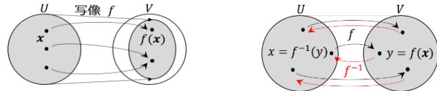

ある集合の全ての元それぞれをある集合の一意な元に対応させる規則のことを**写像**(mapping)という。集合  $U$  の元を集合  $V$  の元に写す写像を  $f$  とする（上図左）。これを  $f: U \rightarrow V$  と書き、また特に元  $x \in U$  が  $f(x) \in V$  に写されることを  $f: x \mapsto f(x)$  とも書く。関数と同様に  $f(x)$  は一意に定まり（つまり 1 対多の対応はダメ）任意の  $x \in U$  に対して  $f(x) \in V$  となること（つまり「定義域」は  $U$  全体、「値域」は  $V$  の一部でも可）に注意。写像が 1 対 1 で「値域」が  $V$  全体の場合（上図右）逆向きの写像が定まる。これを**逆写像**といい  $f^{-1}$  で表す。

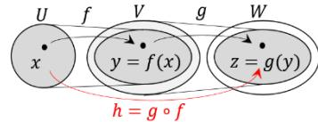

● 合成写像

写像  $f: U \ni x \mapsto y = f(x) \in V, g: V \ni y \mapsto z = g(y) \in W$  に対し（上図）、 $U$  から  $W$  への写像  $h: U \ni x \mapsto z \in W$  を  $z = g(f(x))$  と定義し、これを  $h = g \circ f$  と書いて  $f, g$  の**合成写像**という。合成写像  $h = g \circ f$  の  $f, g$  がそれぞれ逆写像をもつとき（右図）その合成は  $h^{-1} = (g \circ f)^{-1} = f^{-1} \circ g^{-1}$  となることに注意。

● 線形写像

ベクトル空間  $U \rightarrow V$  への写像  $f$  (ベクトルをベクトルに写す写像) が  $\forall x, y \in U, \forall k \in \mathbb{R}$  に対し  $f(x + y) = f(x) + f(y), f(kx) = kf(x)$  (5 - 5 - 1) を満たすとき、この写像を**線形写像**という。定義より  $f(x)$  もベクトルである。特にベクトル空間  $U, V$  が同じベクトル空間である場合、この線形写像のことを**線形変換**ともいう。この線形写像（および線形変換）自体は、ベクトルと同様に基底の取り方に依らない概念であることに注意。

**[5-5-2] ベクトルの列ベクトルによる表示**

任意のベクトルは ある基底の線形結合として表すことができ、列ベクトルはこの係数の組を各成分として縦に並べて表したものであり、逆に列ベクトルの各成分による基底の線形結合の結果が元の（基底に依らない）ベクトルとなると考えることができる。このことを定式化してみよう。

 $n$  次元ベクトル空間  $U$  の任意の元であるベクトル  $x$  が、 $U$  の任意の基底  $B = \{b_i\}$  ( $b_i$  の集合)

の線形結合として  $x = \sum_{i=1}^n b_i x_i^B$  と表されているとき47、この係数  $x_i^B$  を用いて

ベクトル  $x$  の基底  $\{b_i\}$  に対する列ベクトル表示  $x_B = \begin{bmatrix} x_1^B \\ \vdots \\ x_n^B \end{bmatrix} \in \mathbb{R}^n$  を得る。

逆に基底  $\{b_i\}$  の各ベクトルを各成分にもつ「行ベクトル」( $b_1 \cdots b_n$ ) と列ベクトル  $x_B$  との積として以下のように基底の線形結合としてのベクトル  $x$  を得る。

$$x = (b_1 \cdots b_n) x_B = (b_1 \cdots b_n) \begin{bmatrix} x_1^B \\ \vdots \\ x_n^B \end{bmatrix} = \sum_{i=1}^n b_i x_i^B \in U \quad (5-5-2)$$

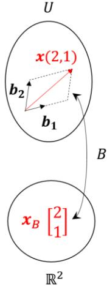

(ここで  $x_i^B$  の右肩および  $x_B$  の右下の  $B$  は基底  $B$  に対する表示を示し、また「 $U$  上のベクトルを成分に持つ行ベクトル」として小括弧を用いている48。)

以上により列ベクトル  $x_B$  は  $U$  上のベクトル  $x$  の基底  $B = \{b_i\}$  に対する  $\mathbb{R}^n$  上での表示となる。

### [5-5-3] ベクトルの組の行列による表示

 $n$  次元ベクトル空間  $U$  の任意の  $n$  本のベクトル  $a_j$  ( $j = 1, 2, \dots, n$ ) の組の表示を考える。各  $a_j$  が  $U$  の任意の基底  $B = \{b_i\}$  の線形結合として  $a_j = \sum_{i=1}^n b_i a_{ij}^B$  と表されているとき、この係数  $a_{ij}^B$  を用いてベクトル  $a_j$ 

の基底  $\{b_i\}$  に対する列ベクトル表示  $a_j = (b_1 \cdots b_n) \begin{bmatrix} a_{1j}^B \\ \vdots \\ a_{nj}^B \end{bmatrix} = (b_1 \cdots b_n) a_{jB}$ 

を得る。この列ベクトル表示を横に並べることでベクトルの組  $\{a_j\}$  を各成分にもつ「行ベクトル」( $a_1 \cdots a_n$ ) (基底という意味ではない) として

$$(a_1 \cdots a_n) = (b_1 \cdots b_n) \begin{bmatrix} a_{11}^B & \cdots & a_{1n}^B \\ \vdots & \ddots & \vdots \\ a_{n1}^B & \cdots & a_{nn}^B \end{bmatrix} = (b_1 \cdots b_n) A_B \quad (5-5-3)$$

と書けることになり、これはベクトルの組  $\{a_j\}$  の基底  $\{b_i\}$  に対する行列  $A_B$  による表示と解釈できる。このベクトルの組  $\{a_j\}$  の線形独立性と表示行列  $A_B$  の正則性には以下の関係がある。

- ● ベクトルの組  $\{a_j\}$  が線形独立  $\Leftrightarrow$  その表示行列  $A_B$  が正則  $(5-5-4)$
- $\{a_j\}$  の線形結合  $\sum_{j=1}^n c_j a_j = 0$  は  $a_j = \sum_{i=1}^n b_i a_{ij}^B$  より  $\sum_{i,j=1}^n b_i a_{ij}^B = 0$  と書け  $\{b_j\}$  は線形独立なので  $\sum_{j=1}^n a_{ij}^B c_j = 0$  すなわち  $A_B c = 0$  となり (5-3-9):(i)  $\Leftrightarrow$  (iii)((iv)ではない)より示された。■

なお本項の話で  $\{a_j\}$  を基底  $\{b_i\}$  自身とした場合を考えると基底  $\{b_i\}$  の基底  $\{b_i\}$  に対する表示行列は単位行列となり、表示された列ベクトルの組は常に  $\mathbb{R}^n$  の「標準基底」となることがわかる。

47 線形結合の係数である成分を基底であるベクトルの右に書くのには理由があり、すぐあとでわかる

48 これらの表記法は特に一般的なものではない。また本節以外で特に必要でない場合は省略される。

**[5-5-4] 線形変換の行列による表示**

 $n$  次元ベクトル空間  $U$  の任意の元  $x$  がある線形変換  $f: U \rightarrow U$  で

$$\mathbf{y} = f(x) \quad (5-5-5)$$

に写されるとする。ベクトル  $x, \mathbf{y}$  を  $U$  の任意の基底  $B = \{\mathbf{b}_i\}$  に対する列ベクトルで表示すると

$$\mathbf{x} = (\mathbf{b}_1 \cdots \mathbf{b}_n) \mathbf{x}_B, \quad \mathbf{y} = (\mathbf{b}_1 \cdots \mathbf{b}_n) \mathbf{y}_B \quad (5-5-6)$$

となり、(5-5-6)式を (5-5-5)式に代入して以下のようになる。

$$(\mathbf{b}_1 \cdots \mathbf{b}_n) \mathbf{y}_B = f(\sum_{i=1}^n \mathbf{b}_i x_i^B) = \sum_{i=1}^n f(\mathbf{b}_i) x_i^B = (f(\mathbf{b}_1) \cdots f(\mathbf{b}_n)) \mathbf{x}_B \quad (5-5-7)$$

 $n$  本のベクトルの組である  $f(\mathbf{b}_j)$  は基底  $\{\mathbf{b}_i\}$  に対する行列で表示でき

$$f(\mathbf{b}_j) = \sum_{i=1}^n \mathbf{b}_i a_{ij}^B \quad \text{or} \quad (f(\mathbf{b}_1) \cdots f(\mathbf{b}_n)) = (\mathbf{b}_1 \cdots \mathbf{b}_n) A_B \quad (5-5-8)$$

これを (5-5-7)式に代入して  $(\mathbf{b}_1 \cdots \mathbf{b}_n) \mathbf{y}_B = (\mathbf{b}_1 \cdots \mathbf{b}_n) A_B \mathbf{x}_B$  となり、

基底  $\{\mathbf{b}_i\}$  は線形独立なので以下を得る。

$$\mathbf{y}_B = A_B \mathbf{x}_B \quad \text{or} \quad y_i^B = \sum_{j=1}^n a_{ij}^B x_j^B \quad (5-5-9)$$

以上により行列  $A_B$  は  $U$  上の線形変換  $f$  の基底  $B = \{\mathbf{b}_i\}$  に対する

 $\mathbb{R}^{n \times n}$  上での表示と解釈できる。またこのことはベクトル空間の公理を

満たすベクトル空間の元が線形変換 (写像) されるとき、どんなもの

でも行列 (および列ベクトル) で表示できることを意味する。

例として本講第 2 節での線形変換  $\mathbf{y} = Ax$  について考察しよう。この  $\mathbf{y} = Ax$  は、あるベクトル空間  $U$  の標準基底  $E = \{\mathbf{e}_i\}$  に対し表示された  $\mathbf{y}_E = A_E \mathbf{x}_E$  のことだと解釈でき、 $\mathbf{x}_E, \mathbf{y}_E$  として表示された  $U$  のベクトル  $x, \mathbf{y}$  は  $x = (\mathbf{e}_1 \cdots \mathbf{e}_n) \mathbf{x}_E, \mathbf{y} = (\mathbf{e}_1 \cdots \mathbf{e}_n) \mathbf{y}_E$  のことであり、また行列  $A_E$  として表示された線形変換  $f$  は

$$f(\mathbf{e}_j) = \sum_{i=1}^n \mathbf{e}_i a_{ij}^E = (\mathbf{e}_1 \cdots \mathbf{e}_n) \mathbf{a}_{jE} \quad \text{or} \quad (f(\mathbf{e}_1) \cdots f(\mathbf{e}_n)) = (\mathbf{e}_1 \cdots \mathbf{e}_n) A_E$$

を満たすものであると考えることができる。

実際、基底  $\mathbf{e}_j$  が写る先を  $\mathbf{e}'_j = f(\mathbf{e}_j)$  として  $\mathbf{e}'_j = \sum_{i=1}^n \mathbf{e}_i a_{ij}^E$  と書くと (5-5-9)式との違いが、基底を写す(5-2-4)式と座標値の変換 (5-2-1)式との違いに相当する。また(5-5-7)式に相当する

 $\mathbf{y} = (f(\mathbf{e}_1) \cdots f(\mathbf{e}_n)) \mathbf{x}_E = (\mathbf{e}'_1 \cdots \mathbf{e}'_n) \mathbf{x}_E$  は、変換先の点を表す  $\mathbf{y}$  は変換元の座標系での座標値 ( $\mathbf{x}_E$ ) を座標値とした  $\mathbf{e}'_j$  が張る座標系により示される点であることを示している。さらに行列の各列ベクトルが  $\mathbf{e}'_j$  の基底  $\{\mathbf{e}_j\}$  に対する表示になるということに相当している。

注意すべきは、基底が写る先  $\mathbf{e}'_j = f(\mathbf{e}_j)$  の組は必ずしも線形独立になるとは限らないという点であり、(5-5-4)より  $f(\mathbf{e}_j)$  の組の線形独立性と表示行列  $A_E$  の正則性が同値となる。基底が写る先が線形独立であれば、逆変換として元の基底をその線形結合で表すことができ、その表示が逆行列となる。式で書くと  $(\mathbf{e}'_1 \cdots \mathbf{e}'_n) = (\mathbf{e}_1 \cdots \mathbf{e}_n) A_E$  に対して逆に  $(\mathbf{e}_1 \cdots \mathbf{e}_n) = (\mathbf{e}'_1 \cdots \mathbf{e}'_n) C$  と表せて、これに先の式を代入すると  $(\mathbf{e}_1 \cdots \mathbf{e}_n) = (\mathbf{e}_1 \cdots \mathbf{e}_n) A_E C$  より  $A_E C = E$  つまり  $C = A_E^{-1}$  となる。

**[5-5-5] 基底の変換と座標変換**

に対する列ベクトル  $x_B, x_C$  として、それぞれ

$$x = (b_1 \cdots b_n)x_B = (c_1 \cdots c_n)x_C \quad (5-5-10)$$

と表されているとする。 $\{c_i\}$  は  $n$  本のベクトルの組なので (5-5-3) 式の

ように基底  $\{b_i\}$  に対する行列で表示することができ、

$$(c_1 \cdots c_n) = (b_1 \cdots b_n)P_{B \rightarrow C} \quad \text{or} \quad c_j = \sum_{i=1}^n b_i p_{ij}^{B \rightarrow C} \quad (5-5-11)$$

と書ける。この  $P_{B \rightarrow C}$  を**基底の変換行列**という。

これを (5-5-10)に代入して  $x_B = P_{B \rightarrow C}x_C$  となる。変換の向きが異なるこ

とに注意。基底はそれぞれ線形独立なので (5-5-4)より  $P_{B \rightarrow C}$  は正則

行列となり逆行列を用いて

$$x_C = P_{B \rightarrow C}^{-1}x_B \quad \text{or} \quad x_i^C = \sum_{j=1}^n p_{ij}^{-1}x_j^B \quad (5-5-12)$$

を得る。この式を基底の変換に伴う座標変換という。

例)  $(c_1 \ c_2) = (b_1 \ b_2) \begin{bmatrix} 2 & 1 \\ 1 & 1 \end{bmatrix}, \quad x = 3b_1 + 2b_2 : x_B = \begin{bmatrix} 3 \\ 2 \end{bmatrix}$ 

$$\rightarrow x_C = \begin{bmatrix} 2 & 1 \\ 1 & 1 \end{bmatrix}^{-1} \begin{bmatrix} 3 \\ 2 \end{bmatrix} = \begin{bmatrix} 1 & -1 \\ -1 & 2 \end{bmatrix} \begin{bmatrix} 3 \\ 2 \end{bmatrix} = \begin{bmatrix} 1 \\ 1 \end{bmatrix}$$

この座標変換を線形変換のときの座標値の変換(5-5-9)式と混同しない

よう注意。線形変換の方は  $U$  上のベクトル自体の変換を同じ基底に対

して表示した結果であるのに対し、座標変換は  $U$  上のある同じベクトルの異なる基底に対する

(異なる  $\mathbb{R}^n$  上での) 表示間の変換（つまり異なる座標系で同じモノを見た結果間の変換）という

根本的な違いがある。基底の変換により、ある同じベクトルの表示である列ベクトルが変換を受け

たように、ある同じ線形変換の表示行列も基底を変換すると変換される。詳しくみてみよう。

**[5-5-6] 線形変換に対する基底の変換と表示行列の変換**

 $n$  次元ベクトル空間  $U$  上のベクトルの線形変換  $f: x \mapsto y = f(x)$ 

の 2 組の基底  $B = \{b_i\}, C = \{c_i\}$  に対する表示行列を  $F_B, F_C$ 

基底の変換行列を  $(c_1 \cdots c_n) = (b_1 \cdots b_n)P_{B \rightarrow C}$  としたとき変換後の

ベクトル  $f(x)$  をそれぞれ表示する。基底と座標の変換を用いて

$$f(x) = (b_1 \cdots b_n)F_B x_B = (c_1 \cdots c_n)F_C x_C = (b_1 \cdots b_n)P_{B \rightarrow C} F_C x_C \\ = (b_1 \cdots b_n)P_{B \rightarrow C} F_C P_{B \rightarrow C}^{-1} x_B$$

と書けて、**表示行列の変換**  $F_B = P_{B \rightarrow C} F_C P_{B \rightarrow C}^{-1}$  あるいは

$$F_C = P_{B \rightarrow C}^{-1} F_B P_{B \rightarrow C} \quad (5-5-13)$$

を得る。この関係は図からも読み取れる。

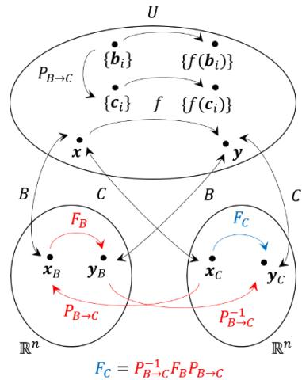

基底すなわち座標系は対象の系に対し最も都合が良いものを選ぶことができ、この表示行列の変換式により行列が単純になる基底があれば応用上重要となる。これは次講のテーマの一つとなる。

また (5-5-13) 式で両辺の行列式を求めると、 $|F_C| = |P_{B \rightarrow C}^{-1} F_B P_{B \rightarrow C}| = |P_{B \rightarrow C}^{-1}| |F_B| |P_{B \rightarrow C}|$  となるが (5-3-6) より  $|P_{B \rightarrow C}^{-1}| = 1/|P_{B \rightarrow C}|$  がいえて、 $|F_C| = |F_B|$  となる。つまり行列式の値は基底の取り方に依らず、表示元である線形変換  $f$  に固有な量を表す重要な量であることがわかる。

**[5-5-7] 線形変換と座標変換 (Active と Passive)**

線形変換による座標値の変換と、基底の変換による座標変換の形式的な類似を利用して、線形変換の結果に相当する座標変換を考えよう。 [5-5-5] 項より座標変換の変換行列は基底の変換行列の逆行列となるので、変換先の基底は実現したい線形変換  $f$  の逆変換による変換先の組  $\{\mathbf{b}'_i = f^{-1}(\mathbf{b}_i)\}$  とする。そうすれば基底の変換行列は  $f$  の基底  $B$  に対する表示行列  $F_B$  の逆行列  $F_B^{-1}$  となり

$$(\mathbf{b}'_1 \cdots \mathbf{b}'_n) = (\mathbf{b}_1 \cdots \mathbf{b}_n) F_B^{-1} \quad (5-5-14)$$

と書け、このときの座標変換は

$$\mathbf{x}_{B'} = F_B \mathbf{x}_B \quad (5-5-15)$$

と書けることになる。線形変換が実際にベクトルを変換するため **Active** な変換、基底の変換に伴う座標変換ではベクトル自体は実際には変換されないため

**Passive** な変換と区別することがある。混同しないよ

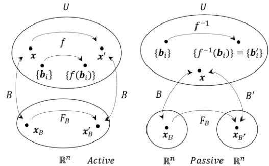

う改めて注意。例として左図の 2 次元の回転を考えよう。ベクトル  $\mathbf{x}$  の線形変換  $f$  による  $\mathbf{x}'$  への  $\frac{\pi}{2}$  回転を基底  $\{\mathbf{b}_1, \mathbf{b}_2\}$  で表示すれば

$$\mathbf{x}'_B = F_B \mathbf{x}_B: \begin{bmatrix} 1 \\ 1 \end{bmatrix} = \begin{bmatrix} 0 & -1 \\ 1 & 0 \end{bmatrix} \begin{bmatrix} 1 \\ -1 \end{bmatrix} \text{ (Active) となる。これを線形変換 } f \text{ の逆変換}$$

$$f^{-1} \text{ による基底変換} (\mathbf{b}'_1 \ \mathbf{b}'_2) = (\mathbf{b}_1 \ \mathbf{b}_2) F_B^{-1} = (\mathbf{b}_1 \ \mathbf{b}_2) \begin{bmatrix} 0 & 1 \\ -1 & 0 \end{bmatrix} = (-\mathbf{b}_2 \ \mathbf{b}_1)$$

(この座標変換で表せば  $\mathbf{x}_{B'} = F_B \mathbf{x}_B: \begin{bmatrix} 1 \\ 1 \end{bmatrix} = \begin{bmatrix} 0 & -1 \\ 1 & 0 \end{bmatrix} \begin{bmatrix} 1 \\ -1 \end{bmatrix}$  (Passive) となる。混同しないこと！

**[5-5-8] 合成変換の行列による表示**

 $n$  次元ベクトル空間  $U$  上のベクトルの線形変換  $f: \mathbf{x} \mapsto \mathbf{y} = f(\mathbf{x})$ ,  $g: \mathbf{y} \mapsto \mathbf{z} = g(\mathbf{y})$  の基底  $B = \{\mathbf{b}_i\}$  に対する行列表示が  $F_B, G_B$  のとき、合成変換  $h = g \circ f$  の表示行列  $H_B$  を  $F_B, G_B$  で表さう。 $g \circ f: \mathbf{x} \mapsto \mathbf{z} = g(f(\mathbf{x}))$  において  $(\mathbf{b}_1 \cdots \mathbf{b}_n) \mathbf{y}_B = (\mathbf{b}_1 \cdots \mathbf{b}_n) F_B \mathbf{x}_B$  より  $\mathbf{y}_B = F_B \mathbf{x}_B$  が言えて、これを  $(\mathbf{b}_1 \cdots \mathbf{b}_n) \mathbf{z}_B = (\mathbf{b}_1 \cdots \mathbf{b}_n) G_B \mathbf{y}_B$  に代入して  $(\mathbf{b}_1 \cdots \mathbf{b}_n) \mathbf{z}_B = (g \circ f)(\mathbf{x}) = (\mathbf{b}_1 \cdots \mathbf{b}_n) G_B F_B \mathbf{x}_B$  となり以下を得る。

$$\mathbf{z}_B = H_B \mathbf{x}_B, \quad H_B = G_B F_B \quad (5-5-16)$$

このように合成変換の同じ基底に対する表示行列は、各変換の表示行列の変換順での積となる。

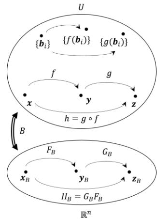

このとき、合成される 2 回目以降の変換について注意が必要で、本講第 2 節の図 5-2-5 のように「回転」と続く「せん断」の合成変換の場合、せん断変換で平行にずらされる方向は回転しても変わらず横 ( $x_1$  軸) 方向のままになっている (実際に図を見て欲しい)。一方で「せん断」が先でその後「回転」の場合 (図 5-2-6) は、せん断で横方向にずらされた状態で全体が回転される。この後者の合成変換 (変換順が逆) の結果は、前者の合成変換でせん断のずらされる方向が回転後の軸とした場合とも解釈できるがこのことは偶然だろうか？ 2 回目以降の変換において、変換固有の向き (例えば 3 次元回転の回転軸なども考えられる) を 1 回目の変換に伴い変えさせたい場合はどう

すればよいのだろうか？ 実現したい変換は図のように 2 回目の変換  $g$  を 1 回目の変換  $f$  の逆変換後の基底として見た変換と考えることができるので、Passive 変換

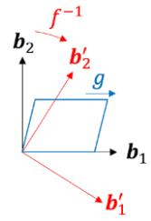

により行うのが自然ともいえる。1 回目・2 回目の基底変換と伴う座標変換は

$$(\mathbf{b}'_1 \cdots \mathbf{b}'_n) = (\mathbf{b}_1 \cdots \mathbf{b}_n) F_B^{-1}, \mathbf{x}_{B'} = F_B \mathbf{x}_B \text{ と } (\mathbf{b}''_1 \cdots \mathbf{b}''_n) = (\mathbf{b}'_1 \cdots \mathbf{b}'_n) G_{B'}^{-1}, \mathbf{x}_{B''} = G_{B'} \mathbf{x}_{B'}$$

と書け、このときの  $G_{B'}$  は基底  $B'$  による表示すなわち 1 回目の基底変換に伴う行

列の変換であり (5-5-13)式で  $P_{B \rightarrow C} = F_B^{-1}$  にあたる  $G_{B'} = F_B G_B F_B^{-1}$  となる。これにより以下の合成変換を得る。

$$\mathbf{x}_{B''} = H_B \mathbf{x}_B, H_B = G_{B'} F_B \quad (G_{B'} = F_B G_B F_B^{-1}) \quad (5-5-17)$$

このとき基底の変換は実現したい座標変換の逆変換なので、その合成変換としては基底の逆変換の

合成  $h^{-1} = g^{-1} \circ f^{-1} = (f \circ g)^{-1}$  なる変換となり、相当する

線形変換(Active)は  $h = f \circ g$  と変換の順序が逆なので、その

表示行列は  $F_B G_B$  となることに注意を要する。このことは

(5-5-13)式にあたる行列の変換式  $G_{B'} = F_B G_B F_B^{-1}$  より

 $G_{B'} F_B = F_B G_B$  が言えることからもわかる。先に考察した線形

変換での回転とせん断の合成変換での変換順を逆にした結果と

解釈できた「からくり」が理解できただろうか。もっと具体例

等を知りたい人は 第 7 講 回転の表現 I 第 2・3 節で 3 次元の

回転にこの方法を応用するのでそちらも参照して頂きたい。

**【5-6】 [▼C]付録 1 : Levi-Civita 記号の積の性質**

宿題となっていた第 3 講 (3-7-5) 式である  $\sum_{i=1}^3 \varepsilon_{ijk} \varepsilon_{imn} = \delta_{jm} \delta_{kn} - \delta_{jn} \delta_{km}$  の導出を行う。

3 次元の列ベクトルの組  $\mathbf{a}, \mathbf{b}, \mathbf{c}$  および  $\mathbf{x}, \mathbf{y}, \mathbf{z}$  が成す 3 次正方行列の行列式において、転置行列の行列式は元の行列式と等しいこと、行列の積の行列式は行列式の積に等しいことにより

$$\begin{bmatrix} a_1 & b_1 & c_1 \\ a_2 & b_2 & c_2 \\ a_3 & b_3 & c_3 \end{bmatrix} \begin{bmatrix} x_1 & y_1 & z_1 \\ x_2 & y_2 & z_2 \\ x_3 & y_3 & z_3 \end{bmatrix} = \begin{bmatrix} a_1 & a_2 & a_3 \\ b_1 & b_2 & b_3 \\ c_1 & c_2 & c_3 \end{bmatrix} \begin{bmatrix} x_1 & y_1 & z_1 \\ x_2 & y_2 & z_2 \\ x_3 & y_3 & z_3 \end{bmatrix} = \begin{bmatrix} \mathbf{a} \cdot \mathbf{x} & \mathbf{a} \cdot \mathbf{y} & \mathbf{a} \cdot \mathbf{z} \\ \mathbf{b} \cdot \mathbf{x} & \mathbf{b} \cdot \mathbf{y} & \mathbf{b} \cdot \mathbf{z} \\ \mathbf{c} \cdot \mathbf{x} & \mathbf{c} \cdot \mathbf{y} & \mathbf{c} \cdot \mathbf{z} \end{bmatrix} \quad (5-6-1)$$

が成り立つ。ここで標準基底  $\{\mathbf{e}_i\}$  において  $D(\mathbf{e}_i, \mathbf{e}_j, \mathbf{e}_k) = \varepsilon_{ijk}$  と上式より、以下が成り立つ。

$$\varepsilon_{ijk} \varepsilon_{lmn} = D(\mathbf{e}_i, \mathbf{e}_j, \mathbf{e}_k) D(\mathbf{e}_l, \mathbf{e}_m, \mathbf{e}_n) = \begin{bmatrix} \mathbf{e}_i \cdot \mathbf{e}_l & \mathbf{e}_i \cdot \mathbf{e}_m & \mathbf{e}_i \cdot \mathbf{e}_n \\ \mathbf{e}_j \cdot \mathbf{e}_l & \mathbf{e}_j \cdot \mathbf{e}_m & \mathbf{e}_j \cdot \mathbf{e}_n \\ \mathbf{e}_k \cdot \mathbf{e}_l & \mathbf{e}_k \cdot \mathbf{e}_m & \mathbf{e}_k \cdot \mathbf{e}_n \end{bmatrix} = \begin{bmatrix} \delta_{il} & \delta_{im} & \delta_{in} \\ \delta_{jl} & \delta_{jm} & \delta_{jn} \\ \delta_{kl} & \delta_{km} & \delta_{kn} \end{bmatrix} \quad (5-6-2)$$

$$= \delta_{il} \delta_{jm} \delta_{kn} + \delta_{im} \delta_{jn} \delta_{kl} + \delta_{in} \delta_{jl} \delta_{km} - \delta_{il} \delta_{jn} \delta_{km} - \delta_{im} \delta_{jl} \delta_{kn} - \delta_{in} \delta_{jm} \delta_{kl} \quad (5-6-3)$$

(5-6-3)式において  $l = i$  として和をとると、以下のように求める式を得る。

$$\begin{aligned} \sum_{i=1}^3 \varepsilon_{ijk} \varepsilon_{imn} &= \sum_{i=1}^3 (\delta_{ii} \delta_{jm} \delta_{kn} + \delta_{im} \delta_{jn} \delta_{ki} + \delta_{in} \delta_{ji} \delta_{km} - \delta_{ii} \delta_{jn} \delta_{km} - \delta_{im} \delta_{ji} \delta_{kn} - \delta_{in} \delta_{jm} \delta_{ki}) \\ &= 3 \delta_{jm} \delta_{kn} + \delta_{jn} \delta_{km} + \delta_{jn} \delta_{km} - 3 \delta_{jn} \delta_{km} - \delta_{jm} \delta_{kn} - \delta_{jm} \delta_{kn} = \delta_{jm} \delta_{kn} - \delta_{jn} \delta_{km} \blacksquare \end{aligned}$$

なお、(5-6-2)式はその導き方により n 次においても同様に成り立つことがわかる。

$$\varepsilon_{i_1 \cdots i_n} \varepsilon_{j_1 \cdots j_n} = \begin{bmatrix} \delta_{i_1 j_1} & \cdots & \delta_{i_1 j_n} \\ \vdots & \ddots & \vdots \\ \delta_{i_n j_1} & \cdots & \delta_{i_n j_n} \end{bmatrix} \quad (5-6-4)$$

**【5-7】 付録 2 : 複素数の行列による表現**

2次の回転行列  $\begin{bmatrix} \cos \theta & -\sin \theta \\ \sin \theta & \cos \theta \end{bmatrix}$  において  $\theta = \pi/2$  とした行列  $I = \begin{bmatrix} 0 & -1 \\ 1 & 0 \end{bmatrix}$  に対して、単位行列  $E$  との線形結合である行列  $Z = xE + yI$  ( $x, y \in \mathbb{R}$ ) を考えよう (以下登場人物は全員が実数)。

 $Z = \begin{bmatrix} x & -y \\ y & x \end{bmatrix}$  であり、 $Z = 0$  となるのは  $x = y = 0$  のときのみで  $E$  と  $I$  は線形独立となる。

$$Z_1 = x_1 E + y_1 I, \quad Z_2 = x_2 E + y_2 I$$

とすると、和は

$$Z_1 + Z_2 = (x_1 + x_2)E + (y_1 + y_2)I$$

となり、積は  $E^2 = E$ ,  $IE = I$ ,  $EI = I$ ,  $I^2 = \begin{bmatrix} -1 & 0 \\ 0 & -1 \end{bmatrix} = -E$  より

$$Z_1 Z_2 = (x_1 E + y_1 I)(x_2 E + y_2 I) = (x_1 x_2 - y_1 y_2)E + (x_1 y_2 + y_1 x_2)I = Z_2 Z_1$$

となる。また

$$E^T = E, I^T = -I \quad \text{および} \quad Z^T = \begin{bmatrix} x & y \\ -y & x \end{bmatrix} = xE^T + yI^T = xE - yI$$

となり、 $ZZ^T = (x^2 + y^2)E = Z^T Z$  となるので

$$\|Z\|^2 E = ZZ^T \quad (\|Z\| = \sqrt{x^2 + y^2})$$

として自然なノルム  $\|Z\|$  ( $\|Z\| = 0 \Leftrightarrow Z = 0$ ) が定義できる。よって  $Z \neq 0$  のとき

$$Z \left( \frac{1}{\|Z\|^2} Z^T \right) = \left( \frac{1}{\|Z\|^2} Z^T \right) Z = E$$

となり 逆元

$$Z^{-1} = \frac{1}{\|Z\|^2} Z^T$$

が定まる (実際、行列式  $|Z| = x^2 + y^2 = \|Z\|^2$ 、余因子行列  $\tilde{Z} = Z^T$  より確かに逆行列となる)。

また  $\cos \theta = \frac{x}{\sqrt{x^2 + y^2}}$ ,  $\sin \theta = \frac{y}{\sqrt{x^2 + y^2}}$  と書け、ノルムの定義から  $Z = \|Z\|(\cos \theta E + \sin \theta I) = \|Z\| \begin{bmatrix} \cos \theta & -\sin \theta \\ \sin \theta & \cos \theta \end{bmatrix}$  となり、大きさ 1 の  $Z$  を掛けることは  $\theta$  回転させることに相当する。  
(つまり  $Z$  はノルムで正規化すると回転行列となる)。

というわけで、対比表としてまとめると

|     | 基底/元                   | 共役                                   | 和                                         | 積                                               | ノルム                                                                                     | 逆元                                                 | 極形式                                        |
|-----|------------------------|--------------------------------------|-------------------------------------------|-------------------------------------------------|-----------------------------------------------------------------------------------------|----------------------------------------------------|--------------------------------------------|
| 複素数 | $1, i$ $z = x + iy$ | $\bar{i} = -i$ $\bar{z} = x - iy$ | $z_1 + z_2 = (x_1 + x_2) + i(y_1 + y_2)$  | $1^2 = 1$ $1i = i$ $i1 = i$ $i^2 = -1$ | $ z ^2 = z\bar{z}$ $ z  = \sqrt{x^2 + y^2}$ $( z  = 0 \Leftrightarrow z = 0)$     | $z^{-1} = \frac{1}{ z ^2} \bar{z}$ $(z \neq 0)$ | $z =  z (\cos \theta + i \sin \theta)$     |
| 行列  | $E, I$                 | $I^T = -I$                           | $Z_1 + Z_2 = (x_1 + x_2)E + (y_1 + y_2)I$ | $E^2 = E$ $EI = I$ $IE = I$ $I^2 = -E$ | $\ Z\ ^2 E = ZZ^T$ $\ Z\  = \sqrt{x^2 + y^2}$ $(\ Z\  = 0 \Leftrightarrow Z = 0)$ | $Z^{-1} = \frac{1}{\ Z\ ^2} Z^T$ $(Z \neq 0)$   | $Z = \ Z\ (\cos \theta E + \sin \theta I)$ |

表 5-6-1

つまり、 $Z = xE + yI$  は  $E, I$  を実数/虚数単位、転置を共役とみなすことで、複素数  $z = x + iy$  と同一視できることになる。おもしろいよね。(次講の付録で、もう一列追加されます・・・)