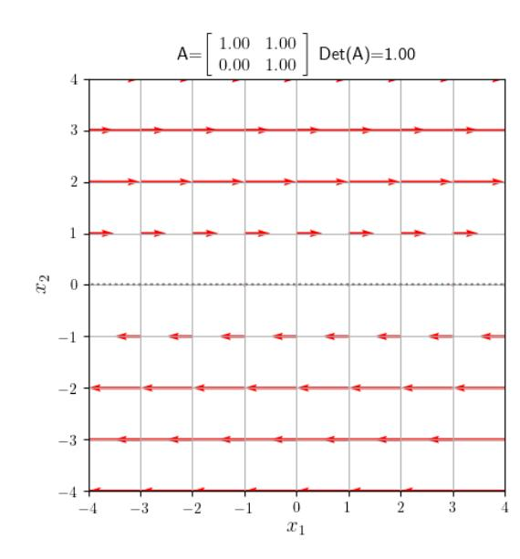

# **【第 6 講】行列 III:固有値・対角化**

## **【6-1】はじめに**

前講では線形変換を表す行列についてみてきた。ベクトル空間の各点は線形変換により別の点に写されるが、その写り方を点の「向きの流れ」として可視化して見てみることで、変換を示す行列によっては各点の写り方が原点を通るある軸に沿って「流れ」ていることがわかり、その行列に固有な特徴を示しているとみることができる。さらに n 次の行列に対し n 本の線形独立な上記の軸が得られる場合は、基底をその軸の組に変換することで変換された表示行列が単純な形になるという、理工系の諸分野で応用上重要となる性質を学ぶ。また最後の節で簡単な応用事例をいくつかみてみよう。

# **【6-2】固有ベクトルと固有値**

### **[6-2-1] 線形変換の点の「向きの流れ」**

右図は2次の線形変換  $\begin{bmatrix} y_1 \\ y_2 \end{bmatrix} = \begin{bmatrix} 3/2 & 1 \\ 1/2 & 1 \end{bmatrix} \begin{bmatrix} x_1 \\ x_2 \end{bmatrix}$  において、各点  $(x_1, x_2)$  の変換先を表すベクトルを（そのままでは図が見づらくなるので縮めて）描くことで、変換による点の動きの「向きの流れ」を可視化したものである。観察するとおおまかな流れとしては、左上・右下から原点を通る直線（ $x_2 = -x_1$ ：図の点線）に沿って入ってきて原点を通る右上がりの直線（ $x_2 = \frac{1}{2}x_1$ ：図の点線）に突き当たり、その直線に沿って右上・左下に流れ出るような振る舞いをしていることがわかる。

下の図は別の例として せん断を表す行列  $\begin{bmatrix} 1 & 1 \\ 0 & 1 \end{bmatrix}$  の場合であり、原点を通る横軸（図の点線）に平行に流れ、横軸を境に上半分は右側に下半分は左側に流れている。この横軸上の点以外の全ての点は横に移動するので、原点を通る向きを変えない直線は、この横軸のみとなる。

上記いずれの例の場合も流れを分ける軸（図の点線）
上の点は、原点からの向きを変えない変換を受けていることになる。
あと２つ別の例をあげよう。

左図は行列が  $\begin{bmatrix} 2 & 0 \\ 0 & 2 \end{bmatrix}$  の例で、この場合は特殊であり、原点を通る全ての直線は向きを変えない変換を受けることになる。従って該当する直線は無数にあるが、それらが 2 次元空間をなすので、線形独立な 2 本の直線を代表として図には点線で示している。

また右図は行列が  $\begin{bmatrix} \cos \theta & -\sin \theta \\ \sin \theta & \cos \theta \end{bmatrix}$  である回転行列の  $\theta = \pi/8$  の場合で、これも特殊で回転なので原点を通る全ての直線が向きを変える変換を受けることになる。従って「向きを変えない」に該当する直線は存在しない。これらの例を踏まえて考察してみよう。

**[6-2-2] 固有ベクトル・固有値と固有方程式**

一般に原点を通る直線はその向きを表すベクトル  $b$  のスカラー積  $kb$  として表され、線形変換  $c = Ab$  により原点を通る直線  $kc$  に写される。従って一般的には原点を通る直線はその向きを変えることになるが、前項の 2 次の例でみたように変換によってはその向きが変わらない直線も存在する。この場合その直線上の点 ( $kb$ ) は一般に同じ直線上の別の点 ( $kb$  に平行な  $kc$ ) に写されることになるが、原点からの距離として直線上の変位を考えるとその比率  $(\frac{\|kc\|}{\|kb\|})$  は一定  $(\frac{\|c\|}{\|b\|})$  となる。この変換により不変となる「向き」と、その向きにおける変位 (伸び・縮み) の「比率」は、その線形変換を特徴づけるものと考えられる。不変となる「向き」を表すベクトルを**固有ベクトル**といい、固有ベクトル上の点の変位の「比率」を**固有値**という。このことを定式化しよう。

 $n$  次の線形変換の表示行列を  $A$ , 固有ベクトルを示す列ベクトルを  $u$ , 固有値を  $\lambda$  とする。

 $Au$  として変換された  $u$  は、向きが変わらず長さの比が一定である  $\lambda$  倍となるので、

$$Au = \lambda u \quad (6-2-1)$$

を満たす。この式は自明な解  $u = 0$  を持つが、これはどのような  $A$  や  $\lambda$  であっても成り立ち何らの特徴を示すものでもないので、 $u = 0$  は固有ベクトルではないとしよう。式変形をして

$$(A - \lambda E)u = 0 \quad (6-2-2)$$

 $u = 0$  のみを得て固有ベクトルは存在しないことになるので、 $A'$  が正則でない：つまりその行列式の値が 0 となることが、固有ベクトルが存在するための  $\lambda$  に対する必要条件となる。よって

$$|A - \lambda E| = 0 \quad (6-2-3)$$
という式を考えることになる。この式を**固有方程式**（あるいは特性方程式）という。また左辺の行列式を展開すると  $\lambda$  についての  $n$  次多項式となり、この  $g(\lambda) = |A - \lambda E|$  を**固有多項式**という。

( $g(\lambda) = |\lambda E - A|$  と定義する場合も多い。次数により全体の符号が異なるだけでどちらでもよい。)

固有方程式は  $\lambda$  についての  $n$  次方程式となり、その解である固有値それぞれに対して (6-2-2) 式を満たす  $u$  を求めることになるが、この連立一次方程式である (6-2-2) 式はその行列式が 0 であり  $u$  は一意に定まらず不定解となることに注意。そもそもこれは (6-2-1) 式で解  $u$  を定数倍してもまた解となることに起因しており、 $u$  はその向きにのみ意味があり大きさは不定となるからである。これ以上の考察は後回しとして、まずは前項の例について実際に解いてみよう。

○例 1) 行列  $A = \begin{bmatrix} 3/2 & 1 \\ 1/2 & 1 \end{bmatrix}$  の場合：

固有方程式： $\begin{vmatrix} 3/2 - \lambda & 1 \\ 1/2 & 1 - \lambda \end{vmatrix} = 0$  を展開、整理して  $\lambda^2 - \frac{5}{2}\lambda + 1 = 0$  より  $\lambda = 2, \frac{1}{2}$  を得る。

(i)  $\lambda = 2$  のとき (6-2-2) 式は

$$\begin{bmatrix} 3/2 - 2 & 1 \\ 1/2 & 1 - 2 \end{bmatrix} \begin{bmatrix} u_1 \\ u_2 \end{bmatrix} = \begin{bmatrix} -1/2 & 1 \\ 1/2 & -1 \end{bmatrix} \begin{bmatrix} u_1 \\ u_2 \end{bmatrix} = \begin{bmatrix} 0 \\ 0 \end{bmatrix} \text{ となる。} \begin{bmatrix} -1/2 & 1 \\ 1/2 & -1 \end{bmatrix} \begin{bmatrix} 0 \\ 0 \end{bmatrix} \rightarrow \begin{bmatrix} -1/2 & 1 \\ 0 & 0 \end{bmatrix} \begin{bmatrix} 0 \\ 0 \end{bmatrix} r_2 + r_1 \rightarrow \begin{bmatrix} 1 & -2 \\ 0 & 0 \end{bmatrix} \begin{bmatrix} 0 \\ 0 \end{bmatrix} r_1 \times (-2) \text{ より } \begin{cases} u_1 = 2s \\ u_2 = s \end{cases} \quad (\forall s \in \mathbb{R}) \text{ となり } u = s \begin{bmatrix} 2 \\ 1 \end{bmatrix} \text{ を得る。}$$

(ii)  $\lambda = 1/2$  のとき

$$\begin{bmatrix} 3/2 - 1/2 & 1 \\ 1/2 & 1 - 1/2 \end{bmatrix} \begin{bmatrix} u_1 \\ u_2 \end{bmatrix} = \begin{bmatrix} 1 & 1 \\ 1/2 & 1/2 \end{bmatrix} \begin{bmatrix} u_1 \\ u_2 \end{bmatrix} = \begin{bmatrix} 0 \\ 0 \end{bmatrix} \text{ となる。} \begin{bmatrix} 1 & 1 \\ 1/2 & 1/2 \end{bmatrix} \begin{bmatrix} 0 \\ 0 \end{bmatrix} \rightarrow \begin{bmatrix} 1 & 1 \\ 0 & 0 \end{bmatrix} \begin{bmatrix} 0 \\ 0 \end{bmatrix} r_2 - r_1/2 \text{ より } \begin{cases} u_1 = -t \\ u_2 = t \end{cases} \quad (\forall t \in \mathbb{R}) \text{ となり } u = t \begin{bmatrix} -1 \\ 1 \end{bmatrix} \text{ を得る。}$$

(6-2-1) 式は、 $\begin{bmatrix} 3/2 & 1 \\ 1/2 & 1 \end{bmatrix} (s \begin{bmatrix} 2 \\ 1 \end{bmatrix}) = s \begin{bmatrix} 4 \\ 2 \end{bmatrix} = 2(s \begin{bmatrix} 2 \\ 1 \end{bmatrix})$  および  $\begin{bmatrix} 3/2 & 1 \\ 1/2 & 1 \end{bmatrix} (t \begin{bmatrix} -1 \\ 1 \end{bmatrix}) = t \begin{bmatrix} -1/2 \\ 1/2 \end{bmatrix} = 1/2(t \begin{bmatrix} -1 \\ 1 \end{bmatrix})$  として確かに満たされる。なおこの式は  $\begin{bmatrix} 3/2 & 1 \\ 1/2 & 1 \end{bmatrix} (s \begin{bmatrix} 2 \\ 1 \end{bmatrix} + t \begin{bmatrix} -1 \\ 1 \end{bmatrix}) = 2(s \begin{bmatrix} 2 \\ 1 \end{bmatrix}) + 1/2(t \begin{bmatrix} -1 \\ 1 \end{bmatrix})$  と、まとめて書ける。また図を改めてみると、固有ベクトル  $s \begin{bmatrix} 2 \\ 1 \end{bmatrix}$  上の点は 2 倍されて原点から遠ざかり、 $t \begin{bmatrix} -1 \\ 1 \end{bmatrix}$  上の点は 1/2 倍されて原点方向に近づくことが読み取れる。

○例 2) 行列  $A = \begin{bmatrix} 1 & 1 \\ 0 & 1 \end{bmatrix}$  の場合：

固有方程式： $\begin{vmatrix} 1 - \lambda & 1 \\ 0 & 1 - \lambda \end{vmatrix} = 0$  を展開して  $(\lambda - 1)^2 = 0$  より  $\lambda = 1$  (重解) を得る。

 $\lambda = 1$  (重解) のとき (6-2-2) 式は

$$\begin{bmatrix} 1 - 1 & 1 \\ 0 & 1 - 1 \end{bmatrix} \begin{bmatrix} u_1 \\ u_2 \end{bmatrix} = \begin{bmatrix} 0 & 1 \\ 0 & 0 \end{bmatrix} \begin{bmatrix} u_1 \\ u_2 \end{bmatrix} = \begin{bmatrix} 0 \\ 0 \end{bmatrix} \text{ より } u_2 = 0 \text{ となり、} u = s \begin{bmatrix} 1 \\ 0 \end{bmatrix} \quad (\forall s \in \mathbb{R}) \text{ を得る。}$$

(6-2-1) 式は、 $\begin{bmatrix} 1 & 1 \\ 0 & 1 \end{bmatrix} (s \begin{bmatrix} 1 \\ 0 \end{bmatrix}) = 1(s \begin{bmatrix} 1 \\ 0 \end{bmatrix})$  として確かに満たされる。また図を改めてみると、固有ベクトル  $s \begin{bmatrix} 1 \\ 0 \end{bmatrix}$  上の点は変換後も同じ座標値をとり、変換で不変な直線となることが読み取れる。

○例 3) 行列  $A = \begin{bmatrix} 2 & 0 \\ 0 & 2 \end{bmatrix}$  の場合 :

固有方程式 :  $\begin{vmatrix} 2-\lambda & 0 \\ 0 & 2-\lambda \end{vmatrix} = 0$  を展開して  $(\lambda-2)^2 = 0$  より  $\lambda = 2$  (重解) を得る。

 $\lambda = 2$  (重解) のとき (6-2-2) 式は

$$\begin{bmatrix} 2-2 & 0 \\ 0 & 2-2 \end{bmatrix} \begin{bmatrix} u_1 \\ u_2 \end{bmatrix} = \begin{bmatrix} 0 & 0 \\ 0 & 0 \end{bmatrix} \begin{bmatrix} u_1 \\ u_2 \end{bmatrix} = \begin{bmatrix} 0 \\ 0 \end{bmatrix} \text{ は 任意の } u_1, u_2 \text{ で成り立つ特殊な場合であるが、}$$

 $\mathbf{u} = s \begin{bmatrix} 1 \\ 0 \end{bmatrix} + t \begin{bmatrix} 0 \\ 1 \end{bmatrix}$  ( $\forall s, t \in \mathbb{R}$ ) として解を表すことができる。解の自由度は 2 であり、解を表す 2 本のベクトルは線形独立であれば、その選び方は自由であることに注意。

(6-2-1) 式は、 $\begin{bmatrix} 2 & 0 \\ 0 & 2 \end{bmatrix} (s \begin{bmatrix} 1 \\ 0 \end{bmatrix} + t \begin{bmatrix} 0 \\ 1 \end{bmatrix}) = 2(s \begin{bmatrix} 1 \\ 0 \end{bmatrix} + t \begin{bmatrix} 0 \\ 1 \end{bmatrix})$  として確かに満たされる。また図を改めてみると、全ての直線が向きを変えずに 2 倍されていることが読み取れる。

○例 4) 行列  $A = \begin{bmatrix} \cos \theta & -\sin \theta \\ \sin \theta & \cos \theta \end{bmatrix}$  の場合 :

固有方程式 :  $\begin{vmatrix} \cos \theta - \lambda & -\sin \theta \\ \sin \theta & \cos \theta - \lambda \end{vmatrix} = 0$  を展開、整理して  $\lambda^2 - 2 \cos \theta \lambda + 1 = 0$  となる。

判別式  $D = \cos^2 \theta - 1 = -\sin^2 \theta$  よりこの 2 次方程式は  $\theta \neq n\pi$  ( $n \in \mathbb{Z}$ ) で実数解を持たない。

実際、回転行列なので図の解釈でも述べたように原点を通る全ての直線は回転させられ、向きを保つ直線は存在しないという観察と一致する。が、2 次方程式で簡単に解けるし、 $\theta \neq n\pi$  つまり  $\sin \theta \neq 0$  として進めるところまで進んでみよう。解としては、 $\lambda = \cos \theta \pm i \sin \theta$  を得る。

(i)  $\lambda = \cos \theta + i \sin \theta$  のとき (6-2-2) 式は

$$\begin{bmatrix} \cos \theta - (\cos \theta + i \sin \theta) & -\sin \theta \\ \sin \theta & \cos \theta - (\cos \theta + i \sin \theta) \end{bmatrix} \begin{bmatrix} u_1 \\ u_2 \end{bmatrix} = \begin{bmatrix} -i \sin \theta & -\sin \theta \\ \sin \theta & -i \sin \theta \end{bmatrix} \begin{bmatrix} u_1 \\ u_2 \end{bmatrix} \\ = \sin \theta \begin{bmatrix} -i & -1 \\ 1 & -i \end{bmatrix} \begin{bmatrix} u_1 \\ u_2 \end{bmatrix} = \begin{bmatrix} 0 \\ 0 \end{bmatrix} \text{ となる。} u_1 = i u_2 \text{ となり } \mathbf{u} = s \begin{bmatrix} i \\ 1 \end{bmatrix} \text{ (} \forall s \in \mathbb{C} \text{) を得る。}$$

(ii)  $\lambda = \cos \theta - i \sin \theta$  のとき

$$\begin{bmatrix} \cos \theta - (\cos \theta - i \sin \theta) & -\sin \theta \\ \sin \theta & \cos \theta - (\cos \theta - i \sin \theta) \end{bmatrix} \begin{bmatrix} u_1 \\ u_2 \end{bmatrix} = \begin{bmatrix} i \sin \theta & -\sin \theta \\ \sin \theta & i \sin \theta \end{bmatrix} \begin{bmatrix} u_1 \\ u_2 \end{bmatrix} \\ = \sin \theta \begin{bmatrix} i & -1 \\ 1 & i \end{bmatrix} \begin{bmatrix} u_1 \\ u_2 \end{bmatrix} = \begin{bmatrix} 0 \\ 0 \end{bmatrix} \text{ となる。} u_1 = -i u_2 \text{ となり } \mathbf{u} = t \begin{bmatrix} -i \\ 1 \end{bmatrix} \text{ (} \forall t \in \mathbb{C} \text{) を得る。}$$

(スカラー値として複素数をとるので、パラメータ  $s, t$  は複素数となる。)

$$(6-2-1) \text{ 式は、} \begin{bmatrix} \cos \theta & -\sin \theta \\ \sin \theta & \cos \theta \end{bmatrix} (s \begin{bmatrix} i \\ 1 \end{bmatrix} + t \begin{bmatrix} -i \\ 1 \end{bmatrix}) = s \begin{bmatrix} i \cos \theta - \sin \theta \\ i \sin \theta + \cos \theta \end{bmatrix} + t \begin{bmatrix} -i \cos \theta - \sin \theta \\ -i \sin \theta + \cos \theta \end{bmatrix} \\ = (\cos \theta + i \sin \theta) s \begin{bmatrix} i \\ 1 \end{bmatrix} + (\cos \theta - i \sin \theta) t \begin{bmatrix} -i \\ 1 \end{bmatrix} \text{ として式の上では確かに成り立つ。}$$

この例 4) のように、実正方行列であっても固有値の解が複素数となる場合がある。第 1 講 イントロダクションで触れた「代数学の基本定理」として、n 次の代数方程式に対し (重複解の場合はその重複数も含めて) 複素数の範囲で n 個の解が存在することが知られている。従って固有値・固有ベクトルを考える際は、解となる固有値や固有ベクトルの成分を複素数まで範囲を広げた方がよさそうだ。ベクトルや行列は、内積や関連して転置が絡むときに実数と複素数との違いが出てくる。概要は付録 1 で述べるが、しばらくは上記程度の拡張で済む。

もう少し複雑な例として、3次の行列の例をみてみよう。

○例 5) 行列  $A = \begin{bmatrix} 0 & 1 & 1 \\ 1 & 0 & 1 \\ 1 & 1 & 0 \end{bmatrix}$  の場合: 固有方程式:  $\begin{vmatrix} -\lambda & 1 & 1 \\ 1 & -\lambda & 1 \\ 1 & 1 & -\lambda \end{vmatrix} = 0$  を余因子展開して

 $(-\lambda)(\lambda^2 - 1) - (-\lambda - 1) + (1 + \lambda) = 0$  となり、これを因数分解して  $(\lambda - 2)(\lambda + 1)^2 = 0$  より

 $\lambda = 2$  と  $\lambda = -1$  (重解) を得る。

(i)  $\lambda = 2$  のとき

$$\begin{aligned} \begin{bmatrix} -2 & 1 & 1 \\ 1 & -2 & 1 \\ 1 & 1 & -2 \end{bmatrix} \begin{bmatrix} u_1 \\ u_2 \\ u_3 \end{bmatrix} &= \begin{bmatrix} 0 \\ 0 \\ 0 \end{bmatrix} \text{ を解く。} \begin{bmatrix} -2 & 1 & 1 \\ 1 & -2 & 1 \\ 1 & 1 & -2 \end{bmatrix} \begin{bmatrix} 0 \\ 0 \\ 0 \end{bmatrix} \rightarrow \begin{bmatrix} 1 & 1 & -2 \\ 1 & -2 & 1 \\ -2 & 1 & 1 \end{bmatrix} \begin{bmatrix} 0 \\ 0 \\ 0 \end{bmatrix} r_1 \leftrightarrow r_3 \\ \rightarrow \begin{bmatrix} 1 & 1 & -2 \\ 0 & -3 & 3 \\ 0 & 3 & -3 \end{bmatrix} \begin{bmatrix} 0 \\ 0 \\ 0 \end{bmatrix} r_2 - r_1 \rightarrow \begin{bmatrix} 1 & 1 & -2 \\ 0 & -3 & 3 \\ 0 & 0 & 0 \end{bmatrix} \begin{bmatrix} 0 \\ 0 \\ 0 \end{bmatrix} r_3 + r_2 \rightarrow \begin{bmatrix} 1 & 1 & -2 \\ 0 & 1 & -1 \\ 0 & 0 & 0 \end{bmatrix} \begin{bmatrix} 0 \\ 0 \\ 0 \end{bmatrix} r_2 \times (-\frac{1}{3}) \\ \rightarrow \begin{bmatrix} 1 & 0 & -1 \\ 0 & 1 & -1 \\ 0 & 0 & 0 \end{bmatrix} \begin{bmatrix} 0 \\ 0 \\ 0 \end{bmatrix} r_1 - r_2 & \text{より} \quad \begin{cases} u_1 = r \\ u_2 = r \\ u_3 = r \end{cases} \quad (\forall r \in \mathbb{R}) \text{ となり、} \mathbf{u} = r \begin{bmatrix} 1 \\ 1 \\ 1 \end{bmatrix} \text{ を得る。} \end{aligned}$$

(ii)  $\lambda = -1$  (重解) のとき

$$\begin{aligned} \begin{bmatrix} 1 & 1 & 1 \\ 1 & 1 & 1 \\ 1 & 1 & 1 \end{bmatrix} \begin{bmatrix} u_1 \\ u_2 \\ u_3 \end{bmatrix} &= \begin{bmatrix} 0 \\ 0 \\ 0 \end{bmatrix} \text{ を解く。} \begin{bmatrix} 1 & 1 & 1 \\ 1 & 1 & 1 \\ 1 & 1 & 1 \end{bmatrix} \begin{bmatrix} 0 \\ 0 \\ 0 \end{bmatrix} \rightarrow \begin{bmatrix} 1 & 1 & 1 \\ 0 & 0 & 0 \\ 0 & 0 & 0 \end{bmatrix} \begin{bmatrix} 0 \\ 0 \\ 0 \end{bmatrix} r_2 - r_1 \text{ より} \begin{cases} u_1 = -s - t \\ u_2 = s \\ u_3 = t \end{cases} \quad (\forall s, t \in \mathbb{R}) \\ \text{となり } \mathbf{u} = s \begin{bmatrix} -1 \\ 1 \\ 0 \end{bmatrix} + t \begin{bmatrix} -1 \\ 0 \\ 1 \end{bmatrix} \text{ を得る。線形独立な} \begin{bmatrix} -1 \\ 1 \\ 0 \end{bmatrix}, \begin{bmatrix} -1 \\ 0 \\ 1 \end{bmatrix} \text{ の線形結合の組 (例: } \begin{bmatrix} -1 \\ 1 \\ 0 \end{bmatrix}, \begin{bmatrix} -1 \\ -1 \\ 2 \end{bmatrix} \text{)} \\ \text{の任意の線形結合もまた解であり (確認しよう)、例 3) と同様に解の自由度は 2 で 同じ解空間} \\ \text{( 2次元) を張る 2 本の固有ベクトルは自由に選べることに注意が必要となる。} \end{aligned}$$

(6-2-1) 式は、以下のように確かに満たされる。

$$\begin{bmatrix} 0 & 1 & 1 \\ 1 & 0 & 1 \\ 1 & 1 & 0 \end{bmatrix} \left( r \begin{bmatrix} 1 \\ 1 \\ 1 \end{bmatrix} + s \begin{bmatrix} -1 \\ 1 \\ 0 \end{bmatrix} + t \begin{bmatrix} -1 \\ 0 \\ 1 \end{bmatrix} \right) = \left( r \begin{bmatrix} 2 \\ 2 \\ 2 \end{bmatrix} + s \begin{bmatrix} 1 \\ -1 \\ 0 \end{bmatrix} + t \begin{bmatrix} 1 \\ 0 \\ -1 \end{bmatrix} \right) = 2(r \begin{bmatrix} 1 \\ 1 \\ 1 \end{bmatrix}) - 1(s \begin{bmatrix} -1 \\ 1 \\ 0 \end{bmatrix} + t \begin{bmatrix} -1 \\ 0 \\ 1 \end{bmatrix})$$

ここまでのまとめ: n 次の行列に対する固有方程式は、複素数の範囲まで広げれば重複度を含めて n 個の解としての固有値を持つ。各固有値に対する固有ベクトルを (6-2-2) 式を解いて求めるが、その数は解の自由度すなわち  $n - \text{rank}(A - \lambda E)$  だけ得ることになる。固有方程式の解を用いるため必然的に  $\text{rank}(A - \lambda E) < n$  となり、相異なる固有値はそれぞれ少なくとも 1 つ固有ベクトルを得る。従ってどんな行列であっても少なくとも 1 つ固有値と固有ベクトルの組が存在する。

行列  $A$  の固有値と固有ベクトルが、 $(\lambda_1, \mathbf{u}_1), (\lambda_2, \mathbf{u}_2), \dots, (\lambda_m, \mathbf{u}_m)$  と求まったとしよう。このとき固有ベクトルの任意の線形結合  $\mathbf{x} = c_1 \mathbf{u}_1 + c_2 \mathbf{u}_2 + \dots + c_m \mathbf{u}_m$  に対する線形変換  $A\mathbf{x}$  は、

$$A\mathbf{x} = c_1 A \mathbf{u}_1 + c_2 A \mathbf{u}_2 + \dots + c_m A \mathbf{u}_m = c_1 \lambda_1 \mathbf{u}_1 + c_2 \lambda_2 \mathbf{u}_2 + \dots + c_m \lambda_m \mathbf{u}_m$$

つまり行列との積をとらずとも固有ベクトルごとの固有値倍として求まることになる。もし固有ベクトルが n 次の行列に対して n 本求まり、かつそれらが線形独立であった場合は、n 次元ベクトル空間の全てのベクトルの線形変換が同様に簡単に求まることになる。それならいっそのこと、基底をその線形独立な固有ベクトルの組に変換してみたらどうか? というのが次節のテーマとなる。

### 【6-3】 行列の対角化

#### 【6-3-1】 線形独立な固有ベクトルへの基底の変換

前節の最後で述べた「n 次正方行列に対し固有ベクトルが n 本存在して、それらが線形独立な場合には、基底をその組に変換したらどうか？」を考察してみよう。

仮定より n 次正方行列  $A$  の固有値・固有ベクトルの組が  $(\lambda_1, \mathbf{u}_1), \dots, (\lambda_n, \mathbf{u}_n)$  として求まり、各固有ベクトルの解の自由度のパラメータを適当に選んだ組を改めて  $\mathbf{u}_1, \dots, \mathbf{u}_n$  とする。今変換元の基底は  $\mathbb{R}^n$  or  $\mathbb{C}^n$  の列ベクトルの組である標準基底であり、新たな基底も同じ  $\mathbb{R}^n$  or  $\mathbb{C}^n$  の列ベクトルである固有ベクトルの組なので、それぞれの基底は列ベクトルを並べたものとして

$$[\mathbf{e}_1 \cdots \mathbf{e}_n] \text{ および } [\mathbf{u}_1 \cdots \mathbf{u}_n] \text{ と書けて、(5-5-11)のように基底の変換行列 } P_{E \rightarrow U} \text{ は } [\mathbf{u}_1 \cdots \mathbf{u}_n] = [\mathbf{e}_1 \cdots \mathbf{e}_n] P_{E \rightarrow U} \text{ として定まる。今 } [\mathbf{e}_1 \cdots \mathbf{e}_n] \text{ は } \mathbb{R}^n \text{ or } \mathbb{C}^n \text{ の標準基底なので } [\mathbf{e}_1 \cdots \mathbf{e}_n] = E \text{ より} P_{E \rightarrow U} = [\mathbf{u}_1 \cdots \mathbf{u}_n] \quad (6-3-1)$$

となる。また固有ベクトルの組は仮定により線形独立なので  $P_{E \rightarrow U}$  は正則となり、その逆行列  $P_{E \rightarrow U}^{-1}$  が存在する。このとき行列  $A$  は、(5-5-13)のように この基底の変換に伴う変換を受け

$$\begin{aligned} A_U &= P_{E \rightarrow U}^{-1} A P_{E \rightarrow U} = P_{E \rightarrow U}^{-1} A [\mathbf{u}_1 \cdots \mathbf{u}_n] = P_{E \rightarrow U}^{-1} [A \mathbf{u}_1 \cdots A \mathbf{u}_n] = P_{E \rightarrow U}^{-1} [\lambda_1 \mathbf{u}_1 \cdots \lambda_n \mathbf{u}_n] \\ &= P_{E \rightarrow U}^{-1} [\mathbf{u}_1 \cdots \mathbf{u}_n] \begin{bmatrix} \lambda_1 & \cdots & 0 \\ \vdots & \ddots & \vdots \\ 0 & \cdots & \lambda_n \end{bmatrix} = P_{E \rightarrow U}^{-1} P_{E \rightarrow U} \begin{bmatrix} \lambda_1 & \cdots & 0 \\ \vdots & \ddots & \vdots \\ 0 & \cdots & \lambda_n \end{bmatrix} = \begin{bmatrix} \lambda_1 & \cdots & 0 \\ \vdots & \ddots & \vdots \\ 0 & \cdots & \lambda_n \end{bmatrix} \end{aligned} \quad (6-3-2)$$

と、各固有値を対角成分に持つ対角行列に変換されることになる。このことを**行列の対角化**という。ちなみに新しい基底となる各固有ベクトル自身は、 $P_{E \rightarrow U}^{-1} \mathbf{u}_i = \mathbf{e}_i$  と変換の結果標準基底とみなされることになる。すなわち対角化後の世界は固有ベクトルが各直交座標軸となり、座標軸ごとに伸縮される比率が固有値で定まるという、表示している線形変換を最もシンプルに表すこととなる。逆に言えば、対角化可能な表示行列で表される線形変換の特徴は本来各固有値のみで決まり、そこからの自由な基底の変換の結果として複雑な表示となっているとみることもできる。各固有ベクトルを求めることは、対角化されていた世界での標準基底（座標軸）を探していることになる。

前節での例に対して実際に確かめてみよう。

○例 1）行列  $A = \begin{bmatrix} 3/2 & 1 \\ 1/2 & 1 \end{bmatrix}$  の場合 : 固有値は  $\lambda = 2, 1/2$  となり固有ベクトルは  $\forall s, t \in \mathbb{R}$  として  $\lambda_1 = 2$  のとき  $\mathbf{u}_1 = s \begin{bmatrix} 2 \\ 1 \end{bmatrix}$ ,  $\lambda_2 = 1/2$  のとき  $\mathbf{u}_2 = t \begin{bmatrix} -1 \\ 1 \end{bmatrix}$  であり、これらは線形独立である。

変換先の基底を  $\mathbf{u}_1 = \begin{bmatrix} 2 \\ 1 \end{bmatrix}$ ,  $\mathbf{u}_2 = \begin{bmatrix} -1 \\ 1 \end{bmatrix}$  とすると、基底の変換行列は  $P_{E \rightarrow U} = \begin{bmatrix} 2 & -1 \\ 1 & 1 \end{bmatrix}$  となる。

逆行列  $P_{E \rightarrow U}^{-1} = \frac{1}{3} \begin{bmatrix} 1 & 1 \\ -1 & 2 \end{bmatrix}$  より固有ベクトルの組を基底とした変換先の表示行列は、

$$A_U = P_{E \rightarrow U}^{-1} A P_{E \rightarrow U} = \frac{1}{3} \begin{bmatrix} 1 & 1 \\ -1 & 2 \end{bmatrix} \begin{bmatrix} 3/2 & 1 \\ 1/2 & 1 \end{bmatrix} \begin{bmatrix} 2 & -1 \\ 1 & 1 \end{bmatrix} = \frac{1}{3} \begin{bmatrix} 1 & 1 \\ -1 & 2 \end{bmatrix} \begin{bmatrix} 4 & -1/2 \\ 2 & 1/2 \end{bmatrix} = \begin{bmatrix} 2 & 0 \\ 0 & 1/2 \end{bmatrix} = \begin{bmatrix} \lambda_1 & 0 \\ 0 & \lambda_2 \end{bmatrix}$$
となり、確かに対角化された。

○例 2）行列  $A = \begin{bmatrix} 1 & 1 \\ 0 & 1 \end{bmatrix}$  の場合 : 固有値は  $\lambda = 1$  (重解) となり固有ベクトルは  $\forall s \in \mathbb{R}$  として  $\lambda_1 = 1$  のとき  $\mathbf{u}_1 = s \begin{bmatrix} 1 \\ 0 \end{bmatrix}$  のみであり、基底と成りえない。よってこの例は対象外となる。

○例 3) 行列  $A = \begin{bmatrix} 2 & 0 \\ 0 & 2 \end{bmatrix}$  の場合 : 固有値は  $\lambda = 2$  (重解) となり固有ベクトルは  $\forall s, t \in \mathbb{R}$  として  $\lambda_1 = 2$  のとき  $\mathbf{u}_1 = s \begin{bmatrix} 1 \\ 0 \end{bmatrix}, \mathbf{u}_2 = t \begin{bmatrix} 0 \\ 1 \end{bmatrix}$  であり、これらは線形独立であるが既に固有ベクトルとして標準基底を選べているので、基底を変換しても変わらない。実際、行列  $A$  はもともと対角行列であり対角成分は確かに固有値である。

○例 4) 行列  $\begin{bmatrix} \cos \theta & -\sin \theta \\ \sin \theta & \cos \theta \end{bmatrix}$  の場合 : 固有値は  $\lambda = \cos \theta \pm i \sin \theta$  となり固有ベクトルは  $\forall s, t \in \mathbb{C}$  として  $\lambda_1 = \cos \theta + i \sin \theta$  のとき  $\mathbf{u}_1 = s \begin{bmatrix} i \\ 1 \end{bmatrix}, \lambda_2 = \cos \theta - i \sin \theta$  のとき  $\mathbf{u}_2 = t \begin{bmatrix} -i \\ 1 \end{bmatrix}$  であり、これらは線形独立である。変換先の基底を  $\mathbf{u}_1 = \begin{bmatrix} i \\ 1 \end{bmatrix}, \mathbf{u}_2 = \begin{bmatrix} -i \\ 1 \end{bmatrix}$  とすると、基底の変換行列は  $P_{E \rightarrow U} = \begin{bmatrix} i & -i \\ 1 & 1 \end{bmatrix}$  となる。逆行列  $P_{E \rightarrow U}^{-1} = \frac{1}{2} \begin{bmatrix} -i & 1 \\ i & 1 \end{bmatrix}$  より固有ベクトルの組を基底とした変換先の表示行列は、

$$A_U = P_{E \rightarrow U}^{-1} A P_{E \rightarrow U} = \frac{1}{2} \begin{bmatrix} -i & 1 \\ i & 1 \end{bmatrix} \begin{bmatrix} \cos \theta & -\sin \theta \\ \sin \theta & \cos \theta \end{bmatrix} \begin{bmatrix} i & -i \\ 1 & 1 \end{bmatrix} \\ = \frac{1}{2} \begin{bmatrix} -i & 1 \\ i & 1 \end{bmatrix} \begin{bmatrix} i \cos \theta - \sin \theta & -i \cos \theta - \sin \theta \\ i \sin \theta + \cos \theta & -i \sin \theta + \cos \theta \end{bmatrix} = \begin{bmatrix} \cos \theta + i \sin \theta & 0 \\ 0 & \cos \theta - i \sin \theta \end{bmatrix} = \begin{bmatrix} \lambda_1 & 0 \\ 0 & \lambda_2 \end{bmatrix}$$

となり、確かに対角化された。

○例 5) 行列  $A = \begin{bmatrix} 0 & 1 & 1 \\ 1 & 0 & 1 \\ 1 & 1 & 0 \end{bmatrix}$  の場合 : 固有値は  $\lambda = 2, -1$  (重解) となり固有ベクトルは  $\forall r, s, t \in \mathbb{R}$ 

として  $\lambda_1 = 2$  のとき  $\mathbf{u}_1 = r \begin{bmatrix} 1 \\ 1 \\ 1 \end{bmatrix}, \lambda_2 = -1$  のとき  $\mathbf{u}_2 = s \begin{bmatrix} -1 \\ 1 \\ 0 \end{bmatrix}, \mathbf{u}_3 = t \begin{bmatrix} -1 \\ 0 \\ 1 \end{bmatrix}$  であり、これらは線形独立である。変換先の基底を  $\mathbf{u}_1 = \begin{bmatrix} 1 \\ 1 \\ 1 \end{bmatrix}, \mathbf{u}_2 = \begin{bmatrix} -1 \\ 1 \\ 0 \end{bmatrix}, \mathbf{u}_3 = \begin{bmatrix} -1 \\ 0 \\ 1 \end{bmatrix}$  とすると、基底の変換行列は

 $P_{E \rightarrow U} = \begin{bmatrix} 1 & -1 & -1 \\ 1 & 1 & 0 \\ 1 & 0 & 1 \end{bmatrix}$  となる。逆行列  $P_{E \rightarrow U}^{-1} = \frac{1}{3} \begin{bmatrix} 1 & 1 & 1 \\ -1 & 2 & -1 \\ -1 & -1 & 2 \end{bmatrix}$  より固有ベクトルの組を基底とした変換先の表示行列は、

$$A_U = P_{E \rightarrow U}^{-1} A P_{E \rightarrow U} = \frac{1}{3} \begin{bmatrix} 1 & 1 & 1 \\ -1 & 2 & -1 \\ -1 & -1 & 2 \end{bmatrix} \begin{bmatrix} 0 & 1 & 1 \\ 1 & 0 & 1 \\ 1 & 1 & 0 \end{bmatrix} \begin{bmatrix} 1 & -1 & -1 \\ 1 & 1 & 0 \\ 1 & 0 & 1 \end{bmatrix} = \frac{1}{3} \begin{bmatrix} 1 & 1 & 1 \\ -1 & 2 & -1 \\ -1 & -1 & 2 \end{bmatrix} \begin{bmatrix} 2 & 1 & 1 \\ 2 & -1 & 0 \\ 2 & 0 & -1 \end{bmatrix} = \begin{bmatrix} 2 & 0 & 0 \\ 0 & -1 & 0 \\ 0 & 0 & -1 \end{bmatrix} = \begin{bmatrix} \lambda_1 & 0 & 0 \\ 0 & \lambda_2 & 0 \\ 0 & 0 & \lambda_2 \end{bmatrix}$$

となり、確かに対角化された。なお重解  $\lambda = -1$  に属する固有ベクトル  $\mathbf{u}_2, \mathbf{u}_3$  は線形独立で同じ解空間を張るならば、選び方は自由であったことに再度注意。

**[6-3-2] 対角化可能な条件**

さて「固有ベクトルが n 本求まり、その組が線形独立であること（つまり基底となり得ること）」これはどの程度の制限となるのだろうか？ 少なくとも上記の例 2) はこの条件を満たさなかった。これについて固有値・固有ベクトルに関し以下の性質が知られている。

- ● 互いに相異なる固有値に属する固有ベクトルの組は線形独立となる (6 - 3 - 3)
- (※証明は付録 2 にて)

これでわかることとして、少なくとも n 次の行列の固有方程式が重複解を持たない場合は、n 個の相異なる固有値に属する n 本の固有ベクトルが存在し、その組は線形独立となるのでその行列は対角化可能ということになる。また固有方程式が重複解を持つ場合は、重複解となる固有値がそれぞれその重複度の数だけ線形独立な固有ベクトルを持てば合計 n 本の固有ベクトルが線形独立となり（厳密には要証明）、対角化可能となる。具体例として例 2 と例 3 例 5 の違いを参照。

**[6-3-3] 相似変換**

一般に正則な行列  $P$  により正方行列  $A$  を  $B = P^{-1}AP$  として変換することを**相似変換** といい、相似変換にて変換される行列を互いに**相似**であるという。行列の対角化のときと異なり相似変換の変換行列に求められる条件は単に正則であるというだけで、対角化の変換よりもずっと一般的な任意の基底の変換に伴う行列の変換と解釈できることになる。

● 相似な行列は以下の共通点を持つ

(i) 行列式が等しい (6 - 3 - 4)

$$|B| = |P^{-1}AP| = |P^{-1}||A||P| = \frac{1}{|P|}|A||P| = |A| \quad \blacksquare$$

(ii) 固有多項式が等しい (6 - 3 - 5)

$$|B - \lambda E| = |P^{-1}AP - \lambda P^{-1}P| = |P^{-1}(A - \lambda E)P| = |P^{-1}||A - \lambda E||P| = |A - \lambda E| \quad \blacksquare$$

(iii) 同じ固有値を持つ (6 - 3 - 6)

(ii) より明らか

これにより行列式の値や固有値は、基底に依らない各線形変換固有の値ということがわかる。

**[6-3-4] 行列の三角化**

成分  $a_{ij} = 0$  ( $i > j$ ) となる行列を (上) 三角行列というのだった。以下のことが知られている。

● 任意の正方行列  $A$  に対しある正則行列  $P$  が存在し、三角行列  $\Gamma$  に  $\Gamma = P^{-1}AP$  と相似変換することができる。(6 - 3 - 7)

このことを**行列の三角化**という。(※証明は付録 2 にて)

● n 次の三角行列の対角成分は三角行列の n 個の固有値が並んだものとなる (6 - 3 - 8)

三角行列の非ゼロ成分を  $\gamma_{ij}$  とすると (4-3-16)式より  $|\Gamma - \lambda E| = \begin{vmatrix} \gamma_{11} - \lambda & \cdots & \gamma_{1n} \\ 0 & \ddots & \vdots \\ 0 & 0 & \gamma_{nn} - \lambda \end{vmatrix} = (\gamma_{11} - \lambda) \cdots (\gamma_{nn} - \lambda)$  よって固有方程式の解は三角行列の各対角成分となり、題意は示された。 ■

● n 次正方行列  $A$  を三角化すると、対角成分に  $A$  の n 個の固有値が並ぶ (6 - 3 - 9)

三角化は相似変換にて行われ、(6-3-6)、(6-3-8) より成り立つ。 ■

**[6-3-5] 固有値の諸性質**

● 行列式との関係

○  $n$  次正方行列  $A$  の  $n$  個の固有値を  $\lambda_1, \lambda_2, \dots, \lambda_n$  とすると  $\det(A) = \lambda_1 \lambda_2 \cdots \lambda_n$  (6-3-10)  
 (6-3-4), (6-3-9) および 三角行列の行列式は対角成分の積より成り立つ。 ■

● トレース

○ 定義 : 正方行列  $A$  の対角成分の総和を **トレース** (跡) といい、 $\text{tr}(A)$  と記す

○ 性質 : (i)  $\text{tr}(\alpha A + \beta B) = \alpha \text{tr}(A) + \beta \text{tr}(B)$  (6-3-11)

$$\text{tr}(\alpha A + \beta B) = \sum_i (\alpha a_{ii} + \beta b_{ii}) = \alpha \sum_i a_{ii} + \beta \sum_i b_{ii} = \alpha \text{tr}(A) + \beta \text{tr}(B) \quad \blacksquare$$

(ii)  $\text{tr}(A^T) = \text{tr}(A)$  (6-3-12)

$$\text{tr}(A^T) = \sum_i a_{ii}^T = \sum_i a_{ii} = \text{tr}(A) \quad \blacksquare$$

(iii)  $\text{tr}(AB) = \text{tr}(BA)$  (6-3-13)

$$\text{tr}(AB) = \sum_i \sum_j a_{ij} b_{ji} = \sum_j \sum_i b_{ji} a_{ij} = \text{tr}(BA) \quad \blacksquare$$

(iv)  $\text{tr}(P^{-1}AP) = \text{tr}(A)$  (6-3-14)

$$\text{tr}(P^{-1}AP) = \text{tr}(APP^{-1}) = \text{tr}(A) \quad \blacksquare$$

(v)  $\text{tr}(A) = (A \text{ の固有値の総和})$  (6-3-15)

 $\Gamma$  を  $\Gamma = P^{-1}AP$  と三角化された行列とすると  $\text{tr}(A) = \text{tr}(\Gamma)$  であり、

 $A$  の全ての固有値は三角化により対角成分に並ぶため題意は示された。 ■

上記性質(iv), (v) より トレース は基底に依らない固有の値 : 固有値の総和となることがわかる。

● 2次・3次の固有多項式の係数および固有方程式の解と係数の関係

固有方程式の解を  $\lambda_1, \dots, \lambda_n$  とすれば 固有多項式  $g(\lambda) = (\lambda_1 - \lambda) \cdots (\lambda_n - \lambda) = 0$  となる。そこで

○ 2次 :  $A = \begin{bmatrix} a & b \\ c & d \end{bmatrix}$  とすると  $\begin{vmatrix} a - \lambda & b \\ c & d - \lambda \end{vmatrix} = \lambda^2 - (a + d)\lambda + ad - bc$  より  
 $g(\lambda) = \lambda^2 - \text{tr}(A)\lambda + \det(A)$  (6-3-16)

一方で  $g(\lambda) = (\lambda_1 - \lambda)(\lambda_2 - \lambda) = \lambda^2 - (\lambda_1 + \lambda_2)\lambda + \lambda_1 \lambda_2$  という解と係数の関係がある。

○ 3次 :  $A = \begin{bmatrix} a_{11} & a_{12} & a_{13} \\ a_{21} & a_{22} & a_{23} \\ a_{31} & a_{32} & a_{33} \end{bmatrix}$  とすると  $\begin{vmatrix} a_{11} - \lambda & a_{12} & a_{13} \\ a_{21} & a_{22} - \lambda & a_{23} \\ a_{31} & a_{32} & a_{33} - \lambda \end{vmatrix} = \begin{vmatrix} -\lambda & a_{12} & a_{13} \\ 0 & a_{22} - \lambda & a_{23} \\ 0 & a_{32} & a_{33} - \lambda \end{vmatrix} +$   
 $\begin{vmatrix} a_{11} & a_{12} & a_{13} \\ a_{21} & a_{22} - \lambda & a_{23} \\ a_{31} & a_{32} & a_{33} - \lambda \end{vmatrix}$  このような分解を続け、 $\lambda$  の3次、2次、1次、0次の行列式に分ければ  
 $g(\lambda) = -\{\lambda^3 - \text{tr}(A)\lambda^2 + (\begin{vmatrix} a_{22} & a_{23} \\ a_{32} & a_{33} \end{vmatrix} + \begin{vmatrix} a_{11} & a_{13} \\ a_{31} & a_{33} \end{vmatrix} + \begin{vmatrix} a_{11} & a_{12} \\ a_{21} & a_{22} \end{vmatrix})\} \lambda - \det(A)\}$   
 $= -\{\lambda^3 - \text{tr}(A)\lambda^2 + (\tilde{a}_{11} + \tilde{a}_{22} + \tilde{a}_{33})\lambda - \det(A)\}$  (6-3-17)  
 ( $\lambda$  の1次の項の係数は主小行列式の総和となる)

一方で  $g(\lambda) = (\lambda_1 - \lambda)(\lambda_2 - \lambda)(\lambda_3 - \lambda) = -\{\lambda^3 - (\lambda_1 + \lambda_2 + \lambda_3)\lambda^2 + (\lambda_1 \lambda_2 + \lambda_2 \lambda_3 + \lambda_3 \lambda_1)\lambda - \lambda_1 \lambda_2 \lambda_3\}$ 

● 行列の多項式

対角行列  $D = \begin{bmatrix} d_1 & 0 & 0 \\ 0 & \ddots & 0 \\ 0 & 0 & d_n \end{bmatrix}$  の累乗は容易に分かるように  $D^k = \begin{bmatrix} d_1^k & 0 & 0 \\ 0 & \ddots & 0 \\ 0 & 0 & d_n^k \end{bmatrix}$  と簡単に求めることができる。同様に三角行列  $\Gamma = \begin{bmatrix} \gamma_1 & * & * \\ 0 & \ddots & * \\ 0 & 0 & \gamma_n \end{bmatrix}$  の累乗も、 $\Gamma^k = \begin{bmatrix} \gamma_1^k & * & * \\ 0 & \ddots & * \\ 0 & 0 & \gamma_n^k \end{bmatrix}$  となることは簡単に確かめることができる（実際に確認のこと！）。

任意の正方行列  $A$  は少なくとも三角化可能であり、三角化された行列を  $\Gamma$  その際の変換行列を  $P$  とすると  $\Gamma = P^{-1}AP$  なので、 $\Gamma^2 = (P^{-1}AP)^2 = P^{-1}APP^{-1}AP = P^{-1}A^2P$  と書け、 $k$  乗の場合も同様に  $\Gamma^k = (P^{-1}AP)^k = P^{-1}A^kP$  となる。よって  $A$  の固有値を  $\lambda_1, \dots, \lambda_n$  とすると、

$$A^k = P \begin{bmatrix} \lambda_1^k & * & * \\ 0 & \ddots & * \\ 0 & 0 & \lambda_n^k \end{bmatrix} P^{-1} \quad \text{対角化可能なら} \quad A^k = P \begin{bmatrix} \lambda_1^k & 0 & 0 \\ 0 & \ddots & 0 \\ 0 & 0 & \lambda_n^k \end{bmatrix} P^{-1} \quad (6-3-18)$$

と書けることがわかる。

 $n$  次正方行列の多項式を考える。具体的には、

$$f(A) = a_k A^k + a_{k-1} A^{k-1} + \dots + a_1 A + a_0 E \quad (6-3-19)$$

これも同様に  $P^{-1}f(A)P = a_k P^{-1}A^k P + \dots + a_1 P^{-1}AP + a_0 P^{-1}EP = a_k \Gamma^k + \dots + a_1 \Gamma + a_0 E$ 

$$\begin{aligned} &= \begin{bmatrix} a_k \lambda_1^k + \dots + a_1 \lambda_1 + a_0 & * & * \\ 0 & \ddots & * \\ 0 & 0 & a_k \lambda_n^k + \dots + a_1 \lambda_n + a_0 \end{bmatrix} = \begin{bmatrix} f(\lambda_1) & * & * \\ 0 & \ddots & * \\ 0 & 0 & f(\lambda_n) \end{bmatrix} \text{ より} \\ f(A) &= P \begin{bmatrix} f(\lambda_1) & * & * \\ 0 & \ddots & * \\ 0 & 0 & f(\lambda_n) \end{bmatrix} P^{-1} \quad \text{対角化可能なら} \quad f(A) = P \begin{bmatrix} f(\lambda_1) & 0 & 0 \\ 0 & \ddots & 0 \\ 0 & 0 & f(\lambda_n) \end{bmatrix} P^{-1} \quad (6-3-20) \end{aligned}$$

と書けることがわかる。

**【6-4】 実対称行列の対角化**

**[6-4-1] 実対称行列の固有値・固有ベクトル**

● 実対称行列の固有値は全て実数となる (6-4-1)

（※証明は付録 2 にて：複素ベクトルの内積は付録 1 も参照）

また実固有値をもとに（6-2-2）式で求める固有ベクトルも実数ベクトルとなることがわかる。

● 相異なる固有値に属する固有ベクトルは直交する (6-4-2)

実対称行列  $A$  の固有値を  $\lambda_i$  それに属する固有ベクトルを  $u_i$  とすると

$$\lambda_i u_i \cdot u_j = (Au_i) \cdot u_j = (Au_i)^T u_j = u_i^T A^T u_j = u_i^T A u_j = u_i \cdot (Au_j) = u_i \cdot (\lambda_j u_j) = \lambda_j u_i \cdot u_j$$

より  $(\lambda_i - \lambda_j) u_i \cdot u_j = 0$  となり、 $\lambda_i \neq \lambda_j$  のとき  $u_i \cdot u_j = 0$  がいえて題意は示された。 ■

**[6-4-2] グラム・シュミットの正規直交法**

対角化の話の前に、 $m$  本の線形独立なベクトルの組  $\{a_i\}$  から  $m$  本の互いに正規直交するベクトルの組  $\{e_i\}$  を作る手法（**グラム・シュミットの正規直交法**）を解説する。固有ベクトルの組か

ら直交行列を作る際などに利用される。まず 1 本めのベクトル  $a_1$  を正規化して  $e_1$  を得る。

$$○ e_1 = a_1/\|a_1\| \quad (6-4-3)$$

これに  $a_2$  を加えた  $e_1, a_2$  から  $e_2$  をどうすれば作れるのだろうか? ここは逆の発想で、正規直交基底となる  $e_1, e_2$  で  $a_2$  を表すと  $a_2 = (e_1 \cdot a_2)e_1 + (e_2 \cdot a_2)e_2$  と書けるハズで、式変形すると  $(e_2 \cdot a_2)e_2 = a_2 - (e_1 \cdot a_2)e_1$  となるが  $a_1, a_2$  は線形独立なので  $e_2, a_2$  は直交しない ( $e_2 \cdot a_2 \neq 0$ ) (∴ 対偶が成り立つ) ため左辺は正規化できて  $e_2$  が求まる。つまりこの左辺を  $e'_2$  としたときの

$$○ e'_2 = a_2 - (e_1 \cdot a_2)e_1 \rightarrow e_2 = e'_2/\|e'_2\| \quad (6-4-4)$$

これに  $a_3$  が加わったら? 同様に  $a_3 = (e_1 \cdot a_3)e_1 + (e_2 \cdot a_3)e_2 + (e_3 \cdot a_3)e_3$  より  $e'_3 = (e_3 \cdot a_3)e_3$  として求める。(同様に  $a_1, a_2, a_3$  は線形独立なので  $e_3 \cdot a_3 \neq 0$  であることが、対偶が成り立つことからいえる。)

$$○ e'_3 = a_3 - (e_1 \cdot a_3)e_1 - (e_2 \cdot a_3)e_2 \rightarrow e_3 = e'_3/\|e'_3\| \quad (6-4-5)$$

あとは必要な次数  $m$  まで繰り返せばよい。

### [6-4-3] 実対称行列の対角化

● 実対称行列は直交行列を変換行列として対角化可能である (6-4-6)

(※証明は付録 2 にて)

実対称行列の対角化は直交変換 : 回転(+軸反転)で可能ということになる。なお直交行列でなければ対角化できないということではないことに注意。(6-4-2)より異なる固有値に属する固有ベクトルは直交するがそもそも正規化は必須でなく、また重複解となる同じ固有値に属する複数の固有ベクトルは必ずしも互いに直交する解のみとして得られるわけでもない。実際、前節の例 5) では直交していないが対角化はできている。重複解の固有ベクトルの組でも線形独立とはなり、正規直交化法などを用い正規直交基底となる固有ベクトルを選べて直交行列にできるということになる。

### [6-4-4] 実二次形式

**実二次形式**とは、 $n$  個の実変数  $x_i$  ( $1 \leq i \leq n$ ) による 2 次の実係数多項式のことで、式で表せば  $Q(x) = \sum_{i,j=1}^n a_{ij}x_ix_j$  ( $x_i, a_{ij} \in \mathbb{R}$ ) のことである。この式は  $x_i, x_j$  について対称なので  $(a_{ij} + a_{ji})/2$  を改めて  $a_{ij}$  としても結果は変わらないことがわかり、 $a_{ij}$  は実対称行列  $A$  の成分とみなせる。よって  $x_i$  を  $n$  次列ベクトル  $x$  の成分とみなして以下のように書ける。

$$Q(x) = x^T A x \quad (A^T = A) \quad (6-4-7)$$

 $A$  は実対称行列なので  $n$  個の実固有値をもち、それらを成分とする対角行列  $\Lambda$  にある直交行列  $R$  を用いて  $\Lambda = R^{-1}AR$  と変換可能で、基底変換とみなし伴う座標変換を  $y = R^{-1}x$  とすれば、 $R$  は直交行列なので  $Q = x^T A x = x^T R \Lambda R^{-1} x = (R^T x)^T \Lambda R^{-1} x = (R^{-1}x)^T \Lambda (R^{-1}x)$  となり、以下を得る。

$$Q(y) = y^T \Lambda y \quad (6-4-8)$$

 $Q(y) = \sum_{i=1}^n \lambda_i y_i^2$  と書けることになり、全ての  $\lambda_i > 0$  であれば  $Q$  は正定値、 $\lambda_i < 0$  であれば負定値となる。このような二次形式の性質は 2 次曲線の標準化や物理学の慣性モーメントの主軸変換等以外にも 2 次形式で表される系の**極値問題**（キーワード：ヘッセ行列、最小二乗法、正規方程式など）等にも応用される。次節で固有値問題や対角化の他の応用例の概要を紹介する。

**【6-5】 応用例**

**[6-5-1] 剛体回転におけるオイラーの定理**

定理：「球が中心のまわりを回転するとき、回転の前後で向きが不変となる直径が必ず存在する」  
（注：3 次元回転の話）解説しよう。模様が描かれたボールを「回転軸の変化も含めて自由に」転がして回しまくったあと回転前の模様と比較すると一般的には全く一致しないが、中心を通るある直線（直径）上のボールの表面部分の 2 点だけは回転の前後でピタリと一致する、そんな 2 点が必ずみつかると定理は主張している。もしそういう直径が存在すれば、それを軸とする一回の回転で回転前の姿勢に戻せるのは自明であり、その戻した回転の逆回転一回だけで複雑な回転の結果を実現できる。  
[証明] : 題意を満たす回転軸が存在することを示す。任意の複数の回転の合成は、その各回転を表す回転行列の積として表され、 $R$  をその積の結果となる 3 次の回転行列とする。

行列式  $|R - E|$  を考えると、 $|R^T| = |R| = +1, RR^T = E$  より

$$\begin{aligned} |R - E| &= |R - E| |R^T| = |(R - E)R^T| = |E - R^T| = |(E - R)^T| \\ &= |E - R| = |-(R - E)| = (-1)^3 |R - E| = -|R - E| \\ &\therefore |R - E| = 0 \end{aligned}$$

となり、任意の 3 次の回転行列が少なくとも一つ固有値 1 の固有ベクトル  $u$  を持つ事を意味する。すなわち、

$$Ru = u \quad (6 - 5 - 1)$$

を満たし、この軸  $u$  は回転による影響を受けない（つまり回転軸となる）。 ■

この定理は、第 7 講 回転の表現 I にて 3 次元回転の性質を調べる際に引用する。

**[6-5-2] 漸化式と特性方程式**

高校時代に習った漸化式を解く際に用いる特性方程式というものがあった（今も習うよね？）。

隣接 3 項間漸化式： $a_{n+2} = pa_{n+1} + qa_n$  に対して 特性方程式： $\lambda^2 - p\lambda - q = 0$  の解を  $\alpha, \beta$  とすれば、一般項は  $\alpha \neq \beta$  のとき  $a_n = c_1 \alpha^{n-1} + c_2 \beta^{n-1}$  として求まるというアレである（なつかし）。

当時は以下のようなロジックで学んだと思う。上記の漸化式をこんな風に書き換えたい：

 $a_{n+2} - \alpha a_{n+1} = \beta(a_{n+1} - \alpha a_n)$  (★) これは  $a_{n+2} - \beta a_{n+1} = \alpha(a_{n+1} - \beta a_n)$  (☆) とも書けてそれぞれ  $a_{n+1} - \alpha a_n = (a_2 - \alpha a_1) \beta^{n-1}$  および  $a_{n+1} - \beta a_n = (a_2 - \beta a_1) \alpha^{n-1}$  と解け、辺々引くと  $\alpha \neq \beta$  のとき  $a_n = \frac{a_2 - \beta a_1}{\alpha - \beta} \alpha^{n-1} - \frac{a_2 - \alpha a_1}{\alpha - \beta} \beta^{n-1}$  を得る。(★) を展開すると、 $a_{n+2} = (\alpha + \beta) a_{n+1} - \alpha \beta a_n$  であり  $p = \alpha + \beta, q = -\alpha \beta$  であればよいので、解と係数の関係から  $\alpha, \beta$  は 2 次方程式  $\lambda^2 - p\lambda - q = 0$  の解となり、これを特性方程式という。 みたいな。実はこれには裏がある。

漸化式を行列形式で書くと  $\begin{bmatrix} a_{n+1}^{n+2} \\ a_{n+1} \end{bmatrix} = \begin{bmatrix} p & q \\ 1 & 0 \end{bmatrix} \begin{bmatrix} a_{n+1} \\ a_n \end{bmatrix}$  (※)となり、一般項は  $\begin{bmatrix} a_{n+1} \\ a_n \end{bmatrix} = \begin{bmatrix} p & q \\ 1 & 0 \end{bmatrix}^{n-1} \begin{bmatrix} a_2 \\ a_1 \end{bmatrix}$  と書ける。固有方程式は  $\begin{bmatrix} p & -\lambda & q \\ 1 & -\lambda & -\lambda \end{bmatrix} = \lambda^2 - p\lambda - q = 0$  となり、解を  $\alpha, \beta$  とすれば、固有ベクトルは固有値  $\alpha$  のとき :  $\begin{bmatrix} p & -\alpha & q \\ 1 & -\alpha & -\alpha \end{bmatrix} \begin{bmatrix} u_1 \\ u_2 \end{bmatrix} = \begin{bmatrix} 0 \\ 0 \end{bmatrix}$  より  $\begin{bmatrix} \alpha \\ 1 \end{bmatrix}$  となり、同様に固有値  $\beta$  のとき :  $\begin{bmatrix} \beta \\ 1 \end{bmatrix}$  となる。

変換行列は  $P = \begin{bmatrix} \alpha & \beta \\ 1 & 1 \end{bmatrix}$  で、 $\alpha \neq \beta$  (重解でない) のときは  $P^{-1} = \frac{1}{\alpha-\beta} \begin{bmatrix} 1 & -\beta \\ -1 & \alpha \end{bmatrix}$  となり対角化可能。

よって  $\begin{bmatrix} p & q \\ 1 & 0 \end{bmatrix}^{n-1} = P \begin{bmatrix} \alpha^{n-1} & 0 \\ 0 & \beta^{n-1} \end{bmatrix} P^{-1} = \frac{1}{\alpha-\beta} \begin{bmatrix} \alpha^n - \beta^n & -\alpha^n \beta + \alpha \beta^n \\ \alpha^{n-1} - \beta^{n-1} & -\alpha^{n-1} \beta + \alpha \beta^{n-1} \end{bmatrix}$  を得て、これを用いて  $\begin{bmatrix} a_{n+1} \\ a_n \end{bmatrix} = \frac{1}{\alpha-\beta} \begin{bmatrix} (a_2 - \beta a_1) \alpha^n - (a_2 - \alpha a_1) \beta^n \\ (a_2 - \beta a_1) \alpha^{n-1} - (a_2 - \alpha a_1) \beta^{n-1} \end{bmatrix}$  を得る。なお基底の変換に伴い座標変換  $\begin{bmatrix} b_{n+1} \\ b_n \end{bmatrix} = P^{-1} \begin{bmatrix} a_{n+1} \\ a_n \end{bmatrix}$  を行うと、(※)は  $\begin{bmatrix} b_{n+2} \\ b_{n+1} \end{bmatrix} = \begin{bmatrix} \alpha & 0 \\ 0 & \beta \end{bmatrix} \begin{bmatrix} b_{n+1} \\ b_n \end{bmatrix}$  と書け、この式を元の  $a_n$  で表すと  $\frac{1}{\alpha-\beta} \begin{bmatrix} a_{n+2} - \beta a_{n+1} \\ -(a_{n+2} - \alpha a_{n+1}) \end{bmatrix} = \frac{1}{\alpha-\beta} \begin{bmatrix} \alpha(a_{n+1} - \beta a_n) \\ -\beta(a_{n+1} - \alpha a_n) \end{bmatrix}$  となり(★)は漸化式を対角化した式だとわかる。

以上の話は隣接 n+1 項間線形漸化式に拡張でき、特性方程式は n 次行列の固有方程式となる。

### [6-5-3] [▼B] フーリ工級数展開

やや高度な話となりまた微積の言葉も用いるため、ここでは概要を述べるにとどめる。微積に不慣れな読者はある程度習熟後、再度読んでもらえば意味がよく分かるかと思う。

第 3 講にて実変数関数の集合もベクトル空間の公理に従い関数はベクトルとみなせるという話をした。簡単のため区間  $[-\pi, \pi]$  での二階微分可能な周期関数の集合  $V$  を考えよう。 $f \in V$  の二階微分となる演算  $\frac{d^2}{dx^2}$  を考えると、 $\frac{d^2}{dx^2}(f + g) = \frac{d^2}{dx^2}f + \frac{d^2}{dx^2}g$ ,  $\frac{d^2}{dx^2}(kf) = k \frac{d^2}{dx^2}f$  となるため、 $\frac{d^2}{dx^2}$  は線形変換  $D: V \ni f \mapsto \frac{d^2}{dx^2}f \in V$  とみなすことができる。であれば微分方程式  $\frac{d^2}{dx^2}f = \lambda f$  は  $Df = \lambda f$  (★) となる固有方程式だと考えることができて、実際よく知られている解  $f(x) = c_1 \cos kx + c_2 \sin kx$  (  $k$  は実数、 $c_1, c_2$  は積分定数) は「固有値」  $\lambda = -k^2$  となる「固有ベクトル」であると考えることができる。境界条件  $f(-\pi) = f(\pi)$  を満たすには、 $c_1 \cos k\pi - c_2 \sin k\pi = c_1 \cos k\pi + c_2 \sin k\pi$  より  $k$  は  $k = n, n \in \mathbb{Z}$  という整数値のみが許されることになる。 $n < 0$  のときは積分定数の符号に吸収、また  $n = 0$  のとき解は定数となり、この境界条件を課した固有方程式 (★) の解は、固有値  $\lambda_n = -n^2$  ( $n$ は非負の整数) また固有ベクトル  $u_0 = a_0$  ( $n = 0$ ),  $u_n = a_n \cos nx + b_n \sin nx$  ( $n > 0$ ) と書くことができる (固有関数ともいう)。

このベクトル空間  $V$  に対して内積を  $f \cdot g = \frac{1}{\pi} \int_{-\pi}^{\pi} f(x) g(x) dx$  と定義、この内積により規格化した固有ベクトルを  $u_n^e = \cos nx, u_n^o = \sin nx$  ( $n > 0$ ),  $u_0^e = \frac{1}{\sqrt{2}}$  ( $n = 0$ ) とすれば、異なる固有値に属する固有ベクトル同士の内積をとると 0 (つまり直交) となり、 $u_n^e \cdot u_m^e = \delta_{nm}, u_n^o \cdot u_m^o = \delta_{nm}, u_n^e \cdot u_m^o = 0$  を得て、各固有ベクトル  $u_n^e, u_n^o$  は正規直交基底となる (無限次元空間だけど w 厳密には「完全性 :  $u_n^e, u_n^o$  の線形結合で  $V$  の任意のベクトルを表示できること」を示す必要があるがこれは結構ムズカシイ話になる)。 $V$  の任意の元  $f$  のこの基底に対する成分はこの内積を用いて  $a_n = u_n^e \cdot f, b_n = u_n^o \cdot f$  となり、 $f = a_0 + \sum_{n=1}^{\infty} (a_n u_n^e + b_n u_n^o)$  と正規直交基底の線形結合により表すことができる。以上のことをフーリ工級数展開といい、仲間のフーリ工変換とともに理工系の多くの分野で応用されている。

**[6-5-4] 行列指数関数**

第 2 講において、指数関数の別定義を導出した。以下に再掲する。

$$\left[ \begin{aligned} e^x &= \lim_{n \rightarrow \infty} \left(1 + \frac{x}{n}\right)^n \\ &= 1 + x + \frac{1}{2!}x^2 + \frac{1}{3!}x^3 + \frac{1}{4!}x^4 + \dots \end{aligned} \right. \quad (2-4-2)$$

これを一般化して、 $n$  次正方行列  $X$  を指数とする関数（正確には  $\mathbb{R}^{n \times n} \rightarrow \mathbb{R}^{n \times n}$  の写像）を定義できないだろうか？具体的には、 $X^0 \equiv E$  としたとき以下のような定義とする。

$$e^X \equiv \sum_{k=0}^{\infty} \frac{1}{k!} X^k \quad (6-5-2)$$

この定義が意味をなすには、この級数が収束しなければならない。行列  $X$  の成分を  $x_{ij} \in \mathbb{R}$  とすると、 $X^k$  の各成分は 高々  $x_{ij}^k$  程度であり、(2-4-2)式が任意の  $x \in \mathbb{R}$  で収束するのであれば、この定義の行列の各成分も収束しそうではある。実は (6-5-2)式は任意の実数成分の値に対して収束することが知られている（さらに言えば任意の複素数成分としても収束する）。

なお一般的には  $e^X e^Y \neq e^{X+Y}$  であることに注意。これは  $e^X e^Y = (\sum_{m=0}^{\infty} \frac{1}{m!} X^m)(\sum_{n=0}^{\infty} \frac{1}{n!} Y^n)$  において  $X$  と  $Y$  の積が交換可能でないため、 $e^{X+Y} = \sum_{k=0}^{\infty} \frac{1}{k!} (X+Y)^k$  と異なるためで、もし  $X$  と  $Y$  が可換であれば  $e^X e^Y = e^{X+Y}$  となることは両式を展開してみれば容易にわかる。

ここでは任意の対角化可能な行列に対し行列指数関数を具体的に求める方法を考察しよう。

以下の 2 式を示す。いずれも  $n$  次の 対角化可能な行列を  $A$ 、変換行列を  $P$  ( $\Lambda = P^{-1}AP$ )、

 $A$  を対角化した行列を  $\Lambda = \begin{bmatrix} \lambda_1 & \dots & 0 \\ \vdots & \ddots & \vdots \\ 0 & \dots & \lambda_n \end{bmatrix}$ 、任意の実対角行列を  $D = \begin{bmatrix} d_1 & \dots & 0 \\ \vdots & \ddots & \vdots \\ 0 & \dots & d_n \end{bmatrix}$  としたとき

$$(i) e^D = \begin{bmatrix} e^{d_1} & \dots & 0 \\ \vdots & \ddots & \vdots \\ 0 & \dots & e^{d_n} \end{bmatrix} \quad (6-5-3) \quad (ii) e^A = P \begin{bmatrix} e^{\lambda_1} & \dots & 0 \\ \vdots & \ddots & \vdots \\ 0 & \dots & e^{\lambda_n} \end{bmatrix} P^{-1} \quad (6-5-4)$$

$$(i) : e^D = \sum_{k=0}^{\infty} \frac{1}{k!} D^k = \sum_{k=0}^{\infty} \frac{1}{k!} \begin{bmatrix} d_1^k & \dots & 0 \\ \vdots & \ddots & \vdots \\ 0 & \dots & d_n^k \end{bmatrix} = \begin{bmatrix} \sum_{k=0}^{\infty} \frac{1}{k!} d_1^k & \dots & 0 \\ \vdots & \ddots & \vdots \\ 0 & \dots & \sum_{k=0}^{\infty} \frac{1}{k!} d_n^k \end{bmatrix} = \begin{bmatrix} e^{d_1} & \dots & 0 \\ \vdots & \ddots & \vdots \\ 0 & \dots & e^{d_n} \end{bmatrix} \quad \blacksquare$$

$$(ii) : P^{-1} e^A P = P^{-1} (\sum_{k=0}^{\infty} \frac{1}{k!} A^k) P = \sum_{k=0}^{\infty} \frac{1}{k!} P^{-1} A^k P = \sum_{k=0}^{\infty} \frac{1}{k!} (P^{-1} A P)^k = \sum_{k=0}^{\infty} \frac{1}{k!} \Lambda^k = e^\Lambda$$

$$\therefore e^A = P e^\Lambda P^{-1} = P \begin{bmatrix} e^{\lambda_1} & \dots & 0 \\ \vdots & \ddots & \vdots \\ 0 & \dots & e^{\lambda_n} \end{bmatrix} P^{-1} \quad \blacksquare \quad (\text{級数は収束するので (6-3-20) からもいえる})$$

なお最後の式から  $\det(e^A) = e^{\text{tr}(A)}$  が成り立つことがわかる。

$$\therefore \det(e^A) = |P e^\Lambda P^{-1}| = |P| |e^\Lambda| |P^{-1}| = |e^\Lambda| = e^{\lambda_1} \dots e^{\lambda_n} = e^{\lambda_1 + \dots + \lambda_n} = e^{\text{tr}(A)} \quad \blacksquare$$

(三角行列でも同様となり任意の正方行列  $A$  で成り立つ。 $e^{\text{tr}(A)} \neq 0$  より  $e^A$  は正則といえる。)

さて、こんなもの（行列指数関数）何に使うの？と思う人もいると思う。例えば列ベクトルで表されるある量  $x$  があるパラメータ ( $t$  とか) で変化し、行列  $A$  を用いた微分方程式  $\frac{d}{dt}x = Ax$  と書けたとすると、 $x(t) = e^{At}x(0)$  と解きたくなるではないか。他にも数学や物理学でたくさん応用されているのだが、別の例として前講の付録 2 の続きを本講付録 3 に載せるので参照して頂きたい。

**【6-6】 付録 1 : 複素ベクトル空間・行列について**本講座ではこれまで実ベクトル空間を扱ってきた。これを複素ベクトル空間に拡張することは、スカラー積のスカラー値が複素数となることの他に、内積の公理が実数向けから複素数向けに拡張されることになり、関連して転置行列が共役転置行列、対称行列がエルミート行列、直交行列がユニタリー行列へとそれぞれ拡張される。以下にその要点をまとめた。なお物理学（および一部の工学）では、複素数向けの内積の公理の一部、複素共役や共役転置を示す記号が異なるので合わせてまとめた。

●内積の違い

|          | スカラー               | 対称性                                                                      | 線形性（スカラー積）                                                                              | 数ベクトルの内積                                                             |
|----------|--------------------|--------------------------------------------------------------------------|-----------------------------------------------------------------------------------------|----------------------------------------------------------------------|
| 実ベクトル空間  | $k \in \mathbb{R}$ | $\mathbf{x} \cdot \mathbf{y} = \mathbf{y} \cdot \mathbf{x}$              | $(k_1 \mathbf{x}) \cdot (k_2 \mathbf{y}) = k_1 k_2 (\mathbf{x} \cdot \mathbf{y})$       | $\mathbf{x}^\top \mathbf{y}$                                         |
| 複素ベクトル空間 | $k \in \mathbb{C}$ | $\mathbf{x} \cdot \mathbf{y} = \overline{(\mathbf{y} \cdot \mathbf{x})}$ | $(k_1 \mathbf{x}) \cdot (k_2 \mathbf{y}) = k_1 \bar{k}_2 (\mathbf{x} \cdot \mathbf{y})$ | $\mathbf{x}^\top \bar{\mathbf{y}}$                                   |
| 同 物理学等   | 同上                 | $\mathbf{x} \cdot \mathbf{y} = (\mathbf{y} \cdot \mathbf{x})^*$          | $(k_1 \mathbf{x}) \cdot (k_2 \mathbf{y}) = k_1^* k_2 (\mathbf{x} \cdot \mathbf{y})$     | $\mathbf{x}^\dagger \mathbf{y} (= \bar{\mathbf{x}}^\top \mathbf{y})$ |

物理学での\*は複素共役を表す●転置と共役転置行列の転置以外に、転置してかつ複素共役をとることがでてくる。このことを**共役転置**といい、 $A^*$  と表記する。式では  $A^* = (\bar{A})^\top = \overline{(A^\top)}$  という意味となる。共役転置のことをエルミート転置、**エルミート随伴**、また共役転置した行列のことを**随伴行列**ともいう。物理学等では、 $A^\dagger$  と記す。

●エルミート行列とユニタリー行列転置しても変わらない行列を対称行列としたように、共役転置しても変わらない行列を**エルミート行列**という。式で書けば  $A^* = A$  となる行列のことを指す。同様に転置行列が逆行列になる行列を直交行列としたように、共役転置行列が逆行列になる行列を**ユニタリー行列**という。式で書けば  $A^* = A^{-1}$  あるいは  $A^* A = A A^* = E$  となる行列のことを指す。いずれも物理学等では  $A^\dagger$  と記す。

**【6-7】 付録 2 : 各証明**●互いに相異なる固有値に属する固有ベクトルの組は線形独立となる $n$  次の行列  $A$  の固有方程式は、複素数の範囲で重複解の重複数を含めて  $n$  個の解を持つ。従って互いに相異なる固有値の数  $m$  は一般に  $m \leq n$  となる。この  $m$  個の固有値を  $\lambda_1, \dots, \lambda_m$  とし、各固有値の固有ベクトルを（重複解の固有値が複数の固有ベクトルを持つ場合は任意に 1 つ選んで） $\mathbf{u}_1, \dots, \mathbf{u}_m$  とする。このうち最初の  $l$  本の固有ベクトルの線形結合式  $c_1 \mathbf{u}_1 + \dots + c_l \mathbf{u}_l = \mathbf{0}$  が  $l = 1$  から  $m$  まで全て自明な解のみを持つことを、数学的帰納法で示す。

1. 1)  $l = 1$  のとき : 固有ベクトル  $\mathbf{u}_1 \neq \mathbf{0}$  より、 $c_1 \mathbf{u}_1 = \mathbf{0}$  は  $c_1 = 0$  となる自明な解のみを持つ。
2. 2)  $l = k - 1$  で成り立つと仮定 ( $k \leq m$ )

3)  $l = k$  のとき :  $c_1 u_1 + \dots + c_k u_k = \mathbf{0}$  (☆) を満たす  $c_1, \dots, c_k$  の解を考える。

(☆) に対して行列  $A$  を掛けると  $c_1 A u_1 + \dots + c_k A u_k = c_1 \lambda_1 u_1 + \dots + c_k \lambda_k u_k = \mathbf{0}$  となる。

この式から (☆) に対して  $\lambda_k$  を掛けた  $c_1 \lambda_k u_1 + \dots + c_k \lambda_k u_k = \mathbf{0}$  を辺々引くと

$$c_1(\lambda_1 - \lambda_k) u_1 + \dots + c_{k-1}(\lambda_{k-1} - \lambda_k) u_{k-1} + c_k(\lambda_k - \lambda_k) u_k$$

 $= c_1(\lambda_1 - \lambda_k) u_1 + \dots + c_{k-1}(\lambda_{k-1} - \lambda_k) u_{k-1} = \mathbf{0}$  となるが、この式は 2) より

 $c_1(\lambda_1 - \lambda_k) = 0, \dots, c_{k-1}(\lambda_{k-1} - \lambda_k) = 0$  となる自明な解のみをもつ。今  $\lambda_k$  は  $\lambda_1, \dots, \lambda_{k-1}$  のどれと

も異なるので、 $c_1 = \dots = c_{k-1} = 0$  を得る。これを (☆) に代入すると  $c_k u_k = \mathbf{0}$  となるが、

 $u_k \neq \mathbf{0}$  より  $c_k = 0$  も成り立つ。よって (☆) は  $c_1 = \dots = c_k = 0$  となる自明な解のみを持つ。

以上により、(☆) が  $l = 1, \dots, m$  のときも自明な解のみを持つことが帰納的に示された。

従って、異なる固有値に属する固有ベクトルの組は線形独立となる。 ■

● 行列の三角化 : 任意の正方行列  $A$  に対してある正則行列  $P$  が存在し

 $\Gamma = P^{-1}AP$  として (上) 三角行列  $\Gamma$  に相似変換することができる。

このことを  $A$  の次数  $n$  に対する数学的帰納法を用いて示す。

1)  $n = 1$  のとき : 1 次の正方行列は上三角行列とみなすことができ、明らかに成り立つ。

2)  $n = k - 1$  で成立すると仮定

3)  $n = k$  のとき :  $k$  次の正方行列  $A$  は少なくとも 1 つの固有値とそれに属する固有ベクトルをもち、これを  $\lambda_1, u_1$  とする。 $u_1 \neq \mathbf{0}$  であり、 $k - 1$  本の列ベクトル  $v_2, \dots, v_k$  を選び  $k$  本の線形独立なベクトルの組を作ることができる。これを並べた行列を  $Q = [u_1 \ v_2 \ \dots \ v_k]$  とする。 $Q$  は正則となるので逆行列  $Q^{-1}$  が存在し、それらの積  $Q^{-1}AQ$  を標準基底である列ベクトル  $e_1$  に掛けると、 $Q^{-1}AQe_1 = Q^{-1}Au_1 = Q^{-1}\lambda_1 u_1 = \lambda_1 Q^{-1}u_1 = \lambda_1 e_1$  となる。左辺は  $Q^{-1}AQ$  の積の結果の 1 列目でもあるので、 $Q^{-1}AQ = \begin{bmatrix} \lambda_1 & c^T \\ \mathbf{0} & A_{k-1} \end{bmatrix}$  と書くことができる。ここで  $A_{k-1}, c^T, \mathbf{0}$  はそれぞれ  $k - 1$  次となる、ある正方行列、不定な行ベクトル、列ゼロベクトルである。2) より  $k - 1$  次の正方行列は三角化可能なので、ある正則な行列  $P_{k-1}$  が存在して、 $\Gamma_{k-1} = P_{k-1}^{-1}A_{k-1}P_{k-1}$  として三角行列  $\Gamma_{k-1} = \begin{bmatrix} \lambda_2 & * & * \\ \mathbf{0} & \ddots & * \\ \mathbf{0} & \mathbf{0} & \lambda_k \end{bmatrix}$  に相似変換できる。ここで  $k$  次の正方行列  $P$  を  $P = Q \begin{bmatrix} 1 & \mathbf{0}^T \\ \mathbf{0} & P_{k-1} \end{bmatrix}$  として定める。 $\begin{bmatrix} 1 & \mathbf{0}^T \\ \mathbf{0} & P_{k-1}^{-1} \end{bmatrix}$  は  $\begin{bmatrix} 1 & \mathbf{0}^T \\ \mathbf{0} & P_{k-1} \end{bmatrix}$  の逆行列であり、 $Q$  は正則なので  $P$  も正則となり

 $P^{-1} = \begin{bmatrix} 1 & \mathbf{0}^T \\ \mathbf{0} & P_{k-1}^{-1} \end{bmatrix} Q^{-1}$  としてその逆行列も求まる。この正則な行列  $P$  で  $A$  を相似変換すると、

$$P^{-1}AP = \begin{bmatrix} 1 & \mathbf{0}^T \\ \mathbf{0} & P_{k-1}^{-1} \end{bmatrix} Q^{-1}AQ \begin{bmatrix} 1 & \mathbf{0}^T \\ \mathbf{0} & P_{k-1} \end{bmatrix} = \begin{bmatrix} 1 & \mathbf{0}^T \\ \mathbf{0} & P_{k-1}^{-1} \end{bmatrix} \begin{bmatrix} \lambda_1 & c^T \\ \mathbf{0} & A_{k-1} \end{bmatrix} \begin{bmatrix} 1 & \mathbf{0}^T \\ \mathbf{0} & P_{k-1} \end{bmatrix} = \begin{bmatrix} \lambda_1 & c^T P_{k-1} \\ \mathbf{0} & A_{k-1} \end{bmatrix} \begin{bmatrix} \lambda_1 & c^T P_{k-1} \\ \mathbf{0} & A_{k-1} \end{bmatrix} = \begin{bmatrix} \lambda_1 & c^T P_{k-1} \\ \mathbf{0} & \Gamma_{k-1} \end{bmatrix} \begin{bmatrix} \lambda_1 & * & * \\ \mathbf{0} & \ddots & * \\ \mathbf{0} & \mathbf{0} & \lambda_k \end{bmatrix} \text{ となり}$$

三角化は  $n = k$  のときも可能となる。以上により正方行列の三角化が可能であることが帰納的に任意の次数で成り立つことが示された。 ■

● 実対称行列の固有値は全て実数となる (複素ベクトルの内積は付録 1 も参照)

 $n$  次実対称行列の固有値を  $\lambda \in \mathbb{C}$  その固有ベクトルを  $\mathbf{u} \in \mathbb{C}^n$  とする。

$$\begin{aligned} \lambda(\mathbf{u} \cdot \mathbf{u}) &= \lambda(\mathbf{u}^T \bar{\mathbf{u}}) = (\lambda \mathbf{u})^T \bar{\mathbf{u}} = (A\mathbf{u})^T \bar{\mathbf{u}} = \mathbf{u}^T A^T \bar{\mathbf{u}} \\ &= \mathbf{u}^T A \bar{\mathbf{u}} = \mathbf{u}^T \bar{A} \bar{\mathbf{u}} = \mathbf{u}^T (\bar{A} \mathbf{u}) = \mathbf{u}^T \bar{\lambda} \bar{\mathbf{u}} = \bar{\lambda}(\mathbf{u}^T \bar{\mathbf{u}}) = \bar{\lambda}(\mathbf{u} \cdot \mathbf{u}) \text{ より} \end{aligned}$$

 $(\lambda - \bar{\lambda})(\mathbf{u} \cdot \mathbf{u}) = 0$  となるが、 $\mathbf{u} \neq \mathbf{0}$  より  $\mathbf{u} \cdot \mathbf{u} \neq 0$  よって  $\lambda - \bar{\lambda} = 0$  を得て題意は示された。 ■

(なお上記証明からわかるように、工ルミート行列の固有値も実数となる。)

● 実対称行列は直交行列で対角化可能である (三角化可能の証明とほぼ同様となる)

任意の実対称行列  $A$  が、ある直交行列  $R$  を用いて対角行列に  $A = R^{-1}AR$  として相似変換できることを  $A$  の次数  $n$  に対する数学的帰納法を用いて示す。

1)  $n = 1$  のとき : 1 次の行列は対角化されているとみなせるので明らかに成り立つ。

2)  $n = k - 1$  で成立すると仮定

3)  $n = k$  のとき :  $k$  次の対称行列  $A$  は少なくとも 1 つの固有値とそれに属する固有ベクトルをもち、これを  $\lambda_1, \mathbf{u}_1$  とする。 $\mathbf{u}_1 \neq \mathbf{0}$  であり正規化されたものとし、 $k - 1$  本の列ベクトル  $\mathbf{v}_2, \dots, \mathbf{v}_k$  を選び  $k$  本の正規直交なベクトルの組を作ることができる。これを並べた行列を  $P = [\mathbf{u}_1 \ \mathbf{v}_2 \ \dots \ \mathbf{v}_k]$  とすると  $P$  は(5-4-7)より直交行列となる。 $P$  は正則なので逆行列  $P^{-1}$  が存在し、それらの積  $P^{-1}AP$  を標準基底である列ベクトル  $\mathbf{e}_1$  に掛けると、 $P^{-1}AP\mathbf{e}_1 = P^{-1}A\mathbf{u}_1 = P^{-1}\lambda_1\mathbf{u}_1 = \lambda_1P^{-1}\mathbf{u}_1 = \lambda_1\mathbf{e}_1$  となる。左辺は  $P^{-1}AP$  の積の結果の 1 列目でもあるので、 $P^{-1}AP = \begin{bmatrix} \lambda_1 & & & \\ & \mathbf{c}^T & & \\ & & A_{k-1} & \\ & & & \mathbf{c}^T \end{bmatrix}$  と書くことができる。ここで  $A_{k-1}, \mathbf{c}^T, \mathbf{0}$  はそれぞれ  $k - 1$  次となる、ある正方行列、不定な行ベクトル、列ゼロベクトルである。両辺の転置をとると  $P$  は直交行列なので  $(P^{-1}AP)^T = P^{-1}AP = \begin{bmatrix} \lambda_1 & & & \\ & \mathbf{c}^T & & \\ & & A_{k-1}^T & \\ & & & \mathbf{c}^T \end{bmatrix}$  より、

 $\mathbf{c} = \mathbf{0}$  および  $A_{k-1}$  も対称行列であることがわかる。2) より  $k - 1$  次の対称行列は対角化可能なので、ある直交行列  $R_{k-1}$  が存在して、 $A_{k-1} = R_{k-1}^{-1}A_{k-1}R_{k-1}$  として対角行列  $A_{k-1} = \begin{bmatrix} \lambda_2 & & & \\ & \ddots & & \\ \vdots & \ddots & & \vdots \\ 0 & & & \lambda_k \end{bmatrix}$  に相似変換できる。ここで  $k$  次の正方行列  $R$  を  $R = P \begin{bmatrix} 1 & & & \\ & \mathbf{0}^T & & \\ & & R_{k-1} & \\ & & & \mathbf{0}^T \end{bmatrix}$  として定める。 $P, R_{k-1}$  は直交行列なので、 $R$  の転置行列は  $R^T = \begin{bmatrix} 1 & & & \\ & \mathbf{0}^T & & \\ & & R_{k-1}^T & \\ & & & \mathbf{0}^T \end{bmatrix} P^T = \begin{bmatrix} 1 & & & \\ & \mathbf{0}^T & & \\ & & R_{k-1}^{-1} & \\ & & & \mathbf{0}^T \end{bmatrix} P^{-1}$  となり、これは  $R$  の逆行列となるので、 $R$  もまた直交行列となることがわかる。この直交行列  $R$  で  $A$  を相似変換すると、

$$\begin{aligned} R^{-1}AR &= \begin{bmatrix} 1 & & & \\ & \mathbf{0}^T & & \\ & & R_{k-1}^{-1} & \\ & & & \mathbf{0}^T \end{bmatrix} P^{-1}AP \begin{bmatrix} 1 & & & \\ & \mathbf{0}^T & & \\ & & R_{k-1} & \\ & & & \mathbf{0}^T \end{bmatrix} = \begin{bmatrix} 1 & & & \\ & \mathbf{0}^T & & \\ & & R_{k-1}^{-1} & \\ & & & \mathbf{0}^T \end{bmatrix} \begin{bmatrix} \lambda_1 & & & \\ & \mathbf{0}^T & & \\ & & A_{k-1} & \\ & & & \mathbf{0}^T \end{bmatrix} \begin{bmatrix} 1 & & & \\ & \mathbf{0}^T & & \\ & & R_{k-1} & \\ & & & \mathbf{0}^T \end{bmatrix} = \\ \begin{bmatrix} 1 & & & \\ & \mathbf{0}^T & & \\ & & R_{k-1}^{-1} & \\ & & & \mathbf{0}^T \end{bmatrix} \begin{bmatrix} \lambda_1 & & & \\ & \mathbf{0}^T & & \\ & & R_{k-1} & \\ & & & \mathbf{0}^T \end{bmatrix} = \begin{bmatrix} \lambda_1 & & & \\ & \mathbf{0}^T & & \\ & & R_{k-1}^{-1} & \\ & & & \mathbf{0}^T \end{bmatrix} \begin{bmatrix} \lambda_1 & & & \\ & \mathbf{0}^T & & \\ & & R_{k-1} & \\ & & & \mathbf{0}^T \end{bmatrix} = \begin{bmatrix} \lambda_1 & & & \\ & \mathbf{0}^T & & \\ & & R_{k-1}^{-1} & \\ & & & \mathbf{0}^T \end{bmatrix} \begin{bmatrix} \lambda_1 & & & \\ & \mathbf{0}^T & & \\ & & R_{k-1} & \\ & & & \mathbf{0}^T \end{bmatrix} \begin{bmatrix} \lambda_2 & & & \\ & \ddots & & \\ \vdots & \ddots & & \vdots \\ 0 & & & \lambda_k \end{bmatrix} \text{ となり} \end{aligned}$$

対角化は  $n = k$  のときも可能となる。以上により実対称行列の直交行列による対角化が可能であることが帰納的に任意の次数で成り立つことが示された。 ■

**【6-8】 [▼A]付録 3 : オイラーの公式の行列表現**

本付録では、第5節の最後で導入した行列指数関数 および 第5講 付録2で導入した行列による複素数の表現の話の続きとして、オイラーの公式の行列表現を第2講での手順と同様にして導く。

ポイントは複素数の行列表現において  $E = \begin{bmatrix} 1 & 0 \\ 0 & 1 \end{bmatrix}, I = \begin{bmatrix} 0 & -1 \\ 1 & 0 \end{bmatrix}$  が  $E^2 = E, I^2 = -E, EI = IE = I$  となり (つまり  $E$  と  $I$  は可換である)、複素数における  $1^2 = 1, i^2 = -1, 1i = i1 = i$  と代数的に全く同じふるまいをすることにあり、積や累乗において単純に置き換えても成り立つことがわかる。

• 極形式での複素数の行列表現での積 (加法定理)

$$Z_1 Z_2 = (\cos \theta_1 E + \sin \theta_1 I)(\cos \theta_2 E + \sin \theta_2 I) = \cos(\theta_1 + \theta_2) E + \sin(\theta_1 + \theta_2) I$$

• 上記より帰納的にド・モアブルの定理を得る

$$Z^2 = (\cos \theta E + \sin \theta I)^2 = \cos 2\theta E + \sin 2\theta I$$

$$Z^3 = (\cos \theta E + \sin \theta I)^3 = \cos 3\theta E + \sin 3\theta I$$

:

$$\therefore (\cos \theta E + \sin \theta I)^n = \cos n\theta E + \sin n\theta I$$

• 行列指数関数の定義

$$e^X \equiv \lim_{n \rightarrow \infty} \left( E + \frac{1}{n} X \right)^n$$

• 二項展開で  $\left( E + \frac{1}{n} X \right)^n$  の一般項を得る ( $E$  と  $X$  は可換であることに注意)

$$\left( E + \frac{1}{n} X \right)^n = \sum_{k=0}^n {}_n C_k E^{n-k} \left( \frac{1}{n} X \right)^k = E + X + \frac{1-\frac{1}{n}}{2!} X^2 + \frac{\left( 1-\frac{1}{n} \right) \left( 1-\frac{2}{n} \right)}{3!} X^3 + \dots$$

よって

$$e^X = \lim_{n \rightarrow \infty} \left( E + \frac{1}{n} X \right)^n = E + X + \frac{1}{2!} X^2 + \frac{1}{3!} X^3 + \dots$$

• (純虚) 行列指数関数

$$e^{xI} = \lim_{n \rightarrow \infty} \left( E + \frac{x}{n} I \right)^n$$

• ド・モアブルの定理の書き換え ( $n\theta = x$ )

$$\cos x E + \sin x I = \left( \cos \frac{x}{n} E + \sin \frac{x}{n} I \right)^n \rightarrow \left( E + \frac{x}{n} I \right)^n \quad (n \rightarrow \infty)$$

よって最後の2式より

$$e^{\theta I} = \cos \theta E + \sin \theta I \quad (6-8-1)$$

として、オイラーの公式の行列表現を得る。この式の登場人物は全員実数であることに注意。また右辺は大きさ1の複素数の極形式の行列表現であり2次の回転行列でもあることから、 $e^{\theta I}$  は2次の回転行列そのものでもあることにも注意。

この2次の回転行列が行列指数関数で表すことができたのは偶然なのだろうか? 話はまだ続く。次回は第7講 回転の表現 I の付録にて、3次の回転行列についてみてみることになる。