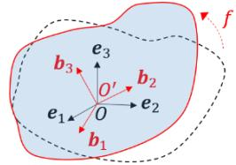
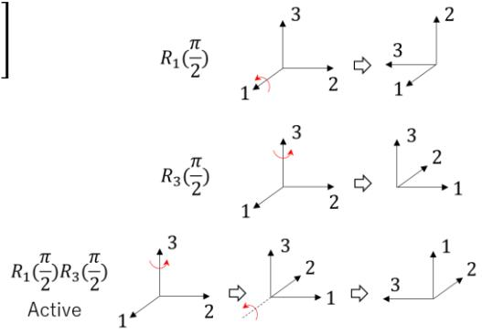
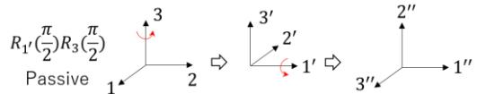
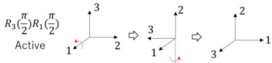
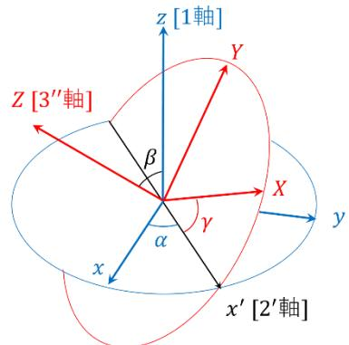
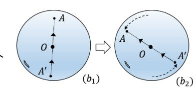
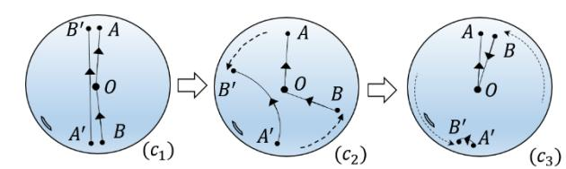

# **【第 7 講】回転の表現 I**

## **【7-1】はじめに**

前講まで線形代数の基礎を駆け足で学んできた。様々な分野でその応用上重要となる３次元回転の表現について代表的な４種をこれから２講に分けて学ぶ。本講では、「回転行列」「オイラー角（および Tait-Bryan 角）」「回転ベクトル」の３種を取り上げる。本２講の目的はこれらを通して３次元回転49そのものの理解を深めることにある。まず３次元回転とは何か？改めて考察することから始めよう。

### ●**3次元回転に対する考察**

○回転とは？：変形しない物体、いわゆる剛体の動きを考えよう。この剛体内の各点との相対的な位置が不変な任意の点 *0'*（わかりやすいのは剛体内の点であるが、この条件を満たせば剛体外の点でもよい）を代表点として選び、代表点 *0'* の 3 次元空間内での位置を決めて固定してみよう。それでもまだ剛体は固定された点 *0'* のまわりを動く自由度を持っている。この固定された点 *0'* のまわりを動くことを我々は**回転**とよび、点 *0'* のことを**回転の中心**とよんでいることがわかる。

○回転中心の位置 : 対して代表点 *O'* 自体の空間内での剛体の向きを変えない動きのことを**並進**とよべば、並進の動きは回転とは独立していることがわかる。よって *O'* を空間の原点と定めた *O* に並進させて考えても（回転後に *O'* を並進させ戻すことで）回転としての一般性は失われない。

○相対的な変位としての回転：並進は３次元空間内の基準点からの変位としての相対的な量として意味を持ち、例えば位置ベクトルとして表現され記述されることがわかる。また２次元回転も基準となる向きからの相対的な回転角として記述されている。同様に３次元回転も基準となる姿勢からの相対的な変位として意味を持ち、そのように記述されるべきであろう。なお、これらの変位は結果のみを表すものであり、途中の情報（どのように到達したのか等）は含んでいないことに注意。

○回転の自由度 : 並進の自由度は明らかに3であるが、回転の自由度はいくつだろうか？ 回転の中心を *O* とし、それ以外の剛体内の任意の点を *P* とする。点 *P* は回転に伴い中心 *O* のまわりを動くが、*OP* 間の距離は不変であり、*O* を中心とした球面上を移動することがわかる。よってこのときの *P* の自由度は2となる。*P* を固定したとしても、まだ剛体は直線 *OP* を軸として回転する自由度をもっている。このときの回転は2次元の回転と同様に回転角で指定でき、1自由度であることがわかる。これも固定されると剛体は完全に固定され、従って回転の自由度は3となることがわかる。

49 本講座では数学や物理学の慣習に従い、いわゆる右手系による記述を行う。殆どの文献も右手系で記述されているので、右手系による記述内容を十分理解したうえで左手系を取り扱うことをお勧めする。

**【7-2】 回転行列**

**[7-2-1] 考察の定式化**

前述の回転に対する考察を素直に定式化してみよう。まず舞台となる 3 次元空間を、標準基底  $E = \{e_1, e_2, e_3\}$  により普通の直交座標が張れるベクトル空間、いわゆるユークリッド空間  $E^3$  とし原点  $O$  を定めよう。次に代表点  $O'$  を始点とする、剛体に対して固定された正規直交基底  $B = \{b_1, b_2, b_3\}$  を剛体に固有な基底としよう。代表点  $O'$  を原点  $O$  に移動させ固定し、さらに標準基底  $E$  も原点  $O$  を始点として空間に固定されているとしよう。これにより剛体に固定された  $B$  が空間に固定された  $E$  と一致しているときを「基準となる姿勢」と定義できる。回転後  $B$  を固定すれば剛体の姿勢が定まりそのときの  $E$  に対する  $B$  の相対的な変位として回転を記述できるだろう。そこで  $E$  を  $B$  へ写す写像（変換）としての記述を考えてみよう。

この変換（写像） $f: E^3 \rightarrow E^3$ （線形変換とは言っていないことに注意）は  $E$  を  $B$  に写すので

$$f(e_1) = b_1, f(e_2) = b_2, f(e_3) = b_3 \text{ および } f(\mathbf{0}) = \mathbf{0} \quad (7-2-1)$$

がいえる。最初の 3 式は  $f: E \mapsto B$  を表し最後の式は回転の中心が原点に固定されていることを表す。また剛体の任意の 2 点を  $x, y$  とし、基準姿勢のときのそれぞれの位置ベクトルを  $x, y$  とすれば、2 点間の距離は回転しても不変なので

$$\|f(x) - f(y)\| = \|x - y\| \quad (7-2-2)$$

がいえる。点  $Y$  を原点  $O$  とすれば、 $y = \mathbf{0}$  および  $f(\mathbf{0}) = \mathbf{0}$  より  $\|f(x)\| = \|x\|$  も成り立つ。また剛体の大きさは任意であり、回転により変換される点は  $E^3$  の任意の点と考えてもよい。よって回転変換  $f$  に対して以下のことがいえる。

○  $f$  はノルムを不変に保つ :  $\forall x \in E^3, \|f(x)\| = \|x\| \quad (7-2-3)$ 

またこれらのことから以下の 2 つのこともいえる（証明は付録 1 にて）。

○  $f$  は内積を不変に保つ :  $\forall x, y \in E^3, f(x) \cdot f(y) = x \cdot y \quad (7-2-4)$ 

○  $f$  は線形変換である :  $\forall x, y \in E^3, \forall k \in \mathbb{R}, f(x + y) = f(x) + f(y), f(kx) = kf(x) \quad (7-2-5)$ 

回転変換は線形変換となることが確認できたので、これまで学んできた知見が適応でき回転変換は行列を用いて表現できることになる。第 5 講 第 4 節にてノルムと内積を不変に保つ線形変換の表示行列として直交行列を学んだ。またここでいう回転は鏡映（反転）を含まない。従って、回転変換  $f$  の表示行列としてはその行列式が +1 となる 3 次の回転行列という結論となる。

以上、一般的な 3 次元回転に対する考察を定式化したところ、回転行列がその素直な表現となるであろうことがわかった。次項で定式化した内容に対し第 5 講第 4・5 節にて学んだことを復習兼ねて当てはめながら、3 次の回転行列を具体的に調べていこう。

**[7-2-2] 表示行列としての回転行列**

● 回転変換と表示行列

回転を表す線形変換  $f$  により標準基底  $\{e_i\}$  は正規直交基底  $b_i = f(e_i)$  として写される。[5-5-4] で学んだようにその表示行列を  $R$ 、成分を  $r_{ij}$  とすれば回転変換  $f$  は以下のように表示される。

$$(b_1 \ b_2 \ b_3) = (f(e_1) \ f(e_2) \ f(e_3)) = (e_1 \ e_2 \ e_3)R \quad \text{or} \quad b_j = f(e_j) = \sum_{i=1}^3 e_i r_{ij} \quad (7-2-6)$$

 $b_i$  の標準基底  $\{e_i\}$  に対する列ベクトル表示を  $b_{iE}$  とすれば、 $R$  は  $b_{iE}$  を並べたものとなり、

$$R = \begin{bmatrix} (b_{1E})_1 & (b_{2E})_1 & (b_{3E})_1 \\ (b_{1E})_2 & (b_{2E})_2 & (b_{3E})_2 \\ (b_{1E})_3 & (b_{2E})_3 & (b_{3E})_3 \end{bmatrix} = \begin{bmatrix} e_1 \cdot b_1 & e_1 \cdot b_2 & e_1 \cdot b_3 \\ e_2 \cdot b_1 & e_2 \cdot b_2 & e_2 \cdot b_3 \\ e_3 \cdot b_1 & e_3 \cdot b_2 & e_3 \cdot b_3 \end{bmatrix} \quad \text{or} \quad r_{ij} = e_i \cdot b_j \quad (7-2-7)$$

と書けて、直交行列であることと同値な条件 (5-4-7) より  $R$  は確かに直交行列となる。行列式は

$$|R| = D(b_{1E}, b_{2E}, b_{3E}) = \sum_{i,j,k=1}^3 \varepsilon_{ijk} (b_{1E})_i (b_{2E})_j (b_{3E})_k = b_1 \cdot (b_2 \times b_3) = +1 \quad (7-2-8)$$

より確かに  $R$  は回転行列といえる。このように回転行列は基準姿勢  $E$  からみた回転後の姿勢  $B$ 

をその列ベクトルの組として表示することになる。 $E^3$  の任意の点  $x = \sum_i e_i x_i = (e_1 \ e_2 \ e_3)x_E$  は

$$x'_E = Rx_E \quad \text{or} \quad x'_i = \sum_j r_{ij} x_j \quad (7-2-9)$$

なる回転としての線形変換により、 $x' = f(x) = (e_1 \ e_2 \ e_3)x'_E = \sum_i e_i x'_i$  に写されることとなる。

● 逆変換と逆行列

回転した剛体を基準姿勢に戻す逆変換を考えよう。回転変換  $f$  により  $f: e_i \mapsto b_i = f(e_i)$  という変換をするとき、変換先のベクトルの組  $\{b_i\}$  は基底であり線形独立となるので、その逆変換が定義でき  $f^{-1}: b_i \mapsto e_i = f^{-1}(b_i)$  とできる。この表示行列は回転行列  $R$  の逆行列となり、 $R^{-1} = R^T$  として求まることになる。実際 (7-2-7) 式より以下のように逆行列であることを確かめられる。

$$R^T R = \begin{bmatrix} e_1 \cdot b_1 & e_2 \cdot b_1 & e_3 \cdot b_1 \\ e_1 \cdot b_2 & e_2 \cdot b_2 & e_3 \cdot b_2 \\ e_1 \cdot b_3 & e_2 \cdot b_3 & e_3 \cdot b_3 \end{bmatrix} \begin{bmatrix} e_1 \cdot b_1 & e_1 \cdot b_2 & e_1 \cdot b_3 \\ e_2 \cdot b_1 & e_2 \cdot b_2 & e_2 \cdot b_3 \\ e_3 \cdot b_1 & e_3 \cdot b_2 & e_3 \cdot b_3 \end{bmatrix} = \begin{bmatrix} b_1 \cdot b_1 & b_1 \cdot b_2 & b_1 \cdot b_3 \\ b_2 \cdot b_1 & b_2 \cdot b_2 & b_2 \cdot b_3 \\ b_3 \cdot b_1 & b_3 \cdot b_2 & b_3 \cdot b_3 \end{bmatrix} = E$$

また  $R^T$  は基底  $\{b_i\}$  に対する  $\{e_i\}$  の表示行列であることもわかる。逆変換として次式を得る。

$$x_E = R^{-1}x'_E \quad \text{or} \quad x_i = \sum_j r_{ij}^{-1} x'_j \quad (7-2-10)$$

● 各座標軸周りの回転

 $e_3$  を回転軸とする回転を考えてみよう。 $e_3$  は回転軸として不変となり、対して  $e_1, e_2$  は2次元の回転と同様に  $e_3$  を中心に回転することになる。従ってこの2次元回転の回転角を  $\theta$  とすれば

$$R_3(\theta) = \begin{bmatrix} \cos \theta & -\sin \theta & 0 \\ \sin \theta & \cos \theta & 0 \\ 0 & 0 & 1 \end{bmatrix}, \quad \begin{bmatrix} \cos \theta & -\sin \theta & 0 \\ \sin \theta & \cos \theta & 0 \\ 0 & 0 & 1 \end{bmatrix} \begin{bmatrix} x_1 \\ x_2 \\ x_3 \end{bmatrix} = \begin{bmatrix} x_1 \cos \theta - x_2 \sin \theta \\ x_1 \sin \theta + x_2 \cos \theta \\ x_3 \end{bmatrix} \quad (7-2-11)$$

となることがわかる。列ベクトルの組は  $b_{iE} \cdot b_{jE} = \delta_{ij}$  として確かに正規直交基底をなし、

転置行列  $\begin{bmatrix} \cos \theta & \sin \theta & 0 \\ -\sin \theta & \cos \theta & 0 \\ 0 & 0 & 1 \end{bmatrix}$  は  $R_3(\theta)$  の逆行列となるが、 $R_3(-\theta)$  でもあり、文字通りの逆回転

を示す。 $e_1, e_2$  を回転軸とした場合も同様に以下の式となる。

$$R_1(\theta) = \begin{bmatrix} 1 & 0 & 0 \\ 0 & \cos \theta & -\sin \theta \\ 0 & \sin \theta & \cos \theta \end{bmatrix}, \quad R_2(\theta) = \begin{bmatrix} \cos \theta & 0 & \sin \theta \\ 0 & 1 & 0 \\ -\sin \theta & 0 & \cos \theta \end{bmatrix}$$

● Active 変換と Passive 変換

[5-5-7]で学んだように、線形変換により  $E^3$  の点が (7-2-9) 式のように実際に回転変換される (Active 変換) のとは違う仕組みで、点は動かさず基底を変換しそれに伴う座標変換を用い形式上同じ変換 (Passive 変換) を行う仕組みがあった。Passive 変換の場合、基底は実現したい回転変換の逆変換  $e'_i = f^{-1}(e_i)$ 

として変換され、その表示行列は元の回転変換  $f$  の表示行列である回転行列の逆行列を用いて

$$(e'_1 \ e'_2 \ e'_3) = (e_1 \ e_2 \ e_3) R^{-1} \quad (7-2-12)$$

となり、これに伴い  $E^3$  上の点を表す任意のベクトルに対し  $x = (e_1 \ e_2 \ e_3) x_E = (e'_1 \ e'_2 \ e'_3) x_{E'}$  として同じ点を異なる基底で表した際の座標変換が (7-2-9) 式である Active 変換と形式的に同じ式

$$x_{E'} = R x_E \quad (7-2-13)$$

として書けることとなる。この Passive 変換 (7-2-13) 式は Active 変換 (7-2-9) 式と同じ回転行列による行列の積の変換で見た目は全く同じだが内実は異なることに改めて注意が必要となる。

● intrinsic 回転と extrinsic 回転

応用上、回転の対象となる物体は固有な回転軸をもっている場合も少なくない。例えば物理学的な意味での剛体は、慣性主軸とよばれる慣性モーメント(行列)に関する固有ベクトルを有しており、この慣性主軸周りでの回転の記述が最も適していることが知られている。あるいは CG において例えば航空機や人体の骨などモデルにより自然な回転軸が存在し、その軸周りでの回転が適切となる。物体が固有な回転軸を複数もつ場合、回転に伴い別の回転軸の向きは必ず変わり、回転後は向きが変わった軸周りの回転を行っていくことになる。このような物体固有の回転軸まわりの回転を **intrinsic** な回転とよぶことがある。また一方で空間全体に定めた座標系に固定された複数の回転軸 (通常は座標軸の 3 軸) による回転として回転を記述することの方が好都合な場合もある。このような回転を **extrinsic** な回転とよぶことがある。この 2 種類の回転の記述の仕方は、先にあげた Active/Passive 変換とともに、回転の合成において絡み合っていくことになる。

● 回転の合成

[5-5-8]で学んだように 2 種類の回転変換  $f, g$  を続けて行った場合の合成変換  $h = g \circ f$  は  $f: x \mapsto x' = f(x)$ ,  $g: x' \mapsto x'' = g(x')$ ,  $h = g \circ f: x \mapsto x'' = g(f(x))$ ,  $x, x', x'' \in E^3$  (7-2-14) としたとき、点  $x, x', x''$  および回転変換  $f, g, h$  それぞれの標準基底に対する列ベクトルを

 $x_E, x'_E, x''_E$ , 表示行列を  $F_E, G_E, H_E$  とすれば線形変換 (Active 変換) として

$$x''_E = H_E x_E, \quad H_E = G_E F_E \quad (7-2-15)$$

を得る。このとき 2 回目に行う回転  $g$  の回転軸は、標準基底  $E$  で張られる座標系における軸となり、extrinsic な回転であることに注意。実際に各座標軸周りの回転で確かめてみよう。図は 1 軸および 3 軸周りの  $\pi/2$ 回転を示したもので、1 回目を 3 軸周り、2 回目を 1 軸周りの回転として (回転変換の表示行列は、各列ベクトルが回転後の正規直交基底を表示していることに注意)

$$G_E: R_1\left(\frac{\pi}{2}\right) = \begin{bmatrix} 1 & 0 & 0 \\ 0 & 0 & -1 \\ 0 & 1 & 0 \end{bmatrix}, \quad F_E: R_3\left(\frac{\pi}{2}\right) = \begin{bmatrix} 0 & -1 & 0 \\ 1 & 0 & 0 \\ 0 & 0 & 1 \end{bmatrix}$$

として合成すると回転行列は

$$R_A = R_1\left(\frac{\pi}{2}\right) R_3\left(\frac{\pi}{2}\right) = \begin{bmatrix} 0 & -1 & 0 \\ 0 & 0 & -1 \\ 1 & 0 & 0 \end{bmatrix}$$

となり、確かに線形変換である Active 変換は extrinsic な回転を表していることが分かる。

一方、基底の変換に伴う座標変換である Passive 変換での合成ではどうなるだろうか？

これも [5-5-8] で学んだように、基底の変換は実現する座標変換の逆変換となるため、以下の

$$(e'_1 \ e'_2 \ e'_3) = (e_1 \ e_2 \ e_3) F_E^{-1}, \quad (e''_1 \ e''_2 \ e''_3) = (e'_1 \ e'_2 \ e'_3) G_{E'}^{-1} \quad (7-2-16)$$

なる変換を行い、これに伴う各変換後の基底によるベクトル  $x$  の列ベクトル表示

$$x = (e_1 \ e_2 \ e_3) x_E = (e'_1 \ e'_2 \ e'_3) x_{E'} = (e''_1 \ e''_2 \ e''_3) x_{E''} \quad (7-2-17)$$

および各基底の変換に伴う座標変換の合成と、(5-5-13)式で  $P_{B \rightarrow C} = F_E^{-1}$  にあたる表示行列の変換

$$x_{E'} = F_E x_E, \quad x_{E''} = G_{E'} x_{E'}, \quad x_{E''} = H_E x_E, \quad H_E = G_{E'} F_E \quad (7-2-18)$$

$$G_{E'} = F_E G_E F_E^{-1} \quad (7-2-19)$$

を得て、これらは intrinsic な回転を表すことになる。実際、各座標軸周りの回転で確かめてみると

$$R_{1'}\left(\frac{\pi}{2}\right) = R_3\left(\frac{\pi}{2}\right) R_1\left(\frac{\pi}{2}\right) R_3^{-1}\left(\frac{\pi}{2}\right) = \begin{bmatrix} 0 & -1 & 0 \\ 1 & 0 & 0 \\ 0 & 0 & 1 \end{bmatrix} \begin{bmatrix} 1 & 0 & 0 \\ 0 & 0 & -1 \\ 0 & 1 & 0 \end{bmatrix} \begin{bmatrix} 0 & 1 & 0 \\ -1 & 0 & 0 \\ 0 & 0 & 1 \end{bmatrix} = \begin{bmatrix} 0 & 0 & 1 \\ 0 & 1 & 0 \\ -1 & 0 & 0 \end{bmatrix}$$

より、合成された回転行列は

$$R_P = R_{1'}\left(\frac{\pi}{2}\right) R_3\left(\frac{\pi}{2}\right) = \begin{bmatrix} 0 & 0 & 1 \\ 1 & 0 & 0 \\ 0 & 1 & 0 \end{bmatrix}$$

となり確かに基底変換に伴う座標変換である Passive 変換は intrinsic な回転を表すことがわかる。

また基底の合成変換が  $h^{-1} = g^{-1} \circ f^{-1} = (f \circ g)^{-1}$  となることより、相当する Active 変換である線形変換の合成変換は  $h = f \circ g$  となり、変換順を逆にした以下の extrinsic な表現もできる。

$$R_A = R_3\left(\frac{\pi}{2}\right) R_1\left(\frac{\pi}{2}\right) = \begin{bmatrix} 0 & 0 & 1 \\ 1 & 0 & 0 \\ 0 & 1 & 0 \end{bmatrix}$$

これらの行列が等しいことは (7-2-19)式より

$$R_P = G_{E'} F_E = F_E G_E = R_A \text{ からもいえる。}$$

● パラメータの自由度と領域

3次回転行列は成分の数 9 に対し直交行列である条件  $R^T R = E$  (同値となる列ベクトルの組とみなしたとき正規直交基底となる条件) より、独立な自由度は 3 となり確かに考察を満たす。この正規直交基底の姿勢ひとつひとつが各 3 次元回転に相当し、基底の姿勢と回転行列の成分は 1 対 1 に対応することになるので、回転行列のパラメータ領域は 3 次元回転と 1 対 1 に対応することになる。しかしながら 9 つの成分に 6 つの拘束条件をかけ独立な自由度 3 となる構造は、冗長ともいえ応用上その点は注意が必要となる。次節では最小限の 3 つのパラメータで回転を表現する手法を学ぶ。

### 【7-3】オイラー角と仲間たち

#### 【7-3-1】回転後の基底の姿勢を3つの回転角で表す

冒頭の考察により回転を表現するとは、基準となる標準基底と、剛体に固定された正規直交基底との自由度3の変位を記述することであった。基準姿勢から目的の姿勢を表す正規直交基底に3つの回転角、すなわち3回の座標軸周りの回転で一致させる記述の仕方を考えよう。座標軸を回転軸として用いる複数回の回転なので、intrinsicな回転となる。まず議論する上での用語を定義しよう。

○座標系 : 基準となる標準基底の座標系を  $xyz$ , 1回転目で写る先の座標系を  $x'y'z'$ , 2回転目で  $x''y''z''$ , 最後の3回転目で写る先の目的の正規直交基底の座標系を  $XYZ$  としよう。

○回転軸 : 3回の回転で一致させるので用いる座標軸は3本となる。この3本について1回転目を1軸、2回転目を2'軸、3回転目を3''軸とよぶことにしよう。1軸は  $xyz$  のうちのどれかの軸、2'軸は  $x'y'z'$  のどれか、3''軸は  $x''y''z''$  のどれかを軸に選ぶことになる。(このように軸の選び方でさまざまなバリエーションが生まれてしまうことになる50。)

考察しながら判明したことをあげていこう。

1) 1軸と2'軸、2'軸と3''軸とでは用いる座標軸は異なる。→上図では1軸として  $z$  軸を選んだが回転軸なので  $z'$  軸でもあり、2'軸としては  $x'$  か  $y'$  軸を用いることになる。同様に2'軸は  $x'$  軸を選んだが  $x''$  軸でもあり、3''軸としては  $y''$  か  $z''$  軸を用いることになる。

2) 上記1)より、1軸は  $xyz$  の3通り、2'軸は  $x'y'z'$  のうち1軸で選ばなかった2通り、3''軸は  $x''y''z''$  のうち2'軸で選ばなかった2通りだが、これは1軸で選んだ軸と同じか異なるかの2通りで前者と後者に大別されることになる。選んだ 1 - 2' - 3'' 軸として、前者の6通りの代表を  $z - x' - z''$  (上図) とし、後者の6通りの代表を  $z - y' - x''$  (下図) としよう。軸の選び方が異なるだけで代表以外も議論は同様に適用される。

3) 1軸と2'軸は直交し、2'軸と3''軸も直交する。→  $x'y'z'$  にて2'軸として選ばなかったどちらかの軸は元1軸でもあり従って直交する。同様に  $x''y''z''$  にて3''軸として選ばなかったどちらかの軸は元2'軸でもあり従って直交する。

50 軸の選択はあくまで事前の規約であり、動的 (回転中) に選ぶという意味ではない (念のため)

4) 3'' 軸が  $x''/y''/z''$  軸であれば  $X/Y/Z$  軸でもある。→最後の回転で  $x''y''z''$  は  $XYZ$  に一致することになるが 3'' 軸は回転軸なのでその回転時には既に一致している。図の例では、3'' 軸 (は  $z''/x''$  軸であるが、これは  $Z/X$  軸にその回転時には既に一致している。

5) 上記3) 4) より、2' 軸の方向は 1 軸 ( $xyz$  のどれか) と 3'' 軸 ( $XYZ$  のどれか) との外積で得られる。→ 2' 軸は 1 軸と 3'' 軸のどちらとも直交するので、方向はその外積のベクトルの方向となる。ただし例外として 1 軸と 3'' 軸が平行 (一致するか反対向き) な場合、2' 軸の方向は定まらないことになる。この場合、後にわかるようにそもそも 3 回でなく 1 回もしくは 2 回の回転で達成できる特殊な最終姿勢ということになり、一般的な姿勢とは別扱いとなる。

以上により5) の例外の場合は別扱いとし、それ以外の一般の回転変換先の正規直交基底に対して各回転軸が一意に定まり、後述するようにその回転角も幾何学的に一意に定まるので求める表現を得ることになる。代表  $z - x' - z''$  の回転角の組ことを (狭義の) **オイラー角**といい、代表  $z - y' - x''$  の回転角の組のことを **Tait-Bryan 角**という。次項以降にてそれぞれ詳細を述べる。

### [7-3-2] オイラー角

● 定義：1 - 2' - 3'' 軸として  $z - x' - z''$  軸を適用したものを (狭義の) オイラー角という。図のように 2' 軸である  $x'$  軸は、1 軸である  $z$  軸と 3'' 軸である  $Z$  軸 ( $z''$  軸) のどちらとも直交する。その方向は  $z$  軸と  $Z$  軸 との外積にて求まり、向きは  $z \times Z$  の正の方向となる。以下、基準座標系  $xyz$  の標準基底を  $\{e_x, e_y, e_z\}$ , 回転後の座標系  $XYZ$  の正規直交基底を  $\{b_x, b_y, b_z\}$ ,  $x'$  軸の単位ベクトルを  $e'_x$  とすると  $e_z \times b_z \neq 0$  のとき  $e'_x$  は次式で求まる。(例外扱いとなる  $e_z \times b_z = 0$  のときは後ほど述べる。以下に続く話は全て  $e_z \times b_z \neq 0$  のときについてであることに注意。)

$$e'_x = (e_z \times b_z) / \|e_z \times b_z\| \quad (\text{ただし } e_z \times b_z \neq 0) \quad (7-3-1)$$

● 各回転角

○ 1 軸回転 :  $z$  軸によるこの回転は、2' 軸となる  $x'$  軸に  $x$  軸を重さねることが担当となる。よって回転角は  $x$  軸と  $x'$  軸の成す角  $\alpha$  となり、その範囲と余弦は次式のようになる。

$$\cos \alpha = e_x \cdot e'_x \quad (0 \leq \alpha < 2\pi) \quad (7-3-2)$$

○ 2' 軸回転 :  $x'$  軸によるこの回転は、3'' 軸となる  $Z$  軸に  $z$  軸を重さねることが担当となる。よって回転角は  $z$  軸と  $Z$  軸の成す角  $\beta$  となり、その範囲と余弦は次式のようになる。

$$\cos \beta = e_z \cdot b_z \quad (0 < \beta < \pi) \quad (7-3-3)$$

○ 3'' 軸回転 :  $Z$  軸 ( $z''$  軸) によるこの回転は、2' 軸だった  $x'$  軸を  $X$  軸に重さねることが担当となる。よって回転角は  $x'$  軸と  $X$  軸の成す角  $\gamma$  となり、その範囲と余弦は次式のようになる。

$$\cos \gamma = e'_x \cdot b_x \quad (0 \leq \gamma < 2\pi) \quad (7-3-4)$$

●回転行列による表示

intrinsic な回転となるので、前節[7-2-2]で行ったように Passive 変換による合成変換が自然な変換となる。 $x$  軸まわりの  $\theta$  回転変換の表示行列を  $R_x(\theta)$  等と表記すれば、Passive 変換の回転行列は

$$R_p^{Euler} = R_{z''}(\gamma)R_{x'}(\beta)R_z(\alpha) \quad (7-3-5)$$

となる。ここで各基底の変換に伴う行列の変換は以下のようになる。

$$R_{x'}(\beta) = R_z(\alpha)R_x(\beta)R_z^{-1}(\alpha), \quad R_{z''}(\gamma) = R_{x'}(\beta)R_{z'}(\gamma)R_{x'}^{-1}(\beta) \quad (7-3-6)$$

3 回の合成でも、前節と同様に相当する Active 変換による extrinsic な回転となる合成変換は行列の積の順が逆順となる。これは  $x$  軸まわりの  $\theta$  回転変換を  $f_x(\theta)$  等と表記すれば、Passive 変換における基底変換の合成変換は  $h^{-1} = f_z^{-1}(\gamma) \circ f_x^{-1}(\beta) \circ f_z^{-1}(\alpha)$  として行われており、相当する線形変換の合成変換は  $h = f_z(\alpha) \circ f_x(\beta) \circ f_z(\gamma)$  であり Active 変換による extrinsic な回転の表示行列は

$$R_A^{Euler} = R_z(\alpha)R_x(\beta)R_z(\gamma) \quad (7-3-7)$$

として得られるからである。なお(7-3-5)式と、この(7-3-7)式の回転行列が等しいことは(7-3-6)式を代入して直接確かめることもできる。記号が煩雑になるので  $R_{x'}(\beta) = X_\beta'$  等略記すると

$$R_p^{Euler} = Z_\gamma'' X_\beta' Z_\alpha \quad (*), \quad R_{x'}(\beta) = X_\beta' = Z_\alpha X_\beta Z_\alpha^{-1} \quad (**), \quad R_{z''}(\gamma) = Z_\gamma'' = X_\beta' Z_\gamma' X_\beta'^{-1} \quad (**)$$

と書けて、 $Z_\gamma' = Z_\alpha Z_\gamma Z_\alpha^{-1}$  と (\*) を (\*\*) に代入すると

$$Z_\gamma'' = X_\beta' Z_\gamma' X_\beta'^{-1} = (Z_\alpha X_\beta Z_\alpha^{-1})(Z_\alpha Z_\gamma Z_\alpha^{-1})(Z_\alpha X_\beta Z_\alpha^{-1})^{-1} = Z_\alpha X_\beta Z_\gamma Z_\alpha^{-1} (Z_\alpha X_\beta^{-1} Z_\alpha^{-1}) = Z_\alpha X_\beta Z_\gamma X_\beta^{-1} Z_\alpha^{-1}$$

となり、これと (\*) を (\*\*) に代入すると

$$R_p^{Euler} = Z_\gamma'' X_\beta' Z_\alpha = (Z_\alpha X_\beta Z_\gamma X_\beta^{-1} Z_\alpha^{-1})(Z_\alpha X_\beta Z_\alpha^{-1}) Z_\alpha = Z_\alpha X_\beta Z_\gamma = R_A^{Euler}$$

として確かめられた。

この回転行列を明示的に書き下すと、 $\cos \alpha = \cos \gamma$ ,  $\sin \beta = \sin \gamma$  等の略記を用いて以下を得る。

$$R^{Euler} = \begin{bmatrix} \cos \gamma & \sin \gamma & \cos \beta & \sin \beta & -\cos \alpha & \sin \alpha & \cos \beta & \sin \beta & -\cos \alpha & \sin \alpha & \cos \beta & \sin \beta \\ \sin \gamma & \cos \gamma & \cos \beta & \sin \beta & -\sin \alpha & \sin \alpha & \sin \beta & \cos \gamma & -\cos \alpha & \sin \alpha & \cos \beta & \sin \beta \\ \sin \beta & \cos \beta & \sin \beta & \cos \beta & \sin \beta & \sin \beta & \cos \gamma & \sin \beta & \cos \beta & \sin \beta & \cos \beta & \sin \beta \end{bmatrix} \quad (7-3-8)$$

●例外処理

さて後回しにしていた「例外」について考察しよう。オイラー角の場合  $z$  軸と  $z'$  軸が一致している、あるいは真逆を向いていることに相当し（7-3-1）式に現れている。この場合両軸に垂直な平面上に  $x$  軸と  $x'$  軸があるので、例えば  $x'$  軸を  $x$  軸として定義することで 1 回目の  $z$  軸回転で  $x$  軸と  $x'$  軸を一致させ、 $z$  軸と  $z'$  軸が逆向きの場合は 2 回目の  $x$  軸(=  $x'$  軸)の  $\pi$  回転を行う等の 1 回あるいは 2 回の回転で目的を達することができる。このように最終姿勢が特殊な例外姿勢である場合は、各回転角の定義自体が異なり、回転行列（7-3-8）式も異なることに注意を要する。

●バリエーション

回転軸を  $z - x' - z''$  と選んだものが狭義のオイラー角であった。軸の選び方は前項で考察したように 6 通りあり、他の 5 通りを書き下せば  $z - y' - z'', x - y' - x'', x - z' - x'', y - z' - y'', y - x' - y''$  となる。これらを合わせて 6 種類の（広義の）オイラー角として扱っている場合もあるので注意。

**[7-3-3] Tait-Bryan 角**

● 定義：1 - 2' - 3'' 軸として  $z - y' - x''$  軸を適用したものを Tait-Bryan 角という。図のように 2' 軸である  $y'$  軸は、1 軸である  $z$  軸と 3'' 軸である  $x$  軸 ( $x''$  軸) のどちらとも直交する。その方向は  $z$  軸と  $x$  軸 との外積にて求まり、向きは  $z \times x$  の正の方向となる。以下、基準座標系  $xyz$  の標準基底を

 $\{e_x, e_y, e_z\}$ , 回転後の座標系  $XYZ$  の正規直交基底を  $\{b_x, b_y, b_z\}$ ,

 $y'$  軸の単位ベクトルを  $e'_y$  とすると  $e_z \times b_x \neq 0$  のとき  $e'_y$  は次式で求まる (例外扱いとなる  $e_z \times b_x = 0$  のときは後ほど述べる。以下に続く話は全て  $e_z \times b_x \neq 0$  の時についてであることに注意。)

$$e'_y = (e_z \times b_x) / \|e_z \times b_x\| \quad (\text{ただし } e_z \times b_x \neq 0) \quad (7-3-9)$$

● 各回転角

○ 1 軸回転 :  $z$  軸によるこの回転は、2' 軸となる  $y'$  軸に  $y$  軸を重さねることが担当となる。よって回転角は  $y$  軸と  $y'$  軸の成す角  $\psi$  となり、その範囲と余弦は次式のようになる。

$$\cos \psi = e_y \cdot e'_y \quad (0 \leq \psi < 2\pi) \quad (7-3-10)$$

○ 2' 軸回転 :  $y'$  軸によるこの回転は、3'' 軸となる  $x$  軸に  $x'$  軸を重さねることが担当となる。よって回転角は  $x'$  軸と  $x$  軸の成す角  $\theta$  となり、その範囲と余弦は次式のようになる。

$$\cos \theta = (e'_y \times e_z) \cdot b_x \quad (-\pi/2 < \theta < \pi/2) \quad (7-3-11)$$

○ 3'' 軸回転 :  $x$  軸 ( $x''$  軸) によるこの回転は、2' 軸だった  $y'$  軸を  $y$  軸に重さねることが担当となる。よって回転角は  $y'$  軸と  $y$  軸の成す角  $\phi$  となり、その範囲と余弦は次式のようになる。

$$\cos \phi = e'_y \cdot b_y \quad (0 \leq \phi < 2\pi) \quad (7-3-12)$$

● 回転行列による表示

intrinsic な回転となるので、前節[7-2-2]で行ったように Passive 変換による合成変換が自然な変換となる。 $x$  軸まわりの  $\theta$  回転変換の表示行列を  $R_x(\theta)$  等と表記すれば、Passive 変換の回転行列は

$$R_p^{TB} = R_{x''}(\phi) R_{y'}(\theta) R_z(\psi) \quad (7-3-13)$$

となる。ここで各基底の変換に伴う行列の変換は以下のようになる。

$$R_{y'}(\theta) = R_z(\psi) R_y(\theta) R_z^{-1}(\psi), \quad R_{x''}(\phi) = R_{y'}(\theta) R_{x'}(\phi) R_{y'}^{-1}(\theta) \quad (7-3-14)$$

3回の合成でも、前節と同様に対応する Active 変換による extrinsic な回転となる合成変換は行列の積の順が逆順となる。これは  $x$  軸まわりの  $\theta$  回転変換を  $f_x(\theta)$  等と表記すれば、Passive 変換における基底変換の合成変換は  $h^{-1} = f_x^{-1}(\phi) \circ f_y^{-1}(\theta) \circ f_z^{-1}(\psi)$  として行われており、相当する線形変換の合成変換は  $h = f_z(\psi) \circ f_y(\theta) \circ f_x(\phi)$  であり Active 変換による extrinsic な回転の表示行列は

$$R_A^{TB} = R_z(\psi) R_y(\theta) R_x(\phi) \quad (7-3-15)$$

として得られるからである。なお (7-3-13)式と、この(7-3-15)式の回転行列が等しいことは(7-3-14)式を代入して直接確かめることもできる。記号が煩雑になるので  $R_{y'}(\theta) = Y'_\theta$  等略記すると

$$R_p^{TB} = X''_\phi Y'_\theta Z_\psi \quad (*), \quad R_{y'}(\theta) = Y'_\theta = Z_\psi Y_\theta Z_\psi^{-1} \quad (**), \quad R_{x''}(\phi) = X''_\phi = Y'_\theta X'_\phi Y'_\theta^{-1} \quad (***)$$

と書けて、 $X'_\phi = Z_\psi X_\phi Z_\psi^{-1}$  と (☆) を (★) に代入すると

$$X''_\phi = Y'_\theta X'_\phi Y'_\theta^{-1} = (Z_\psi Y_\theta Z_\psi^{-1})(Z_\psi X_\phi Z_\psi^{-1})(Z_\psi Y_\theta Z_\psi^{-1})^{-1} = Z_\psi Y_\theta X_\phi Z_\psi^{-1} (Z_\psi Y_\theta^{-1} Z_\psi^{-1}) = Z_\psi Y_\theta X_\phi Y_\theta^{-1} Z_\psi^{-1}$$

となり、これと (☆) を (※) に代入すると

$$R_P^{TB} = X''_\phi Y'_\theta Z_\psi = (Z_\psi Y_\theta X_\phi Y_\theta^{-1} Z_\psi^{-1})(Z_\psi Y_\theta Z_\psi^{-1}) Z_\psi = Z_\psi Y_\theta X_\phi = R_A^{TB}$$

として確かめられた。

この回転行列を明示的に書き下すと、 $\cos \psi = c\psi$ ,  $\sin \theta = s\theta$  等の略記を用いて以下を得る。

$$R^{TB} = \begin{bmatrix} c\psi & c\theta & -s\psi & c\phi + c\psi & s\theta & s\phi & s\psi & s\phi + c\psi & s\theta & c\phi \\ s\psi & c\theta & c\psi & c\phi + s\psi & s\theta & s\phi & -c\psi & s\phi + s\psi & s\theta & c\phi \\ -s\theta & & c\theta & s\phi & & & c\theta & c\phi & & \end{bmatrix} \quad (7-3-16)$$

●例外処理

Tait-Bryan 角の場合  $z$  軸と  $x$  軸が一致している、あるいは真逆を向いていることに相当し(7-3-9)式に現れる。この場合両軸に直交する平面上に  $y$  軸と  $Y$  軸があるので、例えば  $y'$  軸を  $Y$  軸として定義することで 1 回目の  $z$  軸回転で  $y$  軸と  $Y$  軸を一致させさらに  $Y$  軸 (= $y'$  軸) まわりの  $\pm \frac{\pi}{2}$  回転で達成させる等の、合わせて 2 回転による別処理を行えばよいことになる。

●バリエーション

Tait-Bryan 角の場合、代表とした回転軸を  $z - y' - x''$  と選んだもの以外にも、 $z - x' - y''$  もよく使われているようである。軸の選び方は前項で考察したように 6 通りあり、他の 4 通りを書き下せば  $x - y' - z'', x - z' - y'', y - z' - x'', y - x' - z''$  となる。なお 6 通りのオイラー角に 6 通りの Tait-Bryan 角も含めて 12 種類のオイラー角として扱っている場合もあるので、さらにさらに注意。

**[7-3-4] ジンバルロック**

オイラー角における例外状態のことを「回転角  $\beta$  が  $0(, \pi)$  のときは、(7-3-8)式が

$$\begin{bmatrix} c\alpha & c\gamma - s\alpha & s\gamma & -c\alpha & s\gamma - s\alpha & c\gamma & 0 \\ s\alpha & c\gamma + c\alpha & s\gamma & -s\alpha & s\gamma + c\alpha & c\gamma & 0 \\ 0 & 0 & 0 & 0 & 1 \end{bmatrix} = \begin{bmatrix} \cos(\alpha + \gamma) & -\sin(\alpha + \gamma) & 0 \\ \sin(\alpha + \gamma) & \cos(\alpha + \gamma) & 0 \\ 0 & 0 & 1 \end{bmatrix} \quad \text{となり回転の自由度が失われ}$$

れ、これをジンバルロックという。」というような説明もあるが、導出および例外処理の内容から分かるようにそもそもこのとき各回転角や(7-3-8)式自体が別処理での異なる定義となり、Tait-Bryan 角の場合も「回転角  $\theta$  が  $\pm \frac{\pi}{2}$  のとき」にあたり、同様に回転角や(7-3-16)式は異なる定義となる。また因果関係が逆で自由度が失われるのではなく、1 · 2 回転となる少ない自由度で到達できる特殊な場合に相当する。場合分けによる別処理も必要となることを理解したうえで使うべきともいえるがいずれにしても、このような場合分けが必要となること自体は結構(かなり)やっかいなことではあり、根本原因としては 3 つの回転角で構成されるパラメータ領域で 3 次元回転全体を表そうとしたとき、それらがトポロジー的に同等でないことの「しわ寄せ」からきている。では 3 次元回転全体の大域的な構造とはどういったものなのだろうか? これは次節にて調べることになる。

**【7-4】 回転ベクトル**

**[7-4-1] 定義とロドリゲスの回転公式**

前講[6-5-1]で剛体回転におけるオイラーの定理を学んだ。その証明から分かるように任意の3次回転行列が固有値1の実固有ベクトルをもち、全ての3次元回転は回転軸とその周りの回転角で表すことができることを意味する。このことを素直に定式化したものが以下の回転ベクトルとなる。

● 定義 : 3次元空間の任意の回転に対し、回転により右ねじが進む向きを正とした回転軸をベクトル  $\omega$  の方向とし、弧度法による回転角をその大きさとする  $\omega$  を回転ベクトルという。定義より回転角  $\theta = \|\omega\|$  であり、 $\theta \neq 0$  の時の  $\omega$  の向きの単位ベクトルを  $u = \omega/\|\omega\|$  と定義する。

● 回転公式

図のように回転ベクトルにより3次元上の任意の点 P (位置ベクトル  $r$ ) が点 P' (位置ベクトル  $r'$ ) に変換される場合を考える。点 P から回転軸の直線上に下ろした垂線の足を点  $O'$  とすると、 $\vec{O'P}, \vec{O'P'}$  は共に回転軸と直交し、 $\vec{O'P}, \vec{O'P'}$  が張る面 (回転面) も回転軸と直交する。 $r = \vec{OO'} + \vec{O'P}$  であるが、 $r_{//} = \vec{OO'}, r_{\perp} = \vec{O'P}$  とすると  $u$  は単位ベクトルなので

$$r_{//} = (u \cdot r)u \quad (7-4-1)$$

と書けて、 $r = r_{//} + r_{\perp}$  なので以下を得る。

$$r_{\perp} = r - (u \cdot r)u \quad (7-4-2)$$

さらに回転面上で点 P を  $\pi/2$  だけ回した先の点を Q とすると、 $\vec{O'Q}$  は  $u$  とも  $r_{\perp}$  とも直交するので、その向きは図

から  $u$  と  $r_{\perp}$  の外積、 $u \times r_{\perp}$  と同じである。その長さは  $r_{\perp}$  の長さと等しく、 $u$  が単位ベクトルかつ  $r_{\perp}$  と直交することから  $\|u \times r_{\perp}\|$  と同じとなるので、 $\vec{O'Q} = u \times r_{\perp}$  となることが分かる。

 $\vec{O'P'} = \cos \theta \vec{O'P} + \sin \theta \vec{O'Q}$  となることから、点 P' を指す位置ベクトル  $r'$  は

$$r' = \vec{OO'} + \vec{O'P'} = r_{//} + \cos \theta r_{\perp} + \sin \theta u \times r_{\perp}$$

となり、(7-4-1)式、(7-4-2)式を代入すると

$$= (u \cdot r)u + \cos \theta \{r - (u \cdot r)u\} + \sin \theta u \times \{r - (u \cdot r)u\}$$

となる。これを整理して

$$r' = \cos \theta r + (1 - \cos \theta)(u \cdot r)u + \sin \theta u \times r \quad (7-4-3)$$

を得る。この式をロドリゲスの回転公式 (ベクトル表示) という。

● 回転の合成

残念ながら回転ベクトルによる回転の合成は、各回転ベクトルの和や積のような単純な形で表すことはできない。回転行列形式で合成するか、次講のクォータ二オンの合成にならうことになる。

**[7-4-2] 回転行列による表示**

(7-4-3)式 :  $\mathbf{r}' = \cos \theta \mathbf{r} + (1 - \cos \theta)(\mathbf{u} \cdot \mathbf{r})\mathbf{u} + \sin \theta \mathbf{u} \times \mathbf{r}$  を線形変換の行列表示に書き直す。

$$\mathbf{r}' = \begin{bmatrix} x'_1 \\ x'_2 \\ x'_3 \end{bmatrix}, \quad \mathbf{r} = \begin{bmatrix} x_1 \\ x_2 \\ x_3 \end{bmatrix}, \quad \mathbf{u} = \begin{bmatrix} u_1 \\ u_2 \\ u_3 \end{bmatrix}$$

とすると、

$$\begin{aligned} x'_i &= \cos \theta x_i + (1 - \cos \theta) \left( \sum_{j=1}^3 u_j x_j \right) u_i + \sin \theta \sum_{j,k=1}^3 \varepsilon_{ikj} u_k x_j \\ &= \sum_{j=1}^3 \left\{ \cos \theta \delta_{ij} + (1 - \cos \theta) u_i u_j - \sin \theta \sum_{k=1}^3 \varepsilon_{ijk} u_k \right\} x_j \end{aligned}$$

と書けるので

$$R_{ij} = \cos \theta \delta_{ij} + (1 - \cos \theta) u_i u_j - \sin \theta \sum_{k=1}^3 \varepsilon_{ijk} u_k \quad (7-4-4)$$

が回転行列となる。これを成分ごとに行列表記で書き下すと、

$$R = \begin{bmatrix} \cos \theta + (1 - \cos \theta)u_1^2 & (1 - \cos \theta)u_1 u_2 - \sin \theta u_3 & (1 - \cos \theta)u_1 u_3 + \sin \theta u_2 \\ (1 - \cos \theta)u_2 u_1 + \sin \theta u_3 & \cos \theta + (1 - \cos \theta)u_2^2 & (1 - \cos \theta)u_2 u_3 - \sin \theta u_1 \\ (1 - \cos \theta)u_3 u_1 - \sin \theta u_2 & (1 - \cos \theta)u_3 u_2 + \sin \theta u_1 & \cos \theta + (1 - \cos \theta)u_3^2 \end{bmatrix} \quad (7-4-5)$$

この(7-4-4)式、(7-4-5)式を**ロドリゲスの回転公式 (行列表示)** という。

 $\mathbf{u}$  を標準基底の  $\mathbf{e}_1, \mathbf{e}_2, \mathbf{e}_3$  とすれば各座標軸周りの回転行列に帰着することがわかる。

**[▼C] 演習 :** 実際に回転行列であることを確かめよう。(7-4-4)式とその転置行列との積をとると

$$\begin{aligned} (R^T R)_{ij} &= \sum_{k=1}^3 R_{ik}^T R_{kj} = \sum_{k=1}^3 R_{ki} R_{kj} \\ &= \sum_{k=1}^3 \left\{ \cos \theta \delta_{ki} + (1 - \cos \theta) u_k u_i - \sin \theta \sum_{l=1}^3 \varepsilon_{kil} u_l \right\} \left\{ \cos \theta \delta_{kj} + (1 - \cos \theta) u_k u_j - \sin \theta \sum_{m=1}^3 \varepsilon_{kjm} u_m \right\} \\ &= \cos^2 \theta \delta_{ij} + \cos \theta (1 - \cos \theta) u_i u_j - \sin \theta \cos \theta \sum_{m=1}^3 \varepsilon_{ijm} u_m \\ &\quad + \cos \theta (1 - \cos \theta) u_j u_i + (1 - \cos \theta)^2 u_i u_j - \sin \theta (1 - \cos \theta) \sum_{m,k=1}^3 \varepsilon_{kjm} u_k u_i u_m \\ &\quad - \sin \theta \cos \theta \sum_{l=1}^3 \varepsilon_{jil} u_l - \sin \theta (1 - \cos \theta) \sum_{l,k=1}^3 \varepsilon_{kil} u_l u_k u_j + \sin^2 \theta \sum_{k,l,m=1}^3 \varepsilon_{kil} u_l \varepsilon_{kjm} u_m \\ &= \cos^2 \theta \delta_{ij} + (1 + \cos \theta)(1 - \cos \theta) u_i u_j + \sin^2 \theta \sum_{l,m=1}^3 (\delta_{ij} \delta_{lm} - \delta_{im} \delta_{lj}) u_l u_m \\ &= (\cos^2 \theta + \sin^2 \theta) \delta_{ij} + (1 - \cos^2 \theta) u_i u_j - \sin^2 \theta u_i u_j \\ &= \delta_{ij} \end{aligned}$$

となり、確かに  $R$  は 3 次の直交行列である。また(7-4-4)式あるいは(7-4-5)式は  $\theta \rightarrow 0$  にて連続的に単位行列に移行することにより行列式の値は+1 となることがわかる。

以上により  $R$  は回転行列となることが確かめられた。

**[7-4-3] 回転行列の固有値・固有ベクトル**

3 次の回転行列の固有値・固有ベクトルを改めて確認してみよう。一般の 3 次正方行列  $A$  の固有多項式は (6-3-17) 式  $g(\lambda) = -\{\lambda^3 - \text{tr}(A)\lambda^2 + (\tilde{a}_{11} + \tilde{a}_{22} + \tilde{a}_{33})\lambda - \det(A)\}$  だった。これに回転行列を当てはめてみるとまず  $\det(R) = +1$  となる。次に  $\tilde{r}_{11}$  について、回転行列が正規直交基底を列ベクトルにもつので余因子  $\tilde{r}_{11} = \begin{vmatrix} r_{22} & r_{23} \\ r_{32} & r_{33} \end{vmatrix} = (\mathbf{b}_2 \times \mathbf{b}_3)_1$  と基底の外積  $\mathbf{b}_2 \times \mathbf{b}_3$  の第 1 成分となり、正規直交基底なので  $\mathbf{b}_2 \times \mathbf{b}_3 = \mathbf{b}_1$  でもあることから、 $\tilde{r}_{11} = r_{11}$  となることがわかる。

 $\tilde{r}_{22}, \tilde{r}_{33}$  にも同様のことがいえ  $\tilde{r}_{11} + \tilde{r}_{22} + \tilde{r}_{33} = \text{tr}(R)$  となり  $g(\lambda) = -\{\lambda^3 - \text{tr}(R)\lambda^2 + \text{tr}(R)\lambda - 1\}$  を得る。これを式変形して一般の 3 次回転行列の固有多項式は

$$g(\lambda) = -(\lambda - 1)\{\lambda^2 - (\text{tr}(R) - 1)\lambda + 1\} \quad (7-4-6)$$

となり、オイラーの定理で得たように固有値のひとつは  $+1$  であることがわかる。

さらに任意軸周りの回転として確かめる。回転行列である (7-4-5) 式から  $\text{tr}(R)$  を求めると

$$\text{tr}(R) = 3 \cos \theta + (1 - \cos \theta)(u_1^2 + u_2^2 + u_3^2) = 2 \cos \theta + 1 \text{ を得て、固有方程式は} (\lambda - 1)(\lambda^2 - 2 \cos \theta \lambda + 1) = 0 \quad (7-4-7)$$

このうち 2 次方程式  $\lambda^2 - 2 \cos \theta \lambda + 1 = 0$  の部分は、[6-2-2] 例 4) で求めた 2 次の回転行列

 $\begin{bmatrix} \cos \theta & -\sin \theta \\ \sin \theta & \cos \theta \end{bmatrix}$  の固有方程式そのものとなっていることに注意。従って解である固有値は、

$$\lambda = +1, \quad \lambda = \cos \theta \pm i \sin \theta = e^{\pm i\theta} \quad (7-4-8)$$

となる。また回転行列  $R$  である (7-4-4) 式と回転軸である  $\mathbf{u} = (u_1, u_2, u_3)$  との積  $R\mathbf{u}$  は

$$\sum_{j=1}^3 R_{ij} u_j = \cos \theta u_i + (1 - \cos \theta) u_i \sum_{j=1}^3 u_j u_j - \sin \theta \sum_{j,k=1}^3 \varepsilon_{ijk} u_k u_j = u_i$$

となり、確かに  $\mathbf{u}$  は固有値 1 の固有ベクトルとなっていることがわかる。

**[7-4-4] 3 次元回転の大域的な構造**

回転ベクトルはシンプルなので、パラメータ領域を調べることで 3 次元回転全体の大域的な構造を調べることができるだろう。まずは 3 次元回転に 1 対 1 に対応するパラメータ領域を定めよう。

回転軸の方向を指定しその周りに回転させる際に回転角が  $\pi$  を超える場合は、軸の向きが真逆の場合の回転角  $\pi$  以下の回転の結果と重なってしまう。従って 3 次元回転と 1 対 1 の関係を作るには 回転角  $\theta$  の範囲を  $0 \leq \theta \leq \pi$  とするのが自然という事になる。

任意の向きの回転ベクトルの始点を原点とし、回転角  $\theta$  の範囲、従ってベクトルの長さの範囲を  $0 \leq \theta \leq \pi$  とした場合の各回転ベクトルが指す点の集合を考える。この集合は原点を中心とした半径  $\pi$  の球体となり、この球内の各点それぞれが、ひとつの 3 次元の回転に相当することになる。ただし回転角が  $\pi$  となる球の表面の各点に関しては、原点を挟んだ真反対側の球面の点である対蹠点(たいせきてん、たいしょてん) と同一の回転に相当するため、各対蹠点同士を同一視することで 3 次元回転全体と 1 対 1 に対応したパラメータ領域を得る事となる。注意すべきは、この同一視さ

れた各対蹠点およびその球内周辺は3次元的になめらかに繋がっており、単に回転角が  $\pi$  になっただけで球内の他の点同様なんら特別な点ではないということで、2次元回転でいえば回転角  $\theta$  を表す区間  $[-\pi, \pi]$  の両端を同一視することに相当し、3次元回転に1対1に対応したパラメータ領域として構成する際の都合でしかないということである。いずれにしても、このように3次元回転全体の大域的な「つながり具合」は少々複雑なことになっていることがわかる。

この「つながり具合」を理解するためにまず右図のような2次元曲面である球面とトーラス面の違いを考えてみよう。小さなクモが曲面の一点から出発して曲面

上を「蜘蛛の糸」を垂らしながら移動することを想像してほしい。このとき出発点と到着点は糸で「つながる」ことを示している。クモは曲面上を自由に移動できるとし、曲面上の全ての点に移動できた場合、つまり曲面上の全ての点が「つながった」場合、この曲面は連結であるという。曲面として球面とトーラス面は、どちらもそれぞれ連結であることは、直観的にも分かると思う。

設定上この糸は伸縮自在だが決して切れず、出発点と最終的な到着点は固定されるがそれ以外は曲面上を自由に動かせるとしよう。ただし曲面から浮かせたり潜らせたりはできないということで。出発点 A と到着点 B をある経路でつないだものを道と呼んで、ここでは道  $\vec{AB}$  と書くことにしよう。別の経路の道  $\vec{AB}'$  に対して途中の糸を連続的に動かして道  $\vec{AB}$  に変形できる場合、今は「つながり具合」を調べているので この2つの道を同一視して  $\vec{AB} \approx \vec{AB}'$  と書くことにしよう51。もし  $\vec{AB}$  と  $\vec{AB}'$  で囲まれた中に「穴」が開いていれば「穴」に引っかかって  $\vec{AB}'$  を連続的に  $\vec{AB}$  に変形することはできない。つまりつながってはいるけど、単純なつながり方ではないことを知ることができる。ある曲面において、出発点 A を固定し、曲面上の任意の点 B を到着点として作った道  $\vec{AB}$  に対して、別のどんな道  $\vec{AB}'$  であっても  $\vec{AB}$  に一致させることができるとき、その曲面を**単連結**であるという。曲面が単連結でない場合は、どこかに「穴」が開いているなど、単純な連結ではないということになる。判別方法がやや複雑なので改良しよう。

点 B を新たな出発点とした到着点 C への道  $\vec{BC}$  と道  $\vec{AB}$  の合成を、 $\vec{AC} = \vec{AB} + \vec{BC}$  として**道の和**を定義する。また  $\vec{BC}$  を逆向きにつないだ道を  $-\vec{BC}$  と書いて  $-\vec{BC} = \vec{CB}$  と定義し、**道の差**を  $\vec{AC} - \vec{BC} = \vec{AC} + \vec{CB}$  として定義する。これは  $\vec{AC} = \vec{AB} + \vec{BC}$  の  $\vec{BC}$  を左辺に「移項」した式、 $\vec{AB} = \vec{AC} - \vec{BC} = \vec{AC} + \vec{CB}$ 

51 ホモトピーとよばれるトポロジーの概念のひとつ。ホントはこんないい加減な定義や記述の仕方では**ない**ことに注意！注意！（怒られるw）ま、エッセンスを伝えると、こんな感じだということで。

と解釈できる。また  $\hat{0} = \hat{B}\hat{C} - \hat{B}\hat{C} = \hat{B}\hat{C} + \hat{C}\hat{B}$  として  $\hat{0}$  を定義する。これは B から C まで移動し、同じ経路で逆向きに B まで戻ってきた場合、B から動かないこと ( $\hat{0}$ ) に等しい、あるいは戻ってきた B にて糸を全て回収して道をゼロにできる

以上をもとに、 $\widehat{AB} \simeq \widehat{AB}'$  を式変形した

 $\overline{AB} - \overline{AB}' = \overline{AB} + \overline{BA}' \approx \overline{0}$  という式は、Aを出発し

て任意の点（B）まで移動し、そこから任意の違う経路で A まで戻ってきたとき、出発点かつ到着点 A で 「糸」を全て回収できることを意味しその場合は単連結であり、「穴」等に引っかかって回収できない場合は単連結ではないといえる。

この新たな方法により球面とトーラス面で考えると、球面は連結かつ単連結、トーラス面は連結だが単連結ではないということ、さらにトーラスの場合は引っかかりがトーラスの胴周りと、トーラスの「穴」周りの2種類であること、当然ながらそのどちらも何回転させても糸は回収できないこともわかる。

道具が用意できたので、3次元回転を表す球体の場合を考えよう。まず中心から出発したクモは球内および球面のどこにでも移動できるので、この3次元回転を表す球体は連結であるということがわかる。次に図の (a) は球の中心 O を出発して球面の点 A に到達し引き返して中心に戻ってきた場合を示す。この場合は明らかに糸の全てを回収できる。またこの球体は各点がそれぞれ3次元回転を表していたので、各点はある物体の回転後の姿勢を表していると考えることもでき、球の中心は基準の姿勢であり、そこから動き出すと基準の姿勢からじわじわと各点が示す姿勢へ回転していくことに相当する。従って (a) は点 A が z 軸の正の方向だとすれば基準の姿勢から z 軸から少しずれた軸を中心に回りだしてじわじわと回転軸を変えながら回転を続け、ちょうど z 軸まわりに  $\pi$  回転した姿勢 (点 A のこと) になったとき逆向きに回りだし、最終的に基準の姿勢に戻るという「回転のモーション（アニメーション）データ」に相当する。糸を回収できることは、この「モーションデータ」を連続的に無回転まで変形させることができることに相当する。あるいは単連結の最初の判定法である、点 A にたどり着く2種類の道を他方に連続的に変形できることは、点 A が示す姿勢への回転の2種類の「モーション」を連続的に他方に変形できることを意味する。

さて、図の (*b*1) は中心から出発し球面の点 A に到達、対蹠点の A' を通じて中心に戻る場合を示しているが、この場合は糸が「引っかかって」回収することができない。(*b*2) のように点 A を動かして外そうとしても対蹠点である A'も同時に動き、糸は抜けようがないこ

とになる。このことは 3 次元回転全体のつながり方は連結だが単連結ではないということを示している。( $b_1$ ) は言うなれば基準の姿勢から  $z$  軸まわりに  $\pi$  回転し、そのままの向きに回転を続けて最終的に  $2\pi$ 回転して基準姿勢に戻ることを意味している。つまり  $z$  軸まわりの一回転だ。このことは一回転する 「モーション」 は連続的に無回転に変形できない、あるいは半回転する 「モーション  $\widetilde{OA}$ 」 は逆向きに半回転する 「モーション  $\widetilde{OA'}$ 」 に連続的に変形できないことを意味している。原理的にできないのだ。

さてさて話はまだ続く。図の ( $c_1$ ) は中心から出発し球面の点 A に到着、対蹠点の A' を通じて中心付近に戻りさらに球面の A のすぐそばの B' まで行き、対蹠点の B を通じて中心に戻ってくるという、つまり 2 回転させることを示している。1 回転のときと何が違うのだろうか？ 点 A, A' の組はそのままで、B, B' の組を球面に沿って動かしていくと図の ( $c_2$ ) のようになる。原点 O で余った糸を回収しながら進めていくと、図の ( $c_3$ ) のように B' と A', B と A がそれぞれ近づいていき、やがて同時に 1 点になったら後は最初の図の (a) と同じとなり、なんと糸を全て回収できてしまうのだ。つまり 1 回転する「モーション」は連続的に無回転に変形できなかったが、2 回転すればできることを意味する。また互いに逆向きに半回転する「モーション」は連続的に相手に変形できなかったが、互いに逆向きに 1 回転するならできるという事を意味している ( $d_1, d_2, d_3$ )。

このような性質を表すデモンストレーションとして有名なのが The plate trick あるいは The belt trick とよばれるもので、言葉で説明するより動画を見たほうがわかりやすいので是非検索して見て頂きたい。いずれも３次元回転の「ねじれ」が２回転で解消される様子を示す。

話を戻して、さらに回転数を増やすと同様に奇数回の回転なら最後の1回の回転分の糸は回収できないが、偶数回の回転なら全て回収できることになる。トーラスの胴周りや穴に対する場合の何度回してもダメなのとは異なる性質となる。3次元回転全体はこのように結構複雑な大域的構造を持っており、回転を表現する際は、そのパラメータ領域が全体としてこの構造にうまく当てはまる（トポロジー的に同等である：同相である）ことが望ましいことになる。

回転行列はうまく一対一に当てはまるが成分の数がだいぶ冗長。オイラー角/Tait-Bryan 角は一部を場合分けして別処理する必要がある。回転ベクトルは一対一に対応しパラメータ数も必要最小限だが合成に難あり。ある意味どれも一長一短ともいえるなか、次講にて真打ち登場となる。

**【7-5】 付録 1 : 回転変換に関する 2 証明**

写像  $f: E^3 \rightarrow E^3$  が  $\forall x, y \in E^3$  に対して  $\|f(x) - f(y)\| = \|x - y\|, \|f(x)\| = \|x\|$  を満たすとき

- ●  $f$  は内積を不変に保つ ←(7-2-4)

【証明】  $\|f(x) - f(y)\|^2 = \|x - y\|^2$  において

$$\text{左辺: } \|f(x) - f(y)\|^2 = \|f(x)\|^2 + \|f(y)\|^2 - 2f(x) \cdot f(y) = \|x\|^2 + \|y\|^2 - 2f(x) \cdot f(y)$$

$$\text{右辺: } \|x - y\|^2 = \|x\|^2 + \|y\|^2 - 2x \cdot y$$

よって  $f(x) \cdot f(y) = x \cdot y$  がいえて題意は示された。 ■

- ●  $f$  は線形変換である ←(7-2-5)

$$\begin{aligned} \text{【証明】} \quad \|f(x + y) - \{f(x) + f(y)\}\|^2 &= \{f(x + y) - f(x) - f(y)\} \cdot \{f(x + y) - f(x) - f(y)\} \\ &= \|f(x + y)\|^2 + \|f(x)\|^2 + \|f(y)\|^2 - 2f(x) \cdot f(x + y) - 2f(y) \cdot f(x + y) + 2f(x) \cdot f(y) \\ &= \|x + y\|^2 + \|x\|^2 + \|y\|^2 - 2x \cdot (x + y) - 2y \cdot (x + y) + 2x \cdot y \\ &= \|x + y\|^2 - (\|x\|^2 + \|y\|^2 + 2x \cdot y) = 0 \end{aligned}$$

よって  $f(x + y) - \{f(x) + f(y)\} = 0$  すなわち  $f(x + y) = f(x) + f(y)$  がいえる。

$$\begin{aligned} \text{また } \forall k \in \mathbb{R} \text{ に対し } \|f(kx) - kf(x)\|^2 &= \|f(kx)\|^2 + k^2 \|f(x)\|^2 - 2kf(x) \cdot f(kx) \\ &= \|kx\|^2 + k^2 \|x\|^2 - 2kx \cdot (kx) = 0 \end{aligned}$$

よって  $f(kx) - kf(x) = 0$  すなわち  $f(kx) = kf(x)$  がいえる。

以上により題意は示された。 ■

**【7-6】 [▼A,C]付録 2 : 3 次回転行列となる行列指数関数**

前講の付録にてオイラーの公式の行列表現を導き、行列指数関数として表された左辺が、右辺で構成される 2 次の回転行列として解釈できたのだった。

$$e^{\theta I} = \cos \theta E + \sin \theta I = \begin{bmatrix} \cos \theta & -\sin \theta \\ \sin \theta & \cos \theta \end{bmatrix}, \quad I = \begin{bmatrix} 0 & -1 \\ 1 & 0 \end{bmatrix} \quad (7-6-1)$$

同じようなことが 3 次の回転行列でできないか？というのが本付録の主題となる。眺めてみると、ネイピア数  $e$  の肩に乗る行列がポイントになりそうだ。左辺は定義から、ランダウの記号を用いると  $e^{\theta I} = E + \theta I + O(\theta^2)$  となり、右辺は  $\cos \theta = 1 + O(\theta^2)$ ,  $\sin \theta = \theta + O(\theta^3)$  より

$$E + \theta I + O(\theta^2) = \begin{bmatrix} 1 + O(\theta^2) & -\theta + O(\theta^3) \\ \theta + O(\theta^3) & 1 + O(\theta^2) \end{bmatrix} = E + \theta \begin{bmatrix} 0 & -1 \\ 1 & 0 \end{bmatrix} + O(\theta^2) \quad (7-6-2)$$

として行列  $I$  が得られる。あとは、この行列による行列指数関数が実際に右辺となるかどうか？ということを、3 次の任意軸周りの回転行列である、(7-4-4)式(7-4-5)式について試してみよう。

$$R_{ij} = \cos \theta \delta_{ij} + (1 - \cos \theta)u_i u_j - \sin \theta \sum_{k=1}^3 \varepsilon_{ijk} u_k = \delta_{ij} - \theta \sum_{k=1}^3 \varepsilon_{ijk} u_k + O(\theta^2) \quad (7-6-3)$$

これと (7-6-2) 式を比べてみると、行列の候補としては

$$\Omega_{ij} = - \sum_{k=1}^3 \varepsilon_{ijk} u_k, \quad \text{or} \quad \Omega = \begin{bmatrix} 0 & -u_3 & u_2 \\ u_3 & 0 & -u_1 \\ -u_2 & u_1 & 0 \end{bmatrix} \quad (7-6-4)$$

これを用いて行列指数関数

$$e^{\theta\Omega} = \sum_{n=0}^{\infty} \frac{1}{n!} \theta^n \Omega^n \quad (7-6-5)$$

を考えてみよう。この関数が 3 次の回転行列になるのかどうかを調べるため、まず  $\Omega^n$  を求める。

$$\begin{aligned} \Omega_{ij} &= - \sum_{k=1}^3 \varepsilon_{ijk} u_k \\ (\Omega^2)_{ij} &= \sum_{k=1}^3 \left( - \sum_{l=1}^3 \varepsilon_{ikl} u_l \right) \left( - \sum_{m=1}^3 \varepsilon_{kjm} u_m \right) = - \sum_{l,m,k=1}^3 \varepsilon_{kil} \varepsilon_{kjm} u_l u_m \\ &= - \sum_{l,m=1}^3 (\delta_{ij} \delta_{lm} - \delta_{im} \delta_{jl}) u_l u_m = -\delta_{ij} + u_i u_j \\ (\Omega^3)_{ij} &= \sum_{k=1}^3 \left( - \sum_{m=1}^3 \varepsilon_{ikm} u_m \right) (-\delta_{kj} + u_k u_j) = \sum_{m=1}^3 \varepsilon_{ijm} u_m - \sum_{k,m=1}^3 \varepsilon_{ikm} u_k u_m u_j = -\Omega_{ij} \end{aligned}$$

よって、

$$\begin{aligned} e^{\theta\Omega} &= E + \theta\Omega + \frac{1}{2!} \theta^2 \Omega^2 - \frac{1}{3!} \theta^3 \Omega - \frac{1}{4!} \theta^4 \Omega^2 + \frac{1}{5!} \theta^5 \Omega + \frac{1}{6!} \theta^6 \Omega^2 - \dots \\ &= E + \Omega^2 - \left( 1 - \frac{1}{2!} \theta^2 + \frac{1}{4!} \theta^4 - \frac{1}{6!} \theta^6 + \dots \right) \Omega^2 + \left( \theta - \frac{1}{3!} \theta^3 + \frac{1}{5!} \theta^5 - \dots \right) \Omega \\ &= E + (1 - \cos \theta) \Omega^2 + \sin \theta \Omega \\ \therefore (e^{\theta\Omega})_{ij} &= \delta_{ij} + (1 - \cos \theta) (-\delta_{ij} + u_i u_j) + \sin \theta \left( - \sum_{k=1}^3 \varepsilon_{ijk} u_k \right) \\ &= \cos \theta \delta_{ij} + (1 - \cos \theta) u_i u_j - \sin \theta \sum_{k=1}^3 \varepsilon_{ijk} u_k = R_{ij} \end{aligned} \quad (7-6-6)$$

として、確かに (7-4-4) 式の回転行列を得た。

(7-6-4) 式の行列  $\Omega = \begin{bmatrix} 0 & -u_3 & u_2 \\ u_3 & 0 & -u_1 \\ -u_2 & u_1 & 0 \end{bmatrix}$  を、回転軸を表す単位ベクトル  $\mathbf{u} = (u_1, u_2, u_3)$  との「積」として表すと、

$$L_1 = \begin{bmatrix} 0 & 0 & 0 \\ 0 & 0 & -1 \\ 0 & 1 & 0 \end{bmatrix}, \quad L_2 = \begin{bmatrix} 0 & 0 & 1 \\ 0 & 0 & 0 \\ -1 & 0 & 0 \end{bmatrix}, \quad L_3 = \begin{bmatrix} 0 & -1 & 0 \\ 1 & 0 & 0 \\ 0 & 0 & 0 \end{bmatrix} \quad (7-6-7)$$

に対して、

$$\Omega = u_1 L_1 + u_2 L_2 + u_3 L_3 \quad (7-6-8)$$

と書ける。

勘が良い読者ならお気づきと思うが、回転軸のベクトル  $\mathbf{u}$  を標準基底とすると、これは各座標軸周りの回転行列を表し、例えば  $(u_1, u_2, u_3) = (0, 0, 1)$  とすれば、 $z$  軸まわりの  $\theta$  回転として

$$e^{\theta L_3} = \begin{bmatrix} \cos \theta & -\sin \theta & 0 \\ \sin \theta & \cos \theta & 0 \\ 0 & 0 & 1 \end{bmatrix} \quad (7-6-9)$$

を得る。 $L_1, L_2, L_3$  には(7-6-1)式である 2 次の回転行列指数関数の際の行列 I が埋め込まれているのがわかる。実は回転行列だけでなく、正則となる線形変換の表示行列も行列指数関数として表すことができ、解析学や群論も応用することで線形代数の世界がより深く理解できるよう発展した。そのような発展をリー群（およびリー環）という。ここではその入り口をちょっと覗いてみた。さてさて、話はまだまだ続く。最終回として次講の付録にて行列の代わりにクォータニオンをネイピア数の肩に乗せ、オイラーの公式のクォータニオン版を導き、具体的な応用をみることになる。