## 【第 8 講】 回転の表現 II

### 【8-1】 はじめに

本講では、4種の3次元回転の表現の最後としてクォータニオンについて学ぶ。クォータニオンは日本語では四元数(しげんすう)と訳されるもので、1843年にハミルトンにより発見された複素数を拡張した代数体系であり、3次元の回転の表現としても多くの利点を備えている。

その性質から特に計算機を用いる場合にも他の表現手法に比べ優位な点が多く、近年宇宙機を始め、3DCGやCV、ロボット工学等々さまざまな分野で応用されている。一方で他の表現手法に比べると抽象的でその本質(4次元空間に埋め込まれた3次元回転)が捉えづらい面も否めない。本講では、拡張の元になった大きさ1の複素数の積による複素平面内での回転の復習から始め、ハミルトンによる発見に至るまでの過程52をたどる事でクォータニオンを導入し、その性質を分かりやすく解説する。

#### ●おさらい

任意の複素数  $(x + iy)$  に大きさ1の複素数  $(\cos \theta + i \sin \theta)$  を掛ける事は複素平面内での  $\theta$  回転を表していた。実際

$$x' + iy' = (\cos \theta + i \sin \theta)(x + iy) = (x \cos \theta - y \sin \theta) + i(x \sin \theta + y \cos \theta)$$

この式で、1 と  $i$  をベクトルの基底としてみると、

$$x \rightarrow x' = x \cos \theta - y \sin \theta, \quad y \rightarrow y' = x \sin \theta + y \cos \theta$$

という線形変換と見ることができて、行列形式で書けば

$$\begin{bmatrix} x' \\ y' \end{bmatrix} = \begin{bmatrix} \cos \theta & -\sin \theta \\ \sin \theta & \cos \theta \end{bmatrix} \begin{bmatrix} x \\ y \end{bmatrix}$$

となり、すなわち複素平面である  $1 - i$  平面 ( $x - y$  平面) での  $\theta$  回転を表している事がわかる。

これの本質は、 $i$  を掛けるという事 : 基底 1 と  $i$  との積の閉じた代数が、 $1 - i$  平面内で一回りする回転に相当していることにある。

$$\begin{aligned} i \times 1 &= i, & i \times i &= -1 \\ i \times (-1) &= -i, & i \times (-i) &= 1 \end{aligned}$$

(  $1 - i$  平面の  $\frac{\pi}{2}$  回転 :  $\cos \frac{\pi}{2} + i \sin \frac{\pi}{2} = i$  に相当する)

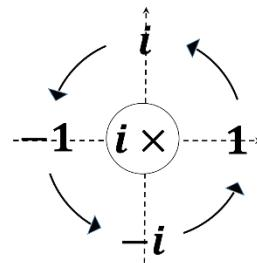

### 【8-2】 クォータニオンの導入 : ハミルトン劇場

#### 【8-2-1】 拡張複素数で複素 (3次元) 空間を回したい

ハミルトンは複素数を拡張して、虚数単位  $i$  の他に独立な別の虚数単位  $j$  を導入

52 あくまで筆者の想像(妄想)による過程であり、史実に基づいたものではありません。

 $(i^2 = j^2 = -1, \bar{i} = -i, \bar{j} = -j)$ 、 $1, i, j$  の 3 つの元で  $1 - i$  平面、 $1 - j$  平面、 $i - j$  平面それぞれの回転を表現できないか？と考えた（つまり複素平面を複素空間に拡張できないか？ってこと）。

「独立な異なる虚数単位  $i, j$ 」に違和感がある人もいると思う。新しい代数として拡張していっているので、うまく拡張できさえすればあとは「慣れ」ではあるのだが「複素数」を以下のように解釈することで別の虚数単位を導入するという拡張も違和感が減るかもしれない。

おさらい53 : 2 行 2 列の行列  $I = \begin{bmatrix} 0 & -1 \\ 1 & 0 \end{bmatrix}$  を考えると（この行列は上のおさらいで出てきた 2 次の回転行列で  $\theta = \frac{\pi}{2}$  としたものでもあることに注意）、 $I^2 = \begin{bmatrix} -1 & 0 \\ 0 & -1 \end{bmatrix} = -E$  ( $E$  は単位行列)となる（つまり 2 乗して -1）。また行列  $Z = xE + yI$  ( $x, y \in \mathbb{R}$ ) を考えると、 $Z = \begin{bmatrix} x & -y \\ y & x \end{bmatrix}$  なので、 $Z = 0$  となるのは  $x = y = 0$  のときのみ（つまり  $E$  と  $I$  は線形独立）。この行列  $Z = xE + yI$  に対し  $E$  を 1,  $I$  を  $i$  に対応させることで、複素数  $z = x + iy$  に対応させる事が可能となる。

ここでさらに別の行列 例えば  $J = \begin{bmatrix} 1 & -\sqrt{2} \\ \sqrt{2} & -1 \end{bmatrix}$  を考えると、 $J^2 = -E$  を満たし、この  $J$  を含め  $E, I, J$  が線形独立であることは容易に確かめられる。このような「複素数の拡張」（上の  $J$  の事）がうまく行くかどうかは別にして「違和感」のない表現もやろうと思えば可能ではある。

以下、ハミルトンがクォータニオンを発見するまでの過程54をたどってみよう。

ハミルトン :  $1 - i$  平面と  $1 - j$  平面の回転は当然できた。

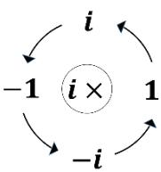

 $1 - i$  平面

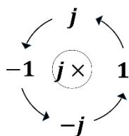

 $1 - j$  平面

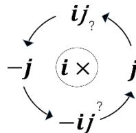

 $j - ij$  平面？

でも  $i - j$  平面がうまくいかない。 $i \times j$  の扱いがどうにもこうにも…

とりあえず  $i \times j$  を  $ij$  として回るようにはできたけど55、この  $ij$  って本来  $i$  にならないと  $i - j$  平面にはならない。でも  $ij = i$  としてしまうと  $i$  を掛けても  $-j$  にならずに  $-1$  となってうまく回らない。どうしたものか・・・

（ちなみに後に別の数学者により、このような  $1, i, j$  による「複素数の拡張」（三元数に相当）は、うまく行かない事が証明されている。）

53 詳細は第 5 講 付録 2 参照

54 くどいですが、筆者による想像（妄想）です

55  $i \times ij = i^2 j = -j$  ってこと

**[8-2-2] 4 次元? マジか 4 次元??**

ある日運河のほとりを歩いている時 (実話56) にひらめいた!

ちう一つ虚数単位  $k$  を導入して  $ij = k$  としてみよう。実数単位 1 と

虚数単位  $i, j, k$  で 4 次元になるけど、うまくいくかも・・・

回転面は  $1 - i$ ,  $1 - j$ ,  $1 - k$  平面,  $i - j$ ,  $j - k$ ,  $k - i$  平面の 6 面になるのか。

3 次元回転をうまく取り出すには、 $i - j$ ,  $j - k$ ,  $k - i$  平面の回転がこんな風になるといいのかな?

●  $i$  を掛けると? : 想定図のように  $j - k$  平面を回すため、 $ij = k$  としてみよう

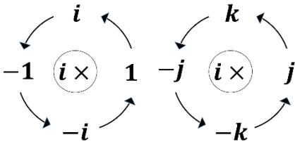

 $1 - i$  平面

うまく回すには、 $ij = k$ ,  $ik = -j$ 

お、 $j - k$  平面だけでなく $1 - i$  平面も同時に回るんだ。

そりゃそうか。しかもそれぞれの平面内で回りそうだ。

角度  $\theta$  の場合として「大きさ」1 の  $(\cos \theta + i \sin \theta)$  を

4 次元に拡張した「複素数」 $(w + ix + jy + kz)$  に

( $i^2 = -1$ ,  $ij = k$ ,  $ik = -j$  に注意して) 掛けてみよう。

$$\begin{aligned} w' + ix' + jy' + kz' &= (\cos \theta + i \sin \theta)(w + ix + jy + kz) \\ &= w \cos \theta + ix \cos \theta + jy \cos \theta + kz \cos \theta + iw \sin \theta - x \sin \theta + ky \sin \theta - jz \sin \theta \\ &= (w \cos \theta - x \sin \theta) + i(w \sin \theta + x \cos \theta) \\ &\quad + j(y \cos \theta - z \sin \theta) + k(y \sin \theta + z \cos \theta) \end{aligned} \quad (8-2-1)$$

確かに  $w - x$  平面 ( $1 - i$  平面 : 下から 2 行目)

と  $y - z$  平面 ( $j - k$  平面 : 下から 1 行目) が

それぞれの平面内で同時に別々に回っている57。

つまり、こういうこと

$$\begin{bmatrix} w' \\ x' \\ y' \\ z' \end{bmatrix} = \begin{bmatrix} \cos \theta & -\sin \theta & 0 & 0 \\ \sin \theta & \cos \theta & 0 & 0 \\ 0 & 0 & \cos \theta & -\sin \theta \\ 0 & 0 & \sin \theta & \cos \theta \end{bmatrix} \begin{bmatrix} w \\ x \\ y \\ z \end{bmatrix}$$

●  $j$  を掛けると? : 想定図のように  $k - i$  平面を回すため、 $jk = i$  としてみよう

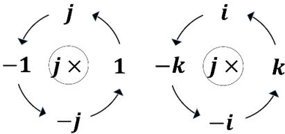

 $1 - j$  平面

 $k - i$  平面 : うまく回すには、 $jk = i, ji = -k$ 

およ。さっきの  $i$  を掛けて  $j - k$  平面をうまく回す条件  $ij = k$  と合わせると、 $ij = k, ji = -k$  となって、なんと積は可換じゃなくなる! マジか! まあしょうがないか…。

56 運河を渡る橋に  $i^2 = j^2 = k^2 = ijk = -1$  と刻んだとの事

57 ちなみに 4 次元では 2 本の直交する基底で張られる(回転)面を、基底を共有せずに 2 面とることができる (3 次元ではできない)。この場合  $1 - i$  平面と  $j - k$  平面は原点のみで交わっている事に注意。

角度  $\theta$  だと同様に :

$$(\cos \theta + j \sin \theta)(w + ix + jy + kz) = (w \cos \theta - y \sin \theta) + j(w \sin \theta + y \cos \theta) + k(z \cos \theta - x \sin \theta) + i(z \sin \theta + x \cos \theta) \quad (8 - 2 - 2)$$

ん、これも同時に別々に回っている。

● 残り  $k$  を掛けると？ : 想定図のように  $i - j$  平面を回すため、 $ki = j$  としてみよう

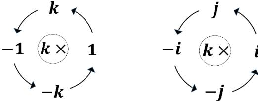

1 -  $k$  平面

 $i - j$  平面 : うまく回すには、 $ki = j, kj = -i$ 

これも角度  $\theta$  だと同様に :

$$(\cos \theta + k \sin \theta)(w + ix + jy + kz) = (w \cos \theta - z \sin \theta) + k(w \sin \theta + z \cos \theta) + i(x \cos \theta - y \sin \theta) + j(x \sin \theta + y \cos \theta) \quad (8 - 2 - 3)$$

● とりあえず分かったこと

虚数単位  $i, j, k$  に対して積を  $ij = k, ji = -k, jk = i, kj = -i, ki = j, ik = -j$  として  $w + ix + jy + kz$  に左から  $\cos \theta + i \sin \theta$  を掛けると、1 -  $i$  平面,  $j - k$  平面が同時に  $\theta$  回転する。 $j, k$  で回しても同様。このままだと 1 -  $i$  平面で余計な回転が発生し、最終的に実現したい純粋な 3 次元の回転を切り出せない。何かうまい方法はないのだろうか？

● そういえば非可換だった58

非可換なので、右から掛けたらどうなる？

右から  $i$  を掛けた場合 :

1 -  $i$  平面

 $j - k$  平面 : 逆向き

なんと 1 -  $i$  平面は同じ向きで、 $j - k$  平面は逆向きに回る！じゃあ  $-i$  だとその逆になるだろう。

$$\begin{bmatrix} w' \\ x' \\ y' \\ z' \end{bmatrix} = \begin{bmatrix} 1 & 0 & 0 & 0 \\ 0 & 1 & 0 & 0 \\ 0 & 0 & \cos \theta & -\sin \theta \\ 0 & 0 & \sin \theta & \cos \theta \end{bmatrix} \begin{bmatrix} w \\ x \\ y \\ z \end{bmatrix}$$

$$\therefore 1 \times i = i, \quad i \times i = -1$$

$$ji = -k, \quad ki = j$$

58 ハミルトン卿ご自身は、この積の非可換性（当時初？）あまりお気に召さなかったらしい

右から  $-i$  を掛けた場合 :

$$\begin{aligned} \therefore 1 \times (-i) &= -i, & -i \times (-i) &= -1 \\ j(-i) &= k, & k(-i) &= -j \end{aligned}$$

1  $-i$  平面 : 逆向き

 $j - k$  平面

これなら、左から  $i$  を、右から  $(-i)$  を掛けることで 1  $-i$  平面の回転だけを無くせそう。

● というわけで

左から  $i$  右から  $-i$  を掛けた場合 :

$$\begin{aligned} \therefore i \times 1 \times (-i) &= 1, & i \times i \times (-i) &= i \\ ij(-i) &= -j, & ik(-i) &= -k \end{aligned}$$

1  $-i$  平面 : 回転なし

 $j - k$  平面 : 2 倍回転

 $j - k$  平面は 2 倍回りそうだけど  $w$  やってみよう。

$$\begin{aligned} &(\cos \theta + i \sin \theta)(w + ix + jy + kz)(\cos \theta - i \sin \theta) \\ &= (\cos \theta + i \sin \theta)\{(w \cos \theta + x \sin \theta) + i(-w \sin \theta + x \cos \theta) + j(y \cos \theta - z \sin \theta) + k(y \sin \theta + z \cos \theta)\} \\ &= w \cos^2 \theta + x \sin \theta \cos \theta - (-w \sin^2 \theta + x \sin \theta \cos \theta) \\ &\quad + i(-w \sin \theta \cos \theta + x \cos^2 \theta) + j(y \cos^2 \theta - z \sin \theta \cos \theta) + k(y \sin \theta \cos \theta + z \cos^2 \theta) \\ &\quad + i(w \sin \theta \cos \theta + x \sin^2 \theta) + k(y \sin \theta \cos \theta - z \sin^2 \theta) - j(y \sin^2 \theta + z \sin \theta \cos \theta) \\ &= w(\cos^2 \theta + \sin^2 \theta) + ix(\cos^2 \theta + \sin^2 \theta) \\ &\quad + j\{y(\cos^2 \theta - \sin^2 \theta) - z(2 \sin \theta \cos \theta)\} + k\{y(2 \sin \theta \cos \theta) + z(\cos^2 \theta - \sin^2 \theta)\} \\ &= w + ix + j(y \cos 2\theta - z \sin 2\theta) + k(y \sin 2\theta + z \cos 2\theta) \quad (8 - 2 - 4) \end{aligned}$$

最後は倍角の公式を使った。これで  $j - k$  平面だけを回せた！

めでたしめでたし。2 倍回るけど  $w$ 

・・・ハミルトン劇場 終

こうなった

$$\begin{bmatrix} w' \\ x' \\ y' \\ z' \end{bmatrix} = \begin{bmatrix} 1 & 0 & 0 & 0 \\ 0 & 1 & 0 & 0 \\ 0 & 0 & \cos 2\theta & -\sin 2\theta \\ 0 & 0 & \sin 2\theta & \cos 2\theta \end{bmatrix} \begin{bmatrix} w \\ x \\ y \\ z \end{bmatrix}$$

### 【8-3】 クォータニオン : 定義と諸性質

#### 【8-3-1】 定義

ここまでをまとめる。独立な虚数単位 (  $\bar{i}$  は  $i$  の複素共役を表す)

$$i, j, k \quad (i^2 = j^2 = k^2 = -1, \quad \bar{i} = -i, \quad \bar{j} = -j, \quad \bar{k} = -k) \quad (8-3-1)$$

に対して、以下の非可換積を定義する。

$$\begin{cases} ij \equiv k & \begin{cases} jk \equiv i & \begin{cases} ki \equiv j \end{cases} \\ ji \equiv -k & \begin{cases} kj \equiv -i & \begin{cases} ik \equiv -j \end{cases} \end{cases} \end{cases} \quad (8-3-2)$$

複素数を拡張した 1 を含めた 4 つの元の数

$$q = q_0 + iq_x + jq_y + kq_z \quad (q_0, q_x, q_y, q_z \in \mathbb{R}) \quad (8-3-3)$$

をクォータニオン (四元数) という。和、スカラー積 ( $\beta \in \mathbb{R}$ ) を

$$p + q = p_0 + q_0 + i(p_x + q_x) + j(p_y + q_y) + k(p_z + q_z) \quad (8-3-4)$$

$$\beta q = \beta q_0 + i\beta q_x + j\beta q_y + k\beta q_z \quad (8-3-5)$$

と定義することで、4次元ベクトルとしてのベクトル空間の公理を満たす。

(4次元ベクトルではあるが複素数と同様に太字表記はしない)

その積は 4 次元における回転を表すが、クォータニオン  $q = \cos \frac{\theta}{2} + i \sin \frac{\theta}{2}$  を用いて

 $p = w + ix + jy + kz$  に左から  $q$ , 右から  $\bar{q}$  を掛けることで、 $j - k$  平面のみの  $\theta$  回転を得る。

$$p' = qp\bar{q} = w + ix + j(y \cos \theta - z \sin \theta) + k(y \sin \theta + z \cos \theta) \quad (8-3-6)$$

(  $\cos \frac{\theta}{2} + j \sin \frac{\theta}{2}, \cos \frac{\theta}{2} + k \sin \frac{\theta}{2}$  でも同様)

これにより、虚数部分を取り出すことで 3 次元の各座標軸まわりの回転の表現を得る。

以下、クォータニオンの性質についてまとめていく。ついでに任意軸まわりの回転に拡張するための準備を行う。

#### 【8-3-2】 スカラー+ベクトル表記

クォータニオン  $p = p_0 + ip_x + jp_y + kp_z$ ,  $q = q_0 + iq_x + jq_y + kq_z$  において積は

$$\begin{aligned} pq &= (p_0 + ip_x + jp_y + kp_z)(q_0 + iq_x + jq_y + kq_z) \\ &= p_0 q_0 - (p_x q_x + p_y q_y + p_z q_z) + p_0 (iq_x + jq_y + kq_z) + q_0 (ip_x + jq_y + kq_z) \\ &\quad + i(p_y q_z - p_z q_y) + j(p_z q_x - p_x q_z) + k(p_x q_y - p_y q_x) \end{aligned} \quad (8-3-7)$$

となる (なんじゃこりゃ! マジメンドクサイ! なんとかならんのか!)。よくみると実数部分の  $(p_x q_x + p_y q_y + p_z q_z)$  および虚数部分の  $i(p_y q_z - p_z q_y) + j(p_z q_x - p_x q_z) + k(p_x q_y - p_y q_x)$  は、それぞれ  $(p_x, p_y, p_z)$  と  $(q_x, q_y, q_z)$  をベクトルの成分とみなした場合の内積・外積のようだ。

試しに  $p = ip_x + jp_y + kp_z$ ,  $q = iq_x + jq_y + kq_z$ 

として、虚数部分同士の積をとってみる。

$$\begin{aligned} pq &= (ip_x + jp_y + kp_z)(iq_x + jq_y + kq_z) \\ &= -(p_x q_x + p_y q_y + p_z q_z) + i(p_y q_z - p_z q_y) + j(p_z q_x - p_x q_z) + k(p_x q_y - p_y q_x) \\ &= -p \cdot q + p \times q \end{aligned}$$

というふうに書けばだいぶましになりそうだ。

そこでクォータニオン  $q$  に対し、実数部  $q_0$  をスカラー、虚数部  $(q_x, q_y, q_z)$  を虚数単位  $i, j, k$  を基底とする (3 次元) ベクトルの成分とみなして、以下のように表記する。

$$q = q_0 + \mathbf{q}, \quad \mathbf{q} \equiv iq_x + jq_y + kq_z \quad (8-3-8)$$

また上記の積 (8-3-7)式は

$$\mathbf{p} \cdot \mathbf{q} \equiv p_x q_x + p_y q_y + p_z q_z \quad (8-3-9)$$

$$\mathbf{p} \times \mathbf{q} \equiv i(p_y q_z - p_z q_y) + j(p_z q_x - p_x q_z) + k(p_x q_y - p_y q_x) \quad (8-3-10)$$

という内積・外積の記法を用いれば

$$p q = p_0 q_0 - \mathbf{p} \cdot \mathbf{q} + p_0 \mathbf{q} + q_0 \mathbf{p} + \mathbf{p} \times \mathbf{q} \quad (8-3-11)$$

と書ける59。

こうすることで 3 次元ベクトルとみなした虚数部分に対して煩雑な成分での計算の見通しが良くなり、次項で述べるように内積・外積などベクトルの代数が適用でき、また回転の対象となる 3 次元ベクトルとの対応が明確になる。ただしこの「ベクトル」には上記で試しにやったクォータニオンとしての本来の「非可換積」も定義されており、内積・外積と混同しないように注意。この非可換性は、ベクトル表示した際の外積の部分に表れているのが (8-3-11)式からわかる。

スカラーである  $q_0$  とベクトルである  $\mathbf{q}$  を普通に加算した表記となっている事にギョッとする人もいるかも知れない。書物によっては  $p = (p_0, \mathbf{p})$ ,  $p + q = (p_0 + q_0, \mathbf{p} + \mathbf{q})$  のように成分表記記号を用いている場合もある。スカラー部とベクトル部は、それぞれ実数部と虚数部でもあり、複素数と同様に和に関しては もともと明らかに独立しているので、わざわざ成分に分けて書くまでもない。その意味では、スカラー部である実数部には、1 というベクトル部である虚数部とは別の基底があるとみてもいいし (実際この解釈で 4 次元ベクトルとしての内積における正規直交基底となることが後にわかる)、冒頭付近で説明したような行列表示も可能であり、実はそのような (単位行列も含めた) 行列が基底の実態だと考えてもいい。

### [8-3-3] ベクトル部の性質

$$\mathbf{a} = ia_x + ja_y + ka_z, \quad \mathbf{b} = ib_x + jb_y + kb_z, \quad \mathbf{c} = ic_x + jc_y + kc_z, \quad \beta \in \mathbb{R}$$

に対して、以下が成り立つ ( (ii) の性質はいずれも第 3 講と同様にして示すことができる)

(i) 複素共役

$$\bar{\mathbf{a}} = -\mathbf{a} \quad (8-3-12)$$

(ii) 内積・外積の性質

$$\mathbf{a} \cdot \mathbf{b} = \mathbf{b} \cdot \mathbf{a}, \quad \mathbf{a} \cdot (\mathbf{b} + \mathbf{c}) = \mathbf{a} \cdot \mathbf{b} + \mathbf{a} \cdot \mathbf{c}, \quad \mathbf{a} \cdot (\beta \mathbf{b}) = \beta \mathbf{a} \cdot \mathbf{b}, \quad \mathbf{a} \cdot \mathbf{a} \geq 0 \quad (8-3-13)$$

$$\mathbf{a} \times \mathbf{b} = -\mathbf{b} \times \mathbf{a}, \quad \mathbf{a} \times (\mathbf{b} + \mathbf{c}) = \mathbf{a} \times \mathbf{b} + \mathbf{a} \times \mathbf{c}, \quad \mathbf{a} \times (\beta \mathbf{b}) = \beta \mathbf{a} \times \mathbf{b} \quad (8-3-14)$$

$$\mathbf{a} \cdot (\mathbf{b} \times \mathbf{c}) = \mathbf{b} \cdot (\mathbf{c} \times \mathbf{a}) = \mathbf{c} \cdot (\mathbf{a} \times \mathbf{b}) \quad (8-3-15)$$

$$\mathbf{a} \times (\mathbf{b} \times \mathbf{c}) = (\mathbf{a} \cdot \mathbf{c})\mathbf{b} - (\mathbf{a} \cdot \mathbf{b})\mathbf{c} \quad (8-3-16)$$

$$(\mathbf{a} \times \mathbf{b}) \cdot (\mathbf{c} \times \mathbf{d}) = (\mathbf{a} \cdot \mathbf{c})(\mathbf{b} \cdot \mathbf{d}) - (\mathbf{a} \cdot \mathbf{d})(\mathbf{b} \cdot \mathbf{c}) \quad (8-3-17)$$

59 この積をハミルトン積という。実は歴史的にはベクトルの内積・外積は、このハミルトン積として初めて世に登場したそうな。なので、こっちが本家本元ということになる。

(iii) クォータ二オンとしての積の性質

$$ab = -a \cdot b + a \times b \quad (8-3-18)$$

演習ついでに後で  $qrq^{-1}$  の計算に使う3重積  $abc$  をここで求めておこう。

まずベクトルの外積がベクトルであることから、(8-3-18)式のベクトル  $b$  に外積されたベクトル  $b \times c$  を代入すると

$$a(b \times c) = -a \cdot (b \times c) + a \times (b \times c)$$

これに注意して3重積は、最後に(8-3-16)式を使うと

$$\begin{aligned} abc &= a(-b \cdot c + b \times c) \\ &= -(b \cdot c)a + a(b \times c) \\ &= -(b \cdot c)a - a \cdot (b \times c) + a \times (b \times c) \\ &= -(b \cdot c)a + (a \cdot c)b - (a \cdot b)c - a \cdot (b \times c) \end{aligned} \quad (8-3-19)$$

**[8-3-4] ノルム・逆元と積の性質**

● ノルムの定義

任意のクォータ二オン  $q$  と、その複素共役  $\bar{q}$  との積は

$$q\bar{q} = (q_0 + q)(q_0 - q) = q_0^2 - q_0q + q_0q - (-q \cdot q + q \times q) = q_0^2 + q \cdot q$$

なので

$$q\bar{q} = \bar{q}q = q_0^2 + q_x^2 + q_y^2 + q_z^2 \quad (8-3-20)$$

となり複素数と同様に  $q\bar{q} \geq 0$  であり、 $q\bar{q} = 0$  となるのは  $q = 0$  のときのみとなる。

よってこれを用いて自然なノルム（大きさ）を定義できる。

$$\|q\| \equiv \sqrt{q\bar{q}} \quad (\|q\| = 0 \Leftrightarrow q = 0) \quad (8-3-21)$$

● 逆元 ( $qq^{-1} = q^{-1}q = 1$  となるクォータ二オン  $q^{-1}$  のこと)

 $q \neq 0$  のとき  $q$  に  $\frac{\bar{q}}{\|q\|^2}$  を掛けると、ノルムの定義により  $q \frac{\bar{q}}{\|q\|^2} = \frac{\bar{q}}{\|q\|^2}q = 1$  となり  
複素数と同様に  $q$  の逆元となる。

$$q^{-1} = \frac{\bar{q}}{\|q\|^2} \quad (\text{ただし } q \neq 0) \quad (8-3-22)$$

● 複素共役、ノルム、逆元における積の性質

○積の複素共役は、順番が入れ替わった複素共役の積となる

$$\begin{aligned} \overline{(pq)} &= \overline{(p_0q_0)} - \overline{(p \cdot q)} + \overline{(p_0q)} + \overline{(q_0p)} + \overline{(p \times q)} \\ &= p_0q_0 - p \cdot q + p_0\bar{q} + q_0\bar{p} - (p \times q) \quad (\because r \equiv p \times q \rightarrow \bar{r} = -r) \\ &= q_0p_0 - q \cdot p + q_0\bar{p} + p_0\bar{q} + q \times p \\ &= \bar{q}_0\bar{p}_0 - \bar{q} \cdot \bar{p} + \bar{q}_0\bar{p} + \bar{p}_0\bar{q} + \bar{q} \times \bar{p} = \bar{q}\bar{p} \end{aligned}$$

$$\therefore \overline{(pq)} = \bar{q}\bar{p} \quad (8-3-23)$$

○積のノルムは、ノルムの積となる

$$\|pq\|^2 = (pq)(\overline{pq}) = (pq)(\bar{q}\bar{p}) = p(q\bar{q})\bar{p} = p\|q\|^2\bar{p} = p\bar{p}\|q\|^2 = \|p\|^2\|q\|^2$$

$$\therefore \|pq\| = \|p\|\|q\| \quad (8-3-24)$$

○積の逆元は、順番が入れ替わった逆元の積となる

$$(pq)^{-1} = \frac{(\overline{pq})}{\|pq\|^2} = \frac{\bar{q}\bar{p}}{\|p\|^2\|q\|^2} = q^{-1}p^{-1} \quad (8-3-25)$$

### [8-3-5] 単位クォータニオンと極形式

複素数では複素平面を極座標表示することで (大きさ 1 の) 複素数  $z$  の極形式  $z = \cos \theta + i \sin \theta$  を導入した。第 2 節ではこれを暗黙のうちに拡張適用していた。ここできちんと定式化しよう。

クォータニオン  $q = q_0 + iq_x + jq_y + kq_z$  において、ノルム (大きさ) が 1、すなわち

$$q\bar{q} = q_0^2 + q_x^2 + q_y^2 + q_z^2 = 1 \quad (8-3-26)$$

となるもの (あるいはノルムで割って正規化したもの :  $\hat{q} = q/\|q\|$  を改めて  $q$  としたもの) を

単位クォータニオンと呼ぶ。ノルムが 1 なので逆元は

$$q^{-1} = \frac{\bar{q}}{\|q\|^2} = \bar{q} \quad (8-3-27)$$

となる。 $q_0^2 + q_x^2 + q_y^2 + q_z^2 = 1$  は  $(q_0, q_x, q_y, q_z)$  を座標値とする 4 次元空間内の半径 1 の 3 次元球面 ( $S^3$ ) を表しており、以下の 4 次元極座標を導入することで自然に表現される。

$$\begin{cases} q_0 = \cos \psi \\ q_z = \sin \psi \cos \theta \\ q_x = \sin \psi \sin \theta \cos \phi \\ q_y = \sin \psi \sin \theta \sin \phi \end{cases} \quad (8-3-28)$$

( $0 \leq \psi \leq \pi$ ,  $0 \leq \theta \leq \pi$ ,  $0 \leq \phi < 2\pi$ )

(実際、 $q_x^2 + q_y^2 = \sin^2 \psi \sin^2 \theta$ ,  $q_z^2 + q_x^2 + q_y^2 = \sin^2 \psi$ ,  $q_0^2 + q_z^2 + q_x^2 + q_y^2 = 1$  となる。) 【注】

このうち  $(q_x, q_y, q_z)$  の部分は、 $q_x^2 + q_y^2 + q_z^2 = \sin^2 \psi$  であり、半径  $\sin \psi$  の 2 次元球面の 3 次元極座標表示でもある。その方向を示す 3 次元単位ベクトル ( $u_x^2 + u_y^2 + u_z^2 = 1$ )

$$\mathbf{u} = iu_x + ju_y + ku_z = i \sin \theta \cos \phi + j \sin \theta \sin \phi + k \cos \theta \quad (8-3-29)$$

を導入することで

$$\mathbf{q} = iq_x + jq_y + kq_z = \sin \psi (i \sin \theta \cos \phi + j \sin \theta \sin \phi + k \cos \theta) = \sin \psi \mathbf{u}$$

と書け、これを用いた単位クォータニオンのスカラー+ベクトル表記の極形式

$$q = q_0 + \mathbf{q} = \cos \psi + \sin \psi \mathbf{u} \quad (8-3-30)$$

を得る。なお、定義から  $\psi$  の定義域は  $0 \leq \psi \leq \pi$  であることに注意。

この定義で  $\mathbf{u}$  が標準基底のとき、例えば  $\mathbf{u} = (1, 0, 0)$  のときは  $q = \cos \psi + i \sin \psi$  となり、複素数の極形式の自然な拡張となっていることがわかる。

【注】 4 次元の極座標 ? 3 次元球面 ? とビビった人も居るかもしれない。

次元を落とすので、まずは 3 次元極座標と 2 次元球面を考える（上図左側）。図は 3 次元空間内の半径 1 の 2 次元球面（いわゆる球面）に対する、極角  $\theta$ , 方位角  $\phi$  の 3 次元の極座標を表している。半径 1 なので 2 次元球面上の点の  $z$  座標値は  $\cos\theta$  となり、この  $z$  座標で 2 次元球面を切断する（ $z$  をこの値で固定、すなわち  $z = \cos\theta$  なので  $\theta$  をこの値で固定する）と  $(x, y)$  座標値は半径が  $\sin\theta$  の 1 次元球面(円周)になる。この 1 次元球面(円周)を切り出したのが図の右側で、2 次元の極座標で半径  $\sin\theta$  の 1 次元球面(円周)を表示したものとなっている。

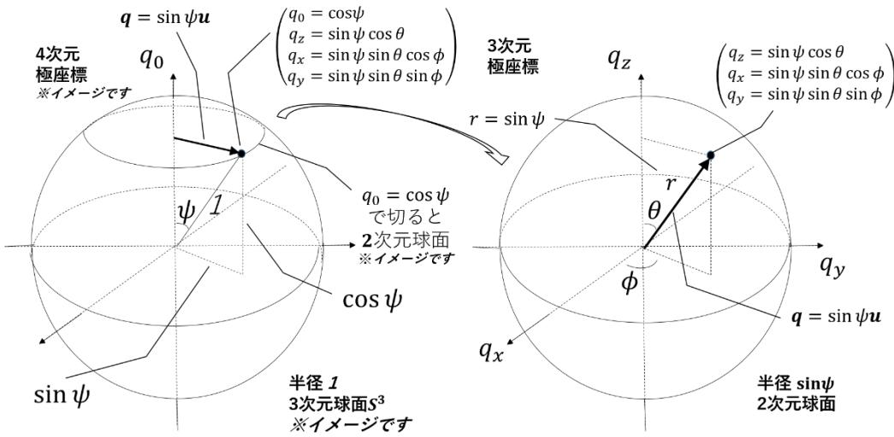

以上の話に対して次元をひとつ上げたものが上図となる。図の左側は 4 次元空間内の単位クォータニオンが成す半径 1 の 3 次元球面  $q_0^2 + q_x^2 + q_y^2 + q_z^2 = 1$  に対する極角  $\psi$  の 4 次元の極座標を表している（座標軸はそれぞれ  $q_0$  軸、 $q_x$  軸、 $q_y$  軸、 $q_z$  軸となる。4 次元の図は描けないので、次元を落として 3 次元の図で描かれている。※イメージです）。半径 1 なので 3 次元球面上の点の  $q_0$  座標値は  $\cos\psi$  となり、この  $q_0$  座標で 3 次元球面を切断する（ $\psi$  を固定する）と  $(q_x, q_y, q_z)$  座標値は半径が  $\sin\psi$  の 2 次元球面になる（左図での見た目は 1 次元球面として描かれている。※イメージです）。この 2 次元球面を切り出したのが図の右側で、3 次元の極座標で半径  $\sin\psi$  の 2 次元球面を表示したものとなっている。各座標軸は  $q_x, q_y, q_z$  を表し、極座標が指す大きさ  $\sin\psi$  の 3 次元ベクトルが  $\mathbf{q}$  で、その向きの単位ベクトルが  $\mathbf{u}$  となる。

**[8-3-6] 4次元ベクトルとしての内積**● 定義クォータ二オンの 4 次元ベクトルとしての内積は、クォータ二オン  $p, q$  に対して

$$p \cdot q \equiv \frac{1}{2}(p\bar{q} + q\bar{p}) \quad (8-3-31)$$

と定義することができる。これは第 3 講 【3-4】 例 2 で定義した複素数の内積の自然な拡張であり内積の公理を満たすことは容易にわかる。成分で表記すると  $p = p_0 + \mathbf{p}, q = q_0 + \mathbf{q}$  として

$$\begin{aligned} \frac{1}{2}(p\bar{q} + q\bar{p}) &= \frac{1}{2}\{(p_0 + \mathbf{p})(q_0 - \mathbf{q}) + (q_0 + \mathbf{q})(p_0 - \mathbf{p})\} \\ &= \frac{1}{2}(p_0q_0 - p_0\bar{q} + q_0\bar{p} - p\bar{q} + q_0p_0 - q_0\bar{p} + p_0\bar{q} - q\bar{p}) \\ &= p_0q_0 - \frac{1}{2}(-\mathbf{p} \cdot \mathbf{q} + \mathbf{p} \times \mathbf{q} - \mathbf{q} \cdot \mathbf{p} + \mathbf{q} \times \mathbf{p}) \\ &= p_0q_0 + \mathbf{p} \cdot \mathbf{q} = p_0q_0 + p_xq_x + p_yq_y + p_zq_z \end{aligned} \quad (8-3-32)$$

となり、4次元ベクトルに対する標準内積となる。また自身との内積をとるとノルムの 2 乗となる自然な内積であり、さらにこの内積を基底であるクォータ二オンの実数単位 1 および虚数単位  $i, j, k$  に対してとれば、これらが4次元ベクトル空間の正規直交基底をなすこともわかる。

● 回転による不変性任意の単位クォータ二オン  $s$  の左からの積による 4 次元における回転60で、この内積の値 (およびノルム) が不変であることを示す。回転により  $p' = sp, q' = sq$  と変換されるとすると、

$$\begin{aligned} p' \cdot q' &= \frac{1}{2}(p'\bar{q}' + q'\bar{p}') = \frac{1}{2}(sp\bar{sq} + sq\bar{sp}) = \frac{1}{2}(sp\bar{q}\bar{s} + sq\bar{p}\bar{s}) = s\frac{1}{2}(p\bar{q} + q\bar{p})\bar{s} \\ &= s(p \cdot q)\bar{s} = (p \cdot q)(s\bar{s}) = p \cdot q \end{aligned} \quad (8-3-33)$$

となり、不変となる61。

またこれにより自身との内積より求まるノルムも不変となることがわかる。 ■

● 幾何学的意味任意の非零クォータ二オン  $p, q$  の内積を考える。 $p = \|p\|\hat{p}, q = \|q\|\hat{q}$  と書けて (ここで  $\hat{p}, \hat{q}$  は単位クォータ二オン)、ある単位クォータ二オン  $s$  による回転  $\hat{p}' = s\hat{p}, \hat{q}' = s\hat{q}$  において、 $\hat{p}'$  を成分表示で  $\hat{p}'_0 = 1, \hat{p}' = \mathbf{0}$  に向けられたとする(実際、 $s = \hat{p}^{-1}$  で可能)。この時、回転後の  $p'$  と  $q'$  の 4 次元内積はノルムが不変なので  $p' \cdot q' = \|p'\|\|q'\|(\hat{p}'_0\hat{q}'_0 + \hat{p}' \cdot \hat{q}') = \|p\|\|q\|\hat{q}'_0$  となり、この値は  $\hat{q}'$  を極形式で表した際の極角 ( $\hat{p}'$  と  $\hat{q}'$  のなす角となる) を  $\psi$  とすれば、 $\|p\|\|q\|\cos\psi$  となる。この内積の値は (8-3-33)式により任意の単位クォータ二オンとの積による回転で不変となり、通常の幾何ベクトルの内積と同様な幾何学的意味を持つことがわかる。

60 4 次元の一般的な回転は実はさらに複雑で、単位クォータ二オンの左側からの積で表されるこの回転はその一部となる。付録 1 で概要を述べる。

61 成分表示  $p_0q_0 + \mathbf{p} \cdot \mathbf{q}$  としても不変となることを直接計算して確かめることができる。付録 2 参照。

**【8-4】 クオータ二オン : 3 次元回転の表現**

**[8-4-1] 任意軸まわりの回転**

以下のような単位クオータ二オン

$$q = q_0 + iq_x + jq_y + kq_z = q_0 + \mathbf{q} = \cos \frac{\psi}{2} + \sin \frac{\psi}{2} \mathbf{u} \quad (8-4-1)$$

$$(\mathbf{u} = iu_x + ju_y + ku_z, \quad u_x^2 + u_y^2 + u_z^2 = 1, \quad q_0 = \cos \frac{\psi}{2}, \quad \mathbf{q} = \sin \frac{\psi}{2} \mathbf{u}, \quad 0 \leq \frac{\psi}{2} \leq \pi)$$

(極角を  $\psi/2$  で表して定義より  $0 \leq \frac{\psi}{2} \leq \pi$  これを  $\psi$  でみれば  $0 \leq \psi \leq 2\pi$ , 混乱しないように)

および 3 次元空間内の任意の点 P の位置ベクトル  $\mathbf{r} = (x, y, z)$  を表すクオータ二オン

$$\mathbf{r} = r_0 + ix + jy + kz = r_0 + \mathbf{r} \quad (8-4-2)$$

において  $\mathbf{r} \rightarrow \mathbf{r}' = q\mathbf{r}q^{-1}$  となる積による変換を考える。

 $\mathbf{r}' = r'_0 + \mathbf{r}' = q\mathbf{r}q^{-1} = q(r_0 + \mathbf{r})q^{-1} = r_0 + q\mathbf{r}q^{-1}$  であり、以下のように  $q\mathbf{r}q^{-1}$  はベクトル部のみとなるので  $r'_0 = r_0$  となり  $r_0$  の値は影響しないので通常  $r_0 = 0$  として取り扱う。

$$\mathbf{r}' = q\mathbf{r}q^{-1} = (q_0 + \mathbf{q})\mathbf{r}(q_0 - \mathbf{q}) = (q_0 + \mathbf{q})(q_0\mathbf{r} - \mathbf{r}\mathbf{q}) = q_0^2\mathbf{r} + q_0(\mathbf{q}\mathbf{r} - \mathbf{r}\mathbf{q}) - q\mathbf{r}\mathbf{q}$$

$$= q_0^2\mathbf{r} + 2q_0(\mathbf{q} \times \mathbf{r}) - \{-(\mathbf{r} \cdot \mathbf{q})\mathbf{q} + (\mathbf{q} \cdot \mathbf{r})\mathbf{r} - (\mathbf{q} \cdot \mathbf{r})\mathbf{q} - \mathbf{q} \cdot (\mathbf{r} \times \mathbf{q})\} \quad (8-4-3a)$$

$$= (q_0^2 - \mathbf{q} \cdot \mathbf{q})\mathbf{r} + 2(\mathbf{q} \cdot \mathbf{r})\mathbf{q} + 2q_0(\mathbf{q} \times \mathbf{r}) \quad (8-4-3b)$$

$$= \left( \cos^2 \frac{\psi}{2} - \sin^2 \frac{\psi}{2} \right) \mathbf{r} + 2 \sin^2 \frac{\psi}{2} (\mathbf{u} \cdot \mathbf{r})\mathbf{u} + 2 \cos \frac{\psi}{2} \sin \frac{\psi}{2} (\mathbf{u} \times \mathbf{r}) \quad (8-4-3c)$$

$$= \cos \psi \mathbf{r} + (1 - \cos \psi)(\mathbf{u} \cdot \mathbf{r})\mathbf{u} + \sin \psi (\mathbf{u} \times \mathbf{r}) \quad (8-4-3)$$

となり、ロドリゲスの回転公式 (ベクトル表示) (7-4-3) 式と一致する。

ここで(8-4-3a)式へは (8-3-18)式より  $\mathbf{q}\mathbf{r} - \mathbf{r}\mathbf{q} = 2(\mathbf{q} \times \mathbf{r})$  また(8-3-19)式より  $\mathbf{q}\mathbf{r}\mathbf{q}$  を展開した。(8-4-3b)式へは (8-3-15)式より  $\mathbf{q} \cdot (\mathbf{r} \times \mathbf{q}) = \mathbf{r} \cdot (\mathbf{q} \times \mathbf{q}) = 0$  となることを用いた。

さらに(8-4-3c)式へは 極形式  $q_0 = \cos \frac{\psi}{2}, \mathbf{q} = \sin \frac{\psi}{2} \mathbf{u}$  を代入、最後の(8-4-3)式へは倍角・半角の公式を用いた。

以上により、単位クオータ二オン  $q = \cos(\psi/2) + \sin(\psi/2) \mathbf{u}$  を用い  $\mathbf{r} \rightarrow \mathbf{r}' = q\mathbf{r}q^{-1}$  として 回転軸  $\mathbf{u}$  のまわりに角度  $\psi$  だけ回転させる表現を得た。なお、変換式  $\mathbf{r}' = q\mathbf{r}q^{-1}$  において  $q$  を  $-q$  としても式は不変となり、この  $q$  と  $-q$  の異なる 2 つの単位クオータ二オンは同じ 3 次元回転を表現することに注意が必要となる。[8-4-4] 項にて詳しく調べる。

**[8-4-2] 3 次元回転の合成**

3 次元の点  $\mathbf{r}$  を単位クオータ二オン  $q_A, q_B$  により続けて回転させる事を考える。

 $\mathbf{r} \rightarrow \mathbf{r}' = q_A \mathbf{r} q_A^{-1}, \mathbf{r}' \rightarrow \mathbf{r}'' = q_B \mathbf{r}' q_B^{-1}$  において、以下を得る。

$$\mathbf{r} \rightarrow \mathbf{r}'' = q_B \mathbf{r}' q_B^{-1} = q_B (q_A \mathbf{r} q_A^{-1}) q_B^{-1} = (q_B q_A) \mathbf{r} (q_A^{-1} q_B^{-1}) = (q_B q_A) \mathbf{r} (q_B q_A)^{-1} \quad (8-4-4)$$

従って、単位クオータ二オン  $q_A, q_B$  による連続した回転に対し、その積  $q = q_B q_A$  が合成された回転となる。なお  $\|q_B q_A\| = \|q_B\| \|q_A\| = 1$  より積  $q_B q_A$  もまた単位クオータ二オンとなる。

**[8-4-3] 回転行列による表示**(8-4-3b)式 :  $\mathbf{r}' = (q_0^2 - \mathbf{q} \cdot \mathbf{q})\mathbf{r} + 2(\mathbf{q} \cdot \mathbf{r})\mathbf{q} + 2q_0(\mathbf{q} \times \mathbf{r})$  を線形変換の行列表示に書き直す。

$$\mathbf{r}' = \begin{bmatrix} x'_1 \\ x'_2 \\ x'_3 \end{bmatrix}, \quad \mathbf{r} = \begin{bmatrix} x_1 \\ x_2 \\ x_3 \end{bmatrix}, \quad \mathbf{q} = \begin{bmatrix} q_1 \\ q_2 \\ q_3 \end{bmatrix}$$

とすると

$$\begin{aligned} x'_i &= (q\mathbf{r}q^{-1})_i = (q_0^2 - \mathbf{q} \cdot \mathbf{q})x_i + 2 \sum_{j=1}^3 (q_j x_j) q_i + 2q_0 \sum_{k,j=1}^3 \varepsilon_{ikj} q_k x_j \\ &= \sum_{j=1}^3 \left\{ (q_0^2 - \mathbf{q} \cdot \mathbf{q})\delta_{ij} + 2q_i q_j - 2q_0 \sum_{k=1}^3 \varepsilon_{ijk} q_k \right\} x_j \end{aligned}$$

と書けるので、

$$R_{ij} = (q_0^2 - \mathbf{q} \cdot \mathbf{q})\delta_{ij} + 2q_i q_j - 2q_0 \sum_{k=1}^3 \varepsilon_{ijk} q_k \quad (8-4-5)$$

が回転行列となる。行列表記で書き下すと、

$$R = \begin{bmatrix} q_0^2 + q_1^2 - q_2^2 - q_3^2 & 2(q_1 q_2 - q_0 q_3) & 2(q_1 q_3 + q_0 q_2) \\ 2(q_2 q_1 + q_0 q_3) & q_0^2 - q_1^2 + q_2^2 - q_3^2 & 2(q_2 q_3 - q_0 q_1) \\ 2(q_3 q_1 - q_0 q_2) & 2(q_3 q_2 + q_0 q_1) & q_0^2 - q_1^2 - q_2^2 + q_3^2 \end{bmatrix} \quad (8-4-6)$$

なお 極形式  $q_0 = \cos \frac{\psi}{2}, q_i = \sin \frac{\psi}{2} u_i$  を(8-4-5)式、(8-4-6)式に代入すると当然口ドリゲスの回転公式の行列表示 (7-4-4)式、(7-4-5)式と一致する。

[▼C] 演習 : 実際に回転行列であることを確かめよう。(8-4-5)式とその転置行列との積をとると

$$\begin{aligned} (R^T R)_{ij} &= \sum_{k=1}^3 R_{ik}^T R_{kj} = \sum_{k=1}^3 R_{ki} R_{kj} \\ &= \sum_{k=1}^3 \left\{ (q_0^2 - \mathbf{q} \cdot \mathbf{q})\delta_{ki} + 2q_k q_i - 2q_0 \sum_{l=1}^3 \varepsilon_{kil} q_l \right\} \left\{ (q_0^2 - \mathbf{q} \cdot \mathbf{q})\delta_{kj} + 2q_k q_j - 2q_0 \sum_{m=1}^3 \varepsilon_{kjm} q_m \right\} \\ &= (q_0^2 - \mathbf{q} \cdot \mathbf{q})^2 \delta_{ij} + 2(q_0^2 - \mathbf{q} \cdot \mathbf{q})q_i q_j - 2q_0(q_0^2 - \mathbf{q} \cdot \mathbf{q}) \sum_{m=1}^3 \varepsilon_{ijm} q_m \\ &\quad + 2(q_0^2 - \mathbf{q} \cdot \mathbf{q})q_j q_i + 4(\mathbf{q} \cdot \mathbf{q})q_i q_j - 4q_0 \sum_{k,m=1}^3 \varepsilon_{kjm} q_k q_i q_m \\ &\quad - 2q_0(q_0^2 - \mathbf{q} \cdot \mathbf{q}) \sum_{l=1}^3 \varepsilon_{jil} q_l - 4q_0 \sum_{k,l=1}^3 \varepsilon_{kil} q_k q_j q_l + 4q_0^2 \sum_{k=1}^3 \sum_{l,m=1}^3 \varepsilon_{kil} q_l \varepsilon_{kjm} q_m \\ &= (q_0^2 - \mathbf{q} \cdot \mathbf{q})^2 \delta_{ij} + 4q_0^2 q_i q_j + 4q_0^2 \sum_{l,m=1}^3 (\delta_{ij} \delta_{lm} - \delta_{im} \delta_{jl}) q_l q_m \\ &= \{(q_0^2 - \mathbf{q} \cdot \mathbf{q})^2 + 4q_0^2(\mathbf{q} \cdot \mathbf{q})\} \delta_{ij} = (q_0^2 + \mathbf{q} \cdot \mathbf{q})^2 \delta_{ij} = \delta_{ij} \end{aligned}$$

となり、確かに  $R$  は 3 次の直交行列である。また(8-4-5)式あるいは(8-4-6)式は  $q_0 \rightarrow 1$ ,  $\mathbf{q} \rightarrow \mathbf{0}$  にて連続的に単位行列に移行することにより行列式の値は+1 となることがわかる。以上により  $R$  は回転行列となることが確かめられた。

### **[8-4-4] 単位クォータニオンのパラメータ領域**

[8-3-5]で定義した単位クォータニオンの極形式を用いて、そのパラメータ領域全体の構造をもとに、3次元回転全体とどのような関係になっているのかを調べよう。そのためには、まず4次元空間に埋め込まれた3次元球面 *S*3 の構造を知る必要がある。3次元球面は文字通り3次元の構造を持つが、4次元空間に埋め込まれているものであり3次元の住人である我々にとって直観的な理解は残念ながら難しい。先にみたように次元を落として考えるのがイメージを掴みやすいので、まずは「3次元空間に埋め込まれた2次元球面を2次元の住人にどうすれば説明できるか？」という観点で見てみよう。

2次元住人は2次元平面およびその上の直線や曲線、（中身の詰まった）多角形面や円盤を理解できる。2次元球面もその一部の領域は当然「面」として理解できるが、その「面は曲がって」いて「全体は繋がっている」と言われても「どっちに曲がっているのか？どうやって繋がるのか？」が理解できない。というわけで、まず思いつくのは2次元球面を赤道でぶった切って「北半球」と「南半球」に分け、それぞれを平面上にベタっと潰した2枚の円盤として提示するという手法だ。だが2次元住人にとっては「潰すって何をどっち向きに？」という話になる。話の筋は良さそうなので、説明の方法を考えよう。2次元住人も数学は理解できる（という設定でw）。

[8-3-5]でみたように3次元極座標の極角  $\theta$  一定で球面を切断すると半径  $\sin \theta$  の円周となり、この円周は2次元住人にもよく理解できる。そこでこの半径  $\sin \theta$  の円周を  $\theta$  の値を連続的に変化させながら、同心円として  $0 \leq \theta \leq \pi/2$  の範囲で集めていき 「北半球」 として半径 1 の円盤を構成す

る。この円盤の円周はちょうど元の2次元球面の「赤道」にあたることになる。同様にして今度は「南半球」として π/2 ≤ θ ≤ π の範囲で半径 1 の2枚めの円盤を構成する。この円盤の円周も元の2次元球面の「赤道」にあたり、2枚の円盤の円周上の点は同じ点を表すので、この2つの円周を同一視することで元の2次元球面を構成することになる。3次元住人の我々にとっては、この2枚の円盤を円周で貼り合わせ「膨らませれば」元の2次元球面になることは容易に理解できるが2次元住人にとっては「膨らませるったってどっち向きに膨らむの？」ということになってしまう。というわけでこの円周を同一視した2枚の円盤として2次元球面を理解してもらうことになる。

[8-3-5]でみたように 4 次元極座標の極角  $\psi$  一定で 3 次元球面を切断すると半径  $\sin \psi$  の球面となり、この球面は 3 次元住人にもよく理解できる。後の話の都合上極角を  $\frac{\psi}{2}$  で測ることにしよう。この半径  $\sin \frac{\psi}{2}$  の球面を  $\frac{\psi}{2}$  の値を連続的に変化させながら、同心球面として  $0 \leq \psi/2 \leq \pi/2$  の範囲で集めていき「北半球」として半径 1 の球体を構成する。この球体表面はちょうど元の 3 次元球面の「赤道面」にあたることになる。同様にして今度は「南半球」として  $\pi/2 \leq \psi/2 \leq \pi$  の範囲で半径 1 の 2 つの球体を構成する。この球体表面も元の 3 次元球面の「赤道面」にあたり、 2 つの球体表面上の点は同じ点を表すので、この 2 つの表面を同一視することで、元の 3 次元球面を構成することになる。4 次元住人のクォータニオンにとっては、この 2 つの球体を表面で貼り合わせ「膨らませれば」元の 3 次元球面になることは容易に理解できるが、3 次元住人にとっては「膨らませるったってどっち向きに膨らむの?」ということになってしまう。

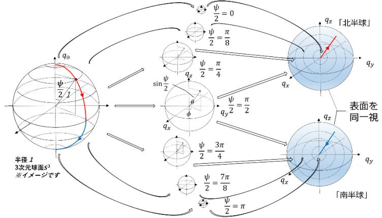

て半径 1 の球体を構成する。この球体表面はちょうど元の 3 次元球面の「赤道面」にあたることになる。同様にして今度は「南半球」として  $\pi/2 \leq \psi/2 \leq \pi$  の範囲で半径 1 の 2 つの球体を構成する。この球体表面も元の 3 次元球面の「赤道面」にあたり、 2 つの球体表面上の点は同じ点を表すので、この 2 つの表面を同一視することで、元の 3 次元球面を構成することになる。4 次元住人のクォータニオンにとっては、この 2 つの球体を表面で貼り合わせ「膨らませれば」元の 3 次元球面になることは容易に理解できるが、3 次元住人にとっては「膨らませるったってどっち向きに膨らむの?」ということになってしまう。

というわけでこの表面を同一視した 2 つの球体として 3 次元球面を理解してもらうことになる。

さて単位クォータニオンで構成された 3 次元球面  $S^3$  でもある、この 2 つの半径 1 の球体について調べよう。球体の（内部も含めた）各点は  $S^3$  から切り出された球面上の点でもあり、[8-3-5]でみたように 3 次元座標が  $(q_x, q_y, q_z)$  で表され、その座標点を位置ベクトル  $q$  で表すと、これは単位クォータニオンのベクトル部に相当し  $q = \sin \frac{\psi}{2} u$  の大きさは切り出した球面の半径  $\sin \frac{\psi}{2}$  となる。「北半球」の球体は範囲  $0 \leq \frac{\psi}{2} \leq \frac{\pi}{2}$  の、「南半球」の球体は範囲  $\frac{\pi}{2} \leq \frac{\psi}{2} \leq \pi$  の該当する  $\frac{\psi}{2}$  が元の単位クォータニオンの極角に相当し、その余弦としてスカラー部  $q_0 = \cos \frac{\psi}{2}$  を得る。 $q_0$  の値は「北半球」では球の中心から表面に向かい  $1 \geq q_0 \geq 0$ , 「南半球」では球の表面から中心に向かい  $0 \geq q_0 \geq -1$  となり、ベクトル部を表す  $q$  とともに  $q = q_0 + q$  として  $S^3$  上の単位クォータニオンに対応するという構造となる。

「幾何学的」には、「北半球」の球体の中心は  $S^3$  の「北極点」である  $q_0 = +1$ ,  $q = 0$  ( $\frac{\psi}{2} = 0$ ) に、同一視した両球体表面は  $S^3$  の「赤道面」である  $q_0 = 0$ ,  $\|q\| = 1$  ( $\frac{\psi}{2} = \frac{\pi}{2}$ ) に、「南半球」の球体の中心は  $S^3$  の「南極点」である  $q_0 = -1$ ,  $q = 0$  ( $\frac{\psi}{2} = \pi$ ) に、それぞれ対応する。

では 3 次元の回転との関係を調べよう。(8-4-3) 式は、単位クォータニオンを  $q = \cos \frac{\psi}{2} + \sin \frac{\psi}{2} u$  としたとき、変換  $r \rightarrow r' = qrq^{-1}$  が  $u$  を回転軸とした角度  $\psi$  の 3 次元回転を表し、これは回転ベクトルによる回転の表現であるロドリゲスの回転公式 (7-4-3) 式と同等だった。また[7-4-4]で

は回転ベクトルのパラメータ領域となる半径  $\pi$  の球体を調べることで 3 次元回転全体の構造を調べた。以上を元にまずは球体表面を除いた「北半球」の半径 1 の球体内部を調べよう。中心は無回転（基準姿勢）を表し、中心以外の球体内部の点  $q = \sin \frac{\psi}{2} u$  は  $u$  を回転軸とした回転角  $\psi$  の 3 次元回転を表し、球体表面を除いた「北半球」では  $0 \leq \frac{\psi}{2} < \frac{\pi}{2}$  すなわち  $0 \leq \psi < \pi$  の回転を表すことになる。 $u$  が真逆を向いている場合は逆向きの  $0 \leq \psi < \pi$  の回転を表すことになり、まさに回転ベクトルのパラメータ領域内部（半径  $\pi$  の球体表面以外）と 1 対 1 に対応している。

同一視する球体表面は後回しにして、「南半球」の球体内部を調べよう。「北半球」との一番の違いは極角の 2 倍となる 3 次元回転での回転角の範囲で、「北半球」が  $0 \leq \psi < \pi$  だったのに対し、「南半球」では  $\pi < \psi \leq 2\pi$  となることだ。つまりクォータニオンによる自然な回転の範囲は南北合わせて  $0 \leq \psi \leq 2\pi$  となる。逆向きの回転軸は逆向きの回転を表現するので、合わせていわば  $-2\pi \leq \psi \leq 2\pi$  の回転ということになり、回転ベクトルが表現する倍の範囲となる。思い出すべきは、任意の単位クォータニオン  $q$  に対し  $-q$  も全く同じ 3 次元回転を表していたことであり、 $q = (q_0, q_x, q_y, q_z)$  に対し  $(-q_0, -q_x, -q_y, -q_z)$  となるのでスカラー部の符号は変わり、ベクトル部は逆向きのベクトル ( $-q$  or  $-u$ ) となる。これは図のように 4 次元空間で原点対称な点すなわち  $S^3$  上での対蹠点同士となり、その極角は  $\frac{\psi}{2}$  に対して  $\pi - \frac{\psi}{2}$  で表されることになる。実際  $\cos(\pi - \frac{\psi}{2}) = -\cos \frac{\psi}{2}$  よりスカラー部の符号は変わり、 $\sin(\pi - \frac{\psi}{2}) = \sin \frac{\psi}{2}$  より長さ（半径）が同じとなる「北半球」の  $\sin \frac{\psi}{2} u$  が指す点と、反対向きである「南半球」の  $\sin \frac{\psi}{2} (-u)$  が指す点にあたり、互いに逆向きの回転となる同じ 3 次元回転後の姿勢を表すことになる。つまり「南半球」の球内の各点もまた「北半球」と同様に回転ベクトルのパラメータ領域内部と 1 対 1 に対応する。

後回しにした「赤道面」である同一視した球体表面は、「南半球」で議論したように同じ半径でベクトルの向きが逆になる点、つまり球体表面上の対蹠点同士が互いに逆向きの  $\pi$  回転となる 3 次元回転を表すことになる。回転ベクトルの場合は同一視した逆向きの  $\pi$  回転に対して、単位クォータニオンの自然なパラメータ領域としては別々の  $\pm q$  として対応していることになる。

以上により単位クォータニオンのパラメータ領域全体は、「南北半球」の内部と「赤道面」を合わせて 3 次元回転全体を過不足なくピッタリ 2 回「覆う」対応となることがわかった。このことを二重被覆 (double covering) であるという。どう応用するのかは使い方次第といったところか。回転の合成や次項の補間などで  $\pi$  回転を超える場合便利な一方、注意しないと大混乱となる。

前講で小グモに調べてもらった「つながり具合」も確認しておこう。まず  $S^3$  あるいは可視化した「南北半球」である 2 つの球体自体は連結かつ単連結62（2 つの球体はその表面でつながっていることに注意）であることがわかる。以下の図は 3 次元回転である  $z$  軸まわりの 1 回転、2 回転で何が起きているのかを示している。読者も色々な図を描いてみて各自で理解を深めて頂きたい。

**[8-4-5] 球面線形補間**

クォータニオンの大きな利点の一つが、比較的容易に補間を実現できる事にある。

この項では最も簡単な 2 つの回転を繋ぐ補間について解説するが、まずそもそも「補間」とは何か？という話を簡単にしておこう。読んで字の如く「間を補う」ことであり、本来は離散的（不連続）にしか存在しないデータの組を連続的に変化したものとみなしてデータ間を「なめらか」につなぎ、存在しないデータ間の値として補う手法のことである。

2 つの単位クォータニオン  $p, q$  により表現された回転をつなぐ補間を考えてみよう。 $r(t)$  を回転  $p$  から回転  $q$  へのパラメータ  $t$  ( $0 \leq t \leq 1, t \in \mathbb{R}$ ) を持つ補間を表す単位クォータニオンとし（つまり  $r(t)$  自体もまた回転を表す）、以下のような線形結合関係があるものとする。

$$r(t) = \alpha(t)q + \beta(t)p \quad (\alpha, \beta \in \mathbb{R}) \begin{cases} r(0) = p \\ r(1) = q \end{cases} \quad (8-4-7)$$

 $p, q, r$  は単位クォータニオンなので 3 つとも半径 1 の  $S^3$  上の点であり、 $r(t)$  を  $p$  と  $q$  を結ぶ  $S^3$  上の「大円」の一部となるようにとるとする。（左の図は  $S^3$  上の  $p, q, r$  を、次元を落とした  $S^2$  上の点として描いたイメージ図となる。）このような補間を**球面線形補間**と言う。なお  $q = \pm p$  の場合は  $r(t)$  は定まらないので  $q \neq \pm p$  とする。

ここで  $S^3$  の中心  $O$  と  $p, q$  の成す角  $\psi$  （の余弦）は 4 次元空間のベクトルである単位クォータニオンの 4 次元ベクトルとしての内積において以下のように求まる。

$$p \cdot q = \frac{1}{2}(p\bar{q} + q\bar{p}) = \|p\| \|q\| \cos \psi = \cos \psi \quad (8-4-8)$$

62 ちなみに「単連結な閉じた 3 次元物体（多様体）は  $S^3$  だけ（正確には $S^3$ と同相）」というのが有名なポアンカレ予想で 2002~3 年にペレルマンにより肯定的に解決された

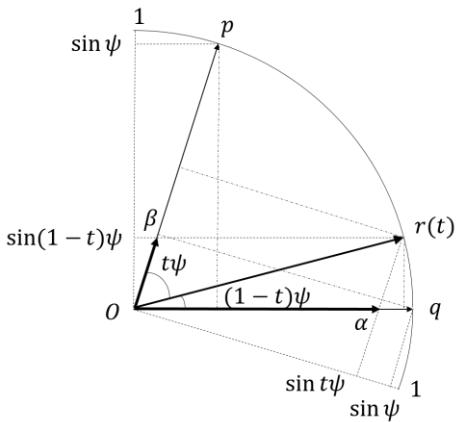

図はこの中心  $O$  と単位クォータニオン  $p, r, q$  が作る 2 次元平面(半径 1 の扇型)を切り出したものであり、角  $\psi$  が  $r(t)$  によって分けられた角をそれぞれ  $t\psi, (1-t)\psi$  とする63。この図において、ベクトルとしての  $r(t)$  をベクトル  $p, q$  の線形結合で表したのが (8-4-7)式であり、その係数  $\alpha(t), \beta(t)$  は  $p, q$  のノルムが 1 であることから図の  $\overline{\alpha}, \overline{\beta}$  の長さとなり、幾何学的に求める事ができる。

点  $q, r$  から  $\overline{\alpha}$  におろした垂線の長さは、 $\overline{\alpha}, \overline{\alpha}$  の長さが 1 なのでそれぞれ  $\sin\psi, \sin t\psi$  となる。 $\sin\psi : \sin t\psi = \overline{\alpha} : \overline{\alpha}$  なので、 $\overline{\alpha}$  の長さ 1 より  $\alpha(t) = \frac{\sin t\psi}{\sin\psi}$  を得る。同様に点  $p, r$  から  $\overline{\alpha}$  におろした垂線の長さは、 $\overline{\alpha}, \overline{\alpha}$  の長さが 1 なのでそれぞれ  $\sin\psi, \sin(1-t)\psi$  となる。 $\sin\psi : \sin(1-t)\psi = \overline{\alpha} : \overline{\alpha}$  なので、 $\overline{\alpha}$  の長さ 1 より  $\beta(t) = \frac{\sin(1-t)\psi}{\sin\psi}$  を得る。

以上により

$$r(t) = \frac{\sin t\psi}{\sin\psi} q + \frac{\sin(1-t)\psi}{\sin\psi} p \quad (8-4-9)$$
( $t \in \mathbb{R}, 0 \leq t \leq 1$ ,  $\cos\psi = p_0 q_0 + p_x q_x + p_y q_y + p_z q_z$ )

となる単位クォータニオンの球面線形補間を得た。

なお前項でみたように、 $s^3$  上の対蹠点同士となる単位クォータニオンの対は 3 次元上では同じ回転を表していた。従って補間の対象となる 3 次元上での回転が  $s^3$  上では対蹠点側の単位クォータニオンでもあり得ることに注意が必要となる。右の図はその例で、3 次元の回転  $P, Q$  とそれを表す  $s^3$  上の単位クォータニオン  $p, q$  および対蹠点上の  $-p, -q$  を図示したもので、仮に 3 次元の回転  $P, Q$  に対する角度  $2\psi$  での補間  $P \rightarrow Q$  を求めたい場合、 $s^3$  上で  $p \rightarrow q$  または  $-p \rightarrow -q$  であれば意図通りとなるが、そうでない場合は、反対回りの  $2\pi - 2\psi$  回転となる補間を得ることになってしまう。回転の結果としてはどちらも同じ  $P \rightarrow Q$  だが間の情報が主となる補間では違いは重要となる。このような場合は、4 次元内積  $p \cdot q = \cos\psi$  の符号により、どちら側の補間に当たるのかを区別できることになる。

また代数的にも

$$r(t) = (qp^{-1})^t p \quad (8-4-10)$$

という式により、上記と全く同じ補間を表すことが知られている。

付録 3 にて (8-4-9)式と同値な式であることを示し、この式の意味を解説する。

63 角度を線形に分割することで「角速度」が一定となり、球面上の「速度」が一定な補間となる。

**【8-5】 [▼]付録 1 : 一般的な 4 次元の回転について**

4 次元の回転は、本講の趣旨（3 次元回転）および本講座の程度を超えるので、ここでは概要の説明にとどめる。以下の表は 2 · 3 · 4 次元における回転の自由度、固有値、回転行列の例を示す。なお各次元の回転行列の例に対しその固有方程式を解くと、それぞれの固有値を得ることに注意。

| 次元 $n$ | 自由度 $\frac{1}{2}n(n-1)$ | 固有値                              | 回転行列の例                                                                                                                                                                                                                    |
|--------|-------------------------|----------------------------------|---------------------------------------------------------------------------------------------------------------------------------------------------------------------------------------------------------------------------|
| 2      | 1                       | $e^{\pm i\theta}$                | $\begin{bmatrix} \cos \theta & -\sin \theta \\ \sin \theta & \cos \theta \end{bmatrix} \begin{bmatrix} x \\ y \end{bmatrix}$                                                                                              |
| 3      | 3                       | $1, e^{\pm i\theta}$             | $\begin{bmatrix} 1 & 0 & 0 \\ 0 & \cos \theta & -\sin \theta \\ 0 & \sin \theta & \cos \theta \end{bmatrix} \begin{bmatrix} x \\ y \\ z \end{bmatrix}$                                                                    |
| 4      | 6                       | $e^{\pm i\theta}, e^{\pm i\phi}$ | $\begin{bmatrix} \cos \theta & -\sin \theta & 0 & 0 \\ \sin \theta & \cos \theta & 0 & 0 \\ 0 & 0 & \cos \phi & -\sin \phi \\ 0 & 0 & \sin \phi & \cos \phi \end{bmatrix} \begin{bmatrix} w \\ x \\ y \\ z \end{bmatrix}$ |

表 8-5-1

- • 回転の自由度 : 単位クォータニオンの成分の独立な自由度 3 の倍の 6 であり、単位クォータニオンの左からの積で表される回転は 4 次元の一般の回転の一部（自由度は半分）であることがわかる。
- • 固有値 :  $e^{\pm i\theta}, e^{\pm i\phi}$  となることが知られており、2 次元や 3 次元での回転角に相当する量が独立に 2 つあることを示唆している。一般の回転では回転軸に相当する実固有ベクトルは存在しない。
- • 回転行列の例 : w-x 面と y-z 面がそれぞれ独立に角度  $\theta, \phi$  で回転していることがわかる。回転面であるこの 2 面は原点のみで交わっていることに注意。この例のような 4 次元の一般の回転は **double-rotation** と呼ばれる。このうち、 $\phi = \pm \theta$  となる特殊な回転を **isoclinic-rotation** といい、 $\theta = 0$  or  $\phi = 0$  となる特殊な回転を **simple-rotation** という。

任意のクォータニオン  $p$  に対して単位クォータニオン  $\cos \theta + i \sin \theta$  ( $\mathbf{u} = (1,0,0)$ ) を用いて、左から  $q_\alpha = \cos \alpha + i \sin \alpha$ , 右から  $q_\beta = \cos \beta + i \sin \beta$  を掛けると、第 2 節でみたようにそれぞれ

$$p' = q_\alpha p : \begin{bmatrix} \cos \alpha & -\sin \alpha & 0 & 0 \\ \sin \alpha & \cos \alpha & 0 & 0 \\ 0 & 0 & \cos \alpha & -\sin \alpha \\ 0 & 0 & \sin \alpha & \cos \alpha \end{bmatrix}, \quad p' = p q_\beta : \begin{bmatrix} \cos \beta & -\sin \beta & 0 & 0 \\ \sin \beta & \cos \beta & 0 & 0 \\ 0 & 0 & \cos \beta & \sin \beta \\ 0 & 0 & -\sin \beta & \cos \beta \end{bmatrix} \quad \text{を表す。}$$

これは、上記のそれぞれ  $\phi = +\theta, \phi = -\theta$  にあたる isoclinic-rotation となる。

また左右から掛けると

$$p' = q_\alpha p q_\beta : \begin{bmatrix} \cos(\alpha + \beta) & -\sin(\alpha + \beta) & 0 & 0 \\ \sin(\alpha + \beta) & \cos(\alpha + \beta) & 0 & 0 \\ 0 & 0 & \cos(\alpha - \beta) & -\sin(\alpha - \beta) \\ 0 & 0 & \sin(\alpha - \beta) & \cos(\alpha - \beta) \end{bmatrix} \quad \text{を表し、} \theta = \alpha + \beta, \phi = \alpha - \beta$$

である double-rotation となる。

さらに上記において  $\beta = -\alpha$  つまり  $q_\beta = q_{-\alpha} = q_\alpha^{-1}$  のとき  $p' = q_\alpha p q_\alpha^{-1}$  は  $\theta = 0, \phi = 2\alpha$  である simple-rotation にあたり、固有値は  $1, e^{\pm i2\alpha}$  となり 4 次元空間に埋め込まれた実回転軸を持つ 3 次元回転を表すことになる。これらのことは第 2 節で行った計算と同様にして確かめることができる。

このように自由度がそれぞれ 3 である互いに独立した単位クォータニオンを左右から掛けることで、合計の自由度が 6 となる 4 次元の一般的な回転が生成されることになる。

ついでにこの左右からの積で表された 4 次元の一般の回転に対しても、(8-3-31) 式で定義した 4 次元内積は不変となることを示す。

 $p, q$  を任意のクォータニオン、 $r, s$  を任意の単位クォータニオンとする。 $p, q$  が  $r, s$  により

 $p' = rps, q' = rqs$  とそれぞれ回転させられたとき、4 次元内積  $p \cdot q = \frac{1}{2}(p\bar{q} + q\bar{p})$  は

$$\begin{aligned} p' \cdot q' &= \frac{1}{2}(p'\bar{q}' + q'\bar{p}') = \frac{1}{2}\{(rps)(rqs) + (rqs)(rps)\} = \frac{1}{2}(rps\bar{s}\bar{q}\bar{r} + rqs\bar{s}\bar{p}\bar{r}) \\ &= r\left\{\frac{1}{2}(p\bar{q} + q\bar{p})\right\}\bar{r} = r(p \cdot q)\bar{r} = (p \cdot q)r\bar{r} = p \cdot q \end{aligned} \quad (8-5-1)$$

となり、題意は示された。 ■

**【8-6】 付録 2 : 成分表示における 4 次元内積の不変性について**

任意の単位クォータニオン  $s$  の左からの積による回転  $p' = sp, q' = sq$  に対し、4 次元内積  $p \cdot q$  の成分表示  $p_0q_0 + p \cdot q$  の値も不変であること直接計算して確かめよう。

$$\begin{aligned} p' &= sp = s_0p_0 - s \cdot p + s_0p + p_0s + s \times p \\ &\therefore p'_0 = s_0p_0 - s \cdot p, \quad p' = s_0p + p_0s + s \times p \\ q' &= sq = s_0q_0 - s \cdot q + s_0q + q_0s + s \times q \\ &\therefore q'_0 = s_0q_0 - s \cdot q, \quad q' = s_0q + q_0s + s \times q \end{aligned}$$

において回転後の 4 次元内積の成分表示は、以下のようになる。

$$\begin{aligned} p'_0q'_0 + p' \cdot q' &\quad (= p' \cdot q') \\ &= (s_0p_0 - s \cdot p)(s_0q_0 - s \cdot q) + (s_0p + p_0s + s \times p) \cdot (s_0q + q_0s + s \times q) \\ &= s_0^2p_0q_0 - s_0p_0s \cdot q - s_0q_0s \cdot p + (s \cdot p)(s \cdot q) \\ &\quad + s_0^2p \cdot q + s_0q_0p \cdot s + s_0p \cdot (s \times q) \\ &\quad + s_0p_0s \cdot q + p_0q_0s \cdot s + p_0s \cdot (s \times q) \\ &\quad + s_0q \cdot (s \times p) + q_0s \cdot (s \times p) + (s \times p) \cdot (s \times q) \end{aligned}$$

上記最後の式で、1 行目の第 2 項、第 3 項は、それぞれ 3 行目の第 1 項、2 行目の第 2 項と打ち消しあう。また 3 行目第 3 項と 4 行目第 2 項のスカラー3 重積は、サイクリックに入れ替えることで  $s \times s$  となり消える。さらに 2 行目第 3 項と 4 行目第 1 項もサイクリックに入れ替えることで打ち消し合うことがわかる。最後に 4 行目第 3 項は、(8-3-17)式を用いて展開すると  $(s \cdot s)(p \cdot q) - (s \cdot p)(s \cdot q)$  となり、この第 2 項は上記最後の式の 1 行目第 4 項と打ち消し合う。

結局多くの項が消えて残るのは

$$\begin{aligned} &= s_0^2p_0q_0 + s_0^2(p \cdot q) + p_0q_0(s \cdot s) + (s \cdot s)(p \cdot q) \\ &= s_0^2(p_0q_0 + p \cdot q) + (s \cdot s)(p_0q_0 + p \cdot q) \\ &= (s \cdot s)(p_0q_0 + p \cdot q) \\ &= p_0q_0 + p \cdot q \quad (= p \cdot q) \end{aligned}$$

となり題意は確かめられた。

**【8-7】 [▼A]付録 3 : オイラーの公式と代数的補間式について**(8-4-10) 式である代数的補間式の話の前に、前講の付録まで続けてきたオイラーの公式シリーズ最終話として、クォータ二オン表示について考えよう。単位クォータ二オンの極形式を改めて眺めると

$$q = \cos \psi + \sin \psi u$$

ほれほれ、そう思ってみたら、そう見えてくるよね？ というわけで (?)、シリーズの式

 $e^{\theta i} = \cos \theta + \sin \theta i$ ,  $e^{\theta l} = \cos \theta + \sin \theta l$  との類推から  $u^n$  を考えてみると

$$u^2 = -u \cdot u + u \times u = -1, \quad u^3 = -u, \quad u^4 = 1, \quad u^5 = u, \quad \dots$$

となるので、 $u^0 \equiv 1$  として以下のように「単位クォータ二オン指数関数」を定義すると

$$e^{\psi u} \equiv \sum_{n=0}^{\infty} \frac{\psi^n}{n!} u^n \quad (8-7-1)$$

$$e^{\psi u} = 1 + \psi u - \frac{\psi^2}{2!} - \frac{\psi^3}{3!} u + \frac{\psi^4}{4!} + \frac{\psi^5}{5!} u - \dots = \left(1 - \frac{\psi^2}{2!} + \frac{\psi^4}{4!} - \dots\right) + \left(\psi - \frac{\psi^3}{3!} + \frac{\psi^5}{5!} - \dots\right) u$$

よって

$$e^{\psi u} = \cos \psi + \sin \psi u \quad (8-7-2)$$

として、オイラーの公式のクォータ二オン版を得る。 $e^{\psi u}$  自体が単位クォータ二オンとなる。なお行列指数関数と同様一般的には  $e^{\psi u} e^{\phi v} \neq e^{\psi u + \phi v}$  であることに注意。これは行列と同様  $u, v$  の積が可換ではないからであり、 $e^{\psi u} e^{\phi u} = e^{(\psi + \phi)u}$  が成り立つことは、展開してみればわかる。

そもそもクォータ二オンは複素数の拡張だったわけで、(8-7-2)式はオイラーの公式の由緒正しき拡張ともいえる。実際、 $u = u_x i + u_y j + u_z k$  において、 $(u_x, u_y, u_z) = (1, 0, 0)$  とすれば単位クォータ二オンの極形式は  $q = \cos \psi + \sin \psi u = \cos \psi + i \sin \psi$  だったわけで、 $e^{\psi u} = e^{i\psi}$  となり、 $e^{i\psi} = \cos \psi + i \sin \psi$  としてオイラーの公式に帰着する。

さて本付録のもうひとつの主題であり、(8-4-10) 式でもある以下の代数的補間式に進もう。

$$r(t) = (qp^{-1})^t p$$

補間の目的である、それぞれ 3 次元回転を表す単位クォータ二オン  $p, q$  をなめらかに繋ぎ、その間の回転を表す単位クォータ二オン  $r(t)$  としてこのような式を考えてみる。パラメータ  $t \in \mathbb{R}$  は  $0 \leq t \leq 1$  の範囲を動き、 $r(0) = (qp^{-1})^0 p = p$ ,  $r(1) = (qp^{-1})^1 p = q$  は満たしそうな気もする。だがそもそもクォータ二オンの冪乗はどのように定義されるのだろうか？ 非零クォータ二オン  $s$  は、そのノルム  $\|s\|$  を用いて  $s = \|s\| \hat{s}$  として書ける。ここで  $\hat{s}$  は単位クォータ二オンである。この単位クォータ二オンを極形式で表し、オイラーの公式を適用すれば  $\hat{s} = \cos \psi + \sin \psi u = e^{\psi u}$  と書けるので、元のクォータ二オンは  $s = \|s\| e^{\psi u}$  と書けることになる。これを利用して**クォータ二オンの実冪乗**を

$$s^t \equiv \|s\|^t e^{t\psi u} = \|s\|^t (\cos t\psi + \sin t\psi u) \quad (0 \leq t \leq 1, t \in \mathbb{R}) \quad (8-7-3)$$

と定義しよう。ただし今必要なのは  $0 \leq t \leq 1$  なので、その範囲でということで64。

64 厳密には複素数の冪関数のときと同様に対数関数も導入したうえで定義し、さらに多価評価とかも議論すべきなのだろうが、ここでは  $0 \leq t \leq 1$  (つまり  $0 \leq t\psi \leq \psi \leq \pi$ ) なので これでよしってことで

冪乗の定義ができたので、(8-4-10) 式  $r(t) = (qp^{-1})^t p$  の具体的な内容を求めてみよう。

まずわかることは、冪乗の定義から以下は確かに成り立つということである。

$$r(0) = (qp^{-1})^0 p = p, \quad r(1) = (qp^{-1})^1 p = q \quad (8-7-4)$$

次に計算を簡単にするために、単位クオータ二オンの積による（回転での）「座標変換」を行おう。

式をぐっと睨むと、 $p, q, r$  の右側から  $p^{-1}$  を掛ける変換をすればよさそうなことがわかる。

$$p \rightarrow p' = pp^{-1} = 1, \quad q \rightarrow q' = qp^{-1}, \quad r \rightarrow r' = rp^{-1} = (qp^{-1})^t pp^{-1} = q'^t \quad (8-7-5)$$

計算が済んだら戻してあげればよい。この「座標系」での  $q'$  の極形式を

$$q' = \cos \psi + \sin \psi u = e^{\psi u} \quad (8-7-6)$$

としよう。今、 $p', q'$  の 4 次元内積をとると  $p' = 1$  より

$$p' \cdot q' = q'_0 = \cos \psi \quad (= p \cdot q) \quad (8-7-7)$$

となり、付録 1 (8-5-1) より単位クオータ二オンの右側からの積においても 4 次元内積は不変となるので、 $p \cdot q$  としても得られることになる。 $r'$  は

$$r' = q'^t = e^{t\psi u} = \cos t\psi + \sin t\psi u \quad (8-7-8)$$

となり、元の「座標系」に戻して

$$q = q'p = \cos \psi p + \sin \psi up, \quad r = r'p = \cos t\psi p + \sin t\psi up$$

より、 $q$  の式から得られる  $up = \frac{1}{\sin \psi} (q - \cos \psi p)$  を  $r$  の式に代入すれば

$$r = \cos t\psi p + \sin t\psi \frac{1}{\sin \psi} (q - \cos \psi p) = \frac{\sin t\psi}{\sin \psi} q + \frac{\sin \psi \cos t\psi - \cos \psi \sin t\psi}{\sin \psi} p$$

よって

$$r(t) = \frac{\sin t\psi}{\sin \psi} q + \frac{\sin(1-t)\psi}{\sin \psi} p, \quad \cos \psi = p \cdot q \quad (8-7-9)$$

となり、(8-4-9)式と同じ式を得る。

では  $r(t) = (qp^{-1})^t p$  の意味を考えよう。そもそも補間  $p \rightarrow q$  とは  $p$  が表す姿勢  $P$  から  $q$  が表す姿勢  $Q$  へのなめらかな変換であり、これは姿勢  $P$  を基準姿勢とした場合の姿勢  $Q$  への連続した回転に他ならない。姿勢  $P$  を基準とした姿勢  $P, Q$  は、それぞれ  $p' = pp^{-1} = 1, q' = qp^{-1}$  で表され  $r'(t): 1 \rightarrow q'$  ( $t: 0 \rightarrow 1$ ) となる単位クオータ二オンが得られれば、 $r = r'p$  として求める補間を得ることになる。この  $r'(t)$  として  $q'^t$  を考えると  $t = 0$  の無回転状態を表す 1 から  $t = 1$  の  $q'$  による回転までオイラーの公式を通して  $q'^t = e^{t\psi u} = \cos t\psi + \sin t\psi u$  よりわかるように回転軸  $u$  のまわりの角度  $2t\psi$  となる回転角が線形な連続した 3 次元回転を表す単位クオータ二オンとなり、単位クオータ二オンの冪乗もまた単位クオータ二オンとして連続した回転変換を表すということになる。

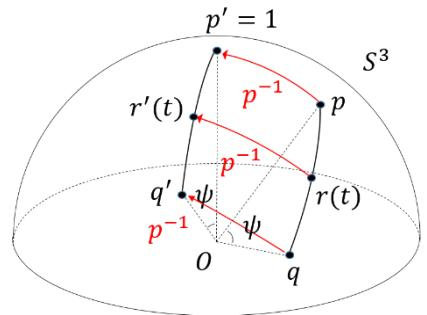

なお、以下の式も  $r(t) = (qp^{-1})^t p$  と等しく、同じ球面線形補間を表す。

$$r(t) = p(p^{-1}q)^t, \quad r(t) = q(q^{-1}p)^{1-t}, \quad r(t) = (pq^{-1})^{1-t}q \quad (8-7-10)$$

これらも上記とほぼ同様に示すことができる。読者の演習としよう。(ヒント:「座標変換」は、それぞれ 左側から  $p^{-1}$  を、左側から  $q^{-1}$  を、右側から  $q^{-1}$  を掛ける変換となる。)

