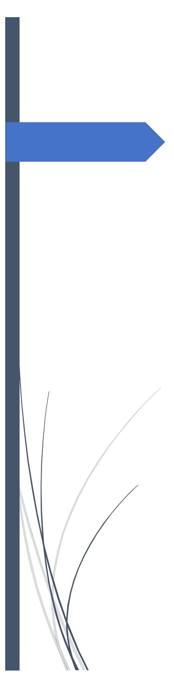
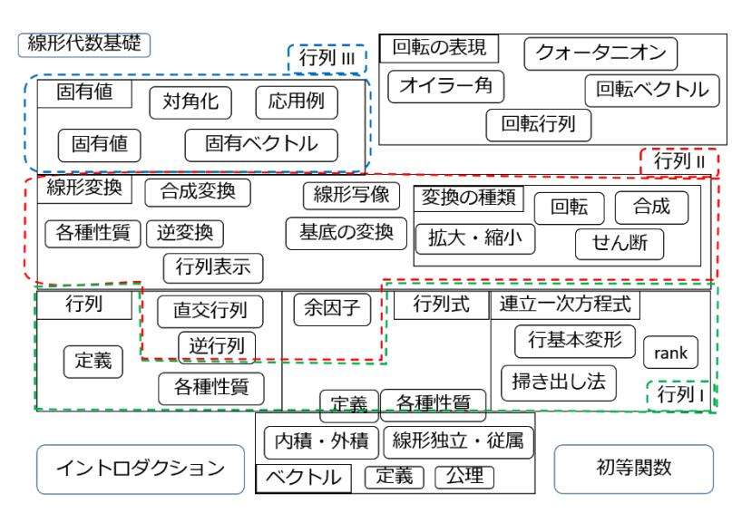

# Basic Linear Algebra Course

Linear Algebra and Representation of Rotations

*Image Note: Cover graphic titled "Basic Linear Algebra Course: Linear Algebra & Representation of Rotations".*

### Basic Linear Algebra Course

# **Publication Preface**

### ● Instead of a Preface

This material was prepared for a study group organized by volunteers at SEGA Corporation and is now being made available to the public. The purpose of the study group was "adult relearning"—starting with an extremely rapid review of high school mathematics, relearning the fundamentals of linear algebra typically taught in first-year university courses, and understanding the basics of 3D rotation representation as an application. As is widely known, linear algebra and calculus form the foundation for various science and engineering disciplines, which is why it is taught in the first year of university. Unfortunately, unlike calculus, topics such as vectors and matrices have increasingly been pushed to the margins of high school mathematics curricula.

In short, linear algebra is a framework for "demystifying objects with linear (proportional) properties through the power of algebra." Its greatest characteristic is that it is fundamentally "solvable." It applies not only when equations representing real-world phenomena behave linearly, but also when non-linear phenomena are approximated linearly, or when insights gained from linear algebra are used to unravel complex, intertwined phenomena. While "solvable" implies simplicity, it should by no means be taken lightly—it equips you with a powerful, widely applicable tool to tackle problems that might otherwise seem completely intractable.

Linear algebra is built on various concepts, and as shown in the diagram, you can only grasp the full picture after studying a wide range of topics even in the basics alone. This is one reason why learning linear algebra can be challenging: even if you master individual calculations, it can be difficult to see how everything connects or what it all adds up to as a whole.

For this "relearning" course, the structure has been designed to allow learners to master the essential core of basic linear algebra as concisely and clearly as possible. Matrices are restricted exclusively to $n \times n$ real matrices (real square matrices). The order of topics, methods, and in some cases even definitions (e.g., determinants) may differ from standard textbook approaches.

(My apologies if this actually makes it harder to understand! :P) We aimed for clear introductions and derivations, concise proofs, and moved longer proofs to the appendix to maintain the flow of discussion. On the other hand, due to page constraints, examples and practice exercises are limited. Readers are encouraged to find additional practice problems online or elsewhere to deepen their understanding.

*Diagram Translation (Overview of Linear Algebra):*
- **Sets & Logic** $\to$ **Numbers** $\to$ **Mappings & Functions**
- **Vectors** $\to$ **Systems of Linear Equations** $\to$ **Matrices**
- **Determinants** $\to$ **Linear Transformations**
- **Eigenvalues & Diagonalization** $\to$ **Vector Spaces** $\to$ **Metrics / Inner Products**
- **Representation of Rotations**

The course consists of 8 lectures (8 chapters) divided into 3 major parts. Topics marked with a `[▼]` icon represent slightly advanced content; feel free to skip them on your first reading. Topics with matching tags like `[▼A]` are interrelated, so please use them as references.

### Part 1: Introduction and Rapid High School Math Review + $\alpha$

- Lecture 1: Introduction
- Lecture 2: Elementary Functions

This book assumes a basic understanding of High School Math I. As a warmup, we rapidly review necessary topics from later high school mathematics. Feel free to review further on your own as needed.

### Part 2: Fundamentals of Linear Algebra (First-Year University Level + $\alpha$)

- Lecture 3: Vectors
- Lecture 4: Matrices I: Systems of Linear Equations
- Lecture 5: Matrices II: Linear Transformations
- Lecture 6: Matrices III: Eigenvalues and Diagonalization

We study the fundamentals of linear algebra, centered on vectors and matrices. The three matrix lectures explore what vectors and matrices represent and how they interact from their respective viewpoints. Across 74 pages, you will quickly cover basic linear algebra. While essential concepts are covered, some details have been omitted due to space constraints. Readers may need to supplement specific topics depending on their field of study or advance to higher-level linear algebra.

### Part 3: Fundamentals of 3D Rotation Representation

- Lecture 7: Representation of Rotations I
- Lecture 8: Representation of Rotations II

As an application, we learn the basics of "Rotation Matrices," "Euler Angles," "Rotation Vectors," and "Quaternions," which are crucial representations of 3D rotations in various fields. The focus is on *why* these representations work rather than just *how* to use them. It may feel a bit challenging at first. Readers with prior knowledge of linear algebra who start from Part 3 are recommended to read Section 5 of Lecture 5 first. Conversely, readers who complete up to Lecture 5 will be able to understand Part 3 reasonably well even if they skip Lecture 6.

### ● To Students

If any adventurous soul decides to learn from this unconventional book (lol), it goes without saying that after reading this, you should revisit your official course textbook. You will likely find that your understanding has deepened significantly. If this book can be of help to those who will shape the future, it would be my utmost pleasure.
