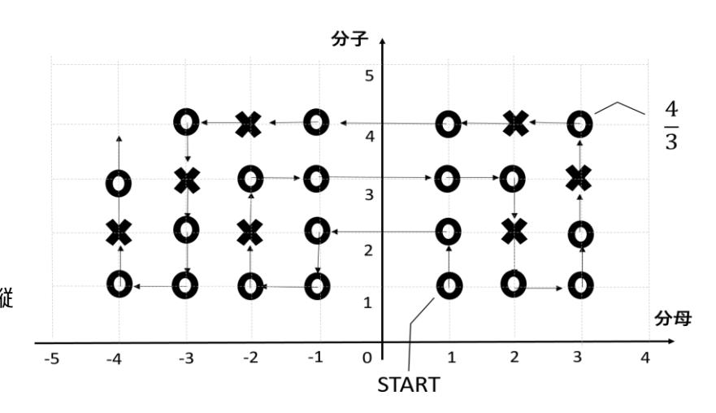
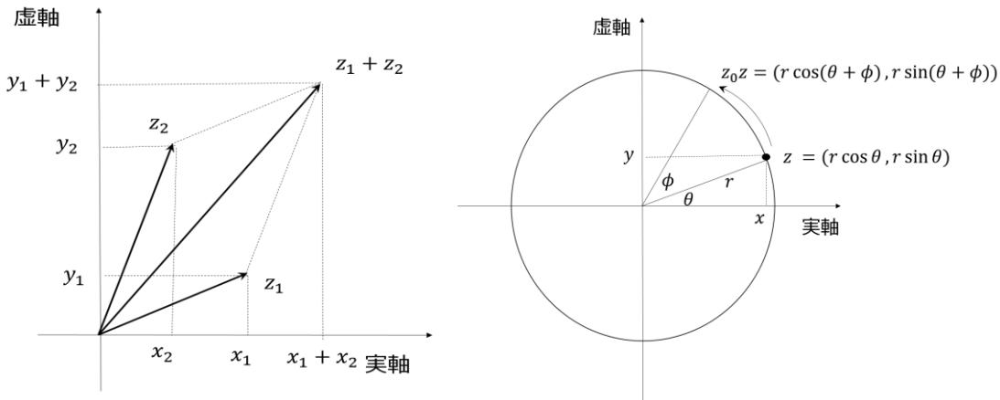
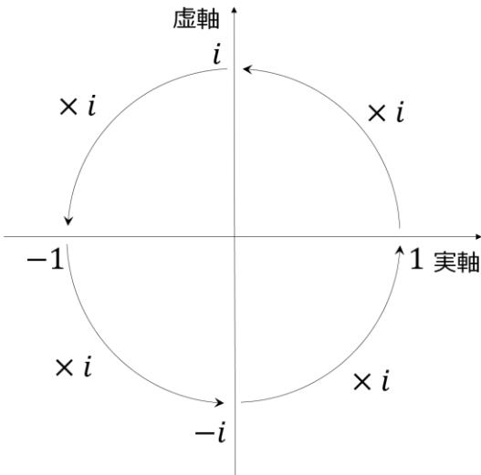

# **[Lecture 1] Introduction**

### **[1-1] Introduction**

In this lecture, as an introduction, we look back at the history of the extension of numbers. While each topic connects to its respective domain, another objective is to introduce the mathematical way of thinking.

# **[1-2] Mathematical Setup: Extension of Numbers**

### **[1-2-1] Natural Numbers $\mathbb{N}$: Everything Starts Here**

- **Since when?** Since ancient times.
- $(0), 1, 2, 3, \dots$: Very familiar numbers. However, although we don't usually think about it, this is already a significantly abstracted concept. It's not 1 person, 2 items, or 3 cars, but 1, 2, 3...
- Whether $0$ is included in the natural numbers depends on the convention. In fact, defining natural numbers rigorously is surprisingly tricky. From a set-theoretic standpoint, natural numbers are built starting from $0$ corresponding to the empty set, so $0$ naturally belongs to $\mathbb{N}$. On the other hand, number theory traditionally excludes $0$.
- In any case, to avoid confusion, use terms like "non-negative integers" or "positive integers" as necessary.
- **Addition ($+$), Multiplication ($\times$)**: Performing these operations on any two natural numbers always yields another natural number. While seemingly obvious, it would be extremely inconvenient if this weren't true.
  $\to$ This property (being closed under an operation) is extremely important.
- **Subtraction ($-$), Division ($\div$)**: Useful, but within natural numbers, they frequently lead to "no solution" scenarios.

### **[1-2-2] Integers $\mathbb{Z}$: Discovery of $0$, Introduction of Negative Numbers**

- $\dots, -3, -2, -1, 0, 1, 2, 3, \dots$
- **Since when?** The consensus is that $0$ as a number and the concept of negative numbers were established around the 5th century in ancient India.
- Indeed, this was a revolutionary milestone in mathematics. However, because of cultural and conceptual resistance, accepting negative numbers—which were previously dismissed as "impossible/no solution"—took a very long time. In Europe, it took nearly 650 years (until around the 17th century!) to be widely accepted.1
- Subtraction ($-$) became closed within the domain of integers (important). Algebraically, natural numbers can be viewed as having been extended to integers for this precise reason.

1 *Preparing the text for this course yielded many personal insights, and this fact was perhaps the most surprising!*

- **Multiplication of Negative Numbers**: Can you explain it to a child?
  $-1 \times 1 = -1$ is easy to understand because it means "one group of $-1$".
  But what about $1 \times (-1)$ or $(-1) \times (-1)$?

$$1 \times 2 = 2$$

$$1 \times 1 = 1$$

$$1 \times 0 = 0$$

$$1 \times (-1) = -1\ ? \qquad -1 \times (-1) = 1\ ?$$

Looking at this pattern, setting $1 \times (-1) = -1$ and $(-1) \times (-1) = 1$ feels completely natural.

- **Algebraic Extension of Multiplication**:
  From an algebraic perspective, an extension is considered natural if it preserves operator properties.

  *Properties of Multiplication*: In natural numbers $\mathbb{N}$, the commutative and distributive laws held.
  $\to$ We extend multiplication to integers $\mathbb{Z}$ so that these laws continue to hold.

  - Commutative law: $a \times b = b \times a$, so:

$$1 \times (-1) = -1 \times 1 = -1$$

  - Distributive law: $a \times (b + c) = a \times b + a \times c$, so:

$$\begin{aligned}
0 &= (-1) \times (1 + (-1)) \\
&= (-1) \times 1 + (-1) \times (-1) \\
&= -1 + (-1) \times (-1)
\end{aligned}$$

  Adding $1$ to both sides gives:

$$(-1) \times (-1) = 1$$

Testing various scenarios with this extension2 reveals no contradictions. Therefore, we adopt this definition.

*(Later in the course, this extension will feel even more natural!)*

### **[1-2-3] Rational Numbers $\mathbb{Q}$: Introduction of Fractions and Decimals**

- **Since when?** Supposedly in ancient Egypt (around 1650 BC)—long before $0$ and negative numbers!
- Division ($\div$) also became closed within the set of rational numbers (important).
- Now all four basic arithmetic operations are closed within rational numbers. Furthermore, rational numbers are "densely packed" along the number line, leading people historically to view rational numbers as complete for practical purposes.

2 *A similar operation extension will be performed for exponents in Lecture 2 (Elementary Functions) to define the exponential function.*

**Do rational numbers feel "more numerous" than integers?**

For any rational numbers $p < q \in \mathbb{Q}$, setting $r = (p + q) / 2$ yields a new rational number satisfying $p < r < q$. This holds no matter how close $p$ and $q$ are. Furthermore, between $p$ and $r$, and between $r$ and $q$, we can insert even more rational numbers $(p + r) / 2$ and $(r + q) / 2$. This process can be repeated infinitely, meaning rational numbers are densely distributed on the number line. This property is called **density** (or being *dense*).

Intuitively, dense rational numbers feel like there are "far more" of them than integers. But is that true?

In this diagram, the horizontal axis represents non-zero denominator integers, and the vertical axis represents positive numerator integers, mapping all rational numbers onto lattice points.

Starting from $1/1$ marked START, we trace a zigzag path along the lattice points. We count only simplified fractions ($\circ$) and skip non-reduced ones ($\times$). This demonstrates that we can "count" all unique rational numbers. Being able to "count" them means establishing a one-to-one correspondence with natural numbers. Although both the set of natural numbers and the set of rational numbers are infinite sets with infinitely many elements, they have the **same size**. This surprising fact counter-intuitively reveals the magic of infinity.

Such "countable" infinite sets are called **countable sets**. The concept generalizing the number of elements in a set to infinite sets is called **cardinality**, denoted by the Hebrew symbol $\aleph$ (Aleph)3. The cardinality of a countable set is called countable cardinality, written as $\aleph_0$. The sets of natural numbers, integers, and rational numbers are all countable and have the exact same cardinality $\aleph_0$.

## **[1-2-4] Real Numbers $\mathbb{R}$: Introduction of Irrational Numbers**

- **Since when?** In ancient Greece (around 500 BC), Pythagoras established his "brotherhood" to study mathematics in secret. The doctrine held that numbers represent lengths (ratios of side lengths in geometry) and that all numbers are rational.
- In the birthplace of the Pythagorean theorem, discovering that the hypotenuse length ($\sqrt{2}$) of an isosceles right triangle with side length $1$ is not rational was only a matter of time...4

- **$\sqrt{2}$ is Irrational**: Proof by contradiction.

  **[Proof]** Assume $\sqrt{2}$ is rational. Then it can be written as $\sqrt{2} = \frac{p}{q}$ for coprime integers $p$ and $q$. Squaring both sides yields $p^2 = 2q^2$, meaning $p^2$ is even. Since $p^2$ is even, $p$ itself must be even, so $p^2$ is a multiple of $4$. This implies $q^2$ is also even, so $q$ is even. This contradicts the assumption that $p$ and $q$ are coprime. Therefore, $\sqrt{2}$ is irrational. $\blacksquare$

- **Cardinality of Real Numbers**:
  Do real numbers have the same cardinality as integers or rational numbers? In 1891, Georg Cantor proved that real numbers are **uncountable** using his famous **diagonal argument**.

  **[Proof]** Consider the set of real numbers in the interval $[0, 1]$ and assume it is countable. If countable, all real numbers $a \in [0, 1]$ can be enumerated as $a_1, a_2, a_3, \dots$. Expanding each $a_i$ into binary decimal form $a_i = 0.a_{i1}a_{i2}a_{i3}\dots$ where $a_{ij} \in \{0, 1\}$, we list them as follows:

$$\begin{aligned}
a_1 &= 0. a_{11} a_{12} a_{13} \dots a_{1n} \dots \\
a_2 &= 0. a_{21} a_{22} a_{23} \dots a_{2n} \dots \\
a_3 &= 0. a_{31} a_{32} a_{33} \dots a_{3n} \dots \\
&\vdots
\end{aligned}$$

  Using the diagonal entries $a_{11}, a_{22}, a_{33}, \dots$, construct a real number $b$ defined as follows5:

$$b = 0. b_1 b_2 b_3 \dots b_n \dots, \quad b_i = \sim a_{ii}$$

  Since $b_1 \neq a_{11}$, $b \neq a_1$. Similarly, $b_2 \neq a_{22} \implies b \neq a_2$, and in general $b \neq a_i$ for all $i \in \mathbb{N}$. Thus, $b$ is a real number in $[0, 1]$ that is distinct from every listed $a_i$, contradicting the assumption that all real numbers in $[0, 1]$ were enumerated. Thus, the set of real numbers in $[0, 1]$ is uncountable. $\blacksquare$

3 *Tickles your inner chuunibyou, doesn't it? (Had to say it!)*

4 *Legend has it that Hippasus discovered this and was expelled (or drowned) by the brotherhood, though the truth is unknown.*

5 *That is, if $a_{ii} = 0$, set $b_i = 1$; if $a_{ii} = 1$, set $b_i = 0$.*

- **Completeness of Real Numbers**:
  As seen above, real numbers are far more numerous than integers or rational numbers. Intuitively, real numbers form a seamlessly continuous line. Demonstrating this mathematically is non-trivial. In mathematical analysis, the "completeness (continuity) of real numbers" is treated as an axiom rather than a provable theorem. Real numbers are remarkably deep.

### **[1-2-5] Complex Numbers $\mathbb{C}$: Introduction of Imaginary Numbers**

- **Since when?**
  Originally, quadratic equations with a negative discriminant were deemed to have "no solution" (at a time when negative numbers weren't even fully accepted in Europe!).

  In 1545, Cardano published the general solution formula for cubic equations. Unlike quadratic equations, a cubic equation always has at least one real root. However, using the algebraic formula forced mathematicians to compute with imaginary numbers as intermediate steps even when the final roots were purely real (the imaginary parts canceled out as complex conjugate pairs). Despite initial skepticism, complex numbers were eventually accepted through the work of Euler and Gauss.

- **Complex Plane (Gaussian Plane)**:
  Plotting a complex number $z = x + iy$ on a plane where the horizontal axis represents real values and the vertical axis represents imaginary values.

  The left diagram shows the sum of complex numbers $z_1 = x_1 + iy_1$ and $z_2 = x_2 + iy_2$:

$$z_1 + z_2 = (x_1 + x_2) + i(y_1 + y_2)$$

  which clearly highlights its vector addition behavior.

  The right diagram shows the polar form of a complex number $z = r(\cos \theta + i \sin \theta)$. Multiplying $z$ by a unit complex number $z_0 = \cos \phi + i \sin \phi$ yields:

$$\begin{aligned}
z_0 z &= r \{ (\cos \theta \cos \phi - \sin \theta \sin \phi) + i (\sin \theta \cos \phi + \cos \theta \sin \phi) \} \\
&= r(\cos(\theta + \phi) + i \sin(\theta + \phi))
\end{aligned}$$

  (using trigonometric addition formulas)6, which clearly represents a 2D rotation on the complex plane.

  Thus, complex numbers behave as vectors under addition and as rotations under multiplication7. The complex plane provides a powerful visual tool for understanding these properties.

- **Multiplication of Negative Numbers Revisited**:

  Multiplying the real unit $1$ by the imaginary unit $i$ gives $i \times 1 = i$. Multiplying repeatedly by $i$ gives:

$$i \times i = -1, \quad i \times (-1) = -i, \quad i \times (-i) = 1$$

  On the complex plane, each multiplication by $i$ corresponds to a $\pi/2$ ($90^\circ$) rotation. This matches setting $\theta = \pi/2$ in $\cos \theta + i \sin \theta = i$8.

  Earlier, extending multiplication from natural numbers to integers required defining $1 \times (-1) = -1$ and $(-1) \times (-1) = 1$. Since $i^2 = -1$, multiplying by $-1$ is equivalent to rotating by $\pi$ ($180^\circ$) on the complex plane, rendering negative multiplication beautifully intuitive.

- **Fundamental Theorem of Algebra**:
  Any $n$-th degree polynomial equation with complex coefficients:

$$a_n x^n + a_{n-1} x^{n-1} + \dots + a_1 x + a_0 = 0 \quad (a_i \in \mathbb{C}, a_n \neq 0)$$

  has exactly $n$ complex roots (counting multiplicity). This signifies that the historical cycle of expanding number systems to solve equations reaches a complete milestone here.

### **[1-2-6] Summary**

We have explored the development of mathematics through the lens of number extensions. Abstraction and generalization serve as the driving forces behind mathematical progress. Furthermore, viewing abstract concepts visually (such as complex numbers) or re-examining foundational ideas from an advanced perspective (such as negative multiplication) dramatically deepens our understanding.

On the other hand, non-intuitive facts like the equal cardinality of rational numbers and natural numbers show that intuition is not always sufficient. While this course strives to provide intuitive explanations whenever possible, mathematical rigor has its place when intuition falls short.

6 *If this feels unfamiliar, review it in Lecture 2 (Elementary Functions).*

7 *Vector properties are studied in Lecture 3, and rotation properties are studied in Lecture 2.*

8 *This visualization of rotation via unit imaginary numbers will play a major role in Lecture 8 (Representation of Rotations II).*

# **[1-3] Appendix: List of Greek Letters**

| Capital | Small | Name | Capital | Small | Name | Capital | Small | Name |
|---|---|---|---|---|---|---|---|---|
| A | $\alpha$ | alpha | I | $\iota$ | iota | P | $\rho$ | rho |
| B | $\beta$ | beta | K | $\kappa$ | kappa | $\Sigma$ | $\sigma$ | sigma |
| $\Gamma$ | $\gamma$ | gamma | $\Lambda$ | $\lambda$ | lambda | T | $\tau$ | tau |
| $\Delta$ | $\delta$ | delta | M | $\mu$ | mu | $\Upsilon$ | $\upsilon$ | upsilon |
| E | $\varepsilon, \epsilon$ | epsilon | N | $\nu$ | nu | $\Phi$ | $\phi, \varphi$ | phi |
| Z | $\zeta$ | zeta | $\Xi$ | $\xi$ | xi | X | $\chi$ | chi |
| H | $\eta$ | eta | O | $o$ | omicron | $\Psi$ | $\psi$ | psi |
| $\Theta$ | $\theta$ | theta | $\Pi$ | $\pi$ | pi | $\Omega$ | $\omega$ | omega |
