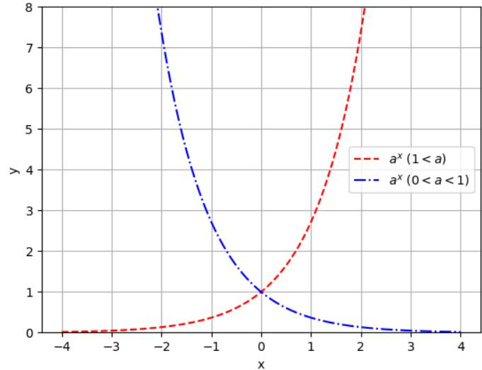
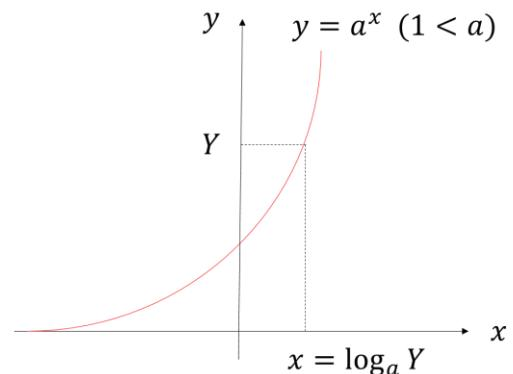
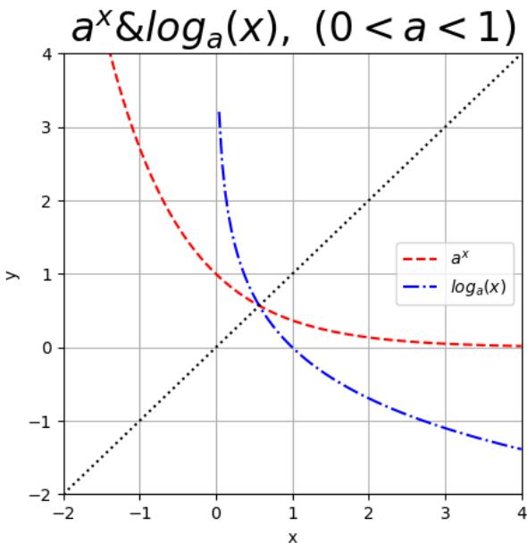
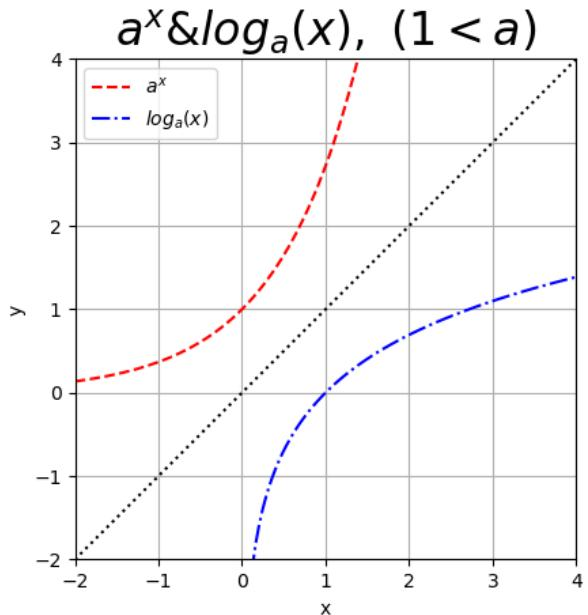
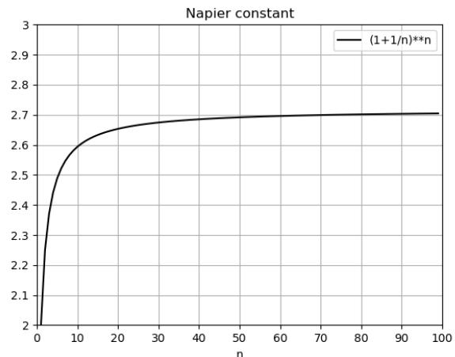
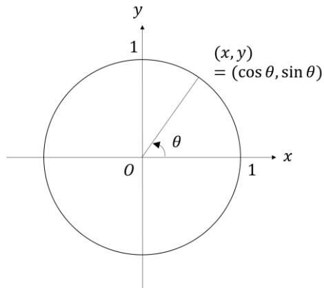
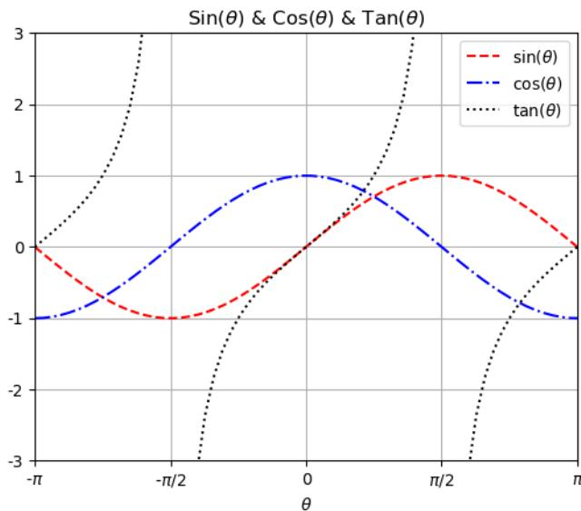
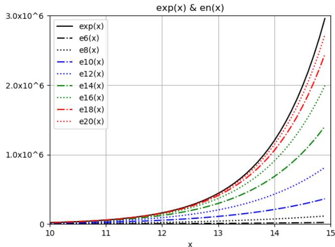
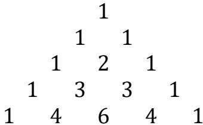
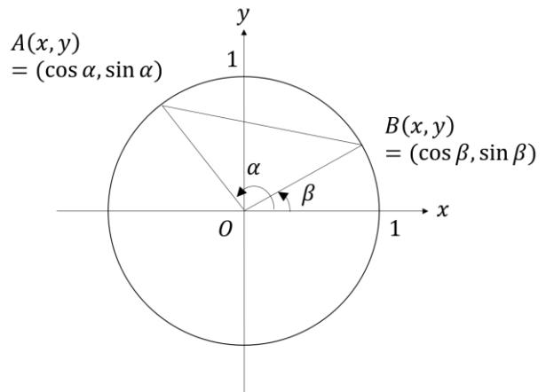

## [Lecture 2] Elementary Functions

### [2-1] Introduction

An elementary function is a single-variable function constructed from algebraic functions (power functions, polynomial functions, rational functions, etc.), exponential functions, logarithmic functions, trigonometric functions, inverse trigonometric functions, hyperbolic functions, inverse hyperbolic functions, and their compositions. They are essential functions applied not only across mathematics but in all branches of science and engineering. Except for a few exceptions, this course treats functions within the real domain. In this lecture, we study the particularly important exponential functions, logarithmic functions, trigonometric functions, their properties, and derive Euler's formula to understand their connections.

### [2-2] Exponential and Logarithmic Functions

#### [2-2-1] Definition and Properties of Exponential Functions

Have you ever wondered how a number with a real exponent (for instance, $2^{\sqrt{2}}$) is calculated in practice? In fact, this is far from simple. As mentioned in Lecture 1 (Introduction), real numbers are surprisingly deep.

Let us begin with natural number powers (positive integer powers: **exponentiation**). Below, let $n, m \in \mathbb{N}$ with $n, m > 0$.

Multiplying $2$ by itself $n$ times is denoted as $2^n$, defined as "$2$ to the power of $n$".
Here, $2$ is called the **base**, and $n$ is called the **exponent**.

From the definition, $2^n \times 2^m = 2^{n+m}$, $(2^n)^m = 2^{nm}$, and $(2 \times 3)^n = 2^n \times 3^n$ hold.

In general, for non-zero real numbers $a, b \in \mathbb{R}$ ($a, b \neq 0$), exponentiation satisfies:

$$a^n \times a^m = a^{n+m}, \quad (a^n)^m = a^{nm}, \quad (ab)^n = a^n b^n$$

We consider extending these properties so that they hold even when the exponents are arbitrary integers.

Since $a^0 \times a^n = a^{0+n} = a^n$, defining $a^0 \equiv 1$, and since $a^{-n} \times a^n = a^{-n+n} = a^0 = 1$, defining $a^{-n} \equiv 1/a^n$, we have for any $p, q \in \mathbb{Z}$:

$$a^p \times a^q = a^{p+q}, \quad (a^p)^q = a^{pq}, \quad (ab)^p = a^p b^p$$

This extension also yields:

$$\frac{a^p}{a^q} = a^{p-q}, \quad \left(\frac{a}{b}\right)^p = \frac{a^p}{b^p}$$

Next, consider extending exponents to rational numbers. If these properties hold for rational exponents, then since:

$$\left(a^{1/2}\right)^2 = a^1 = a \implies a^{1/2} \equiv \sqrt{a}$$

For $\sqrt{a}$ to take a real value, we must impose the restriction $a > 0$. Under this restriction, since $\left(a^{\frac{q}{p}}\right)^p = a^{\frac{pq}{p}} = a^q$, defining $a^{\frac{q}{p}} \equiv \sqrt[p]{a^q}$ ensures that for any $r, s \in \mathbb{Q}$ and $a, b \in \mathbb{R}$ ($a, b > 0$):

$$a^r \times a^s = a^{r+s}, \quad \frac{a^r}{a^s} = a^{r-s}, \quad (a^r)^s = a^{rs}, \quad (ab)^r = a^r b^r, \quad \left(\frac{a}{b}\right)^r = \frac{a^r}{b^r}$$

Extending exponents to arbitrary real numbers is not straightforward. As an example, consider $2^{\sqrt{2}}$.

The decimal expansion $\sqrt{2} = 1.41421356 \dots$ is infinite. Consider the sequence of finite decimals (rational numbers):

$$1, 1.4, 1.41, 1.414, 1.4142, 1.41421, 1.414213, 1.4142135, 1.41421356, \dots$$

and form the sequence of powers $2^1, 2^{1.4}, 2^{1.41}, 2^{1.414}, \dots$:

$$\begin{array}{rcl}
2^1 & = & 2 \\
2^{1.4} & = & 2.63901582 \dots \\
2^{1.41} & = & 2.65737162 \dots \\
2^{1.414} & = & 2.66474965 \dots \\
2^{1.4142} & = & 2.66511908 \dots \\
2^{1.41421} & = & 2.66513756 \dots \\
2^{1.414213} & = & 2.66514310 \dots \\
2^{1.4142135} & = & 2.66514402 \dots \\
2^{1.41421356} & = & 2.66514413 \dots \\
&\vdots&
\end{array}$$

Notice that this sequence approaches a specific limit.

Thus, when the exponent is a real number, it is defined as the limit of a sequence of rational powers whose exponents approach that real number.9

With this definition, for all $a, b \in \mathbb{R}$ ($a, b > 0$) and any $x, y \in \mathbb{R}$:

$$a^x \times a^y = a^{x+y}, \quad \frac{a^x}{a^y} = a^{x-y}, \quad (a^x)^y = a^{xy}, \quad (ab)^x = a^x b^x, \quad \left(\frac{a}{b}\right)^x = \frac{a^x}{b^x}$$

These fundamental properties are called the **exponent laws**.

Now that exponents are extended to real numbers, continuous values are obtained for any real exponent.

When the base $a = 1$, $1^x = 1$ for all $x$. Excluding $a = 1$, the function $f(x) = a^x$ defined for $0 < a < 1$ or $1 < a$ is called an **exponential function**. Here $a$ is referred to as the **base**.

9 *A different definition will be derived in Section 2-4.*

Basic properties of exponential functions derived from exponent laws:

● For $1 < a$:
- Monotonically increasing function
- Asymptotically approaches the $x$-axis as $x \rightarrow -\infty$
- $a^0 = 1$ when $x = 0$

● For $0 < a < 1$:
- Monotonically decreasing function
- Asymptotically approaches the $x$-axis as $x \rightarrow \infty$
- $a^0 = 1$ when $x = 0$

The domain is all real numbers $\mathbb{R}$, and the range is all positive real numbers $\mathbb{R}^+$. The graph below shows examples of $y = a^x$.

*Diagram Translation (Exponential Function Graphs $y = a^x$):*
- **Monotonically Increasing**: $1 < a$ (e.g., $y = 2^x$)
- **Monotonically Decreasing**: $0 < a < 1$ (e.g., $y = (1/2)^x$)

#### [2-2-2] Definition and Properties of Logarithmic Functions

Since the exponential function $a^x$ spans all positive real numbers as its range and is strictly monotonic ($0 < a < 1 \implies$ strictly decreasing, $1 < a \implies$ strictly increasing), for any positive real number $Y$, there exists a unique real number $x$ such that $Y = a^x$.

This unique $x$ is called the **logarithm** of $Y$ to the base $a$, written as $x = \log_a Y$. Here $Y$ is called the **argument** (or antilogarithm).

*Diagram Translation (Definition of Logarithm):*
- **Base**: $a$
- **Argument / Antilogarithm**: $Y$
- **Logarithm**: $x = \log_a Y$

By definition, logarithms satisfy properties corresponding to the exponent laws. For $a, Y, Z \in \mathbb{R}$ ($a > 0, a \neq 1, Y, Z > 0$):

(i) $\log_a YZ = \log_a Y + \log_a Z$
   Let $y = \log_a Y, z = \log_a Z \implies Y = a^y, Z = a^z \implies YZ = a^y a^z = a^{y+z}$.
   $\therefore \log_a YZ = y + z = \log_a Y + \log_a Z$. $\blacksquare$

(ii) $\log_a \frac{Y}{Z} = \log_a Y - \log_a Z$
   Let $y = \log_a Y, z = \log_a Z \implies Y = a^y, Z = a^z \implies Y/Z = a^y / a^z = a^{y-z}$.
   $\therefore \log_a \frac{Y}{Z} = y - z = \log_a Y - \log_a Z$. $\blacksquare$

(iii) $\log_a Y^t = t \log_a Y$
   Let $y = \log_a Y \implies Y = a^y \implies Y^t = (a^y)^t = a^{yt}$.
   $\therefore \log_a Y^t = yt = t \log_a Y$. $\blacksquare$

Furthermore, for $b \in \mathbb{R}$ ($b > 0, b \neq 1$), the change of base formula holds:

(iv) $\log_a Y = \frac{\log_b Y}{\log_b a}$
   Let $y = \log_a Y, z = \log_b Y, a = b^t \implies t = \log_b a$.
   $Y = b^z = a^y = (b^t)^y = b^{ty} \implies z = ty \implies y = \frac{z}{t}$.
   $\therefore \log_a Y = \frac{\log_b Y}{\log_b a}$. $\blacksquare$

The function $y = \log_a x$ defined in this way is called the **logarithmic function**.

By definition, $y = \log_a x \iff x = a^y = a^{\log_a x}$ and $y = \log_a x = \log_a a^y$. Thus, $y = \log_a x$ and $y = a^x$ are inverse functions of each other.

Logarithmic functions have the following properties for base $a \in \mathbb{R}$ ($a > 0, a \neq 1$):
- Monotonically decreasing when $0 < a < 1$
- Monotonically increasing when $1 < a$
- Domain: positive real numbers $\mathbb{R}^+$; Range: all real numbers $\mathbb{R}$
- When $x = 1$, $\log_a 1 = 0$.

*Diagram Translation (Exponential & Logarithm for $0 < a < 1$):*
- Inverse function relationship shown by $y = x$ line symmetry.

*Diagram Translation (Exponential & Logarithm for $1 < a$):*
- Inverse function relationship shown by $y = x$ line symmetry.

The graphs above illustrate $y = \log_a x$ and $y = a^x$ for $0 < a < 1$ and $1 < a$. They are symmetric with respect to the line $y = x$, visually confirming their inverse relationship.

In short, a base-$a$ logarithm tells you the number of digits in base $a$.

#### [2-2-3] Natural Logarithms and Natural Exponentials

An extraordinarily useful logarithmic base is **Napier's constant** (Euler's number) $e$.

Napier's constant $e$ is an irrational number defined by:

$$e = \lim_{n \rightarrow \infty} \left(1 + \frac{1}{n}\right)^n \quad (2-2-1)$$

whose value is approximately:

$$e = 2.71828182846 \dots \quad (2-2-2)$$

Here, equation (2-2-1) represents the **limit** of $\left(1 + \frac{1}{n}\right)^n$ as the positive integer $n$ grows arbitrarily large. The graph below illustrates how $\left(1 + \frac{1}{n}\right)^n$ converges to $e$ for $n$ from $1$ to $100$.

*Diagram Translation (Convergence to Napier's Constant $e$):*
- Convergence curve of $(1 + 1/n)^n \to e \approx 2.71828$.

Logarithms with base $e$ are called **natural logarithms**, usually written as $\log_e x = \ln x$. The term "exponential function" usually defaults to $e^x$, also written as $\exp(x)$ or called the natural exponential.

The term "natural" stems from its clean mathematical properties—for instance, the derivative of $e^x$ is simply $e^x$ itself. It is ubiquitous across mathematics, physics, and engineering.

#### [2-2-4] Applications

Exponential functions play a vital role in calculus and differential equations (describing how a system evolves over time). Logarithmic functions appear in human perception scales (decibels), earthquake magnitudes, entropy in statistical mechanics, and information theory.

### [2-3] Trigonometric Functions

#### [2-3-1] Definition and Properties of Trigonometric Functions

Consider a point $(x, y)$ on a unit circle ($r = 1$) centered at the origin. Let $\theta$ be the angle (in radians) formed by the line connecting the point to the origin and the positive $x$-axis, measured counterclockwise. Angle values naturally extend beyond $\pm \pi, \pm 2\pi$.

We define:
- $\sin \theta$ (sine): $\sin \theta = y$
- $\cos \theta$ (cosine): $\cos \theta = x$

and for $x \neq 0$:
- $\tan \theta$ (tangent): $\tan \theta = y/x$

These are the **trigonometric functions**.

*Diagram Translation (Trigonometric Definitions on Unit Circle):*
- **Sine**: $y = \sin \theta$
- **Cosine**: $x = \cos \theta$
- **Tangent**: $y/x = \tan \theta$

By definition, $\sin \theta$ and $\cos \theta$ are periodic with period $2\pi$, while $\tan \theta$ has period $\pi$ ($n \in \mathbb{Z}$):

$$\begin{aligned}
\sin(\theta + 2n\pi) &= \sin \theta \\
\cos(\theta + 2n\pi) &= \cos \theta \\
\tan(\theta + n\pi) &= \tan \theta
\end{aligned}$$

The domain of $\sin \theta$ and $\cos \theta$ is $\mathbb{R}$, and their range is $[-1, 1]$. $\sin \theta$ is an odd function ($\sin(-\theta) = -\sin \theta$), whereas $\cos \theta$ is an even function ($\cos(-\theta) = \cos \theta$).

Phase shifts follow directly from the circle definitions:

$$\sin\left(\theta + \frac{\pi}{2}\right) = \cos \theta, \quad \cos\left(\theta - \frac{\pi}{2}\right) = \cos\left(\frac{\pi}{2} - \theta\right) = \sin \theta$$

The domain of $\tan \theta$ is $\mathbb{R} \setminus \left\{ \frac{\pi}{2} + n\pi \mid n \in \mathbb{Z} \right\}$, its range is $\mathbb{R}$, and it is monotonically increasing on $-\frac{\pi}{2} < \theta < \frac{\pi}{2}$.

#### [2-3-2] Key Trigonometric Formulas

The following formulas are fundamental. The addition formulas form the core, from which all others can be easily derived (proofs in Appendix 4):

● **Addition Formulas** (matching signs)
$$\begin{aligned}
\sin(\alpha \pm \beta) &= \sin \alpha \cos \beta \pm \cos \alpha \sin \beta \\
\cos(\alpha \pm \beta) &= \cos \alpha \cos \beta \mp \sin \alpha \sin \beta \\
\tan(\alpha \pm \beta) &= \frac{\tan \alpha \pm \tan \beta}{1 \mp \tan \alpha \tan \beta}
\end{aligned} \quad (2-3-1)$$

● **Double-Angle Formulas**
$$\begin{aligned}
\sin 2\alpha &= 2 \sin \alpha \cos \alpha \\
\cos 2\alpha &= \cos^2 \alpha - \sin^2 \alpha = 1 - 2 \sin^2 \alpha = 2 \cos^2 \alpha - 1 \\
\tan 2\alpha &= \frac{2 \tan \alpha}{1 - \tan^2 \alpha}
\end{aligned} \quad (2-3-2)$$

● **Half-Angle Formulas**
$$\begin{aligned}
\sin^2 \frac{\alpha}{2} &= \frac{1 - \cos \alpha}{2} \\
\cos^2 \frac{\alpha}{2} &= \frac{1 + \cos \alpha}{2} \\
\tan^2 \frac{\alpha}{2} &= \frac{1 - \cos \alpha}{1 + \cos \alpha}
\end{aligned} \quad (2-3-3)$$

● **Product-to-Sum Formulas**
$$\begin{aligned}
\sin \alpha \cos \beta &= \frac{1}{2} \{\sin(\alpha + \beta) + \sin(\alpha - \beta)\} \\
\cos \alpha \cos \beta &= \frac{1}{2} \{\cos(\alpha + \beta) + \cos(\alpha - \beta)\} \\
\sin \alpha \sin \beta &= -\frac{1}{2} \{\cos(\alpha + \beta) - \cos(\alpha - \beta)\}
\end{aligned} \quad (2-3-4)$$

● **Sum-to-Product Formulas**
$$\begin{aligned}
\sin x + \sin y &= 2 \sin \frac{x+y}{2} \cos \frac{x-y}{2} \\
\sin x - \sin y &= 2 \cos \frac{x+y}{2} \sin \frac{x-y}{2} \\
\cos x + \cos y &= 2 \cos \frac{x+y}{2} \cos \frac{x-y}{2} \\
\cos x - \cos y &= -2 \sin \frac{x+y}{2} \sin \frac{x-y}{2}
\end{aligned} \quad (2-3-5)$$

● **Harmonic Addition (Combination Formula)**
$$\begin{aligned}
a \sin \theta + b \cos \theta &= \sqrt{a^2 + b^2} \sin(\theta + \alpha), \quad \cos \alpha = \frac{a}{\sqrt{a^2 + b^2}}, \ \sin \alpha = \frac{b}{\sqrt{a^2 + b^2}} \\
a \sin \theta + b \cos \theta &= \sqrt{a^2 + b^2} \cos(\theta - \beta), \quad \sin \beta = \frac{a}{\sqrt{a^2 + b^2}}, \ \cos \beta = \frac{b}{\sqrt{a^2 + b^2}}
\end{aligned} \quad (2-3-6)$$

#### [2-3-3] De Moivre's Theorem

Consider a unit complex number in polar form $z = \cos \theta + i \sin \theta$ on the complex plane. This maps unit circle coordinates directly onto the complex plane.

For two such complex numbers $z_1 = \cos \alpha + i \sin \alpha$ and $z_2 = \cos \beta + i \sin \beta$, their product using addition formulas is:

$$\begin{aligned}
z_1 z_2 &= (\cos \alpha + i \sin \alpha)(\cos \beta + i \sin \beta) \\
&= (\cos \alpha \cos \beta - \sin \alpha \sin \beta) + i(\sin \alpha \cos \beta + \cos \alpha \sin \beta) \\
&= \cos(\alpha + \beta) + i \sin(\alpha + \beta)
\end{aligned} \quad (2-3-7)$$

Multiplying unit complex numbers adds their argument angles. Geometrically, multiplying by $\cos \alpha + i \sin \alpha$ represents a counterclockwise rotation by angle $\alpha$ on the complex plane.

*Diagram Translation (Rotation on Complex Plane):*
- Left: Product $z_1 z_2$ adds argument angles $\alpha + \beta$.
- Right: Powers $z^n$ rotate by $n\theta$ (De Moivre's theorem).

In particular, when $\alpha = \beta = \theta$:

$$(\cos \theta + i \sin \theta)^2 = \cos 2\theta + i \sin 2\theta$$

which expresses the double-angle formula. Repeating for higher integer powers yields **De Moivre's Theorem**:

$$(\cos \theta + i \sin \theta)^n = \cos n\theta + i \sin n\theta \quad (2-3-8)$$

#### [2-3-4] Applications

Trigonometric functions describe rotations, vibrations, and waves, and form the foundation of Fourier series expansions.

### [2-4] An Alternative Definition of the Exponential Function

Let us re-examine the definition of $e$ in equation (2-2-1). Consider $\left(1 + \frac{x}{n}\right)^n$. Setting $\frac{x}{n} = \frac{1}{m} \implies n = mx$, we have:

$$\left(1 + \frac{x}{n}\right)^n = \left(1 + \frac{1}{m}\right)^{mx} = \left\{\left(1 + \frac{1}{m}\right)^m\right\}^x$$

Taking $n \to \infty$ ($m \to \infty$) for a fixed $x$ gives $\left\{\left(1 + \frac{1}{m}\right)^m\right\}^x \to e^x$.

Thus, we can define the exponential function directly as:

$$e^x = \lim_{n \rightarrow \infty} \left(1 + \frac{x}{n}\right)^n \quad (2-4-1)$$

To evaluate this limit, expand $\left(1 + \frac{x}{n}\right)^n$ using the binomial theorem:

$$\begin{aligned}
\left(1 + \frac{x}{n}\right)^n &= 1 + n \left(\frac{x}{n}\right) + \frac{n(n-1)}{2!} \left(\frac{x}{n}\right)^2 + \frac{n(n-1)(n-2)}{3!} \left(\frac{x}{n}\right)^3 + \dots \\
&= 1 + x + \frac{1 - \frac{1}{n}}{2!} x^2 + \frac{(1 - \frac{1}{n})(1 - \frac{2}{n})}{3!} x^3 + \dots
\end{aligned}$$

Taking $n \to \infty$, each term $(1 - k/n) \to 1$, yielding the power series expansion:

$$e^x = \sum_{k=0}^{\infty} \frac{x^k}{k!} = 1 + x + \frac{x^2}{2!} + \frac{x^3}{3!} + \frac{x^4}{4!} + \dots \quad (2-4-2)$$

This series converges for all $x \in \mathbb{R}$.

The graph below shows partial sums $e_n(x) \equiv \sum_{k=0}^n \frac{x^k}{k!}$ approaching $\exp(x)$ up to $n = 20$.

Defining $e^x$ via (2-4-1) or (2-4-2) allows direct definition for real exponents without taking limits of rational powers.

### [2-5] [▼A] Euler's Formula

From De Moivre's theorem (2-3-8), substitute $n\theta = x \implies \theta = x/n$:

$$\cos x + i \sin x = \left( \cos \frac{x}{n} + i \sin \frac{x}{n} \right)^n \quad (2-5-1)$$

Taking $n \rightarrow \infty$ ($\theta \rightarrow 0$), since $\cos(x/n) \to 1$ and $\sin(x/n) \to x/n$:

$$\cos x + i \sin x = \lim_{n \rightarrow \infty} \left( 1 + \frac{ix}{n} \right)^n \quad (2-5-3)$$

This matches equation (2-4-1) with $x$ replaced formally by $i x$.

Defining the exponential function for pure imaginary arguments via series expansion:

$$e^{ix} = 1 + ix + \frac{(ix)^2}{2!} + \frac{(ix)^3}{3!} + \frac{(ix)^4}{4!} + \dots \quad (2-5-4)$$

Comparing real and imaginary parts with (2-5-3) yields **Euler's Formula**:

$$e^{i\theta} = \cos \theta + i \sin \theta \quad (2-5-5)$$

Euler's formula concisely reveals the profound relationship between exponential and trigonometric functions.

Using Euler's formula, addition formulas simplify to index laws:

$$e^{i\alpha} e^{i\beta} = e^{i(\alpha+\beta)} \quad (2-5-6)$$

and De Moivre's theorem simplifies to:

$$(e^{i\theta})^n = e^{in\theta} \quad (2-5-7)$$

By comparing real and imaginary parts of (2-5-4) and (2-5-5), we obtain the Taylor series for sine and cosine:

$$\begin{cases}
\cos x = 1 - \frac{x^2}{2!} + \frac{x^4}{4!} - \frac{x^6}{6!} + \dots \\
\sin x = x - \frac{x^3}{3!} + \frac{x^5}{5!} - \frac{x^7}{7!} + \dots
\end{cases} \quad (2-5-8)$$

### [2-6] Appendix 1: The Binomial Theorem (Binomial Expansion)

Expanding $(a+b)^n$ is called a **binomial expansion**. Pascal's triangle gives the coefficients:

*Diagram Translation (Pascal's Triangle):*
- Coefficients of $(a+b)^n$ for $n = 0, 1, 2, 3, 4$.

In general:

$$(a+b)^n = \sum_{k=0}^n \binom{n}{k} a^{n-k} b^k \quad (2-6-2)$$

where the combination formula is:

$$\binom{n}{k} = {}_nC_k = \frac{n!}{(n-k)! k!}$$

### [2-7] Appendix 2: Summation Notation

The summation symbol $\Sigma$ (Sigma) represents sums compactly:

$$\sum_{i=1}^n a_i \equiv a_1 + a_2 + \dots + a_n$$

Key properties:
1. **Linearity**: $\sum (a_i + b_i) = \sum a_i + \sum b_i$, $\sum k a_i = k \sum a_i$
2. **Order of Summation**: Computed from inside out.
3. **Interchanging Sums**: For independent finite bounds, $\sum_i \sum_j a_{ij} = \sum_j \sum_i a_{ij}$.

### [2-8] Appendix 3: Proof of $\sin \theta / \theta \rightarrow 1$ ($\theta \rightarrow 0$)

Consider a sector $OAB$ of a unit circle with angle $0 < \theta < 1$:

*Diagram Translation (Geometric Squeeze Theorem Setup):*
- Sector $OAB$ radius $1$, $|\overline{BD}| = \sin \theta$, $|\overline{CA}| = \tan \theta$.

Area of $\triangle OAB = \frac{1}{2} \sin \theta$, sector $OAB = \frac{1}{2} \theta$, and $\triangle OAC = \frac{1}{2} \tan \theta$.

Comparing areas: $\frac{1}{2} \sin \theta < \frac{1}{2} \theta < \frac{1}{2} \tan \theta \implies \cos \theta < \frac{\sin \theta}{\theta} < 1$.

By the squeeze theorem, as $\theta \to 0$, $\cos \theta \to 1 \implies \frac{\sin \theta}{\theta} \rightarrow 1$. $\blacksquare$

### [2-9] Appendix 4: Proofs of Trigonometric Formulas

See geometric proofs of addition, double-angle, half-angle, product-to-sum, and sum-to-product formulas via unit circle coordinates.

