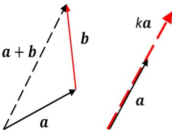
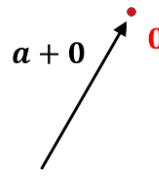
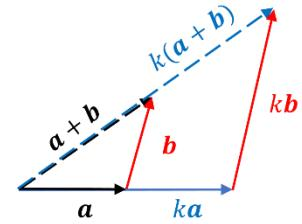
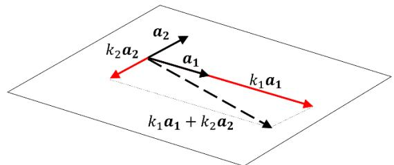
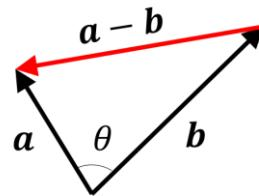
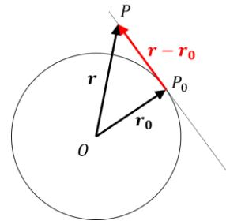
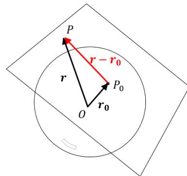
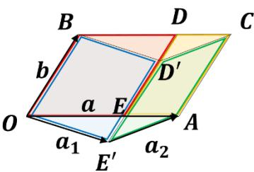
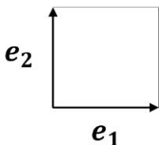
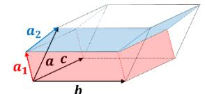

## [Lecture 3] Vectors

### [3-1] Introduction

Vectors are applied across mathematics, physics, and engineering. Understanding their properties is fundamental. In addition to geometric vectors (directed line segments in space), abstract vector spaces encompass many mathematical objects, enabling wide application of vector theory. The concept of vectors inherently possesses linearity16, forming the bedrock of linear algebra together with matrices.

In this lecture, we review the properties of geometric vectors, introduce abstract vector examples, and examine vector linearity as a core foundation of linear algebra.

16 *For instance, a function $f(x)$ is linear if $f(x+y) = f(x) + f(y)$ and $f(kx) = kf(x)$.*

### [3-2] Properties of Vectors

#### [3-2-1] Properties of Individual Vectors

A geometric vector is defined by magnitude and direction, represented as a directed segment $\vec{PQ}$ from start point $P$ to end point $Q$. Vectors with equal magnitude and direction are identified as identical under translation, denoted as $\mathbf{a} = \vec{PQ}$.

Moving beyond geometric vectors to general vector spaces, we write vectors in boldface $\mathbf{a}$.

For geometric vectors, **addition** and **scalar multiplication** are defined:

*Diagram Translation (Vector Addition & Scalar Multiplication):*
- **Addition**: $\mathbf{a} + \mathbf{b}$
- **Scalar Multiplication**: $k\mathbf{a}$ ($k > 0$, $k < 0$, $k = 0$)

- **Addition**: Translate vector $\mathbf{b}$ so its start point coincides with the end point of vector $\mathbf{a}$. The vector from the start point of $\mathbf{a}$ to the end point of $\mathbf{b}$ is $\mathbf{a} + \mathbf{b}$.
- **Scalar Multiplication**: Scaling the magnitude of vector $\mathbf{a}$ by a real number $k$ yields $k\mathbf{a}$. If $k < 0$, its direction is reversed; if $k = 0$, it becomes the zero vector $\mathbf{0}$.

Addition: $\mathbf{a} + \mathbf{b}$, Scalar Multiplication: $k\mathbf{a}$.

Importantly, performing addition or scalar multiplication on vectors always yields another vector (the space is closed under these operations).

Properties of vector addition:

*Diagram Translation:* Commutative Law: $\mathbf{a} + \mathbf{b} = \mathbf{b} + \mathbf{a}$

*Diagram Translation:* Associative Law: $(\mathbf{a} + \mathbf{b}) + \mathbf{c} = \mathbf{a} + (\mathbf{b} + \mathbf{c})$

*Diagram Translation:* Zero Vector Existence: $\mathbf{a} + \mathbf{0} = \mathbf{a}$

*Diagram Translation:* Additive Inverse Existence: $\mathbf{a} + (-\mathbf{a}) = \mathbf{0}$

Properties of scalar multiplication:

*Diagram Translation:* Distributive Law: $k(\mathbf{a} + \mathbf{b}) = k\mathbf{a} + k\mathbf{b}$

● **Axioms of Geometric Vector Addition & Scalar Multiplication**:
- (i) $\mathbf{a} + \mathbf{b} = \mathbf{b} + \mathbf{a}$ (Commutativity)
- (ii) $(\mathbf{a} + \mathbf{b}) + \mathbf{c} = \mathbf{a} + (\mathbf{b} + \mathbf{c})$ (Associativity)
- (iii) $\mathbf{a} + \mathbf{0} = \mathbf{a}$ (Zero Vector)
- (iv) $\mathbf{a} + (-\mathbf{a}) = \mathbf{0}$ (Additive Inverse)
- (v) $k(\mathbf{a} + \mathbf{b}) = k\mathbf{a} + k\mathbf{b}$ (Distributivity over vector addition)

#### [3-2-2] Properties of Sets of Vectors

● **Definition of Linear Combination (First-Order Combination)**:
Given vectors $\mathbf{a}_1, \mathbf{a}_2, \dots, \mathbf{a}_m$ and scalars $k_1, k_2, \dots, k_m$, the vector sum:

$$k_1 \mathbf{a}_1 + k_2 \mathbf{a}_2 + \dots + k_m \mathbf{a}_m \quad (3-2-2)$$

is called a **linear combination** of the vectors with coefficients $(k_1, k_2, \dots, k_m)$.

Consider 3D space as an example. Two vectors $\mathbf{a}_1, \mathbf{a}_2$ scaled by $k_1, k_2$ form a linear combination $k_1 \mathbf{a}_1 + k_2 \mathbf{a}_2$ lying on the plane spanned by $\mathbf{a}_1, \mathbf{a}_2$.

*Diagram Translation:* Plane spanned by vectors $\mathbf{a}_1, \mathbf{a}_2$.

Varying $k_1, k_2$ continuously traces out every point on that plane. We say the vectors $\mathbf{a}_1, \mathbf{a}_2$ **span** the plane.

Adding a third vector $\mathbf{a}_3$:

*Diagram Translation (Coplanar vs. Non-Coplanar):*
- **Left**: $\mathbf{a}_3$ is coplanar with $\mathbf{a}_1, \mathbf{a}_2$ ($\to$ Linearly Dependent).
- **Right**: $\mathbf{a}_3$ is non-coplanar ($\to$ Linearly Independent).

If $\mathbf{a}_3$ lies on the plane spanned by $\mathbf{a}_1, \mathbf{a}_2$ (left image), it can be expressed as $\mathbf{a}_3 = k_1 \mathbf{a}_1 + k_2 \mathbf{a}_2$, so the three vectors span only that same plane.
If $\mathbf{a}_3$ does not lie on the plane (right image), it cannot be written as a linear combination of $\mathbf{a}_1, \mathbf{a}_2$, so the three vectors span the entire 3D space.

● **Linear Independence and Linear Dependence**:
For a set of vectors $\mathbf{a}_1, \mathbf{a}_2, \dots, \mathbf{a}_m$ and scalars $c_1, c_2, \dots, c_m$, consider:

$$c_1 \mathbf{a}_1 + c_2 \mathbf{a}_2 + \dots + c_m \mathbf{a}_m = \mathbf{0} \quad (3-2-3)$$

This equation always has the trivial solution:

$$c_1 = c_2 = \dots = c_m = 0 \quad (3-2-4)$$

- If the trivial solution is the **only** solution, the set of vectors is **linearly independent**.
- Otherwise (if non-zero scalar solutions exist), the set is **linearly dependent**.

*Note: If any vector in the set is the zero vector $\mathbf{0}$, the set is automatically linearly dependent.*

● **Basis, Dimension, and Coordinate Systems**:
A linearly independent set of vectors whose linear combinations span a space or subspace is called a **basis** for that space.
Every vector in the space can be written **uniquely** as a linear combination of the basis vectors:

$$\mathbf{a} = c_1 \mathbf{a}_1 + \dots + c_n \mathbf{a}_n = c'_1 \mathbf{a}_1 + \dots + c'_n \mathbf{a}_n \implies (c_1 - c'_1)\mathbf{a}_1 + \dots + (c_n - c'_n)\mathbf{a}_n = \mathbf{0}$$

Since $\mathbf{a}_1, \dots, \mathbf{a}_n$ are linearly independent, $c_1 = c'_1, \dots, c_n = c'_n$. $\blacksquare$

The number of vectors in a basis is invariant for a given space and is defined as the **dimension** $n$ of the space.

The coefficients $(c_1, \dots, c_n)$ representing a vector in a given basis are called its **coordinates** in that **coordinate system**. A basis consisting of mutually orthogonal unit vectors is called a **standard basis** (or **orthonormal basis**).

### [3-3] Dot Product (Inner Product)

#### [3-3-1] Definition

For vectors $\mathbf{a} = \sum_{i=1}^n a_i \mathbf{e}_i$ and $\mathbf{b} = \sum_{j=1}^n b_j \mathbf{e}_j$ expressed in a standard basis $\mathbf{e}_i$, the **(standard) inner product** (dot product) is defined as:

$$\mathbf{a} \cdot \mathbf{b} \equiv \sum_{i=1}^n a_i b_i \quad (3-3-1)$$

The **norm** (length/magnitude) of vector $\mathbf{a}$ is defined as:

$$\|\mathbf{a}\| \equiv \sqrt{\mathbf{a} \cdot \mathbf{a}} = \sqrt{\sum_{i=1}^n a_i^2} \quad (\|\mathbf{a}\| = 0 \iff \mathbf{a} = \mathbf{0}) \quad (3-3-2)$$

For standard basis vectors:

$$\mathbf{e}_i \cdot \mathbf{e}_j = \delta_{ij} \quad (3-3-3)$$

where $\delta_{ij}$ is the **Kronecker delta**:

$$\delta_{ij} = \begin{cases} 1 & \text{if } i = j \\ 0 & \text{if } i \neq j \end{cases} \quad (3-3-4)$$

The dot product of a vector $\mathbf{a}$ with basis vector $\mathbf{e}_i$ extracts its $i$-th component: $\mathbf{e}_i \cdot \mathbf{a} = a_i$.

#### [3-3-2] Algebraic Properties

- (i) $\mathbf{a} \cdot \mathbf{b} = \mathbf{b} \cdot \mathbf{a}$ (Symmetry)
- (ii) $\mathbf{a} \cdot (\mathbf{b} + \mathbf{c}) = \mathbf{a} \cdot \mathbf{b} + \mathbf{a} \cdot \mathbf{c}$ (Additivity)
- (iii) $\mathbf{a} \cdot (k\mathbf{b}) = k(\mathbf{a} \cdot \mathbf{b})$ (Homogeneity)
- (iv) $\mathbf{a} \cdot \mathbf{a} \geq 0$ with equality iff $\mathbf{a} = \mathbf{0}$ (Positive-definiteness)

Together, properties (ii) and (iii) define **bilinearity**.

#### [3-3-3] Geometric Meaning

In geometric space, the dot product satisfies:

$$\mathbf{a} \cdot \mathbf{b} = \|\mathbf{a}\| \|\mathbf{b}\| \cos \theta \quad (3-3-8)$$

where $\theta$ is the angle between $\mathbf{a}$ and $\mathbf{b}$. Two non-zero vectors are orthogonal iff $\mathbf{a} \cdot \mathbf{b} = 0$.

*Diagram Translation:* Angle $\theta$ between vectors $\mathbf{a}$ and $\mathbf{b}$.

● **Equation of a Tangent Line to a Circle**:
For a circle centered at origin $O$ with radius $r_0$, the tangent line at $P_0(\mathbf{r}_0)$ satisfies $(\mathbf{r} - \mathbf{r}_0) \cdot \mathbf{r}_0 = 0 \implies \mathbf{r}_0 \cdot \mathbf{r} = r_0^2$. In Cartesian coordinates: $x_0 x + y_0 y = r_0^2$.

*Diagram Translation:* Tangent line to circle at $P_0(x_0, y_0)$.

● **Equation of a Tangent Plane to a Sphere**:
Extending to 3D sphere: $x_0 x + y_0 y + z_0 z = r_0^2$.

*Diagram Translation:* Tangent plane to sphere at $P_0(x_0, y_0, z_0)$.

### [3-4] Abstract Vector Spaces and Examples

A set $V$ equipped with vector addition and scalar multiplication satisfying the 8 vector space axioms is called a **vector space**.
If an inner product satisfying bilinear positive-definite properties is defined on $V$, it is called an **inner product space** (or metric vector space).

Examples of abstract vector spaces:
- **Example 1 ($n$-dimensional real vector space $\mathbb{R}^n$)**: Column vectors $\mathbf{a} = [a_1, a_2, \dots, a_n]^T$.
- **Example 2 (Complex numbers $\mathbb{C}$ as a real vector space)**: Vectors $\mathbf{a} = a_1 + i a_2$ with basis $\{1, i\}$.
- **Example 3 (Real-valued functions)**: Function space with inner product $\int f(x)g(x) dx$.

### [3-5] Cross Product (Outer Product)

#### [3-5-1] Definition

The cross product is defined specifically in 3D space. For $\mathbf{a} = a_1 \mathbf{e}_1 + a_2 \mathbf{e}_2 + a_3 \mathbf{e}_3$ and $\mathbf{b} = b_1 \mathbf{e}_1 + b_2 \mathbf{e}_2 + b_3 \mathbf{e}_3$:

$$\mathbf{a} \times \mathbf{b} \equiv (a_2 b_3 - a_3 b_2)\mathbf{e}_1 + (a_3 b_1 - a_1 b_3)\mathbf{e}_2 + (a_1 b_2 - a_2 b_1)\mathbf{e}_3 \quad (3-5-1)$$

#### [3-5-2] Algebraic Properties

- (i) $\mathbf{a} \times \mathbf{b} = -\mathbf{b} \times \mathbf{a} \implies \mathbf{a} \times \mathbf{a} = \mathbf{0}$ (Anti-commutativity)
- (ii) $(\mathbf{a} + \mathbf{b}) \times \mathbf{c} = \mathbf{a} \times \mathbf{c} + \mathbf{b} \times \mathbf{c}$ (Distributivity)
- (iii) $(k\mathbf{a}) \times \mathbf{b} = k(\mathbf{a} \times \mathbf{b})$

Key vector identities:
- **Scalar Triple Product**: $\mathbf{a} \cdot (\mathbf{b} \times \mathbf{c}) = \mathbf{b} \cdot (\mathbf{c} \times \mathbf{a}) = \mathbf{c} \cdot (\mathbf{a} \times \mathbf{b}) \quad (3-5-3)$
- **Vector Triple Product (BAC-CAB Rule)**: $\mathbf{a} \times (\mathbf{b} \times \mathbf{c}) = (\mathbf{a} \cdot \mathbf{c})\mathbf{b} - (\mathbf{a} \cdot \mathbf{b})\mathbf{c} \quad (3-5-4)$
- **Lagrange's Identity**: $(\mathbf{a} \times \mathbf{b}) \cdot (\mathbf{c} \times \mathbf{d}) = (\mathbf{a} \cdot \mathbf{c})(\mathbf{b} \cdot \mathbf{d}) - (\mathbf{a} \cdot \mathbf{d})(\mathbf{b} \cdot \mathbf{c}) \quad (3-5-5)$

#### [3-5-3] Geometric Meaning

*Diagram Translation (Cross Product Properties):*
- Magnitude $\|\mathbf{a} \times \mathbf{b}\| = \|\mathbf{a}\| \|\mathbf{b}\| \sin \theta$ equals area of parallelogram.
- Direction is perpendicular to both $\mathbf{a}$ and $\mathbf{b}$ following the right-hand rule.

- **Magnitude**: $\|\mathbf{a} \times \mathbf{b}\| = \|\mathbf{a}\| \|\mathbf{b}\| \sin \theta$, equal to the area of the parallelogram spanned by $\mathbf{a}$ and $\mathbf{b}$.
- **Direction**: Orthogonal to both $\mathbf{a}$ and $\mathbf{b}$, obeying the right-hand rule.

*Diagram Translation:* Scalar triple product $\mathbf{a} \cdot (\mathbf{b} \times \mathbf{c})$ equals signed volume of parallelepiped.

- **Scalar Triple Product**: $\mathbf{a} \cdot (\mathbf{b} \times \mathbf{c})$ equals the signed volume of the parallelepiped spanned by $\mathbf{a}, \mathbf{b}, \mathbf{c}$.

### [3-6] $n$-Dimensional Volume Spanned by $n$ Vectors

We define a multilinear alternating volume function $D(\mathbf{a}_1, \mathbf{a}_2, \dots, \mathbf{a}_n)$:

Properties of $D(\mathbf{a}_1, \dots, \mathbf{a}_n)$:
- (i) **Multilinearity**: Additive in each vector argument.
- (ii) **Homogeneity**: $D(\dots, k\mathbf{a}_i, \dots) = k D(\dots, \mathbf{a}_i, \dots)$.
- (iii) **Alternating Property**: Swapping any two vector arguments reverses the sign: $D(\dots, \mathbf{a}_j, \dots, \mathbf{a}_i, \dots) = -D(\dots, \mathbf{a}_i, \dots, \mathbf{a}_j, \dots)$, and $D(\dots, \mathbf{a}_i, \dots, \mathbf{a}_i, \dots) = 0$.
- (iv) **Normalization**: $D(\mathbf{e}_1, \mathbf{e}_2, \dots, \mathbf{e}_n) = 1$.

Key consequences:
- Adding a scalar multiple of one vector to another does not change $D$:
  $D(\dots, \mathbf{a}_i + k\mathbf{a}_j, \dots, \mathbf{a}_j, \dots) = D(\dots, \mathbf{a}_i, \dots, \mathbf{a}_j, \dots)$
- If vectors $\mathbf{a}_1, \dots, \mathbf{a}_n$ are linearly dependent, $D(\mathbf{a}_1, \dots, \mathbf{a}_n) = 0$.

### [3-7] Appendix 1: Levi-Civita Symbol

Defined in 3D as:

$$\varepsilon_{ijk} = \begin{cases} +1 & \text{if } (i,j,k) \text{ is an even permutation of } (1,2,3) \\ -1 & \text{if } (i,j,k) \text{ is an odd permutation of } (1,2,3) \\ 0 & \text{if any index is repeated} \end{cases} \quad (3-7-1)$$

In index notation, cross product components are: $(\mathbf{a} \times \mathbf{b})_i = \sum_{j,k} \varepsilon_{ijk} a_j b_k$.

Contraction identity:

$$\sum_{i=1}^3 \varepsilon_{ijk} \varepsilon_{ilm} = \delta_{jl} \delta_{km} - \delta_{jm} \delta_{kl} \quad (3-7-5)$$

### [3-8] Appendix 2: Proofs of Cross Product Identities

Includes component-wise algebraic derivations and Levi-Civita symbol derivations for triple products and Lagrange's identity.

### [3-9] Appendix 3: Permutations and Parity of Inversions

Defines inversions, odd/even permutations, and their equivalence with $\varepsilon_{i_1 i_2 \dots i_n}$ signs.
