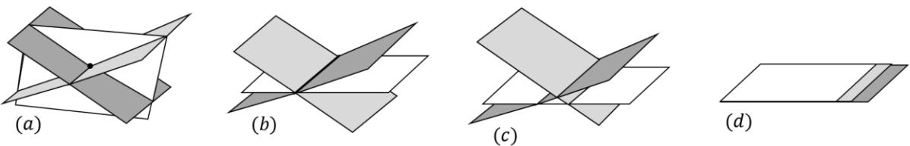
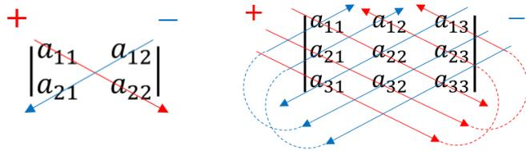

## [Lecture 4] Matrices I: Systems of Linear Equations

### [4-1] Introduction

In this lecture, we begin with solving systems of linear equations via elimination (addition/subtraction method) and systematically learn **Gaussian elimination** (row reduction / sweep-out method). Linear algebra historically originated from systematic methods for solving linear systems, capturing a core aspect of the subject. Here, we systematically manipulate linear equations and introduce determinants and matrices using the volume function $D$ developed in Lecture 3.

Efficiently solving large linear systems remains a central research topic in modern computational science (e.g., discretized partial differential equations, big data analysis). Gaussian elimination serves as the foundational starting point.

### [4-2] Gaussian Elimination

#### [4-2-1] Solving Systems of Linear Equations via Elimination

Consider the system of three linear equations:

$$\begin{cases} x + y + 2z = 9 \\ 2x + y + 3z = 13 \\ x + 2y + 4z = 17 \end{cases}$$

Instead of writing variables $x, y, z$ repeatedly, we write the augmented matrix containing coefficients and constants:

$$\begin{bmatrix} 1 & 1 & 2 & 9 \\ 2 & 1 & 3 & 13 \\ 1 & 2 & 4 & 17 \end{bmatrix}$$

- Subtract $2 \times \text{Row 1}$ from Row 2, and $1 \times \text{Row 1}$ from Row 3:

$$\begin{cases} x + y + 2z = 9 \\ -y - z = -5 \\ y + 2z = 8 \end{cases} \quad \begin{bmatrix} 1 & 1 & 2 & 9 \\ 0 & -1 & -1 & -5 \\ 0 & 1 & 2 & 8 \end{bmatrix}$$

- Multiply Row 2 by $-1$:

$$\begin{cases} x + y + 2z = 9 \\ y + z = 5 \\ y + 2z = 8 \end{cases} \quad \begin{bmatrix} 1 & 1 & 2 & 9 \\ 0 & 1 & 1 & 5 \\ 0 & 1 & 2 & 8 \end{bmatrix}$$

- Subtract Row 2 from Row 3:

$$\begin{cases} x + y + 2z = 9 \\ y + z = 5 \\ z = 3 \end{cases} \quad \begin{bmatrix} 1 & 1 & 2 & 9 \\ 0 & 1 & 1 & 5 \\ 0 & 0 & 1 & 3 \end{bmatrix}$$

- Subtract $2 \times \text{Row 3}$ from Row 1, and $1 \times \text{Row 3}$ from Row 2:

$$\begin{cases} x + y = 3 \\ y = 2 \\ z = 3 \end{cases} \quad \begin{bmatrix} 1 & 1 & 0 & 3 \\ 0 & 1 & 0 & 2 \\ 0 & 0 & 1 & 3 \end{bmatrix}$$

- Subtract Row 2 from Row 1:

$$\begin{cases} x = 1 \\ y = 2 \\ z = 3 \end{cases} \quad \begin{bmatrix} 1 & 0 & 0 & 1 \\ 0 & 1 & 0 & 2 \\ 0 & 0 & 1 & 3 \end{bmatrix}$$

The basic operations involved in Gaussian elimination are:
1. Multiply a row by a non-zero scalar.
2. Add a scalar multiple of one row to another row.
3. Swap two rows (if necessary).

#### [4-2-2] Gaussian Elimination and Elementary Row Operations

The matrix notation represents the **coefficient matrix** (left of vertical bar) and **augmented matrix** (including constants).

- Horizontal entries form **rows**, and vertical entries form **columns**.
- The first non-zero entry in a row is its **pivot** (leading entry / principal component).

● **Definition of Elementary Row Operations**:
- Multiply a row by a non-zero scalar.
- Add a scalar multiple of one row to another row.
- Swap two rows.

● **Definition of Reduced Row Echelon Form (RREF)**:
1. Every pivot is $1$.
2. In any column containing a pivot, all other entries are $0$.
3. Pivots strictly move to the right in lower rows.
4. Any row consisting entirely of $0$s is placed at the bottom.

#### [4-2-3] Infinitely Many Solutions and No Solution

If equations in a system are not linearly independent, the system may yield no solution (inconsistent/impossible) or infinitely many solutions (indeterminate).

For example:

$$\begin{cases} x + y + 2z = 1 \\ 3x + 2y + 3z = 2 \\ 2x + y + z = 1 + a \end{cases}$$

Reducing the augmented matrix yields:

$$\begin{bmatrix} 1 & 0 & -1 & 0 \\ 0 & 1 & 3 & 1 \\ 0 & 0 & 0 & a \end{bmatrix}$$

- If $a \neq 0$, the third row states $0 = a$, which is impossible ($\to$ **no solution**).
- If $a = 0$, the third row states $0 = 0$. Setting free variable $z = t$, the solution set is parametrized as:

$$\begin{cases} x = t \\ y = 1 - 3t \\ z = t \end{cases}$$

The number of pivots in the coefficient matrix is defined as its **rank**. Here $\text{rank} = 2$.
In general, for $n$ variables:
- If $\text{rank} = n$, a unique solution exists.
- If $\text{rank} < n$, the solution space has degrees of freedom equal to $n - \text{rank}$.

Geometric interpretation in 3D:
- (a) Three planes intersect at a single point ($\text{rank} = 3$, unique solution).
- (b) Three planes intersect in a line ($\text{rank} = 2$, 1 degree of freedom).
- (c) Planes have no common intersection ($\text{rank} = 2, a \neq 0$, no solution).
- (d) Three planes coincide ($\text{rank} = 1$, 2 degrees of freedom).

#### [4-2-4] A Different Perspective on Linear Systems

A linear system can be viewed as a vector equation:

$$\begin{cases} x + 2y = 5 \\ 2x + 5y = 12 \end{cases} \iff x \begin{bmatrix} 1 \\ 2 \end{bmatrix} + y \begin{bmatrix} 2 \\ 5 \end{bmatrix} = \begin{bmatrix} 5 \\ 12 \end{bmatrix} \quad (4-2-3)$$

This asks whether the constant vector $[5, 12]^T$ can be expressed as a linear combination of column vectors $[1, 2]^T$ and $[2, 5]^T$.

Using our multilinear alternating volume function $D(\mathbf{a}, \mathbf{b})$ from Lecture 3:

$$D\left(\begin{bmatrix} 5 \\ 12 \end{bmatrix}, \begin{bmatrix} 2 \\ 5 \end{bmatrix}\right) = D\left(x \begin{bmatrix} 1 \\ 2 \end{bmatrix} + y \begin{bmatrix} 2 \\ 5 \end{bmatrix}, \begin{bmatrix} 2 \\ 5 \end{bmatrix}\right) = x D\left(\begin{bmatrix} 1 \\ 2 \end{bmatrix}, \begin{bmatrix} 2 \\ 5 \end{bmatrix}\right)$$

When $D\left(\begin{bmatrix} a \\ c \end{bmatrix}, \begin{bmatrix} b \\ d \end{bmatrix}\right) \neq 0$, the solution is given explicitly by:

$$x = \frac{D\left(\begin{bmatrix} e \\ f \end{bmatrix}, \begin{bmatrix} b \\ d \end{bmatrix}\right)}{D\left(\begin{bmatrix} a \\ c \end{bmatrix}, \begin{bmatrix} b \\ d \end{bmatrix}\right)}, \quad y = \frac{D\left(\begin{bmatrix} a \\ c \end{bmatrix}, \begin{bmatrix} e \\ f \end{bmatrix}\right)}{D\left(\begin{bmatrix} a \\ c \end{bmatrix}, \begin{bmatrix} b \\ d \end{bmatrix}\right)} \quad (4-2-6)$$

Extending to $n \times n$ systems yields **Cramer's Rule**.

### [4-3] Introduction of Determinants

#### [4-3-1] Revisiting Function $D$

For an $n \times n$ matrix with entries $a_{ij}$ (where $i$ is row index and $j$ is column index):

$$D(\mathbf{a}_1, \dots, \mathbf{a}_n) = \sum_{i_1, \dots, i_n=1}^n a_{i_1 1} a_{i_2 2} \dots a_{i_n n} \varepsilon_{i_1 \dots i_n} \quad (4-3-2)$$

where $\varepsilon_{i_1 \dots i_n}$ is the Levi-Civita symbol.

#### [4-3-2] Definition of Determinant

The determinant of matrix $A$, denoted $\det(A)$ or $|A|$, is defined as:

- **$2 \times 2$ Determinant**:

$$\begin{vmatrix} a_{11} & a_{12} \\ a_{21} & a_{22} \end{vmatrix} = a_{11} a_{22} - a_{12} a_{21} \quad (4-3-3)$$

- **$3 \times 3$ Determinant** (Sarrus' Rule):

$$\begin{vmatrix} a_{11} & a_{12} & a_{13} \\ a_{21} & a_{22} & a_{23} \\ a_{31} & a_{32} & a_{33} \end{vmatrix} = a_{11}a_{22}a_{33} + a_{12}a_{23}a_{31} + a_{13}a_{21}a_{32} - a_{13}a_{22}a_{31} - a_{11}a_{23}a_{32} - a_{12}a_{21}a_{33}$$

- **General $n \times n$ Determinant**:

$$\det(A) = \sum_{i_1, \dots, i_n=1}^n \varepsilon_{i_1 \dots i_n} a_{i_1 1} \dots a_{i_n n} \quad (4-3-6)$$

#### [4-3-3] Properties of Determinants

1. **Multilinearity**: Linear in each row and column.
2. **Alternating Property**: Swapping two rows or two columns multiplies the determinant by $-1$.
3. **Pivotal Row Operation**: Adding a scalar multiple of one row (or column) to another leaves the determinant unchanged.
4. **Transpose Invariance**: $\det(A^T) = \det(A)$.
5. **Upper Triangular Matrix**: For an upper triangular matrix, the determinant equals the product of diagonal elements:

$$\begin{vmatrix} a_{11} & a_{12} & \cdots & a_{1n} \\ 0 & a_{22} & \cdots & a_{2n} \\ \vdots & \vdots & \ddots & \vdots \\ 0 & 0 & \cdots & a_{nn} \end{vmatrix} = a_{11} a_{22} \cdots a_{nn} \quad (4-3-16)$$

### [4-4] Introduction of Matrices

#### [4-4-1] Defining Matrices and Matrix Multiplication

A system $A\mathbf{x} = \mathbf{b}$ uses matrix-vector multiplication defined by:

$$\begin{bmatrix} a & b \\ c & d \end{bmatrix} \begin{bmatrix} x \\ y \end{bmatrix} = \begin{bmatrix} ax + by \\ cx + dy \end{bmatrix} \quad (4-4-1)$$

Matrix-matrix multiplication $AB = C$ is defined component-wise as:

$$c_{ij} = \sum_{k=1}^n a_{ik} b_{kj} \quad (4-4-11)$$

*Note: Matrix multiplication is non-commutative in general ($AB \neq BA$).*

#### [4-4-2] Basic Definitions and Special Matrices

- **Square Matrix**: Matrix with equal number of rows and columns ($n \times n$).
- **Identity Matrix $E$ (or $I$)**: Diagonal entries are $1$, off-diagonal entries are $0$.
- **Zero Matrix $O$**: All entries are $0$.
- **Transpose $A^T$**: Row and column indices are swapped ($(A^T)_{ij} = A_{ji}$).

#### [4-4-3] Solving $A\mathbf{x} = \mathbf{b}$ via Inverse Matrix

Finding matrix $X'$ such that $AX' = E$ allows solving $A\mathbf{x} = \mathbf{b}$ as $\mathbf{x} = X'\mathbf{b}$.
Computing $X'$ via augmented Gaussian elimination $[A \mid E] \to [E \mid X']$ yields $X' = A^{-1}$ (the inverse matrix).

### [4-5] Appendix 1: Important Properties of Determinants
Detailed derivations using index notation and Levi-Civita symbols for $\det(A^T) = \det(A)$ and multiplicative property $\det(AB) = \det(A)\det(B)$.

### [4-6] Appendix 2: Structure of Reduced Row Echelon Matrices
Exhaustive list of possible RREF forms for $2 \times 2, 3 \times 3, 4 \times 4$ matrices categorized by rank $r$ and solution freedom $n - r$.

### [4-7] Appendix 3: Supplementary Explanations
Geometric analysis of planes in 3D and proof that elementary row operations preserve linear combination relationships.

### [4-8] Appendix 4: Equivalence to Leibniz Formula
Demonstrates equivalence between $D(\mathbf{a}_1, \dots, \mathbf{a}_n)$ definition and the Leibniz formula for determinants over the symmetric group $S_n$.
