## [Lecture 5] Matrices II: Linear Transformations

### [5-1] Introduction

In Lecture 4, we treated systems of linear equations as algebraic equations $A\mathbf{x} = \mathbf{b}$. Just as $y = ax$ represents a linear function, viewing $A\mathbf{x} = \mathbf{b}$ as $\mathbf{y} = A\mathbf{x}$ interprets matrix $A$ as a mapping that transforms vector $\mathbf{x}$ to vector $\mathbf{y}$.

In this lecture, we explore matrices, determinants, and vector spaces from the perspective of linear transformations. Finally, we establish abstract linear mappings to deepen our understanding before proceeding to Lecture 6.

### [5-2] Linear Transformations

#### [5-2-1] Examples of Linear Transformations

The mapping $\mathbf{y} = A\mathbf{x}$ that maps vector $\mathbf{x}$ to vector $\mathbf{y}$ via matrix $A$ is called a **linear transformation**. For a $2 \times 2$ matrix $A$:

$$\begin{bmatrix} y_1 \\ y_2 \end{bmatrix} = \begin{bmatrix} a_{11} & a_{12} \\ a_{21} & a_{22} \end{bmatrix} \begin{bmatrix} x_1 \\ x_2 \end{bmatrix} \implies \begin{cases} y_1 = a_{11} x_1 + a_{12} x_2 \\ y_2 = a_{21} x_1 + a_{22} x_2 \end{cases} \quad (5-2-1)$$

Position vector $\mathbf{x} = x_1 \mathbf{e}_1 + x_2 \mathbf{e}_2$ transforms into:

$$\mathbf{y} = A\mathbf{x} = A(x_1 \mathbf{e}_1 + x_2 \mathbf{e}_2) = x_1 A\mathbf{e}_1 + x_2 A\mathbf{e}_2 = x_1 \mathbf{e}'_1 + x_2 \mathbf{e}'_2 \quad (5-2-2)$$

where standard basis vectors $\mathbf{e}_1 = [1, 0]^T, \mathbf{e}_2 = [0, 1]^T$ map to transformed basis vectors $\mathbf{e}'_1, \mathbf{e}'_2$:

$$\mathbf{e}'_1 = A\mathbf{e}_1 = \begin{bmatrix} a_{11} \\ a_{21} \end{bmatrix}, \quad \mathbf{e}'_2 = A\mathbf{e}_2 = \begin{bmatrix} a_{12} \\ a_{22} \end{bmatrix} \quad (5-2-3)$$

Notice that the columns of matrix $A$ are precisely the transformed basis vectors $\mathbf{e}'_1, \mathbf{e}'_2$!

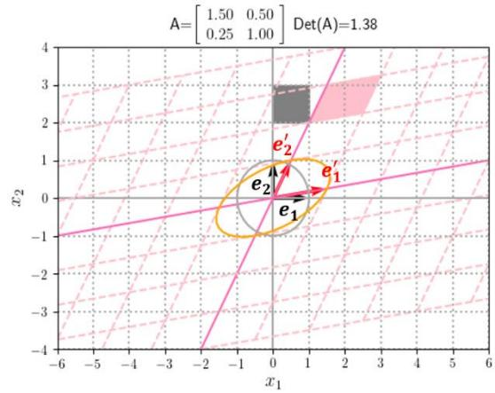
*Figure 5-2-1: Grid transformation under matrix $A = \begin{bmatrix} 1.5 & 0.5 \\ 0.25 & 1.0 \end{bmatrix}$.*

Geometrically, the determinant $\det(A)$ represents the **area scaling factor** under transformation $A$.
In Figure 5-2-1, $\det(A) = 1.5 \times 1.0 - 0.5 \times 0.25 = 1.375$, so every region's area is scaled by a factor of $1.375$.

*Figure 5-2-2: Scaling transformation $A = \begin{bmatrix} 1.2 & 0 \\ 0 & 0.8 \end{bmatrix}$ ($\det(A) = 0.96$).*

*Figure 5-2-3: Shear transformation $A = \begin{bmatrix} 1 & 0.8 \\ 0 & 1 \end{bmatrix}$ ($\det(A) = 1$).*

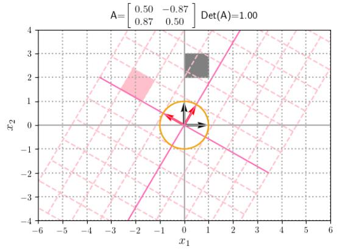
*Figure 5-2-4: Rotation transformation $A = \begin{bmatrix} \cos(\pi/3) & -\sin(\pi/3) \\ \sin(\pi/3) & \cos(\pi/3) \end{bmatrix}$ ($\det(A) = 1$).*

*Figure 5-2-5: Composite transformation: Rotation followed by Shear.*

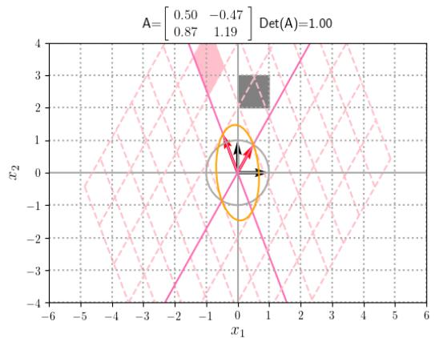
*Figure 5-2-6: Composite transformation: Shear followed by Rotation.*

*Figure 5-2-7: Singular transformation $A = \begin{bmatrix} 1 & -1 \\ -1 & 1 \end{bmatrix}$ ($\det(A) = 0$), collapsing 2D space onto a 1D line.*

When $\det(A) = 0$, the transformation collapses 2D space onto a line (or point), rendering the transformation non-invertible.

### [5-3] Inverse Matrix

#### [5-3-1] Cofactor Expansion and Determinant Properties

The **cofactor** $\tilde{a}_{ij}$ (or $C_{ij}$) of entry $a_{ij}$ in matrix $A$ is defined as:

$$\tilde{a}_{ij} = (-1)^{i+j} M_{ij} \quad (5-3-1)$$

where $M_{ij}$ is the $(n-1) \times (n-1)$ minor determinant obtained by deleting row $i$ and column $j$.

● **Cofactor Expansion along Column $j$**:

$$\det(A) = \sum_{i=1}^n a_{ij} \tilde{a}_{ij} \quad (5-3-1)$$

● **Cofactor Expansion along Row $i$**:

$$\det(A) = \sum_{j=1}^n a_{ij} \tilde{a}_{ij} \quad (5-3-2)$$

● **Determinant of Product**:

$$\det(AB) = \det(A) \det(B) \quad (5-3-3)$$

#### [5-3-2] Definition of Inverse Matrix via Adjugate Matrix

A square matrix $A$ is **nonsingular** (invertible) if there exists a matrix $X$ such that $AX = XA = E$. We denote $X = A^{-1}$.

The **adjugate matrix** (or cofactor matrix transposed) $\tilde{A}$ is defined as:

$$\tilde{A} = \begin{bmatrix} \tilde{a}_{11} & \tilde{a}_{21} & \dots & \tilde{a}_{n1} \\ \tilde{a}_{12} & \tilde{a}_{22} & \dots & \tilde{a}_{n2} \\ \vdots & \vdots & \ddots & \vdots \\ \tilde{a}_{1n} & \tilde{a}_{2n} & \dots & \tilde{a}_{nn} \end{bmatrix}$$

Explicit formula for the inverse matrix:

$$A^{-1} = \frac{1}{\det(A)} \tilde{A} \quad (\det(A) \neq 0) \quad (5-3-4)$$

#### [5-3-3] Equivalent Conditions for Invertibility

For an $n \times n$ matrix $A$, the following conditions are mutually equivalent:
1. $A$ is invertible ($A^{-1}$ exists).
2. $\det(A) \neq 0$.
3. $A\mathbf{x} = \mathbf{0}$ has only the trivial solution $\mathbf{x} = \mathbf{0}$.
4. The column vectors of $A$ are linearly independent.
5. The row vectors of $A$ are linearly independent.
6. $\text{rank}(A) = n$.

### [5-4] Orthogonal Matrices

#### [5-4-1] Properties of Transpose Matrices

- $(AB)^T = B^T A^T \quad (5-4-1)$
- $(A^T)^{-1} = (A^{-1})^T \quad (5-4-2)$
- Inner product notation: $\mathbf{x} \cdot \mathbf{y} = \mathbf{x}^T \mathbf{y}$.

#### [5-4-2] Definition and Properties of Orthogonal Matrices

A real square matrix $R$ is **orthogonal** if:

$$R^T R = R R^T = E \iff R^{-1} = R^T \quad (5-4-3)$$

Key properties:
1. $\det(R) = \pm 1$.
2. Products of orthogonal matrices are orthogonal.
3. Orthogonal transformations preserve inner products and lengths: $(R\mathbf{x}) \cdot (R\mathbf{y}) = \mathbf{x} \cdot \mathbf{y}$ and $\|R\mathbf{x}\| = \|\mathbf{x}\|$.
4. The column vectors (and row vectors) of $R$ form an **orthonormal basis**.

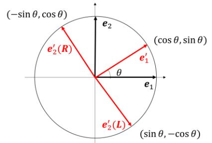
*Diagram Translation (Proper Rotation vs. Reflection / 回転と鏡映):*
- $e'_2(R)$: Proper rotation (right-handed frame, $\det R = +1$).
- $e'_2(L)$: Reflection across $x_1$-axis (left-handed frame, $\det R = -1$).

In 2D:
- **Proper Rotation** ($\det(R) = +1$):

$$R(\theta) = \begin{bmatrix} \cos \theta & -\sin \theta \\ \sin \theta & \cos \theta \end{bmatrix}$$

- **Reflection / Improper Rotation** ($\det(R) = -1$):

$$R(\theta) = \begin{bmatrix} \cos \theta & \sin \theta \\ \sin \theta & -\cos \theta \end{bmatrix}$$

### [5-5] Matrix Representation of Linear Transformations

#### [5-5-1] Abstract Mapping Definitions

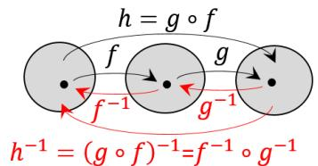

A mapping $f: U \to V$ between vector spaces is a **linear mapping** if:

$$f(\mathbf{x} + \mathbf{y}) = f(\mathbf{x}) + f(\mathbf{y}), \quad f(k\mathbf{x}) = k f(\mathbf{x}) \quad (5-5-1)$$

#### [5-5-2] Matrix Representation under Basis $B$

For basis $B = \{\mathbf{b}_1, \dots, \mathbf{b}_n\}$ of vector space $U$, vector $\mathbf{x} = \sum x_i^B \mathbf{b}_i$ is represented by column coordinate vector $\mathbf{x}_B = [x_1^B, \dots, x_n^B]^T$:

$$\mathbf{x} = (\mathbf{b}_1 \ \dots \ \mathbf{b}_n) \mathbf{x}_B \quad (5-5-2)$$

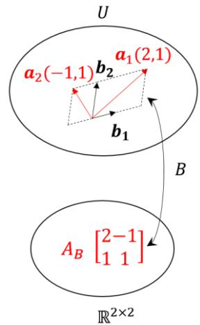

Linear mapping $f$ has matrix representation $A_B$ under basis $B$ defined by:

$$f(\mathbf{b}_j) = \sum_{i=1}^n \mathbf{b}_i a_{ij}^B \implies (f(\mathbf{b}_1) \ \dots \ f(\mathbf{b}_n)) = (\mathbf{b}_1 \ \dots \ \mathbf{b}_n) A_B \quad (5-5-8)$$

Transformed coordinates satisfy:

$$\mathbf{y}_B = A_B \mathbf{x}_B \quad (5-5-9)$$

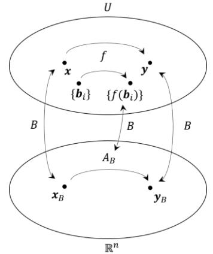

#### [5-5-3] Change of Basis and Matrix Transformation

Given two bases $B = \{\mathbf{b}_i\}$ and $C = \{\mathbf{c}_i\}$ related by change of basis matrix $P_{B \to C}$:

$$(\mathbf{c}_1 \ \dots \ \mathbf{c}_n) = (\mathbf{b}_1 \ \dots \ \mathbf{b}_n) P_{B \to C} \quad (5-5-11)$$

Coordinates convert as:

$$\mathbf{x}_C = P_{B \to C}^{-1} \mathbf{x}_B \quad (5-5-12)$$

Matrix representation transforms via similarity transformation:

$$F_C = P_{B \to C}^{-1} F_B P_{B \to C} \quad (5-5-13)$$

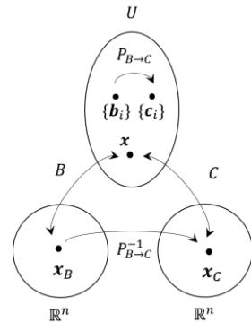
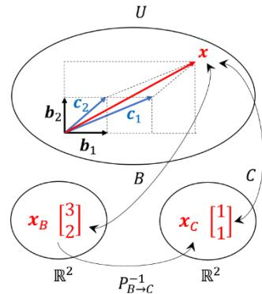

Note: $\det(F_C) = \det(F_B)$, proving that the determinant is an intrinsic property of the linear transformation $f$ independent of basis choice!

#### [5-5-4] Active vs. Passive Transformations and Compositions

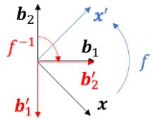
*Diagram Translation (Active vs Passive Transformation / アクティブ変換とパッシブ変換):*
- **Active Transformation**: Rotates physical vector $\mathbf{x} \to \mathbf{x}'$ within a fixed frame ($\mathbf{x}'_B = F_B \mathbf{x}_B$).
- **Passive Transformation**: Rotates coordinate frame $\mathbf{b}_1, \mathbf{b}_2 \to \mathbf{b}'_1, \mathbf{b}'_2$ while vector $\mathbf{x}$ remains fixed ($\mathbf{x}_{B'} = F_B \mathbf{x}_B$).

Composition of transformations $h = g \circ f$ under basis $B$:

$$H_B = G_B F_B \quad (5-5-16)$$

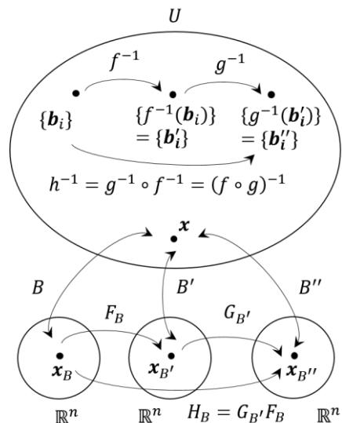

### [5-6] Appendix 1: Properties of Products of Levi-Civita Symbols
Rigorous derivation of $\sum_{i=1}^3 \varepsilon_{ijk} \varepsilon_{imn} = \delta_{jm} \delta_{kn} - \delta_{jn} \delta_{km}$ via determinant of dot products.

### [5-7] Appendix 2: Matrix Representation of Complex Numbers
Isomorphism between complex number $z = x + i y$ and $2 \times 2$ real matrix $Z = x E + y I = \begin{bmatrix} x & -y \\ y & x \end{bmatrix}$ where $I = \begin{bmatrix} 0 & -1 \\ 1 & 0 \end{bmatrix}$. Multiplication by unit norm $Z$ corresponds exactly to $2D$ rotation.
