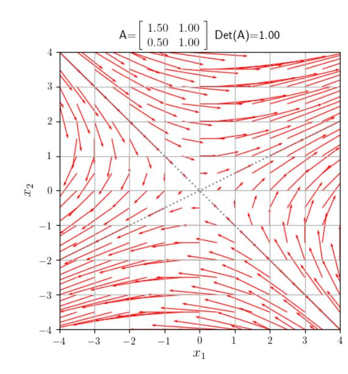
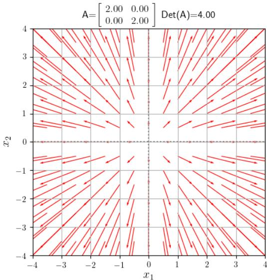
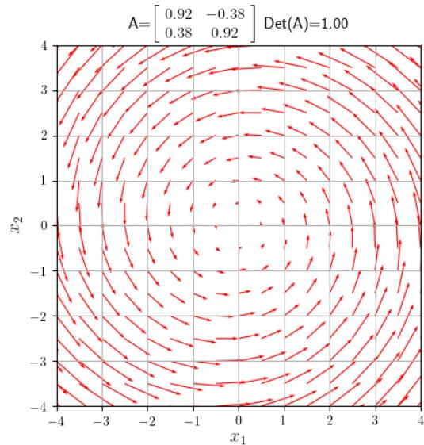
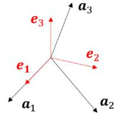

# [Lecture 6] Matrices III: Eigenvalues and Diagonalization

## [6-1] Introduction

In Lecture 5, we studied matrices as linear transformations mapping points in vector space. Visualizing the transformation as a directional "flow" reveals that certain lines through the origin remain invariant in direction, offering deep insight into intrinsic matrix characteristics.

Furthermore, if an $n \times n$ matrix possesses $n$ linearly independent invariant axes, transforming the basis to these axes simplifies the matrix into a diagonal form—a process called **diagonalization** with major applications across science and engineering.

## [6-2] Eigenvectors and Eigenvalues

### [6-2-1] Directional Flow of Linear Transformations

Consider the 2D linear transformation:

$$\begin{bmatrix} y_1 \\ y_2 \end{bmatrix} = \begin{bmatrix} 3/2 & 1 \\ 1/2 & 1 \end{bmatrix} \begin{bmatrix} x_1 \\ x_2 \end{bmatrix}$$

Plotting direction vectors of transformed points visualizes the directional "flow":

Notice how points flow along the line $x_2 = -x_1$ toward the origin and diverge outward along $x_2 = \frac{1}{2}x_1$.

For shear matrix $\begin{bmatrix} 1 & 1 \\ 0 & 1 \end{bmatrix}$:

points move horizontally parallel to the $x_1$-axis.

*Scaling $2E$: Every direction through origin is invariant.*

*Rotation by $\pi/8$: No real invariant direction exists.*

### [6-2-2] Eigenvalue Equation and Characteristic Polynomial

For an $n \times n$ matrix $A$, a non-zero vector $\mathbf{u} \neq \mathbf{0}$ whose direction is unchanged by transformation $A$ satisfies:

$$A\mathbf{u} = \lambda \mathbf{u} \quad (6-2-1)$$

where scalar $\lambda$ is the **eigenvalue** and non-zero vector $\mathbf{u}$ is the **eigenvector**.

Rearranging gives the homogeneous system:

$$(A - \lambda E)\mathbf{u} = \mathbf{0} \quad (6-2-2)$$

For non-zero solutions $\mathbf{u} \neq \mathbf{0}$ to exist, matrix $(A - \lambda E)$ must be singular:

$$\det(A - \lambda E) = 0 \quad (6-2-3)$$

Equation (6-2-3) is the **characteristic equation** (or eigenvalue equation), and $g(\lambda) = \det(A - \lambda E)$ is the **characteristic polynomial**.

#### Examples:

1. $A = \begin{bmatrix} 3/2 & 1 \\ 1/2 & 1 \end{bmatrix}$:
   Characteristic equation: $\lambda^2 - \frac{5}{2}\lambda + 1 = 0 \implies \lambda_1 = 2, \lambda_2 = 1/2$.
   - For $\lambda_1 = 2$: eigenvector $\mathbf{u}_1 = s \begin{bmatrix} 2 \\ 1 \end{bmatrix}$.
   - For $\lambda_2 = 1/2$: eigenvector $\mathbf{u}_2 = t \begin{bmatrix} -1 \\ 1 \end{bmatrix}$.

2. Shear matrix $A = \begin{bmatrix} 1 & 1 \\ 0 & 1 \end{bmatrix}$:
   $(\lambda - 1)^2 = 0 \implies \lambda = 1$ (repeated root). Eigenvector: $\mathbf{u} = s \begin{bmatrix} 1 \\ 0 \end{bmatrix}$ (1D eigenspace).

3. Diagonal matrix $A = \begin{bmatrix} 2 & 0 \\ 0 & 2 \end{bmatrix}$:
   $\lambda = 2$ (repeated root). Eigenspace is 2D, spanned by $\begin{bmatrix} 1 \\ 0 \end{bmatrix}$ and $\begin{bmatrix} 0 \\ 1 \end{bmatrix}$.

4. Rotation matrix $A = \begin{bmatrix} \cos \theta & -\sin \theta \\ \sin \theta & \cos \theta \end{bmatrix}$:
   Characteristic roots: complex conjugate eigenvalues $\lambda = \cos \theta \pm i \sin \theta = e^{\pm i \theta}$.

5. 3D Symmetric matrix $A = \begin{bmatrix} 0 & 1 & 1 \\ 1 & 0 & 1 \\ 1 & 1 & 0 \end{bmatrix}$:
   Characteristic polynomial: $(\lambda - 2)(\lambda + 1)^2 = 0$.
   - $\lambda_1 = 2 \implies \mathbf{u}_1 = r [1, 1, 1]^T$.
   - $\lambda_2 = -1$ (multiplicity 2) $\implies$ 2D eigenspace spanned by $[-1, 1, 0]^T$ and $[-1, 0, 1]^T$.

## [6-3] Matrix Diagonalization

### [6-3-1] Basis Transformation to Eigenvectors

If an $n \times n$ matrix $A$ has $n$ linearly independent eigenvectors $\mathbf{u}_1, \dots, \mathbf{u}_n$, construct transition matrix $P = [\mathbf{u}_1 \ \dots \ \mathbf{u}_n]$. Since columns are linearly independent, $P$ is invertible.

Transforming matrix $A$ under basis $P$:

$$P^{-1} A P = \begin{bmatrix} \lambda_1 & \cdots & 0 \\ \vdots & \ddots & \vdots \\ 0 & \cdots & \lambda_n \end{bmatrix} = \Lambda \quad (6-3-2)$$

This process is **matrix diagonalization**.

### [6-3-2] Diagonalizability Conditions

- **Theorem**: Eigenvectors corresponding to distinct eigenvalues are automatically linearly independent.
- If $A$ has $n$ distinct eigenvalues, $A$ is guaranteed to be diagonalizable.
- If $A$ has repeated eigenvalues, $A$ is diagonalizable iff the geometric multiplicity (number of linearly independent eigenvectors) equals algebraic multiplicity for every eigenvalue.

### [6-3-3] Similarity Transformations

Matrices $A$ and $B$ are **similar** if $B = P^{-1} A P$ for some invertible matrix $P$.
Similar matrices share:
1. Same determinant: $\det(B) = \det(A)$.
2. Same characteristic polynomial: $\det(B - \lambda E) = \det(A - \lambda E)$.
3. Same eigenvalues and trace.

### [6-3-4] Matrix Triangulation (Schur Decomposition)

Every square complex matrix $A$ is similar to an upper triangular matrix $\Gamma = P^{-1} A P$ whose diagonal entries are the eigenvalues of $A$.

### [6-3-5] Trace and Matrix Polynomials

- **Trace**: $\text{tr}(A) = \sum a_{ii} = \sum \lambda_i$.
- **Determinant**: $\det(A) = \prod \lambda_i$.
- **Matrix Powers**: $A^k = P \Lambda^k P^{-1}$.
- **Matrix Polynomials**: $f(A) = P f(\Lambda) P^{-1}$.

## [6-4] Diagonalization of Real Symmetric Matrices

### [6-4-1] Properties of Real Symmetric Matrices

For any real symmetric matrix $A = A^T$:
1. All eigenvalues of $A$ are real numbers.
2. Eigenvectors corresponding to distinct eigenvalues are orthogonal ($u_i \cdot u_j = 0$).

### [6-4-2] Gram-Schmidt Orthogonalization Process

Given $m$ linearly independent vectors $\{\mathbf{a}_1, \dots, \mathbf{a}_m\}$, construct orthonormal basis $\{\mathbf{e}_1, \dots, \mathbf{e}_m\}$ via:

$$\mathbf{e}_1 = \frac{\mathbf{a}_1}{\|\mathbf{a}_1\|}$$

$$\mathbf{e}'_k = \mathbf{a}_k - \sum_{i=1}^{k-1} (\mathbf{e}_i \cdot \mathbf{a}_k)\mathbf{e}_i, \quad \mathbf{e}_k = \frac{\mathbf{e}'_k}{\|\mathbf{e}'_k\|}$$

### [6-4-3] Orthogonal Diagonalization and Quadratic Forms

Every real symmetric matrix $A$ can be orthogonally diagonalized:

$$R^T A R = \Lambda \quad \text{where } R \text{ is an orthogonal matrix } (R^T = R^{-1})$$

A quadratic form $Q(\mathbf{x}) = \mathbf{x}^T A \mathbf{x}$ simplifies under orthogonal coordinate change $\mathbf{x} = R\mathbf{y}$ to canonical form:

$$Q(\mathbf{y}) = \mathbf{y}^T \Lambda \mathbf{y} = \sum_{i=1}^n \lambda_i y_i^2 \quad (6-4-8)$$

## [6-5] Application Examples

### [6-5-1] Euler's Rotation Theorem

Any 3D rotation matrix $R$ satisfies $R\mathbf{u} = \mathbf{u}$ for at least one unit vector $\mathbf{u}$ ($\lambda = 1$), proving the existence of an invariant axis of rotation.

### [6-5-2] Recurrence Relations and Characteristic Equations

Matrix form of second-order linear recurrence $a_{n+2} = p a_{n+1} + q a_n$:

$$\begin{bmatrix} a_{n+2} \\ a_{n+1} \end{bmatrix} = \begin{bmatrix} p & q \\ 1 & 0 \end{bmatrix} \begin{bmatrix} a_{n+1} \\ a_n \end{bmatrix}$$

Diagonalizing the transition matrix yields the closed-form solution.

### [6-5-3] [▼B] Fourier Series Expansion

Differential operator $D = \frac{d^2}{dx^2}$ on periodic functions acts as a linear operator whose eigenfunctions $\cos(nx), \sin(nx)$ form an orthogonal basis.

### [6-5-4] Matrix Exponential Function

Defined by power series:

$$e^X \equiv \sum_{k=0}^{\infty} \frac{1}{k!} X^k \quad (6-5-2)$$

For diagonalizable matrix $A = P \Lambda P^{-1}$:

$$e^A = P e^\Lambda P^{-1} = P \begin{bmatrix} e^{\lambda_1} & \dots & 0 \\ \vdots & \ddots & \vdots \\ 0 & \dots & e^{\lambda_n} \end{bmatrix} P^{-1} \quad (6-5-4)$$

with property $\det(e^A) = e^{\text{tr}(A)}$.

## [6-6] Appendix 1: Complex Vector Spaces
Overview of Hermitian inner products $\mathbf{x} \cdot \mathbf{y} = \mathbf{x}^\dagger \mathbf{y}$, conjugate transpose $A^\dagger = (\bar{A})^T$, Hermitian matrices ($A^\dagger = A$), and unitary matrices ($U^\dagger U = E$).

## [6-7] Appendix 2: Complete Mathematical Proofs
Includes proofs of eigenvector independence for distinct eigenvalues, Schur triangulation theorem, and orthogonal diagonalization of symmetric matrices.

## [6-8] [▼A] Appendix 3: Matrix Representation of Euler's Formula
Derivation of matrix Euler formula $e^{\theta I} = \cos \theta E + \sin \theta I$ where $I = \begin{bmatrix} 0 & -1 \\ 1 & 0 \end{bmatrix}$.
