# **[Lecture 7] Representation of Rotations I**

## **[7-1] Introduction**

In previous lectures, we rapidly covered the fundamentals of linear algebra. In the final two lectures, we focus on four major representations of 3D rotations widely used across engineering and computer graphics. In this lecture, we study **Rotation Matrices**, **Euler Angles (and Tait-Bryan Angles)**, and **Rotation Vectors**. Our goal is to deepen our understanding of 3D rotations themselves. Let us begin by analyzing what a 3D rotation fundamentally represents.

### **Considerations on 3D Rotations**

- **What is a rotation?** Consider a rigid body that does not deform. Choose a representative reference point $O'$ fixed relative to all points in the body (or fixed relative to the body's frame). Even if $O'$ is fixed at a point in 3D space, the rigid body retains freedom to move around $O'$. This motion around fixed center point $O'$ is what we call **rotation**, and $O'$ is the **center of rotation**.
- **Location of the Center of Rotation**: The translational motion of $O'$ itself in space is independent of rotation. Thus, by shifting $O'$ to the origin $O$ of our coordinate space, we lose no generality in analyzing rotations.
- **Rotation as Relative Displacement**: Just as position vectors describe translation relative to an origin, 3D rotations describe relative displacement from a reference orientation (pose). These displacements describe net orientation results without depending on intermediate path details.
- **Degrees of Freedom of Rotation**: Translational motion in 3D space has 3 degrees of freedom. What about rotation? Fixing rotation center $O$, choose another point $P$ in the rigid body. As the body rotates, $P$ moves on a sphere of constant radius $OP$ centered at $O$, giving $P$ 2 degrees of freedom. Even with $P$ fixed, the body can still rotate around axis $OP$, adding 1 rotational degree of freedom around $OP$. Once this angle is fixed, the rigid body is completely fixed. Thus, 3D rotations have **3 degrees of freedom**.

## **[7-2] Rotation Matrices**

### **[7-2-1] Formalization of Rotation Analysis**

Let Euclidean space $\mathbb{E}^3$ be spanned by standard orthonormal basis $E = \{\mathbf{e}_1, \mathbf{e}_2, \mathbf{e}_3\}$ fixed in world space with origin $O$. Attach an orthonormal basis $B = \{\mathbf{b}_1, \mathbf{b}_2, \mathbf{b}_3\}$ to the rigid body with origin $O' = O$. When $B$ aligns with $E$, the body is in its **reference orientation**. Any rotation maps basis $E$ to $B$.

Consider mapping $f: \mathbb{E}^3 \to \mathbb{E}^3$ representing rotation:

$$f(\mathbf{e}_1) = \mathbf{b}_1, \quad f(\mathbf{e}_2) = \mathbf{b}_2, \quad f(\mathbf{e}_3) = \mathbf{b}_3, \quad f(\mathbf{0}) = \mathbf{0} \quad (7-2-1)$$

Since distances between points are preserved under rigid rotation:

$$\|f(\mathbf{x}) - f(\mathbf{y})\| = \|\mathbf{x} - \mathbf{y}\| \quad (7-2-2)$$

Setting $\mathbf{y} = \mathbf{0}$, we have $\|f(\mathbf{x})\| = \|\mathbf{x}\|$ (preserves norms). As proven in Appendix 1:
- $f$ preserves inner products: $f(\mathbf{x}) \cdot f(\mathbf{y}) = \mathbf{x} \cdot \mathbf{y} \quad (7-2-4)$
- $f$ is a linear transformation: $f(\mathbf{x} + \mathbf{y}) = f(\mathbf{x}) + f(\mathbf{y}), f(k\mathbf{x}) = k f(\mathbf{x}) \quad (7-2-5)$

Because $f$ is a distance-preserving linear transformation without reflections, its matrix representation $R$ is a $3 \times 3$ **orthogonal matrix** with determinant $\det(R) = +1$—a **rotation matrix**.

### **[7-2-2] Properties of Rotation Matrices**

● **Matrix Representation**:
Transformed basis vectors $\mathbf{b}_j = f(\mathbf{e}_j) = \sum_{i=1}^3 \mathbf{e}_i r_{ij}$ form the columns of rotation matrix $R$:

$$R = \begin{bmatrix}
\mathbf{e}_1 \cdot \mathbf{b}_1 & \mathbf{e}_1 \cdot \mathbf{b}_2 & \mathbf{e}_1 \cdot \mathbf{b}_3 \\
\mathbf{e}_2 \cdot \mathbf{b}_1 & \mathbf{e}_2 \cdot \mathbf{b}_2 & \mathbf{e}_2 \cdot \mathbf{b}_3 \\
\mathbf{e}_3 \cdot \mathbf{b}_1 & \mathbf{e}_3 \cdot \mathbf{b}_2 & \mathbf{e}_3 \cdot \mathbf{b}_3
\end{bmatrix} \quad (7-2-7)$$

Columns of $R$ represent transformed orthonormal basis $B$ in world frame $E$, satisfying $R^T R = E$ and $\det(R) = +1$.
For any point $\mathbf{x}_E$, its rotated position is $\mathbf{x}'_E = R \mathbf{x}_E \quad (7-2-9)$.

● **Inverse Rotation**:
The inverse transformation $f^{-1}: \mathbf{b}_i \mapsto \mathbf{e}_i$ restores the body to its reference orientation. Its matrix is $R^{-1} = R^T \quad (7-2-10)$.

● **Rotations Around Principal Coordinate Axes**:

$$R_1(\theta) = \begin{bmatrix} 1 & 0 & 0 \\ 0 & \cos \theta & -\sin \theta \\ 0 & \sin \theta & \cos \theta \end{bmatrix}, \quad R_2(\theta) = \begin{bmatrix} \cos \theta & 0 & \sin \theta \\ 0 & 1 & 0 \\ -\sin \theta & 0 & \cos \theta \end{bmatrix}, \quad R_3(\theta) = \begin{bmatrix} \cos \theta & -\sin \theta & 0 \\ \sin \theta & \cos \theta & 0 \\ 0 & 0 & 1 \end{bmatrix}$$

● **Active vs. Passive Transformations**:
- **Active Transformation**: Rotates physical vectors within a fixed coordinate system ($\mathbf{x}'_E = R \mathbf{x}_E$).

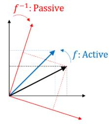

- **Passive Transformation**: Rotates the coordinate basis while keeping physical points fixed ($\mathbf{x}_{E'} = R \mathbf{x}_E$).

● **Intrinsic vs. Extrinsic Rotations**:
- **Intrinsic**: Rotations around body-attached moving axes ($z \to x' \to z''$).
- **Extrinsic**: Rotations around fixed world axes ($z \to x \to z$).

Composition of active extrinsic rotations applies matrix products in order: $R = R_3 R_2 R_1$.
Composition of intrinsic rotations multiplies matrices in reverse order: $R = R_1 R_2 R_3$.

## [7-3] Euler Angles and Related Representations

### [7-3-1] Expressing Orientation via Three Rotations

Any orientation can be reached from a reference state via three consecutive rotations around coordinate axes.

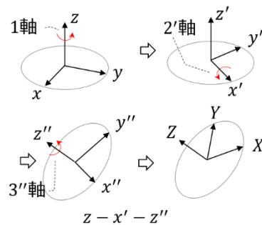
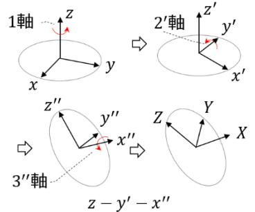

Sequences fall into two main categories:
1. **Proper Euler Angles** ($z - x' - z''$, $z - y' - z''$, etc.): First and third rotation axes coincide in local frames.
2. **Tait-Bryan Angles** ($z - y' - x''$, $z - x' - y''$, Yaw-Pitch-Roll, etc.): All three rotation axes are distinct.

### [7-3-2] Proper Euler Angles ($z - x' - z''$)

1. Rotate by angle $\alpha$ around $z$-axis ($0 \le \alpha < 2\pi$).
2. Rotate by angle $\beta$ around current $x'$-axis ($0 < \beta < \pi$).
3. Rotate by angle $\gamma$ around current $z''$-axis ($0 \le \gamma < 2\pi$).

Composite intrinsic rotation matrix:

$$R^{Euler} = R_z(\alpha) R_x(\beta) R_z(\gamma) \quad (7-3-7)$$

$$R^{Euler} = \begin{bmatrix}
\cos \alpha \cos \gamma - \sin \alpha \cos \beta \sin \gamma & -\cos \alpha \sin \gamma - \sin \alpha \cos \beta \cos \gamma & \sin \alpha \sin \beta \\
\sin \alpha \cos \gamma + \cos \alpha \cos \beta \sin \gamma & -\sin \alpha \sin \gamma + \cos \alpha \cos \beta \cos \gamma & -\cos \alpha \sin \beta \\
\sin \beta \sin \gamma & \sin \beta \cos \gamma & \cos \beta
\end{bmatrix} \quad (7-3-8)$$

### [7-3-3] Tait-Bryan Angles ($z - y' - x''$ / Yaw-Pitch-Roll)

1. Yaw $\psi$ around $z$-axis ($0 \le \psi < 2\pi$).
2. Pitch $\theta$ around current $y'$-axis ($-\pi/2 < \theta < \pi/2$).
3. Roll $\phi$ around current $x''$-axis ($0 \le \phi < 2\pi$).

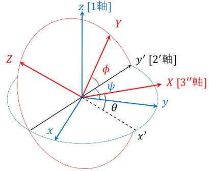

Composite rotation matrix:

$$R^{TB} = R_z(\psi) R_y(\theta) R_x(\phi) \quad (7-3-15)$$

$$R^{TB} = \begin{bmatrix}
\cos \psi \cos \theta & \cos \psi \sin \theta \sin \phi - \sin \psi \cos \phi & \cos \psi \sin \theta \cos \phi + \sin \psi \sin \phi \\
\sin \psi \cos \theta & \sin \psi \sin \theta \sin \phi + \cos \psi \cos \phi & \sin \psi \sin \theta \cos \phi - \cos \psi \sin \phi \\
-\sin \theta & \cos \theta \sin \phi & \cos \theta \cos \phi
\end{bmatrix} \quad (7-3-16)$$

### [7-3-4] Gimbal Lock

When pitch $\theta = \pm \pi/2$ in Tait-Bryan angles (or $\beta = 0, \pi$ in Euler angles), the first and third rotation axes align. One degree of freedom is lost, and the parameterization becomes singular—a phenomenon called **Gimbal Lock**.

## [7-4] Rotation Vectors

### [7-4-1] Definition and Rodrigues' Rotation Formula

By Euler's Rotation Theorem, every 3D rotation corresponds to a rotation by angle $\theta$ around a unit axis $\mathbf{u} = [u_1, u_2, u_3]^T$. The **rotation vector** is $\boldsymbol{\omega} = \theta \mathbf{u}$.

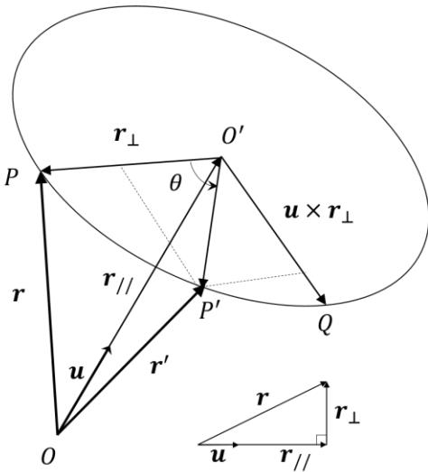

Vector position $\mathbf{r}'$ after rotating $\mathbf{r}$ by angle $\theta$ around unit axis $\mathbf{u}$ is given by **Rodrigues' Rotation Formula**:

$$\mathbf{r}' = \cos \theta \mathbf{r} + (1 - \cos \theta)(\mathbf{u} \cdot \mathbf{r})\mathbf{u} + \sin \theta (\mathbf{u} \times \mathbf{r}) \quad (7-4-3)$$

### [7-4-2] Matrix Representation of Rodrigues' Formula

Writing Rodrigues' formula in matrix form:

$$R = \cos \theta E + (1 - \cos \theta)\mathbf{u} \mathbf{u}^T + \sin \theta [\mathbf{u}]_\times \quad (7-4-4)$$

where $[\mathbf{u}]_\times = \begin{bmatrix} 0 & -u_3 & u_2 \\ u_3 & 0 & -u_1 \\ -u_2 & u_1 & 0 \end{bmatrix}$ is the skew-symmetric cross-product matrix.

Explicit matrix form:

$$R = \begin{bmatrix}
\cos \theta + (1 - \cos \theta)u_1^2 & (1 - \cos \theta)u_1 u_2 - u_3 \sin \theta & (1 - \cos \theta)u_1 u_3 + u_2 \sin \theta \\
(1 - \cos \theta)u_1 u_2 + u_3 \sin \theta & \cos \theta + (1 - \cos \theta)u_2^2 & (1 - \cos \theta)u_2 u_3 - u_1 \sin \theta \\
(1 - \cos \theta)u_1 u_3 - u_2 \sin \theta & (1 - \cos \theta)u_2 u_3 + u_1 \sin \theta & \cos \theta + (1 - \cos \theta)u_3^2
\end{bmatrix} \quad (7-4-5)$$

### [7-4-3] Eigenvalues and Trace

- $\text{tr}(R) = 1 + 2 \cos \theta \implies \cos \theta = \frac{\text{tr}(R) - 1}{2} \quad (7-4-7)$
- Eigenvalues of $R$: $\lambda_1 = 1, \lambda_{2,3} = e^{\pm i \theta}$.

### [7-4-4] Global Topology of 3D Rotations

Rotation vectors with length $\|\boldsymbol{\omega}\| \le \pi$ fill a solid ball of radius $\pi$ in $\mathbb{R}^3$.
Antipodal points on the boundary sphere $\|\boldsymbol{\omega}\| = \pi$ represent identical rotations ($\boldsymbol{\omega}$ and $-\boldsymbol{\omega}$ produce the exact same orientation).

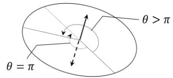
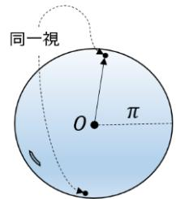
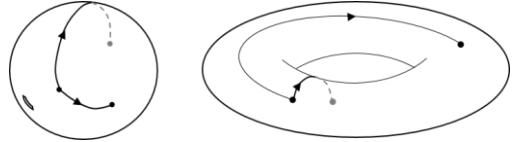
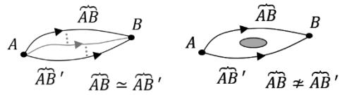
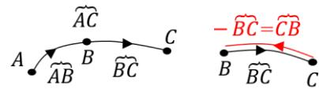
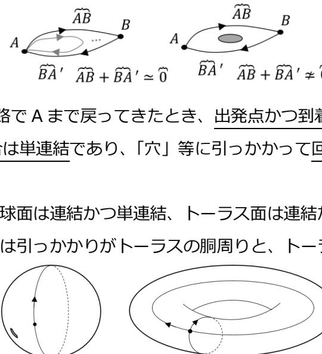
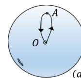

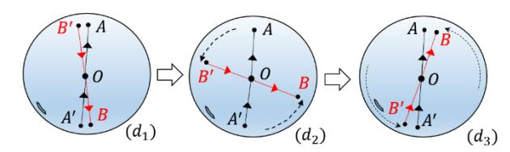

Topologically, the space of 3D rotations $SO(3)$ is homeomorphic to real projective space $\mathbb{R}P^3$, which is connected but **doubly connected** (not simply connected). A $2\pi$ rotation path cannot be shrunk continuously to a point, whereas a $4\pi$ rotation path can! (Demonstrated by the famous Belt Trick / Plate Trick).

## [7-5] Appendix 1: Proofs on Distance-Preserving Maps
Proofs that isometric maps preserving origin preserve inner products and are linear transformations.

## [7-6] [▼A,C] Appendix 2: Matrix Exponential of Skew-Symmetric Matrices
Derivation of $e^{\theta [\mathbf{u}]_\times} = R$ via Taylor expansion of matrix exponentials.
