# **[Lecture 8] Representation of Rotations II**

## **[8-1] Introduction**

In this lecture, as the fourth representation of 3D rotations, we study **Quaternions**. Quaternions are an algebraic system extending complex numbers discovered by William Rowan Hamilton in 1843. They offer remarkable advantages for representing 3D rotations.

Compared to other representations, quaternions avoid singularities like gimbal lock and excel in computational efficiency and smooth interpolation. They are widely applied in robotics, computer graphics (3DCG), computer vision (CV), and aerospace engineering.

### **Recap: Rotations in the Complex Plane**

Multiplying any complex number $(x + i y)$ by a unit complex number $(\cos \theta + i \sin \theta)$ represents a 2D rotation by angle $\theta$ in the complex plane ($1-i$ plane):

$$x' + i y' = (\cos \theta + i \sin \theta)(x + i y) = (x \cos \theta - y \sin \theta) + i (x \sin \theta + y \cos \theta)$$

Writing $1$ and $i$ as basis vectors yields the linear transformation matrix:

$$\begin{bmatrix} x' \\ y' \end{bmatrix} = \begin{bmatrix} \cos \theta & -\sin \theta \\ \sin \theta & \cos \theta \end{bmatrix} \begin{bmatrix} x \\ y \end{bmatrix}$$

The essence lies in multiplication by $i$: closed algebra between bases $1$ and $i$ corresponds to a quarter-turn ($90^\circ$ or $\pi/2$) rotation in the $1-i$ plane:

$$\begin{aligned}
i \times 1 &= i, & i \times i &= -1 \\
i \times (-1) &= -i, & i \times (-i) &= 1
\end{aligned}$$

*Diagram Translation:* Multiplication by $i$ on the complex plane represents a $\pi/2$ ($90^\circ$) rotation.

## **[8-2] Introduction to Quaternions: Hamilton's Theater**

### **[8-2-1] Extending Complex Numbers to 3D Space**

Hamilton attempted to extend complex numbers by introducing two independent imaginary units $i$ and $j$ ($i^2 = j^2 = -1$). He wanted $1, i, j$ to represent rotations across the $1-i$, $1-j$, and $i-j$ planes.

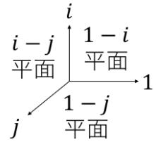

*Diagram Translation:*
- $1-i$ plane rotation
- $1-j$ plane rotation
- Attempted $j-ij$ / $i-j$ plane rotations

However, a system with 3 components ($1, i, j$) failed because the product $i \times j$ could not be consistently closed without producing contradictions. (Later, mathematicians proved that a 3D division algebra extending complex numbers is impossible.)

### **[8-2-2] The Four-Dimensional Breakthrough**

On October 16, 1843, while walking along the Royal Canal in Dublin, Hamilton realized that **four dimensions** were necessary! He introduced a third imaginary unit $k$ with fundamental formula:

$$i^2 = j^2 = k^2 = i j k = -1 \quad (8-2-0)$$

From this, the non-commutative products between imaginary units follow:

$$\begin{aligned}
i j &= k, & j i &= -k \\
j k &= i, & k j &= -i \\
k i &= j, & i k &= -j
\end{aligned}$$

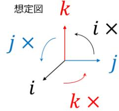

*Diagram Translation:*
- Multiplying by $i$ rotates the $1-i$ plane and $j-k$ plane simultaneously.
- Multiplying by $j$ rotates the $1-j$ plane and $k-i$ plane simultaneously.
- Multiplying by $k$ rotates the $1-k$ plane and $i-j$ plane simultaneously.

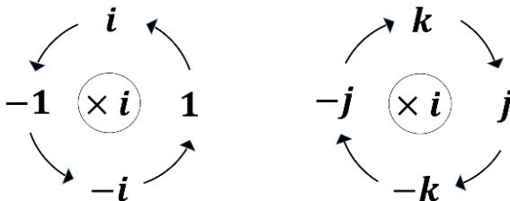
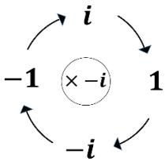
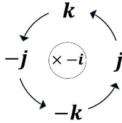
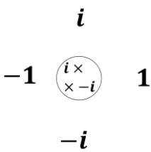
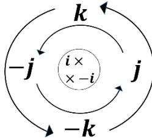
*Diagram Translation:*
- **Left Multiplication**: $1-i$ plane rotates forward; $j-k$ plane rotates forward.
- **Right Multiplication**: $1-i$ plane rotates forward; $j-k$ plane rotates in reverse.
- **Sandwich Product $q p \bar{q}$** (Left by $i$, Right by $-i$):
  - $1-i$ plane: No rotation (cancels out).
  - $j-k$ plane: Double rotation ($2\theta$).

Hamilton discovered that multiplying a pure imaginary 3D vector $p = i x + j y + k z$ on both sides by a unit quaternion $q$ and its conjugate $\bar{q}$:

$$p' = q p \bar{q} \quad (8-2-4)$$

eliminates unwanted 4D rotations and produces a **pure 3D rotation** by angle $2\theta$ around axis $\mathbf{u}$!

## **[8-3] Quaternions: Definition and Properties**

### **[8-3-1] Definition**

A **quaternion** $q$ is an expression of the form:

$$q = q_0 + i q_x + j q_y + k q_z \quad (q_0, q_x, q_y, q_z \in \mathbb{R}) \quad (8-3-3)$$

Addition and scalar multiplication ($\beta \in \mathbb{R}$) are component-wise:

$$p + q = (p_0 + q_0) + i(p_x + q_x) + j(p_y + q_y) + k(p_z + q_z) \quad (8-3-4)$$

$$\beta q = \beta q_0 + i \beta q_x + j \beta q_y + k \beta q_z \quad (8-3-5)$$

### [8-3-2] Scalar-Vector Notation

We conveniently split quaternion $q$ into a **scalar part** $q_0$ and a **vector part** $\mathbf{q} = [q_x, q_y, q_z]^T$:

$$q = q_0 + \mathbf{q} \quad (8-3-8)$$

The quaternion product (Hamilton product) of $p = p_0 + \mathbf{p}$ and $q = q_0 + \mathbf{q}$ simplifies elegantly to:

$$p q = (p_0 q_0 - \mathbf{p} \cdot \mathbf{q}) + (p_0 \mathbf{q} + q_0 \mathbf{p} + \mathbf{p} \times \mathbf{q}) \quad (8-3-11)$$

where $\mathbf{p} \cdot \mathbf{q}$ is the standard dot product and $\mathbf{p} \times \mathbf{q}$ is the 3D cross product.

### [8-3-3] Conjugate, Norm, and Inverse

- **Conjugate**: $\bar{q} = q_0 - \mathbf{q} = q_0 - i q_x - j q_y - k q_z \quad (8-3-12)$
- **Norm**: $\|q\| = \sqrt{q \bar{q}} = \sqrt{q_0^2 + q_x^2 + q_y^2 + q_z^2} \quad (8-3-21)$
- **Inverse** ($q \neq 0$): $q^{-1} = \frac{\bar{q}}{\|q\|^2} \quad (8-3-22)$

Key identities:
- Conjugate of product: $\overline{pq} = \bar{q} \bar{p} \quad (8-3-23)$
- Norm of product: $\|pq\| = \|p\| \|q\| \quad (8-3-24)$
- Inverse of product: $(pq)^{-1} = q^{-1} p^{-1} \quad (8-3-25)$

### [8-3-4] Unit Quaternions and Polar Form

A quaternion with $\|q\| = 1$ is a **unit quaternion**. Its inverse is simply its conjugate $q^{-1} = \bar{q}$.

Polar form of a unit quaternion:

$$q = \cos \frac{\psi}{2} + \sin \frac{\psi}{2} \mathbf{u} \quad (8-3-30)$$

where $\mathbf{u} = u_x i + u_y j + u_z k$ is a 3D unit vector ($\|\mathbf{u}\| = 1$) representing the rotation axis, and $\psi$ is the rotation angle.

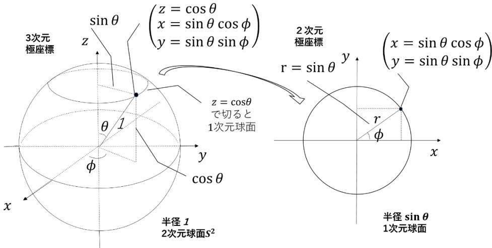

*Diagram Translation (Hyperspherical Coordinates):*
- **Left Diagram**: 3D spherical coordinates for 2D sphere $S^2$.
- **Right Diagram**: 4D hyperspherical coordinates for 3D unit sphere $S^3$ with polar angle $\psi$.

### [8-3-5] 4D Inner Product

For quaternions $p, q$, the 4D inner product is:

$$p \cdot q \equiv \frac{1}{2}(p \bar{q} + q \bar{p}) = p_0 q_0 + p_x q_x + p_y q_y + p_z q_z = \|p\| \|q\| \cos \psi \quad (8-3-32)$$

Left/right multiplication by a unit quaternion preserves 4D inner products and lengths.

## [8-4] Quaternions: Representation of 3D Rotations

### [8-4-1] Rotation of a 3D Vector

To rotate a 3D vector $\mathbf{r} = [x, y, z]^T$, express it as a pure imaginary quaternion $\mathbf{r} = 0 + i x + j y + k z$.
The rotated vector $\mathbf{r}'$ is given by the sandwich product:

$$\mathbf{r}' = q \mathbf{r} q^{-1} = q \mathbf{r} \bar{q} \quad (8-4-3a)$$

Expanding $q \mathbf{r} \bar{q}$ using scalar-vector notation yields:

$$\mathbf{r}' = \cos \psi \mathbf{r} + (1 - \cos \psi)(\mathbf{u} \cdot \mathbf{r})\mathbf{u} + \sin \psi (\mathbf{u} \times \mathbf{r}) \quad (8-4-3)$$

which is **Rodrigues' Rotation Formula** for rotation by angle $\psi$ around unit axis $\mathbf{u}$!

*Note: Unit quaternions $q$ and $-q$ represent the exact same 3D rotation ($(-q)\mathbf{r}(-q)^{-1} = q\mathbf{r}q^{-1}$).*

### [8-4-2] Composition of Rotations

Concatenating rotation $q_A$ followed by $q_B$:

$$\mathbf{r}'' = q_B (q_A \mathbf{r} q_A^{-1}) q_B^{-1} = (q_B q_A) \mathbf{r} (q_B q_A)^{-1} \quad (8-4-4)$$

The composite rotation quaternion is simply the quaternion product $q = q_B q_A$.

### [8-4-3] Equivalent Rotation Matrix

Expanding $\mathbf{r}' = q \mathbf{r} \bar{q}$ into matrix form $R$:

$$R = \begin{bmatrix}
q_0^2 + q_x^2 - q_y^2 - q_z^2 & 2(q_x q_y - q_0 q_z) & 2(q_x q_z + q_0 q_y) \\
2(q_x q_y + q_0 q_z) & q_0^2 - q_x^2 + q_y^2 - q_z^2 & 2(q_y q_z - q_0 q_x) \\
2(q_x q_z - q_0 q_y) & 2(q_y q_z + q_0 q_x) & q_0^2 - q_x^2 - q_y^2 + q_z^2
\end{bmatrix} \quad (8-4-6)$$

### [8-4-4] Double Covering $S^3 \to SO(3)$

Unit quaternions lie on the 3D unit sphere $S^3$ in $\mathbb{R}^4$.
The mapping from unit quaternions $S^3$ to $3\text{D}$ rotation matrices $SO(3)$ is a **2-to-1 surjective homomorphism** (double cover): both $q$ and $-q$ map to the exact same rotation matrix $R$.

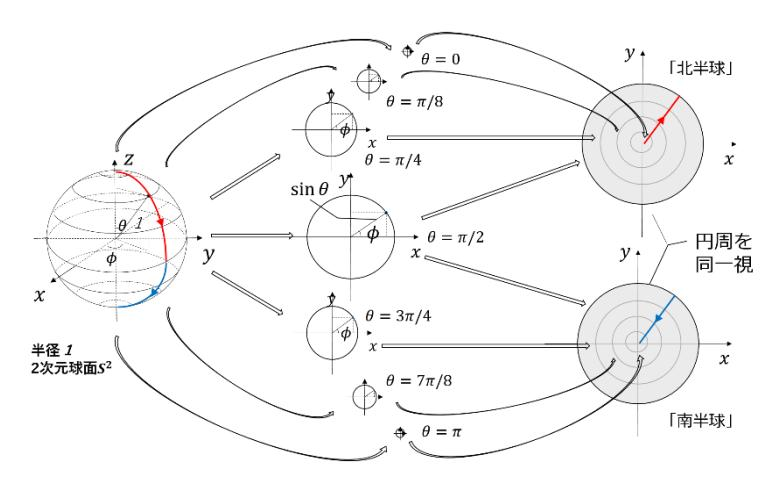

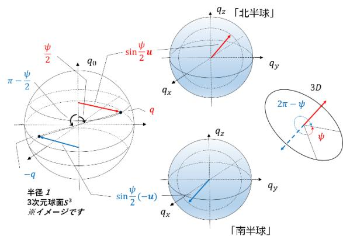
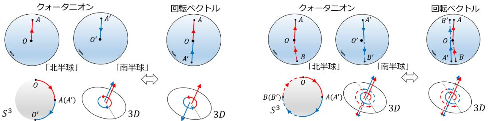
*Diagram Translation (Double Covering $S^3 \to SO(3)$):*
- **Northern Hemisphere**: $q_0 > 0$
- **Southern Hemisphere**: $q_0 < 0$
- **Equator**: $q_0 = 0$
- Antipodal points $+q$ and $-q$ represent the same 3D rotation.

### [8-4-5] Spherical Linear Interpolation (Slerp)

Given two unit quaternions $p$ and $q$ with angle $\psi$ between them ($\cos \psi = p \cdot q$), the **Slerp** formula computes smooth interpolation along the shortest arc on $S^3$:

$$\text{Slerp}(p, q; t) = \frac{\sin((1-t)\psi)}{\sin \psi} p + \frac{\sin(t\psi)}{\sin \psi} q \quad (8-4-9)$$

where $t \in [0, 1]$ is the interpolation parameter.

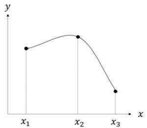
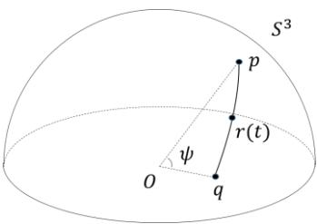

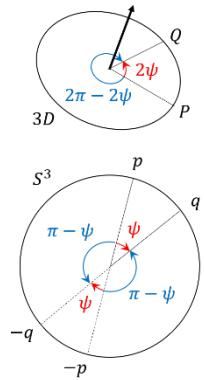
*Diagram Translation (Spherical Linear Interpolation):*
- Slerp interpolates along arc between unit quaternions $p$ and $q$ on $S^3$.

Algebraic form of Slerp:

$$\text{Slerp}(p, q; t) = (q p^{-1})^t p \quad (8-4-10)$$

## [8-5] [▼] Appendix 1: General 4D Rotations
Table and overview of 4D double rotations $p \mapsto r p s$ parameterized by pairs of unit quaternions $(r, s) \in S^3 \times S^3$.

## [8-6] Appendix 2: Component-wise Proof of 4D Norm Invariance
Direct algebraic verification showing $p_0' q_0' + \mathbf{p}' \cdot \mathbf{q}' = p_0 q_0 + \mathbf{p} \cdot \mathbf{q}$.

## [8-7] [▼A] Appendix 3: Quaternion Exponential and Algebraic Slerp
Quaternion version of Euler's formula: $e^{\psi \mathbf{u}} = \cos \psi + \sin \psi \mathbf{u}$. Derivation showing equivalence between $(q p^{-1})^t p$ and geometric Slerp formula.

